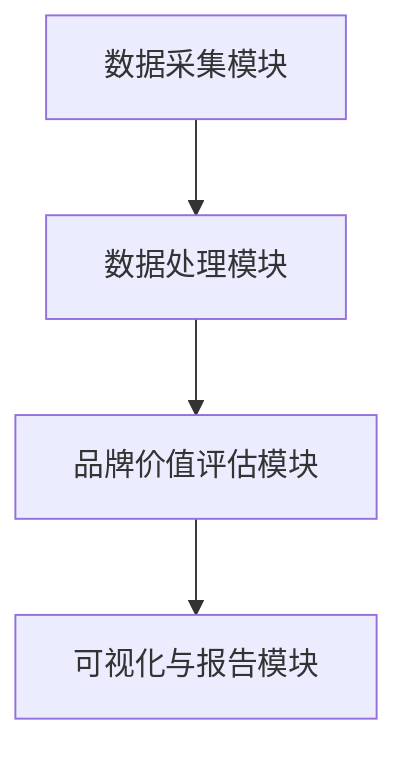

                 


# 巴菲特的品牌价值评估：社交媒体影响力的量化

**关键词**：巴菲特，品牌价值，社交媒体影响力，量化评估，数据驱动决策，投资策略

**摘要**：本文探讨如何将巴菲特的价值投资理念与社交媒体影响力相结合，通过数据驱动的方法量化品牌价值。文章从社交媒体影响力的基础概念出发，结合巴菲特的品牌评估方法，构建数学模型，设计系统架构，并通过案例分析展示实际应用。最终，本文提出了一种创新的品牌价值评估方法，为投资者和企业提供新的视角。

---

# 第一部分: 社交媒体影响力与品牌价值评估基础

## 第1章: 社交媒体影响力概述

### 1.1 社交媒体影响力的定义与重要性

#### 1.1.1 社交媒体的起源与发展
社交媒体起源于20世纪末，随着互联网的普及迅速发展。如今，社交媒体已成为人们日常生活和企业营销的重要组成部分。其影响力体现在信息传播速度和范围的扩大上。

#### 1.1.2 社交媒体影响力的概念
社交媒体影响力指的是品牌或个人在社交媒体平台上的影响力，通常通过粉丝数量、互动率和内容传播力等指标衡量。影响力高的账号能够快速传播信息，影响目标受众的决策。

#### 1.1.3 社交媒体影响力的重要性
在品牌价值评估中，社交媒体影响力已成为不可或缺的因素。它反映了品牌在市场中的认知度和用户忠诚度，直接影响品牌价值和市场地位。

### 1.2 品牌价值评估的背景与挑战

#### 1.2.1 品牌价值的传统评估方法
传统方法包括财务指标分析和市场调研，但难以量化社交媒体的影响。例如，品牌知名度和美誉度的提升往往依赖社交媒体，传统方法难以捕捉这些动态变化。

#### 1.2.2 社交媒体时代品牌价值评估的必要性
随着社交媒体的普及，品牌价值的评估需要考虑线上互动和传播效果。社交媒体数据能够提供实时反馈，帮助品牌及时调整策略，提升价值。

#### 1.2.3 传统与新兴品牌价值评估方法的对比
传统方法侧重财务数据，新兴方法结合社交媒体数据，更具动态性和全面性。社交媒体评估方法能够量化用户的参与度和情感倾向，弥补传统方法的不足。

---

## 第2章: 巴菲特的品牌价值评估方法

### 2.1 巴菲特投资理念的核心

#### 2.1.1 投资中的“护城河”概念
巴菲特强调企业必须有强大的护城河，如技术优势、品牌忠诚度或成本优势。这些因素能够长期维持企业的竞争优势，确保稳定的收益。

#### 2.1.2 巴菲特的长期价值投资策略
巴菲长期价值投资强调企业内在价值，而非短期市场波动。投资者应选择具有强大竞争优势和良好管理的公司。

#### 2.1.3 投资决策中的关键指标分析
巴菲的关键指标包括ROE（净资产收益率）、毛利率和现金流等。这些指标反映企业的盈利能力和财务健康状况。

### 2.2 巴菲特方法在品牌评估中的应用

#### 2.2.1 品牌的经济护城河分析
品牌护城河包括品牌忠诚度、市场地位和分销网络。强大的护城河能够抵御竞争对手，保持品牌价值的稳定增长。

#### 2.2.2 品牌忠诚度与市场地位
品牌忠诚度高的消费者更可能回购产品，提升企业的长期收入。市场地位反映品牌在行业中的影响力，是品牌价值的重要指标。

#### 2.2.3 财务数据与品牌价值的关系
财务数据是品牌价值的重要组成部分，但社交媒体数据提供了更实时的市场反馈。结合两者，能够更全面地评估品牌价值。

---

# 第二部分: 社交媒体影响力与品牌价值的关联

## 第3章: 社交媒体数据与品牌价值的关系

### 3.1 社交媒体数据的特征

#### 3.1.1 数据的多样性与实时性
社交媒体数据包括文本、图片和视频等多种形式，能够实时反映用户的反应和市场趋势。

#### 3.1.2 数据的可量化性
通过分析粉丝数量、互动率和内容传播力，可以量化社交媒体数据，为品牌价值评估提供依据。

#### 3.1.3 数据的关联性与影响力
社交媒体数据与品牌价值密切相关。例如，高互动率表明用户对品牌感兴趣，可能提升购买意愿。

### 3.2 社交媒体影响力对品牌价值的影响

#### 3.2.1 粉丝数量与品牌价值的关系
粉丝数量反映了品牌的知名度。然而，单纯粉丝数量不一定直接反映价值，需结合互动率和内容传播力。

#### 3.2.2 互动频率与品牌忠诚度的关系
高互动频率表明用户对品牌忠诚，可能转化为实际购买行为，提升品牌价值。

#### 3.2.3 内容传播力与品牌认知度的关系
内容传播力反映了品牌在市场中的认知度。广泛传播的内容能够提升品牌知名度，吸引更多潜在用户。

---

## 第4章: 社交媒体影响力量化模型的构建

### 4.1 数据收集与处理

#### 4.1.1 数据来源与获取
通过社交媒体API获取数据，包括粉丝数量、互动次数和内容传播情况。数据清洗和预处理是关键步骤，确保数据质量。

#### 4.1.2 数据清洗与特征提取
去除无效数据，提取关键特征，如粉丝增长率和互动率。这些特征用于后续模型训练。

### 4.2 数学模型与算法设计

#### 4.2.1 线性回归模型
使用线性回归模型量化社交媒体影响力对品牌价值的影响。公式：$$Y = aX + b$$，其中Y是品牌价值，X是社交媒体指标。

#### 4.2.2 算法实现
Python代码实现线性回归模型，展示数据预处理、模型训练和评估的过程。代码示例：
```python
import numpy as np
from sklearn.linear_model import LinearRegression

# 假设X为社交媒体指标，Y为目标品牌价值
X = np.array([1, 2, 3, 4, 5]).reshape(-1, 1)
Y = np.array([2, 3, 4, 5, 6])

model = LinearRegression()
model.fit(X, Y)
print("回归系数a:", model.coef_)
print("截距b:", model.intercept_)
```

---

## 第5章: 系统分析与架构设计方案

### 5.1 项目背景与目标
项目旨在构建一个品牌价值评估系统，结合社交媒体数据和传统财务指标，提供全面的品牌价值评估。

### 5.2 系统功能设计

#### 5.2.1 数据采集模块
负责收集社交媒体数据，包括粉丝数量和互动次数。

#### 5.2.2 数据处理模块
对数据进行清洗和特征提取，为模型训练提供高质量数据。

#### 5.2.3 品牌价值评估模块
应用回归模型评估品牌价值，并结合财务指标进行综合评估。

#### 5.2.4 可视化与报告模块
生成可视化报告，展示评估结果和建议。

### 5.3 系统架构设计

#### 5.3.1 系统架构图


---

## 第6章: 项目实战

### 6.1 环境安装
安装必要的Python库，如numpy、pandas和scikit-learn。

### 6.2 核心代码实现
展示数据处理和模型训练的代码，解释每一步的作用。

### 6.3 案例分析
以苹果品牌为例，分析社交媒体数据，评估其品牌价值。

### 6.4 结果展示与分析
展示评估结果，分析社交媒体影响力对品牌价值的具体影响。

---

## 第7章: 总结与展望

### 7.1 总结
本文提出了一种结合社交媒体数据和巴菲特投资理念的品牌价值评估方法，为投资者和企业提供新的视角。

### 7.2 未来展望
未来工作包括优化模型、引入更多社交媒体指标和扩展应用场景。

---

**作者：AI天才研究院 & 禅与计算机程序设计艺术**

