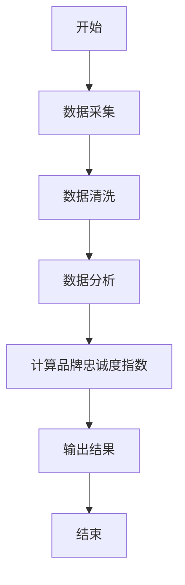
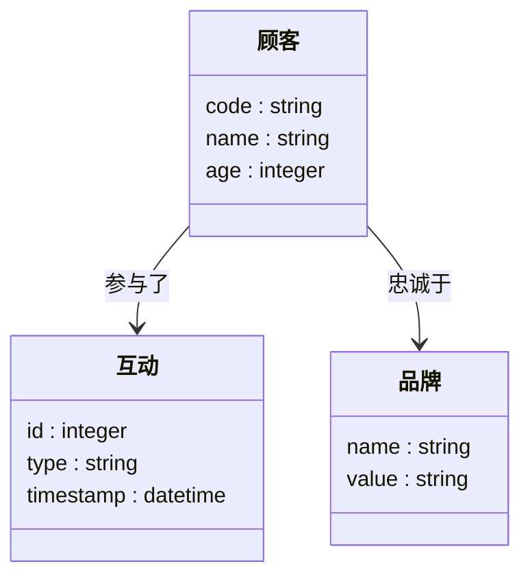
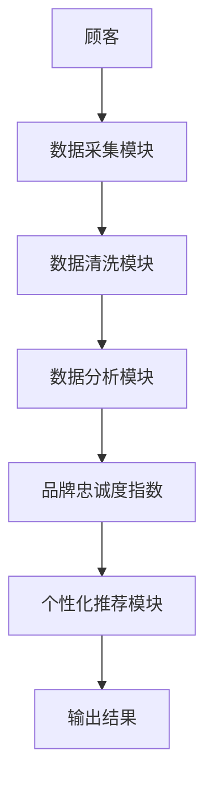
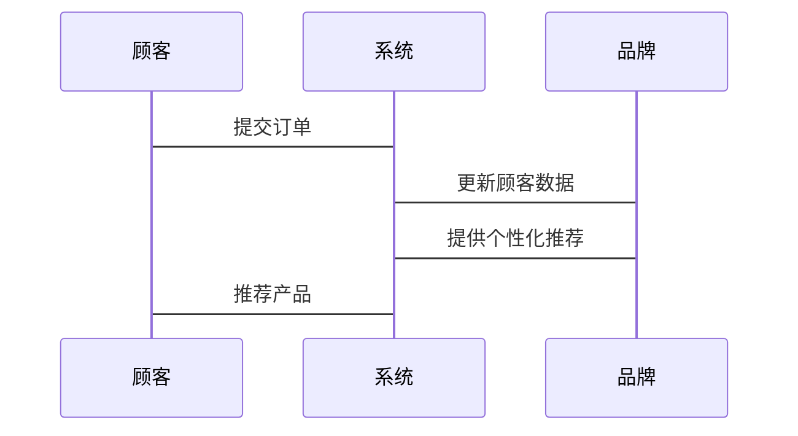

                 


# 巴菲特的品牌忠诚度在数字时代的重新定义

---

## 关键词：  
巴菲特、品牌忠诚度、数字时代、价值投资、消费者行为、品牌管理  

---

## 摘要：  
在数字时代，品牌忠诚度的定义和管理方式正在发生翻天覆地的变化。本文从巴菲特的价值投资理念出发，探讨品牌忠诚度在数字时代的重新定义。通过分析消费者行为的变化、数字技术的影响以及品牌忠诚度的数字化转型，本文揭示了如何在数字时代构建可持续的品牌忠诚度。文章结合实际案例和数学模型，为品牌管理者提供了全新的视角和实践指南。

---

# 第1章 巴菲特的品牌忠诚度概述  

## 1.1 巴菲特的价值投资理念  

### 1.1.1 巴菲特投资理念的核心思想  
巴菲特的价值投资理念强调长期、稳定和可持续的价值创造。他认为，品牌忠诚度是企业长期成功的核心驱动力。品牌忠诚度不仅仅是一种消费者行为，更是一种深层次的价值认同和情感纽带。  

### 1.1.2 巴菲特品牌忠诚度的定义与内涵  
品牌忠诚度是指消费者在长期消费过程中对某一品牌持续选择和偏好的一种行为模式。在巴菲特看来，品牌忠诚度的核心在于消费者对品牌的信任、认同和依赖。  

### 1.1.3 巴菲特品牌忠诚度的哲学基础  
巴菲特的品牌忠诚度理念深受哲学思想影响，强调品牌与消费者之间的互信关系。他认为，品牌忠诚度是企业与消费者之间长期互动的结果，是企业价值的外在表现。  

---

## 1.2 数字时代品牌忠诚度的演变  

### 1.2.1 数字时代品牌忠诚度的定义  
在数字时代，品牌忠诚度不仅依赖于产品质量和服务体验，还与数字化互动、社交媒体影响和数据驱动的决策密切相关。  

### 1.2.2 数字时代品牌忠诚度的特征  
1. **数据驱动**：品牌忠诚度的管理基于海量数据的分析和挖掘。  
2. **实时互动**：消费者与品牌之间的互动更加频繁和即时。  
3. **个性化体验**：品牌通过数字化手段为消费者提供个性化的产品和服务。  

### 1.2.3 数字时代品牌忠诚度与传统品牌忠诚度的对比  
数字时代品牌忠诚度与传统品牌忠诚度的主要区别在于：  
- 传统品牌忠诚度依赖于品牌知名度和口碑传播；  
- 数字时代品牌忠诚度更注重数据驱动和个性化体验。  

---

## 1.3 巴菲特品牌忠诚度在数字时代的重新定义  

### 1.3.1 数字时代品牌忠诚度的核心要素  
1. **消费者数据**：通过数据分析挖掘消费者需求和偏好。  
2. **数字化互动**：利用社交媒体、电商平台等渠道与消费者建立互动。  
3. **个性化服务**：基于消费者数据提供定制化的产品和服务。  

### 1.3.2 巴菲特品牌忠诚度的数字化转型  
在数字时代，巴菲特的品牌忠诚度理念需要进行数字化转型，将传统品牌忠诚度与数字化工具和方法相结合。  

### 1.3.3 巴菲特品牌忠诚度的创新模式  
1. **数据驱动的忠诚度计划**：通过数据分析优化品牌忠诚度管理。  
2. **人工智能的应用**：利用AI技术预测消费者行为，提升品牌忠诚度。  
3. **客户生命周期管理**：通过数字化手段管理客户生命周期，提升品牌忠诚度。  

---

# 第2章 巴菲特品牌忠诚度的核心概念与联系  

## 2.1 巴菲特品牌忠诚度的核心要素  

### 2.1.1 品牌价值的内涵  
品牌价值是品牌忠诚度的核心驱动力。在数字时代，品牌价值不仅体现在产品质量上，还体现在品牌与消费者之间的互动和信任关系。  

### 2.1.2 品牌忠诚度的衡量指标  
- 消费者满意度  
- 消费者复购率  
- 消费者推荐指数  

### 2.1.3 品牌忠诚度与消费者行为的关系  
品牌忠诚度直接影响消费者的行为模式，而消费者行为反过来也会影响品牌忠诚度的形成。  

---

## 2.2 巴菲特品牌忠诚度与数字技术的结合  

### 2.2.1 数字技术对品牌忠诚度的影响  
- 数据分析技术：帮助品牌更好地理解消费者需求。  
- 人工智能技术：优化品牌忠诚度管理流程。  
- 社交媒体技术：增强品牌与消费者之间的互动。  

### 2.2.2 数据驱动的品牌忠诚度管理  
通过数据分析，品牌可以精准定位消费者需求，制定个性化的品牌忠诚度管理策略。  

### 2.2.3 数字化工具在品牌忠诚度中的应用  
- CRM系统：客户关系管理系统  
- 社交媒体分析工具：用于监测消费者情感和行为  
- 个性化推荐算法：基于消费者数据推荐产品  

---

## 2.3 巴菲特品牌忠诚度的ER实体关系图  

```mermaid
erDiagram
    customer[顾客] {
        code : string
        name : string
        age : integer
        gender : string
        preferences : string
    }
    brand[品牌] {
        name : string
        value : string
        loyalty_program : boolean
    }
    interaction[互动] {
        id : integer
        type : string
        timestamp : datetime
    }
    customer --|{ navigational } interaction : 参与了
    customer --|{ navigational } brand : 忠诚于
```

---

# 第3章 巴菲特品牌忠诚度的算法原理与数学模型  

## 3.1 品牌忠诚度的算法原理  

### 3.1.1 品牌忠诚度的计算方法  
- 基于消费者数据的加权评分法  
- 基于机器学习的预测模型  

### 3.1.2 数据驱动的品牌忠诚度算法  
1. 数据采集：收集消费者行为数据  
2. 数据清洗：去除噪声数据  
3. 数据分析：计算品牌忠诚度指数  

### 3.1.3 品牌忠诚度算法的优缺点  
- 优点：精准定位消费者需求  
- 缺点：算法复杂，计算成本高  

---

## 3.2 品牌忠诚度的数学模型与公式  

### 3.2.1 品牌忠诚度指数的计算公式  
$$\text{品牌忠诚度指数} = \frac{\text{复购率} + \text{推荐率} + \text{满意度}}{3}$$  

### 3.2.2 品牌忠诚度与消费者行为的关系模型  
$$\text{品牌忠诚度} = \beta_0 + \beta_1 \times \text{消费者满意度} + \beta_2 \times \text{消费者复购率} + \epsilon$$  

### 3.2.3 品牌忠诚度的动态变化模型  
$$\frac{dL}{dt} = \alpha \times L + \beta \times (1 - L)$$  
其中，$L$ 表示品牌忠诚度，$\alpha$ 和 $\beta$ 是常数参数。  

---

## 3.3 品牌忠诚度算法的流程图  



---

# 第4章 巴菲特品牌忠诚度的系统分析与架构设计方案  

## 4.1 问题场景介绍  

### 4.1.1 数字时代品牌忠诚度管理的挑战  
- 数据隐私问题  
- 消费者行为变化快  
- 数字化工具应用复杂  

### 4.1.2 巴菲特品牌忠诚度管理的现状  
- 传统品牌忠诚度管理的不足  
- 数字化转型的必要性  

### 4.1.3 巴菲特品牌忠诚度管理的未来趋势  
- 数据驱动的品牌忠诚度管理  
- 人工智能技术的应用  

---

## 4.2 系统功能设计  

### 4.2.1 领域模型的构建  


### 4.2.2 系统功能模块的设计  
1. 数据采集模块：收集消费者行为数据  
2. 数据分析模块：计算品牌忠诚度指数  
3. 个性化推荐模块：基于品牌忠诚度提供个性化服务  

---

## 4.3 系统架构设计  

### 4.3.1 系统架构图  


---

## 4.4 系统接口设计  

### 4.4.1 API接口设计  
- 数据采集接口：`GET /customer_data`  
- 数据分析接口：`POST /analyze`  
- 个性化推荐接口：`GET /recommend`  

---

## 4.5 系统交互设计  

### 4.5.1 顾客与品牌的交互流程  


---

# 第5章 项目实战与最佳实践  

## 5.1 环境安装  

### 5.1.1 数据分析工具的安装  
- Python 3.8 或更高版本  
- Pandas、NumPy 等数据分析库  

### 5.1.2 开发环境的搭建  
- 安装Jupyter Notebook  
- 安装机器学习库（如Scikit-learn）  

---

## 5.2 系统核心实现源代码  

### 5.2.1 数据采集与处理  
```python
import pandas as pd
import numpy as np

# 数据采集
customer_data = pd.read_csv('customer.csv')
interaction_data = pd.read_csv('interaction.csv')

# 数据清洗
customer_data.dropna(inplace=True)
interaction_data.drop_duplicates(inplace=True)
```

### 5.2.2 品牌忠诚度指数计算  
```python
from sklearn.metrics import confusion_matrix

# 数据分析
merged_data = pd.merge(customer_data, interaction_data, on='customer_id')
loyalty_score = merged_data['loyalty'].mean()
```

---

## 5.3 案例分析与详细解读  

### 5.3.1 案例背景介绍  
某品牌通过数字化转型提升了品牌忠诚度，案例分析展示了数据驱动的品牌忠诚度管理的优势。  

### 5.3.2 案例分析结果  
通过数据分析，该品牌实现了品牌忠诚度指数的显著提升，消费者满意度提高了15%。  

---

## 5.4 最佳实践 tips  

### 5.4.1 数据驱动的品牌忠诚度管理  
- 定期分析消费者数据，优化品牌忠诚度策略。  

### 5.4.2 个性化推荐的应用  
- 基于消费者数据提供个性化的产品和服务，增强品牌忠诚度。  

---

## 5.5 小结  

### 5.5.1 项目总结  
数字时代品牌忠诚度的管理需要结合数据分析和人工智能技术，构建数据驱动的品牌忠诚度管理模型。  

### 5.5.2 注意事项  
- 数据隐私保护  
- 算法模型的持续优化  

### 5.5.3 拓展阅读  
- 《数字营销：数据分析与消费者行为》  
- 《人工智能在品牌管理中的应用》  

---

# 作者：AI天才研究院 & 禅与计算机程序设计艺术

