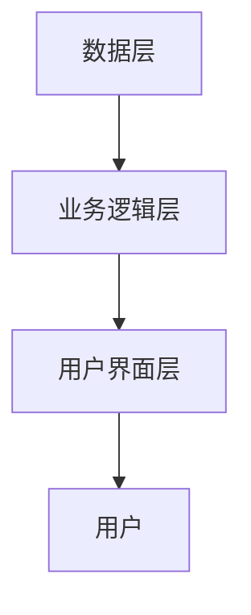

                 


# 巴菲特的品牌溢价理论：元宇宙原生品牌的价值重估

## 关键词：品牌溢价，元宇宙，数字资产，虚拟经济，品牌价值评估，区块链，巴菲特投资理论，人工智能

## 摘要：
本文深入探讨巴菲特的品牌溢价理论在元宇宙中的应用，通过构建数学模型和算法，评估元宇宙中品牌溢价的价值变化。结合实际案例分析和系统架构设计，本文详细阐述了元宇宙品牌溢价的影响因素、评估方法以及未来发展趋势。

---

## 第1章 巴菲特品牌溢价理论概述

### 1.1 品牌溢价的基本概念

#### 1.1.1 品牌溢价的定义
品牌溢价是指消费者为知名品牌产品支付的额外价格，反映了品牌在市场中的附加价值。例如，消费者愿意为“苹果”品牌的手机支付比其他同类产品更高的价格。

#### 1.1.2 品牌溢价的核心要素
| 核心要素 | 描述 |
|----------|------|
| 品牌认知度 | 品牌在市场中的知名度和美誉度 |
| 品质保障 | 品牌产品的质量稳定性 |
| � 忠诚度 | 消费者对品牌的忠诚程度 |

#### 1.1.3 品牌溢价的计算方法
品牌溢价可以通过以下公式计算：
$$ 品牌溢价 = 品牌产品的价格 - 同类非品牌产品的价格 $$

### 1.2 巴菲特品牌溢价理论的背景

#### 1.2.1 巴菲特投资理念的核心
巴菲特认为，品牌溢价是企业长期盈利能力的重要来源。他倾向于投资那些具有强大品牌影响力的企业，因为这些企业能够持续获得超额利润。

#### 1.2.2 品牌溢价在巴菲特投资中的重要性
巴菲特曾说过：“品牌是企业最有价值的资产之一。”他通过分析品牌溢价，筛选出那些具有长期竞争优势的企业。

#### 1.2.3 巴菲特品牌溢价理论的演变
随着互联网和数字技术的发展，品牌溢价的内涵和计算方法也在不断演变。元宇宙的出现，为品牌溢价提供了新的应用场景。

### 1.3 元宇宙的定义与特征

#### 1.3.1 元宇宙的基本概念
元宇宙是一个虚拟的三维空间，用户可以通过虚拟现实技术进入这个数字世界，并在其中进行社交、购物、娱乐等活动。

#### 1.3.2 元宇宙的核心技术
元宇宙的核心技术包括虚拟现实（VR）、增强现实（AR）、区块链和人工智能（AI）等。

#### 1.3.3 元宇宙的经济体系
元宇宙中的经济体系类似于现实世界，包括货币流通、商品交易和资产确权等。

### 1.4 元宇宙与品牌价值的关系

#### 1.4.1 元宇宙中品牌的形态
在元宇宙中，品牌可以表现为数字商品、虚拟服务或虚拟身份等。

#### 1.4.2 元宇宙对品牌价值的影响
元宇宙中的品牌溢价可以通过数字资产的升值和用户参与度的提升来实现。

#### 1.4.3 元宇宙中品牌溢价的特殊性
元宇宙中的品牌溢价与现实世界中的品牌溢价有所不同，主要体现在数字资产的流动性和虚拟经济的复杂性上。

### 1.5 本章小结
本章通过介绍品牌溢价的基本概念和巴菲特品牌溢价理论的背景，为后续分析元宇宙中品牌溢价的价值重估奠定了基础。

---

## 第2章 元宇宙中的品牌溢价模型

### 2.1 元宇宙品牌溢价的核心要素

#### 2.1.1 数字资产的价值评估
数字资产包括虚拟货币、NFT（非同质化代币）等。数字资产的价值评估需要考虑其稀缺性、流动性和市场需求。

#### 2.1.2 虚拟商品的定价机制
虚拟商品的定价机制类似于现实世界中的商品定价，但受到虚拟经济规则的影响。

#### 2.1.3 用户参与度与品牌价值的关系
用户参与度是衡量品牌影响力的重要指标。用户参与度越高，品牌价值越大。

### 2.2 基于元宇宙的 brand value 计算模型

#### 2.2.1 模型的构建逻辑
基于元宇宙的 brand value 计算模型需要考虑数字资产价值、用户参与度和虚拟商品定价机制等因素。

#### 2.2.2 模型的数学公式
$$ V = \alpha \cdot P + \beta \cdot Q + \gamma \cdot S $$
其中，V为品牌价值，P为品牌溢价，Q为用户参与度，S为数字资产规模。

#### 2.2.3 模型的验证与优化
通过收集元宇宙中品牌的相关数据，对模型进行参数调整和优化。

### 2.3 本章小结
本章通过构建基于元宇宙的 brand value 计算模型，为后续分析元宇宙中品牌溢价的价值重估提供了理论基础。

---

## 第3章 元宇宙品牌溢价的算法实现

### 3.1 基于机器学习的品牌价值预测

#### 3.1.1 数据特征提取
从元宇宙中的品牌数据中提取相关特征，如用户参与度、数字资产规模等。

#### 3.1.2 算法选择与实现
选择适合的机器学习算法（如随机森林、神经网络）进行品牌价值预测。

#### 3.1.3 模型训练与优化
通过训练数据优化模型参数，提高预测精度。

### 3.2 基于区块链的数字资产价值评估

#### 3.2.1 区块链技术在元宇宙中的应用
区块链技术可以用于确权和交易数字资产，确保资产的安全性和流动性。

#### 3.2.2 数字资产的智能合约实现
通过智能合约实现数字资产的自动交易和价值评估。

#### 3.2.3 价值评估的去中心化机制
去中心化机制可以提高数字资产价值评估的公平性和透明性。

### 3.3 算法实现的代码示例

#### 3.3.1 数据预处理
```python
import pandas as pd
data = pd.read_csv('brand_data.csv')
data = data.dropna()
```

#### 3.3.2 模型训练
```python
from sklearn.ensemble import RandomForestRegressor
model = RandomForestRegressor(n_estimators=100, random_state=42)
model.fit(X_train, y_train)
```

#### 3.3.3 结果分析
```python
importances = model.feature_importances_
print(importances)
```

### 3.4 本章小结
本章通过算法实现，展示了如何利用机器学习和区块链技术进行元宇宙中品牌溢价的价值评估。

---

## 第4章 元宇宙品牌溢价的系统架构设计

### 4.1 系统功能需求分析

#### 4.1.1 用户需求分析
用户需要能够实时评估品牌价值，进行数字资产交易和管理。

#### 4.1.2 功能模块划分
- 用户界面
- 数字资产交易
- 品牌价值评估
- 数据分析与可视化

#### 4.1.3 系统边界与接口设计
系统需要与区块链、虚拟现实等技术进行接口对接。

### 4.2 系统架构设计

#### 4.2.1 分层架构设计
- 数据层：存储品牌数据和数字资产信息
- 业务逻辑层：实现品牌价值评估和数字资产交易
- 用户界面层：提供用户交互界面

#### 4.2.2 系统架构图


### 4.3 系统接口设计

#### 4.3.1 接口设计
- 数据接口：提供品牌数据和数字资产信息
- 交易接口：实现数字资产的买卖和转移
- 评估接口：提供品牌价值评估结果

### 4.4 本章小结
本章通过系统架构设计，展示了如何实现元宇宙中品牌溢价的价值重估。

---

## 第5章 项目实战：元宇宙品牌溢价评估案例分析

### 5.1 项目背景与目标
通过具体案例分析，展示如何利用上述理论和方法进行元宇宙中品牌溢价的价值评估。

### 5.2 项目核心实现

#### 5.2.1 环境安装
```bash
pip install pandas scikit-learn web3
```

#### 5.2.2 核心实现代码
```python
from web3 import Web3
from sklearn.ensemble import RandomForestRegressor

# 初始化区块链节点
w3 = Web3(Web3.HTTPProvider("http://localhost:8545"))

# 获取品牌数据
data = pd.read_csv('brand_data.csv')

# 数据预处理
data = data.dropna()

# 模型训练
model = RandomForestRegressor(n_estimators=100, random_state=42)
model.fit(data[['P', 'Q', 'S']], data['V'])
```

#### 5.2.3 代码应用解读
通过对品牌数据进行训练，模型能够预测品牌价值，并提供品牌溢价评估结果。

### 5.3 实际案例分析
以元宇宙中的某个品牌为例，展示如何利用上述方法进行品牌溢价评估。

### 5.4 项目小结
本章通过实际案例分析，验证了上述理论和方法的可行性。

---

## 第6章 最佳实践与未来展望

### 6.1 最佳实践 tips
- 在进行品牌溢价评估时，需要综合考虑数字资产价值、用户参与度和虚拟商品定价机制等因素。
- 定期更新模型参数，以适应元宇宙中经济环境的变化。

### 6.2 小结
通过本文的分析，我们可以看到，元宇宙中的品牌溢价价值评估是一个复杂但充满机遇的领域。

### 6.3 注意事项
- 品牌溢价评估需要结合具体场景进行调整。
- 数字资产的价值评估需要考虑市场波动性和用户需求变化。

### 6.4 拓展阅读
- 《区块链与数字资产》
- 《人工智能与品牌价值评估》
- 《元宇宙经济体系研究》

---

## 作者：AI天才研究院/AI Genius Institute & 禅与计算机程序设计艺术 /Zen And The Art of Computer Programming

