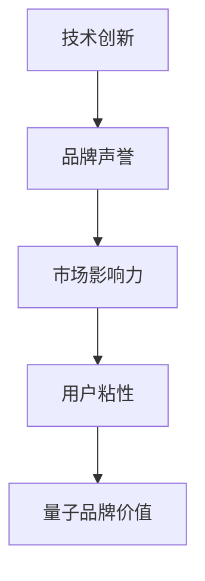

                 

# 巴菲特的品牌溢价理论：量子品牌在元宇宙中的价值重估

## 关键词：品牌溢价，巴菲特，量子品牌，元宇宙，价值重估，投资策略，品牌价值

## 摘要：本文深入探讨了巴菲特的品牌溢价理论，并结合量子品牌在元宇宙中的价值重估，分析了品牌溢价的计算方法、量子品牌的核心特性、元宇宙中的品牌价值重构、量子品牌的价值评估模型、巴菲特投资策略中的品牌溢价应用以及品牌溢价的未来趋势。文章结合理论与实践，通过详细的案例分析和数学模型，为读者提供了全面的理解和洞察。

---

# 第1章: 品牌溢价理论的背景与基础

## 1.1 品牌溢价的核心概念

### 1.1.1 品牌溢价的定义

品牌溢价是指品牌产品或服务在市场上的售价高于同类非品牌产品的额外价值。这种溢价源于品牌在市场中的独特性、信任度、忠诚度和认知价值。

$$\text{品牌溢价} = \text{品牌产品的价格} - \text{同类非品牌产品的价格}$$

### 1.1.2 品牌溢价的来源与特征

品牌溢价的来源主要包括品牌知名度、品牌忠诚度、品牌质量、品牌创新和品牌文化等。以下是品牌溢价的特征对比表：

| 特征         | 高溢价品牌 | 低溢价品牌 |
|--------------|------------|------------|
| 知名度       | 高         | 低         |
| 忠诚度       | 高         | 低         |
| 质量         | 高         | 一般       |
| 创新能力     | 高         | 低         |
| 品牌文化      | 强         | 弱         |

### 1.1.3 品牌溢价与企业价值的关系

品牌溢价直接影响企业的市场价值和盈利能力。高品牌溢价意味着企业在市场上具有更强的定价权和竞争优势。

### 1.2 巴菲特投资理念中的品牌溢价

### 1.2.1 巴菲特的价值投资理念

巴菲特的价值投资理念强调购买具有持续竞争优势和长期盈利能力的公司，而品牌溢价正是这种竞争优势的重要体现。

### 1.2.2 品牌溢价在巴菲特投资中的重要性

巴菲特认为，品牌溢价是企业长期盈利能力的关键因素。他倾向于投资那些具有强大品牌溢价能力的公司，因为这些公司能够在市场上获得更高的定价权和顾客忠诚度。

### 1.2.3 巴菲特对品牌溢价的量化分析

巴菲特通过分析公司的品牌溢价能力来评估其投资价值。以下是品牌溢价的量化分析模型：

$$\text{品牌溢价能力} = \frac{\text{品牌产品的价格}}{\text{同类非品牌产品的价格}} - 1$$

### 1.3 品牌溢价的评估方法

### 1.3.1 品牌价值的评估模型

品牌价值的评估模型主要包括品牌资产、品牌忠诚度、品牌认知度和品牌创新等指标。

$$\text{品牌价值} = \text{品牌资产} + \text{品牌忠诚度} + \text{品牌认知度} + \text{品牌创新}$$

### 1.3.2 品牌溢价的计算公式

品牌溢价的计算公式如下：

$$\text{品牌溢价} = \text{品牌产品的价格} - \text{同类非品牌产品的价格}$$

### 1.3.3 品牌溢价与市场定价的关系

品牌溢价与市场定价密切相关。高品牌溢价意味着企业能够在市场上以更高的价格销售产品，从而提高利润率。

---

## 1.4 本章小结

本章详细介绍了品牌溢价的核心概念、来源与特征，以及巴菲特投资理念中的品牌溢价。通过量化分析和评估方法，揭示了品牌溢价对企业和投资者的重要性。

---

# 第2章: 量子品牌的特性与品牌溢价的关系

## 2.1 量子品牌的定义与特征

### 2.1.1 量子品牌的定义

量子品牌是指基于量子技术或具有量子特性（如超高速、超强计算能力）的品牌，通常应用于高科技领域。

### 2.1.2 量子品牌的独特性

量子品牌的独特性体现在其技术创新、性能优势和市场定位等方面。以下是量子品牌与传统品牌的对比表：

| 特性         | 量子品牌       | 传统品牌       |
|--------------|----------------|----------------|
| 技术创新     | 高             | 低             |
| 性能优势     | 高             | 一般           |
| 市场定位     | 高端           | 中低端         |

### 2.1.3 量子品牌与传统品牌的对比

量子品牌在技术创新、性能和市场定位等方面具有显著优势，从而能够在市场中获得更高的品牌溢价。

## 2.2 量子品牌的核心要素

### 2.2.1 量子品牌的无形资产

量子品牌的无形资产包括技术创新、品牌声誉和市场影响力等。

### 2.2.2 量子品牌的用户粘性

量子品牌通过技术创新和优质服务，能够吸引并留住大量用户，从而提高品牌忠诚度。

### 2.2.3 量子品牌的创新性

量子品牌的创新能力是其核心竞争力之一，能够不断推出新产品和服务，满足市场需求。

## 2.3 量子品牌与品牌溢价的关系

### 2.3.1 量子品牌如何影响品牌溢价

量子品牌的技术创新和性能优势能够显著提升品牌溢价能力。

$$\text{量子品牌溢价} = \text{量子产品的价格} - \text{同类传统产品的价格}$$

### 2.3.2 量子品牌的市场表现与品牌溢价

量子品牌在市场上的成功表现进一步增强了其品牌溢价能力。

### 2.3.3 量子品牌在品牌溢价中的作用

量子品牌通过技术创新和市场定位，能够在品牌溢价中占据重要地位。

## 2.4 本章小结

本章分析了量子品牌的定义与特征，探讨了其核心要素，并详细阐述了量子品牌与品牌溢价之间的关系，揭示了量子品牌在品牌溢价中的重要作用。

---

# 第3章: 元宇宙中的品牌价值重构

## 3.1 元宇宙的基本概念与特征

### 3.1.1 元宇宙的定义

元宇宙是一个虚拟的三维空间，通过虚拟现实技术将用户带入一个与现实世界平行的数字世界。

### 3.1.2 元宇宙的核心技术

元宇宙的核心技术包括虚拟现实、增强现实、区块链和人工智能等。

### 3.1.3 元宇宙的经济体系

元宇宙的经济体系基于虚拟货币、数字资产和智能合约等。

## 3.2 元宇宙中的品牌价值重构

### 3.2.1 元宇宙对品牌价值的影响

元宇宙为品牌提供了全新的展示和营销平台，能够显著提升品牌价值。

### 3.2.2 元宇宙中的品牌资产

元宇宙中的品牌资产包括虚拟资产、数字资产和用户数据等。

### 3.2.3 元宇宙中的品牌溢价

元宇宙中的品牌溢价是品牌在虚拟世界中与现实世界中的价格差异。

$$\text{元宇宙品牌溢价} = \text{虚拟产品价格} - \text{现实产品价格}$$

## 3.3 元宇宙中的品牌价值实现

### 3.3.1 元宇宙中的品牌资产量化

元宇宙中的品牌资产可以通过虚拟货币、数字资产和用户数据等进行量化。

### 3.3.2 元宇宙中的品牌溢价计算

元宇宙中的品牌溢价可以通过虚拟产品价格和现实产品价格的差异进行计算。

### 3.3.3 元宇宙中的品牌溢价实现

元宇宙中的品牌溢价通过技术创新和市场定位实现。

## 3.4 本章小结

本章分析了元宇宙的基本概念与特征，探讨了其对品牌价值的影响，并详细阐述了元宇宙中的品牌溢价实现方式。

---

# 第4章: 量子品牌的价值评估模型

## 4.1 量子品牌的价值评估模型

### 4.1.1 模型概述

量子品牌的价值评估模型包括技术创新、品牌声誉、市场影响力和用户粘性等指标。

$$\text{量子品牌价值} = \text{技术创新} + \text{品牌声誉} + \text{市场影响力} + \text{用户粘性}$$

### 4.1.2 模型的构建

以下是量子品牌价值评估模型的 mermaid 图：

### 4.1.3 模型的验证

通过实证分析验证模型的准确性和有效性。

## 4.2 量子品牌的溢价评估

### 4.2.1 溢价评估方法

量子品牌的溢价评估可以通过比较同类产品的价格差异进行。

### 4.2.2 溢价与技术创新的关系

技术创新是影响量子品牌溢价的重要因素。

### 4.2.3 溢价与市场定位的关系

市场定位也显著影响量子品牌溢价能力。

## 4.3 本章小结

本章构建了量子品牌的价值评估模型，并分析了溢价评估方法，揭示了技术创新和市场定位对量子品牌溢价的影响。

---

# 第5章: 巴菲特投资策略中的品牌溢价应用

## 5.1 巴菲特投资策略的核心

### 5.1.1 价值投资理念

巴菲

