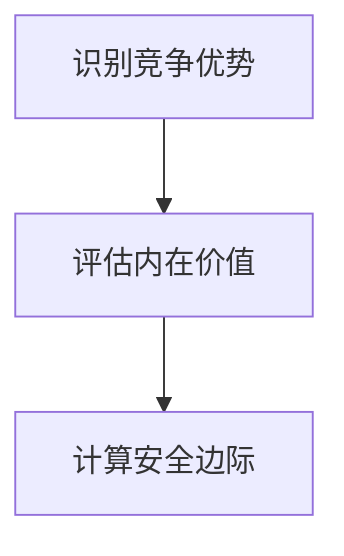
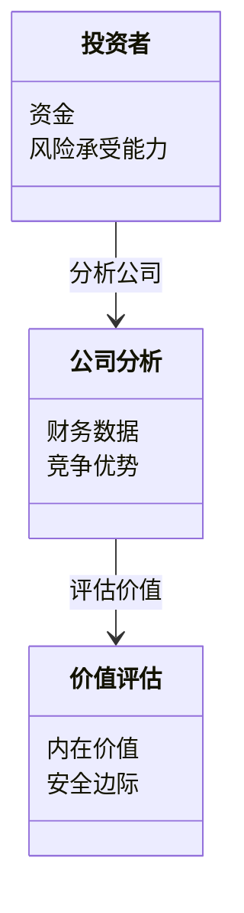
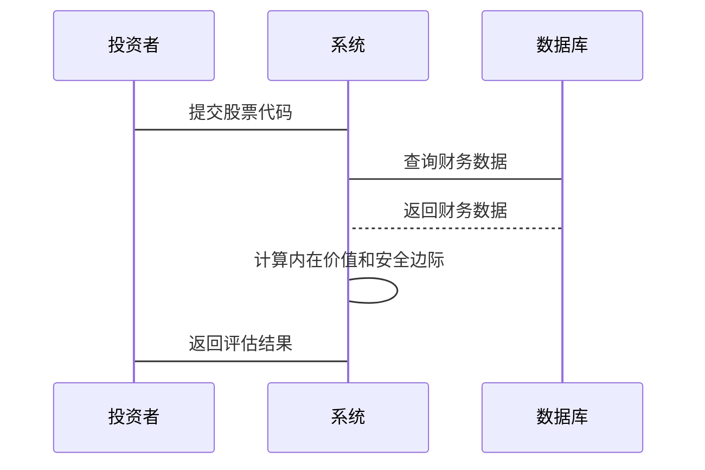

                 


# 巴菲特的商业分析方法论

## 关键词
- 巴菲特
- 价值投资
- 商业分析
- 投资策略
- 安全边际
- 竞争优势
- 投资者心态

## 摘要
巴菲特的商业分析方法论是价值投资领域的经典策略，以其独特的核心概念和系统化的分析框架著称。本文将详细介绍巴菲特的投资哲学、核心分析工具、数学模型以及实际案例分析，帮助读者理解如何在商业分析中应用这些方法。

---

# 第1章: 巴菲特的商业分析方法论背景

## 1.1 巴菲特的生平与投资理念

### 1.1.1 巴菲特的成长经历
沃伦·巴菲特（Warren Buffett）于1934年出生在美国奥马哈市，毕业于哥伦比亚商学院，师从本杰明·格雷厄姆。他的投资理念深受格雷厄姆的影响，形成了价值投资的核心思想。

### 1.1.2 巴菲特的投资哲学
巴菲特强调长期投资和价值投资，主张购买被市场低估的优秀企业，并长期持有。他提出的“安全边际”概念，要求投资者在购买股票时留有余地，以避免市场波动带来的损失。

### 1.1.3 巴菲特的价值投资理念
价值投资的核心是寻找市场价格低于内在价值的股票。巴菲特认为，内在价值是企业未来现金流的现值，可以通过DCF模型计算。

---

## 1.2 巴菲特商业分析方法论的核心思想

### 1.2.1 价值投资的核心要素
价值投资强调对企业基本面的深入分析，包括财务数据、行业地位和竞争优势。以下是核心要素的对比表：

| 要素 | 描述 |
|------|------|
| 内在价值 | 企业未来现金流的现值 |
| 市场价格 | 当前股票价格 |
| 安全边际 | 内在价值与市场价格的差额 |

### 1.2.2 巴菲特的长期投资策略
巴菲特倡导长期投资，避免频繁交易，注重企业的持续盈利能力。他认为，短期市场波动不可预测，而长期价值必然体现。

### 1.2.3 巴菲特的商业分析框架
巴菲特的分析框架包括三个步骤：识别竞争优势、评估内在价值和计算安全边际。下图展示了这一流程：



---

# 第2章: 巴菲特商业分析方法的核心概念

## 2.1 价值投资的定义与特点

### 2.1.1 价值投资的定义
价值投资是寻找市场价格低于内在价值的股票。其核心是通过深入分析企业基本面，识别被低估的投资标的。

### 2.1.2 价值投资的核心特点
价值投资注重长期、安全和边际。以下是特点对比：

| 特点 | 描述 |
|------|------|
| 长期视角 | 避免短期波动，关注长期价值 |
| 安全边际 | 确保投资的安全性 |
| 低市盈率 | 寻找低估的股票 |

### 2.1.3 价值投资与短期投资的对比
价值投资与短期投资在目标、风险和策略上有显著差异。下表展示了对比：

| 方面 | 价值投资 | 短期投资 |
|------|----------|----------|
| 目标 | 内在价值 | 市场波动 |
| 风险 | 低 | 高 |
| 策略 | 买入低估股 | 抄底逃顶 |

---

## 2.2 安全边际的概念与应用

### 2.2.1 安全边际的定义
安全边际是内在价值与市场价格的差额，确保在市场价格下跌时，投资者仍有获利空间。公式如下：

$$\text{安全边际} = \text{内在价值} - \text{市场价格}$$

### 2.2.2 安全边际在投资中的作用
安全边际提供了缓冲区，减少市场波动带来的损失。巴菲特建议投资者选择安全边际较大的股票，以降低风险。

### 2.2.3 安全边际的计算与应用
通过计算安全边际，投资者可以评估股票的安全性。例如，若内在价值为100，市场价格为80，则安全边际为20。

---

## 2.3 竞争优势的定义与分类

### 2.3.1 竞争优势的定义
竞争优势是企业相对于竞争对手的独特优势，包括成本优势、品牌优势和技术优势。

### 2.3.2 竞争优势的分类
竞争优势可以分为成本优势、品牌优势和护城河。护城河是企业长期竞争优势的来源，如专利、网络效应等。

### 2.3.3 竞争优势的评估方法
评估竞争优势时，需考虑企业的市场份额、利润率和增长潜力。例如，苹果公司的品牌和技术优势构成了强大的护城河。

---

# 第3章: 巴菲特商业分析方法的数学模型与公式

## 3.1 价值投资的数学模型

### 3.1.1 内在价值的计算公式
内在价值是企业未来现金流的现值，公式为：

$$\text{内在价值} = \sum_{t=1}^{n} \frac{\text{现金流}_t}{(1 + r)^t}$$

其中，r为贴现率，n为年数。

### 3.1.2 股票估值的数学模型
股票估值可以通过市盈率和每股收益计算：

$$\text{股票估值} = \text{每股收益} \times \text{市盈率}$$

---

## 3.2 安全边际的数学计算

### 3.2.1 安全边际的计算公式
$$\text{安全边际} = \text{内在价值} - \text{市场价格}$$

### 3.2.2 安全边际的比率计算
$$\text{安全边际比率} = \frac{\text{安全边际}}{\text{内在价值}}$$

---

## 3.3 竞争优势的数学评估

### 3.3.1 竞争优势的评估指标
竞争优势指数可以量化企业的竞争优势：

$$\text{竞争优势指数} = \frac{\text{市场份额} + \text{利润率}}{2}$$

---

# 第4章: 巴菲特商业分析方法的系统分析与架构设计

## 4.1 问题场景介绍

### 4.1.1 投资者面临的挑战
投资者在选择股票时，需面对市场波动、信息不对称和企业基本面分析的复杂性。

### 4.1.2 巴菲特方法的应用场景
巴菲特方法适用于寻找低估股票和长期投资。

---

## 4.2 系统功能设计

### 4.2.1 领域模型设计（Mermaid 类图）


### 4.2.2 系统架构设计（Mermaid 架构图）


### 4.2.3 系统接口设计
投资者通过客户端提交股票代码，系统返回价值评估结果。

---

## 4.3 系统交互设计（Mermaid 序列图）



---

# 第5章: 巴菲特商业分析方法的项目实战

## 5.1 环境安装

### 5.1.1 安装Python和相关库
安装Python和Pandas、NumPy等库，用于数据处理和计算。

### 5.1.2 数据来源
获取目标公司的财务数据，如收入、利润和现金流。

---

## 5.2 核心实现

### 5.2.1 计算内在价值
编写代码计算企业未来现金流的现值。

```python
import numpy as np

def calculate_intrinsic_value(cash_flows, discount_rate):
    return np.npv(discount_rate, cash_flows[1:]) + cash_flows[0]
```

### 5.2.2 计算安全边际
计算内在价值与市场价格的差额。

```python
market_price = 80
intrinsic_value = 100
safety_margin = intrinsic_value - market_price
```

---

## 5.3 应用解读与分析

### 5.3.1 案例分析
以苹果公司为例，分析其竞争优势和价值评估。

### 5.3.2 结果解读
若苹果的内在价值为150美元，市场价格为120美元，则安全边际为30美元。

---

## 5.4 项目小结
通过实际案例分析，验证巴菲特方法的有效性，并总结其在投资中的应用。

---

# 第6章: 总结与展望

## 6.1 最佳实践 tips
- 长期投资，避免短期波动
- 选择具有竞争优势的企业
- 保持安全边际

## 6.2 小结
巴菲特的商业分析方法论提供了系统化的投资框架，强调基本面分析和长期投资。

## 6.3 注意事项
- 避免过度依赖单一指标
- 定期复盘和调整投资组合
- 考虑宏观经济环境的影响

## 6.4 拓展阅读
推荐阅读巴菲特的经典著作和投资分析书籍，深入理解价值投资。

---

# 作者
作者：AI天才研究院 & 禅与计算机程序设计艺术

