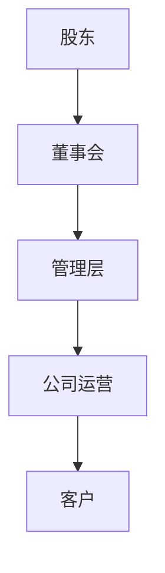
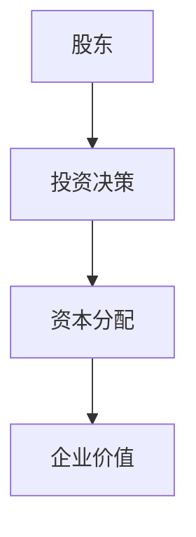
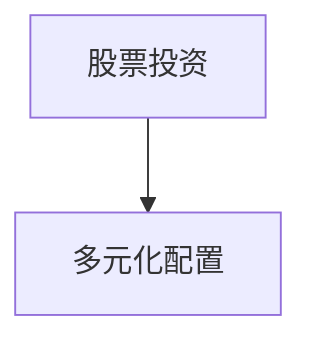

                 


# 巴菲特的商业模式分析

## 关键词
- 巴菲特
- 价值投资
- 商业模式
- 股票分析
- 投资策略

## 摘要
本文系统地分析了巴菲特的商业模式，从他的投资理念、商业模式核心概念、数学模型到系统架构进行了全面的探讨。通过详细分析巴菲特的护城河理论、竞争优势评估、财务指标分析以及投资组合管理，本文揭示了巴菲特商业模式的深刻本质，并通过实际案例展示了其在实践中的应用。本文还总结了巴菲特的投资哲学和对现代投资者的启示。

---

# 第一部分：巴菲特的商业模式概述

## 第1章：巴菲特的生平与投资理念

### 1.1 巴菲特的生平简介

#### 1.1.1 巴菲特的早年经历
沃伦·巴菲特（Warren Buffett）于1934年8月30日出生在美国堪萨斯州的奥马哈市。他在童年时期便展现出了对数字和投资的浓厚兴趣，12岁时开始购买股票。巴菲特的早年经历为他后来的投资理念奠定了基础。

#### 1.1.2 巴菲特的合伙人制度
在20世纪50年代，巴菲特开始与合伙人合作，成立了巴菲特合伙有限公司（Buffett Partnership, Ltd.）。这种合伙制度使他能够聚集资金，集中投资于具有长期增长潜力的公司。

#### 1.1.3 巴菲特的伯克希尔哈撒韦帝国
1962年，巴菲特收购了濒临破产的伯克希尔·哈撒韦公司（Berkshire Hathaway），并将其转变为一家多元化的投资公司。伯克希尔成为巴菲特投资理念的载体，涵盖了保险、银行、能源、制造业等多个领域。

### 1.2 巴菲特的投资理念

#### 1.2.1 价值投资的核心思想
巴菲特是价值投资的倡导者。他认为市场先生是疯狂的，而投资者应该关注企业的内在价值，而不是市场的短期波动。他强调以合理的价格投资于优秀的公司。

#### 1.2.2 股票的内在价值与市场价格
巴菲特认为，股票的内在价值是其未来现金流的现值。他提出了著名的内在价值公式：
$$ \text{内在价值} = \frac{\text{未来现金流}}{\text{贴现率}} $$

#### 1.2.3 长期投资与复利效应
巴菲特强调长期投资的重要性，认为复利是投资的“圣杯”。他建议投资者选择具有持续增长潜力的公司，并长期持有。

---

## 第2章：巴菲特的商业模式核心概念

### 2.1 商业模式背景介绍

#### 2.1.1 问题背景与问题描述
巴菲特的商业模式的核心在于如何识别具有持续竞争优势的公司。他关注的是企业的护城河，即公司能够在长期竞争中保持优势的屏障。

#### 2.1.2 问题解决的路径与方法
巴菲特通过分析企业的财务状况、管理层能力和市场地位来评估其竞争优势。

#### 2.1.3 模型的边界与外延
巴菲特的商业模式适用于长期价值投资，但不适合短期交易或高频交易。

#### 2.1.4 核心要素与概念结构
- **护城河分析**：企业的竞争优势。
- **财务指标**：如净利润率、资产负债率等。
- **管理层能力**：管理层的决策能力和道德水平。

### 2.2 核心概念与联系

#### 2.2.1 护城河分析
巴菲特认为，具有宽护城河的公司能够长期保持竞争优势。例如，可口可乐的全球品牌和分销网络就是其护城河。

#### 2.2.2 竞争优势评估
巴菲特将竞争优势分为四种类型：成本优势、品牌优势、网络优势和政策优势。例如，苹果公司通过不断创新和品牌忠诚度建立了强大的竞争优势。

#### 2.2.3 财务指标与估值模型
巴菲特使用财务指标和估值模型来评估企业的内在价值。例如，他关注企业的净利润率：
$$ \text{净利润率} = \frac{\text{净利润}}{\text{营业收入}} $$

---

## 第3章：巴菲特的商业模式分析框架

### 3.1 商业模式的核心要素

#### 3.1.1 企业盈利能力分析
巴菲特关注企业的盈利能力，认为只有能够持续创造利润的公司才值得投资。

#### 3.1.2 财务健康状况评估
巴菲特通过分析企业的财务报表来评估其健康状况。例如，他关注企业的资产负债率：
$$ \text{资产负债率} = \frac{\text{总负债}}{\text{总资产}} $$

#### 3.1.3 管理层能力与决策
巴菲特认为，管理层的能力和决策对企业的发展至关重要。他特别关注管理层的道德水平和决策能力。

### 3.2 商业模式的系统分析

#### 3.2.1 企业价值链分析
巴菲特通过分析企业的价值链来评估其竞争优势。例如，他分析苹果公司的产品开发、生产、销售和售后服务。

#### 3.2.2 股东价值最大化策略
巴菲特的目标是通过投资实现股东价值最大化。他通过选择具有长期增长潜力的公司来实现这一目标。

#### 3.2.3 投资组合管理方法
巴菲特通过分散投资来降低风险。他将伯克希尔的投资组合分散到多个行业和公司中。

---

## 第4章：巴菲特商业模式的数学模型

### 4.1 投资价值计算公式

#### 4.1.1 内在价值公式
$$ \text{内在价值} = \frac{\text{未来现金流}}{\text{贴现率}} $$

#### 4.1.2 股票估值公式
$$ \text{股价} = \text{每股收益} \times \text{市盈率} $$

### 4.2 财务指标分析

#### 4.2.1 净利润率
$$ \text{净利润率} = \frac{\text{净利润}}{\text{营业收入}} $$

#### 4.2.2 资产负债率
$$ \text{资产负债率} = \frac{\text{总负债}}{\text{总资产}} $$

---

## 第5章：巴菲特商业模式的系统架构

### 5.1 企业分析系统框架

#### 5.1.1 企业价值链分析


#### 5.1.2 股东价值最大化系统


### 5.2 投资组合管理系统

#### 5.2.1 投资组合构成


---

## 第6章：巴菲特商业模式的项目实战

### 6.1 实际案例分析

#### 6.1.1 可口可乐的护城河分析
可口可乐的全球品牌和分销网络构成了其强大的护城河。

#### 6.1.2 苹果公司的竞争优势
苹果公司的创新能力和品牌忠诚度使其在科技行业中具有竞争优势。

### 6.2 项目实现与解读

#### 6.2.1 项目环境安装
需要安装Python和相关数据分析库（如Pandas、NumPy）。

#### 6.2.2 核心实现代码
```python
import pandas as pd

# 示例：计算净利润率
def calculate_net_margin(net_income, revenue):
    return net_income / revenue

# 示例：计算资产负债率
def calculate_debt_to_equity(debt, equity):
    return debt / equity

# 示例：计算内在价值
def calculate_intrinsic_value(cash_flows, discount_rate):
    return sum(cash_flows) / (1 + discount_rate)
```

---

## 第7章：巴菲特商业模式的哲学与启示

### 7.1 投资哲学

#### 7.1.1 长期投资的重要性
巴菲特强调长期投资的重要性，认为复利是投资的“圣杯”。

#### 7.1.2 风险管理的核心地位
巴菲特认为，风险管理是投资成功的关键。他通过分散投资来降低风险。

### 7.2 对现代投资者的启示

#### 7.2.1 价值投资的真谛
价值投资不仅仅是寻找便宜的股票，而是寻找具有长期增长潜力的优秀公司。

#### 7.2.2 护城河分析的重要性
投资者应该关注企业的护城河，选择具有竞争优势的公司。

### 7.3 最佳实践 tips

#### 7.3.1 长期投资
投资者应该长期持有优秀的公司，避免短期波动的影响。

#### 7.3.2 财务分析
投资者应该学会分析企业的财务报表，评估其财务健康状况。

#### 7.3.3 管理层评估
投资者应该关注管理层的能力和道德水平。

---

## 作者

作者：AI天才研究院/AI Genius Institute & 禅与计算机程序设计艺术 /Zen And The Art of Computer Programming

