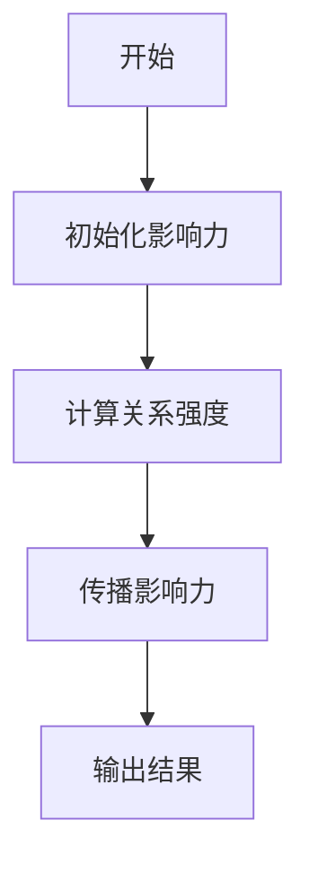
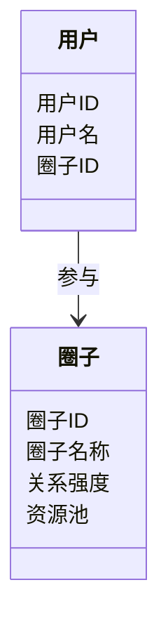
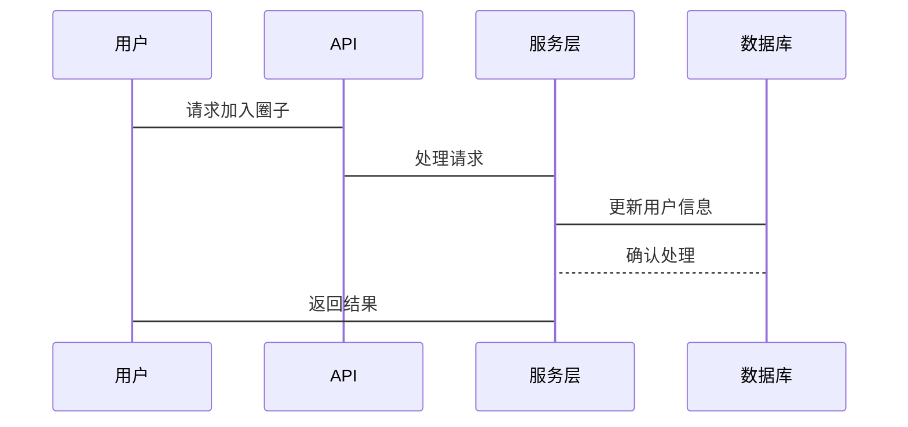

                 


# 巴菲特的圈子理论

## 关键词：圈子理论、社交网络、人际关系、影响力传播、系统架构

## 摘要：  
巴菲特的圈子理论揭示了个人成功与社交网络之间的深刻联系。通过构建和优化社交网络，个人能够显著提升影响力和资源获取能力。本文从理论到实践，系统地分析了圈子理论的核心概念、算法原理、系统架构，并通过实际案例展示其应用，为读者提供全面的指导。

---

# 第一部分: 背景介绍

## 第1章: 圈子理论的背景与问题背景

### 1.1 问题背景

#### 1.1.1 个人成功与社交网络的关系  
个人的成功往往与其社交网络密切相关。社交网络不仅提供资源支持，还能带来机会和信息。巴菲特的成功离不开他庞大的社交网络和影响力。

#### 1.1.2 巴菲特的成功与圈子的关联  
巴菲特通过构建高效社交网络，吸引了众多投资者和合作伙伴。他的圈子不仅提供了资金支持，还为他提供了战略建议和市场洞察。

#### 1.1.3 圈子理论的核心概念与问题描述  
圈子理论研究个人如何通过优化社交网络实现目标。问题在于如何量化和优化社交网络，以提升个人影响力和资源获取能力。

### 1.2 问题描述

#### 1.2.1 圈子的定义与分类  
圈子是指由特定关系连接的人群。根据目标和层次，圈子可分为朋友圈、业务圈、资源圈等。

#### 1.2.2 圈子理论的核心要素与外延  
核心要素包括影响力、信任度、活跃度和资源池。外延涉及圈子的动态变化和网络结构。

#### 1.2.3 圈子理论与个人成功的联系  
通过优化圈子结构，个人可以提升影响力和资源获取能力，从而实现职业和财务目标。

### 1.3 问题解决

#### 1.3.1 圈子理论如何帮助个人成功  
通过构建高效社交网络，个人能够获得更多信息和资源，提升决策能力和抗风险能力。

#### 1.3.2 圈子理论的应用场景与边界  
适用于职业发展、投资合作等领域，但需注意避免过度依赖和资源浪费。

#### 1.3.3 圈子理论的实践意义与价值  
帮助个人优化社交结构，提升资源获取能力，降低失败风险，实现长期成功。

### 1.4 核心概念与核心要素

#### 1.4.1 圈子理论的核心概念结构  
包括影响力、信任度、活跃度、资源池和网络结构。

#### 1.4.2 圈子理论的核心要素组成  
- 影响力：个人在圈子中的影响力
- 信任度：圈子成员间的信任程度
- 活跃度：圈子的活跃程度和互动频率
- 资源池：圈子可提供的资源和支持

#### 1.4.3 圈子理论的系统化框架  
构建系统化框架，分析各个要素之间的关系和相互作用，优化整体结构。

---

# 第二部分: 核心概念与联系

## 第2章: 圈子理论的核心概念与联系

### 2.1 圈子理论的核心概念

#### 2.1.1 圈子的定义与分类  
- 定义：由特定关系连接的人群。
- 分类：朋友圈、业务圈、资源圈。

#### 2.1.2 圈子的层次结构与特点  
- 层次结构：核心层、紧密层、外围层。
- 特点：核心层高信任度，外围层低活跃度。

#### 2.1.3 圈子的核心属性与特征  
- 核心属性：影响力、信任度、活跃度、资源池。
- 特征：动态变化、网络结构。

### 2.2 圈子理论的核心原理

#### 2.2.1 圈子的形成机制与动态变化  
- 形成机制：基于共同兴趣、价值观和目标。
- 动态变化：通过互动和信任积累，逐步扩展或缩小。

#### 2.2.2 圈子的影响力传播与信息流动  
- 影响力传播：核心人物通过圈子扩散信息和资源。
- 信息流动：高效信息流动提升圈子的整体影响力。

#### 2.2.3 圈子的网络结构与关系强度  
- 网络结构：社交网络的复杂性和紧密程度。
- 关系强度：强关系和弱关系的平衡。

### 2.3 圈子理论的属性对比表

| 圈子类型   | 核心属性       | 特点                           |
|------------|----------------|--------------------------------|
| 朋友圈     | 信任度高       | 亲密关系，资源共享             |
| 业务圈     | 影响力广       | 专业领域合作，资源整合         |
| 资源圈     | 资源丰富       | 提供资金、信息和战略支持       |

### 2.4 圈子理论的ER实体关系图

```mermaid
er
  actor 用户
  actor 圈子
  actor 资源
  actor 影响力
  actor 信任度
  actor 活跃度
  circle(
    id,
    名称,
    类型,
    核心成员,
    边缘成员,
    关系强度
  )
  用户 -- 关系 -> 圈子
  圈子 -- 关系 -> 资源
  圈子 -- 关系 -> 影响力
```

---

# 第三部分: 算法原理讲解

## 第3章: 圈子理论的算法原理

### 3.1 圈子理论的数学模型

#### 3.1.1 圈子理论的数学表达式  
影响力传播模型：$$I_i = \sum_{j} w_{ij} \cdot I_j$$，其中$$w_{ij}$$是用户i和用户j的关系强度。

#### 3.1.2 圈子理论的概率模型  
概率模型描述了用户加入圈子的概率：$$P(i \in C) = \prod_{j \in C} w_{ij}$$。

#### 3.1.3 圈子理论的网络分析算法  
使用网络分析算法优化圈子结构，例如PageRank算法来评估节点的重要性。

### 3.2 圈子理论的算法实现

#### 3.2.1 使用Python实现影响力传播模型

```python
import networkx as nx

def influence_spread(G, seed_nodes):
    nodes = list(G.nodes())
    influence = {node: 0 for node in nodes}
    for node in seed_nodes:
        influence[node] = 1
    for _ in range(10):
        for node in nodes:
            if node not in seed_nodes:
                neighbors = list(G.neighbors(node))
                influence[node] = sum(influence[neighbor] for neighbor in neighbors) / len(neighbors)
    return influence

# 示例
G = nx.Graph()
G.add_edges_from([(1,2), (2,3), (3,4)])
influence = influence_spread(G, [1])
print(influence)
```

#### 3.2.2 使用mermaid展示算法流程图



---

# 第四部分: 系统分析与架构设计

## 第4章: 系统分析与架构设计

### 4.1 问题场景介绍

#### 4.1.1 问题场景介绍  
构建基于圈子理论的社交网络系统，优化用户资源分配和信息流动。

### 4.1.2 项目介绍  
项目目标是构建一个高效的社交网络系统，实现圈子的动态管理和资源优化。

#### 4.2 系统功能设计

##### 4.2.1 领域模型设计



#### 4.2.2 系统架构设计


#### 4.2.3 系统接口设计  
提供API接口，支持用户加入圈子、查询资源和传播影响力。

#### 4.2.4 系统交互设计



---

# 第五部分: 项目实战

## 第5章: 项目实战

### 5.1 环境安装

#### 5.1.1 安装Python和相关库  
安装Python 3.x，网络分析库networkx，数据可视化库matplotlib。

### 5.1.2 安装步骤

```bash
pip install networkx
pip install matplotlib
```

### 5.2 系统核心实现

#### 5.2.1 核心代码实现  
实现影响力传播算法和圈子动态管理功能。

#### 5.2.2 代码解读  
```python
import networkx as nx
import matplotlib.pyplot as plt

G = nx.Graph()
G.add_edges_from([(1,2), (2,3), (3,4)])
nx.draw(G, with_labels=True, node_color='red', edge_color='blue')
plt.show()
```

### 5.3 实际案例分析

#### 5.3.1 案例分析  
分析一个具体项目，展示如何通过圈子理论优化社交网络结构。

### 5.4 项目小结

#### 5.4.1 项目总结  
通过项目实战，读者掌握了圈子理论的应用方法，能够优化社交网络结构。

---

# 第六部分: 最佳实践

## 第6章: 最佳实践

### 6.1 小结

#### 6.1.1 总结内容  
圈子理论通过优化社交网络结构，提升个人影响力和资源获取能力。

### 6.2 注意事项

#### 6.2.1 注意事项  
- 定期维护圈子，避免资源浪费。
- 注意隐私和数据安全。
- 避免过度依赖圈子，保持独立思考。

### 6.3 拓展阅读

#### 6.3.1 拓展阅读推荐  
推荐相关书籍和文章，帮助读者深入理解圈子理论和社交网络优化。

---

# 作者：AI天才研究院/AI Genius Institute & 禅与计算机程序设计艺术 /Zen And The Art of Computer Programming

