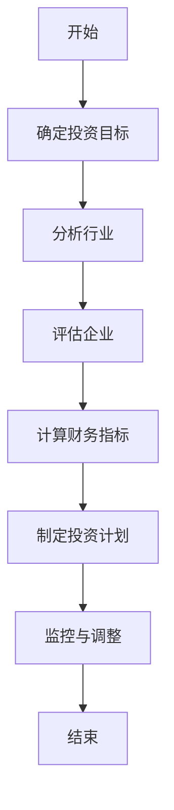

                 


# 巴菲特的圈子理论：投资你懂的行业

> 关键词：巴菲特，投资，能力圈，价值投资，长期投资

> 摘要：本文深入探讨了巴菲特的圈子理论，即投资你懂的行业。通过分析巴菲特的生平、投资理念、圈子理论的核心概念、数学模型、系统架构以及实际案例，帮助读者理解如何通过投资自己熟悉的行业来实现长期稳定的收益。

---

## 第一部分: 巴菲特的生平与投资理念

### 第1章: 巴菲特的生平简介

#### 1.1 巴菲特的早年经历
沃伦·巴菲特（Warren Buffett）于1930年8月30日出生在美国堪萨斯州的奥马哈市。他从小就展现出对数字和金融的浓厚兴趣。巴菲特在高中时期就开始阅读投资相关的书籍，并在大学期间主修经济学，这为他后来的投资事业奠定了基础。

#### 1.2 巴菲特的合伙人制度
巴菲特在1950年代初期创立了巴菲特合伙公司（Buffett Partnership），标志着他正式进入投资领域。他通过合伙制将资金和人才结合起来，实现了资本的快速积累。

#### 1.3 巴菲特的投资哲学
巴菲特的投资哲学以价值投资为核心，强调长期持有优质资产，避免短期市场的波动。他主张通过深入研究企业的基本面，寻找那些具有持续竞争优势和合理估值的企业进行投资。

---

### 第2章: 巴菲特的投资理念

#### 2.1 价值投资的核心思想
价值投资的核心是寻找市场价格低于内在价值的股票。巴菲特认为，市场先生（Mr. Market）的情绪波动为理性投资者提供了廉价买入优质资产的机会。

#### 2.2 长期投资的重要性
巴菲特强调长期投资的重要性，认为短期市场的波动并不能决定企业的长期价值。通过长期持有优质资产，投资者能够分享企业的成长果实。

#### 2.3 安全边际的概念
安全边际是指股票的市场价格低于其内在价值的部分。巴菲特认为，通过购买具有安全边际的股票，可以降低投资的风险，并为长期收益提供保障。

---

## 第二部分: 圈子理论的核心概念

### 第3章: 圈子理论的定义

#### 3.1 能力圈的定义
能力圈是指投资者对某个行业或领域的深入了解和熟悉程度。巴菲特认为，投资者应该只投资于自己熟悉的企业，这样才能更好地评估企业的价值和风险。

#### 3.2 能力圈的边界
能力圈的边界包括投资者的知识储备、行业经验以及对市场的理解。只有在自己熟悉的能力圈内进行投资，才能降低决策的错误率。

#### 3.3 能力圈的外延
能力圈的外延是指投资者可以通过不断学习和实践，扩大自己的能力圈。然而，巴菲特强调，投资者应该专注于自己最熟悉的部分，而不是盲目追求广泛的投资领域。

---

### 第4章: 圈子理论的核心要素

#### 4.1 行业分析
行业分析是圈子理论的重要组成部分。投资者需要对目标行业的市场结构、竞争格局、增长潜力等进行深入研究，以确定其是否具有长期投资价值。

#### 4.2 企业竞争优势
企业竞争优势是评估企业价值的关键因素。巴菲特强调，投资者应该选择那些具有持续竞争优势的企业，例如成本优势、品牌优势或技术优势。

#### 4.3 财务状况评估
财务状况评估是投资决策的重要依据。巴菲特通过分析企业的财务报表，重点关注企业的盈利能力、资产负债情况以及现金流状况，以评估企业的财务健康状况。

---

## 第三部分: 圈子理论的数学模型与算法原理

### 第5章: 财务指标分析

#### 5.1 市盈率（P/E）计算
市盈率是衡量股票估值的重要指标，公式如下：
$$ P/E = \frac{\text{Market Price}}{\text{Earnings Per Share}} $$

#### 5.2 市净率（P/B）计算
市净率是另一个常用的估值指标，公式如下：
$$ P/B = \frac{\text{Market Price}}{\text{Book Value Per Share}} $$

### 第6章: 投资组合优化

#### 6.1 马科维茨投资组合理论
马科维茨的投资组合理论认为，通过合理配置资产，可以最大化投资收益并最小化风险。公式如下：
$$ \text{风险} = \sqrt{w^T \Sigma w} $$
其中，\( w \) 是资产权重向量，\( \Sigma \) 是资产之间的协方差矩阵。

### 第7章: 价值评估模型

#### 7.1 现金流折现模型（DCF）
现金流折现模型是评估企业价值的重要工具，公式如下：
$$ V = \sum_{t=1}^{n} \frac{CF_t}{(1 + r)^t} + \frac{TV}{(1 + r)^n} $$
其中，\( CF_t \) 是第t年的现金流，\( r \) 是折现率，\( TV \) 是终值。

---

## 第四部分: 圈子理论的系统架构设计

### 第8章: 投资决策流程图
以下是投资决策的流程图：



---

## 第五部分: 项目实战

### 第9章: 环境安装与系统核心实现

#### 9.1 环境安装
需要安装Python和相关数据分析库（如Pandas、NumPy、Matplotlib）。

#### 9.2 核心代码实现
以下是计算市盈率和市净率的Python代码：

```python
import pandas as pd

# 假设df是包含股票数据的DataFrame
def calculate_pe_pb(df):
    df['PE'] = df['Market Price'] / df['Earnings Per Share']
    df['PB'] = df['Market Price'] / df['Book Value Per Share']
    return df

# 示例数据
data = {
    'Market Price': [100, 80, 120],
    'Earnings Per Share': [20, 15, 30],
    'Book Value Per Share': [50, 40, 60]
}
df = pd.DataFrame(data)
result = calculate_pe_pb(df)
print(result)
```

---

## 第六部分: 最佳实践与总结

### 第10章: 最佳实践

#### 10.1 投资心态
投资者需要保持冷静和耐心，避免被市场的短期波动所影响。

#### 10.2 持续学习
通过不断学习和实践，投资者可以逐步扩大自己的能力圈。

#### 10.3 风险管理
合理的资产配置和风险控制是实现长期投资收益的重要保障。

---

## 作者信息

作者：AI天才研究院/AI Genius Institute & 禅与计算机程序设计艺术 /Zen And The Art of Computer Programming

---

通过以上结构，我们可以清晰地看到巴菲特的圈子理论如何指导我们进行投资决策。从生平简介到数学模型，再到实际案例分析，每一步都紧扣主题，帮助读者理解并应用这一理论。希望这篇文章能为投资者提供有价值的参考和启示。

