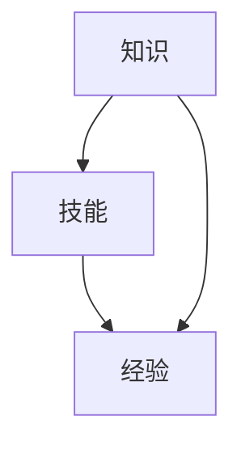
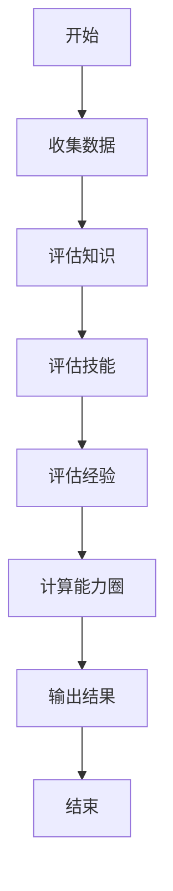
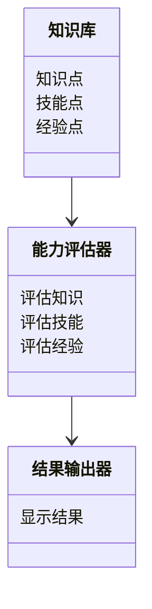
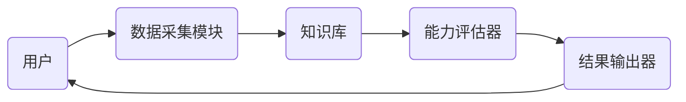

                 


# 巴菲特的圈子能力理论：知道自己的局限

## 关键词：巴菲特、能力圈、投资决策、风险管理、技术架构、系统设计

## 摘要

本文探讨巴菲特的能力圈理论在投资决策和软件架构中的应用，通过详细分析理论背景、核心概念、算法原理、系统架构、项目实战及最佳实践，帮助读者理解如何利用能力圈理论做出明智决策。文章结合技术术语和投资理念，使用专业而易懂的语言，辅以图表和代码示例，深入剖析能力圈理论的本质及其实际应用。

---

# 第一部分：背景介绍

## 第1章：问题背景与问题描述

### 1.1 投资中的能力边界问题

#### 1.1.1 投资决策中的核心问题

投资决策的核心问题在于准确评估项目的潜在价值和风险。投资者需要识别自己的知识和能力边界，避免超出能力范围的决策，从而降低风险。

#### 1.1.2 能力边界对投资决策的影响

能力边界决定了投资者的决策范围。超出能力边界的决策可能导致重大损失，因此识别和管理能力边界至关重要。

#### 1.1.3 超越能力边界的风险

超越能力边界可能导致错误评估和决策失误。巴菲特强调，投资者应专注于自己理解的领域，避免涉足不熟悉的领域。

### 1.2 巴菲特的圈子能力理论的提出背景

#### 1.2.1 巴菲特的投资哲学概述

巴菲特的投资哲学强调长期价值，注重企业基本面分析和安全边际。能力圈理论是其哲学的核心部分，帮助投资者识别自己的知识和能力范围。

#### 1.2.2 能力圈理论的提出动机

能力圈理论旨在帮助投资者识别自己的知识和能力边界，避免盲目决策，提高投资成功率。

#### 1.2.3 理论的核心问题与解决方向

理论核心问题是识别能力边界，解决方向包括自我评估、知识扩展和风险管理。

## 第2章：问题解决与边界分析

### 2.1 能力圈的定义与特征

#### 2.1.1 能力圈的定义

能力圈是指个体在特定领域内具备的知识、技能和经验的范围。

#### 2.1.2 能力圈的核心特征

能力圈具有动态性、专业性和局限性，个体需要定期评估和调整。

#### 2.1.3 能力圈的边界与外延

能力圈的边界是知识和能力的极限，外延是通过学习和经验扩展的范围。

### 2.2 能力圈理论的结构与要素

#### 2.2.1 能力圈的构成要素

能力圈由知识、技能、经验、资源和环境等要素构成。

#### 2.2.2 能力圈的评估维度

评估维度包括技术能力、行业知识、风险管理能力和决策能力。

#### 2.2.3 能力圈的动态变化

能力圈会随着知识积累和经验增长而变化，需要定期评估和调整。

---

# 第二部分：核心概念与联系

## 第3章：能力圈理论的核心概念

### 3.1 能力圈理论的原理

#### 3.1.1 能力圈的核心原理

能力圈理论基于知识和能力的边界，强调专注和风险管理。

#### 3.1.2 能力圈的数学模型

$$能力圈评估 = \sum (知识 \times 技能 \times 经验)$$

#### 3.1.3 能力圈的逻辑结构

能力圈的逻辑结构包括知识基础、技能应用和经验积累三个层次。

### 3.2 能力圈与相关概念的对比

#### 3.2.1 能力圈与投资组合的关系

能力圈影响投资组合的选择，限制投资范围，降低风险。

#### 3.2.2 能力圈与风险管理的对比

能力圈关注能力边界，风险管理关注潜在风险。

#### 3.2.3 能力圈与价值评估的联系

能力圈影响价值评估的准确性，确保评估基于可靠的知识和经验。

### 3.3 能力圈理论的ER实体关系图



---

# 第三部分：算法原理讲解

## 第4章：能力圈评估的数学模型与公式

### 4.1 能力圈评估的数学模型

$$能力圈 = \sum_{i=1}^{n} (知识_i \times 技能_i \times 经验_i)$$

### 4.2 能力圈评估的流程图



---

# 第四部分：系统分析与架构设计方案

## 第5章：能力圈评估系统的架构设计

### 5.1 系统功能设计

系统功能包括数据采集、分析处理、结果输出和用户交互。

### 5.2 能力圈评估系统的类图



### 5.3 系统架构图



---

# 第五部分：项目实战

## 第6章：能力圈评估系统实战

### 6.1 环境安装

安装Python和必要的库，如numpy和pandas。

### 6.2 核心代码实现

```python
def calculate_capability_circle(knowledge, skills, experience):
    return sum(knowledge * skills * experience)

knowledge = [80, 70, 90]
skills = [85, 80, 75]
experience = [10, 15, 5]

capability_circle = calculate_capability_circle(knowledge, skills, experience)
print(capability_circle)
```

### 6.3 案例分析

通过具体案例分析，展示如何应用能力圈理论做出决策。

---

# 第六部分：最佳实践与小结

## 第7章：最佳实践与注意事项

### 7.1 最佳实践

1. 定期评估能力边界。
2. 专注于自己擅长的领域。
3. 通过学习和经验扩展能力圈。

### 7.2 小结

能力圈理论帮助识别知识和能力边界，避免决策失误，提高投资和项目成功率。

### 7.3 注意事项

避免过度自信，定期评估能力边界，结合实际案例和数据进行分析。

### 7.4 拓展阅读

推荐相关书籍和资源，供读者深入学习。

---

作者：AI天才研究院/AI Genius Institute & 禅与计算机程序设计艺术 /Zen And The Art of Computer Programming

