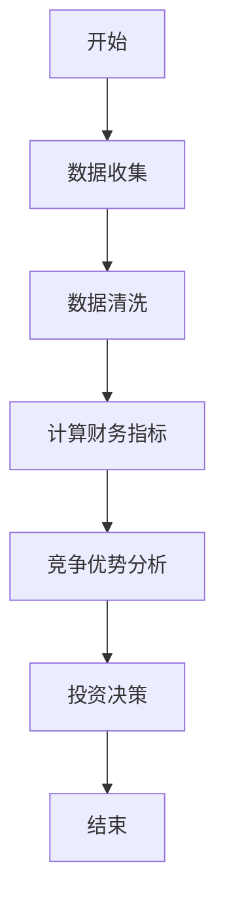

                 


```markdown
# 巴菲特的媒体行业投资：内容为王的时代

> 关键词：巴菲特，媒体行业，内容为王，投资策略，价值投资，媒体分析

> 摘要：本文深入探讨了巴菲特在媒体行业的投资策略，分析了内容为王的时代背景下，巴菲特如何通过价值投资原则，选择具有长期竞争优势的媒体公司。文章结合媒体行业的现状，详细解析了巴菲特的投资逻辑，并通过实际案例，展示了如何将这些策略应用于媒体行业的投资分析中。

---

# 第一部分: 巴菲特的媒体行业投资概述

## 第1章: 巴菲特的投资理念与媒体行业的结合

### 1.1 巴菲特的价值投资理念
#### 1.1.1 价值投资的核心原则
- **长期投资**：巴菲特倡导长期投资，关注企业的内在价值，而非短期市场波动。
- **安全边际**：通过购买低于内在价值的股票，确保投资的安全性。
- **企业基本面**：重视企业的财务健康、盈利能力和竞争优势。

#### 1.1.2 巴菲特对媒体行业的独特见解
- 媒体行业的独特性：媒体行业具有高门槛、高投入、高回报的特点。
- 内容为王：优质内容是媒体企业核心竞争力的体现。

#### 1.1.3 内容为王的时代背景
- 数字化转型：互联网和数字技术的普及，使得内容分发更加高效。
- 用户需求变化：用户从单一内容消费向多元化、个性化需求转变。
- 媒体行业的周期性：内容生产、传播和消费的周期性波动。

---

## 第2章: 媒体行业的现状与发展趋势

### 2.1 媒体行业的数字化转型
#### 2.1.1 传统媒体与新媒体的对比
| 特性       | 传统媒体          | 新媒体          |
|------------|-------------------|-----------------|
| 内容分发    | 单向传播          | 互动传播        |
| 用户参与度  | 低               | 高             |
| 技术依赖    | 低               | 高             |

#### 2.1.2 数字化对媒体行业的影响
- 内容生产效率提升：数字化工具降低了内容创作的成本。
- 用户行为变化：用户从被动接受内容转向主动参与内容生产。
- 市场竞争加剧：新媒体的出现打破了传统媒体的垄断地位。

#### 2.1.3 内容为王的行业趋势
- 优质内容成为核心竞争力。
- 内容形式多样化：从文字、图片到视频，内容形式不断丰富。
- 用户需求个性化：用户对内容的需求更加个性化，推动媒体行业细分市场的形成。

---

## 第3章: 巴菲特的媒体行业投资策略

### 3.1 巴菲特的选股标准
#### 3.1.1 财务指标分析
- **市盈率（P/E）**：衡量企业股票价格与盈利之间的关系。
  $$ P/E = \frac{\text{股价}}{\text{每股收益}} $$
- **市净率（P/B）**：衡量企业股票价格与净资产之间的关系。
  $$ P/B = \frac{\text{股价}}{\text{每股净资产}} $$
- **股息率**：衡量企业分红能力。
  $$ \text{股息率} = \frac{\text{每股股息}}{\text{股价}} $$

#### 3.1.2 管理团队评估
- 团队稳定性：管理团队是否稳定，是否有长期发展的规划。
- 团队能力：管理团队是否具备行业经验和专业能力。
- 团队激励机制：是否存在有效的激励机制，确保团队与企业利益一致。

#### 3.1.3 行业地位与竞争优势
- 市场占有率：企业在行业中的市场地位。
- 竞争优势：企业的核心竞争力，如技术、品牌、资源等。

### 3.2 巴菲特对媒体行业投资的长期视角
#### 3.2.1 长期投资与股东价值
- 长期投资的核心是关注企业的内在价值，而非短期市场波动。
- 股东价值：通过长期持有，分享企业的成长收益。

#### 3.2.2 媒体行业的周期性分析
- 行业周期：媒体行业受经济周期影响较大，需关注行业周期性波动。
- 市场波动：短期市场波动对长期投资影响有限。

#### 3.2.3 风险管理与投资组合优化
- 风险分散：通过多元化投资降低风险。
- 投资组合优化：根据市场变化调整投资组合，保持合理风险水平。

---

## 第4章: 巴菲特的媒体行业投资模型

### 4.1 投资模型的构建
#### 4.1.1 数据收集与清洗
- 数据来源：公司财务报表、行业报告、市场分析等。
- 数据清洗：去除无效数据，确保数据的准确性和完整性。

#### 4.1.2 财务指标计算
- 利润率：净利润率、销售利润率等。
- 资产负债率：衡量企业的财务健康状况。
- 现金流：企业经营活动产生的现金流。

#### 4.1.3 竞争优势分析
- 市场地位：企业在行业中的市场地位。
- 技术创新：企业是否具备技术优势。
- 用户粘性：用户对企业的依赖程度。

---

## 第5章: 巴菲特投资模型的算法实现

### 5.1 算法流程


### 5.2 算法实现
#### 5.2.1 Python代码示例
```python
import pandas as pd

# 数据清洗
def clean_data(data):
    data.dropna(inplace=True)
    return data

# 财务指标计算
def calculate_ratios(data):
    data['市盈率'] = data['股价'] / data['每股收益']
    data['市净率'] = data['股价'] / data['每股净资产']
    return data

# 竞争优势分析
def analyze_competition(data):
    data['市场地位'] = data['市场占有率'].rank(ascending=False)
    return data
```

---

## 第6章: 巴菲特投资模型的实际应用

### 6.1 投资案例分析
#### 6.1.1 投资迪士尼的案例
- 投资背景：迪士尼的并购策略和内容生产优势。
- 投资决策：基于财务指标和竞争优势分析，巴菲特定价买入。

#### 6.1.2 投资奈飞的案例
- 投资背景：奈飞的内容分发模式和订阅制收入。
- 投资决策：基于市盈率和用户增长潜力，巴菲特定价买入。

### 6.2 投资模型的应用步骤
#### 6.2.1 数据收集与清洗
- 收集目标公司的财务报表和行业报告。
- 清洗数据，确保数据的准确性和完整性。

#### 6.2.2 财务指标计算
- 计算市盈率、市净率等关键指标。
- 分析企业的财务健康状况和盈利潜力。

#### 6.2.3 竞争优势分析
- 评估企业的市场地位和技术优势。
- 分析企业的用户粘性和品牌影响力。

---

## 第7章: 投资模型的优化与改进

### 7.1 算法优化
- 引入机器学习算法，提高模型的预测精度。
- 使用大数据分析技术，优化数据收集和处理流程。

### 7.2 模型改进
- 根据市场变化，动态调整投资策略。
- 引入新的指标，如用户增长率和研发投入比例。

---

## 第8章: 投资模型的总结与展望

### 8.1 投资模型的总结
- 通过巴菲特的投资理念和媒体行业的特点，构建了完整的投资模型。
- 该模型结合了财务分析和竞争优势分析，具有较高的实用价值。

### 8.2 投资模型的展望
- 随着技术的进步，未来可以引入更多的数据分析工具，优化投资模型。
- 结合人工智能技术，实现更加精准的投资决策。

---

# 作者信息

作者：AI天才研究院/AI Genius Institute & 禅与计算机程序设计艺术 /Zen And The Art of Computer Programming

---

通过以上目录结构和内容，您可以逐步展开每个章节的具体内容，确保文章逻辑清晰、结构紧凑、内容详实。希望这篇技术博客文章能为您提供有价值的信息和见解！
```

