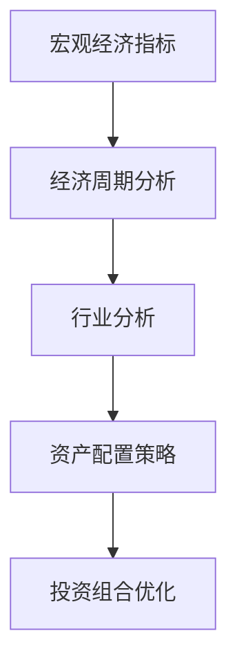

                 


# 巴菲特的宏观经济视角：如何将大局观应用于投资

## 关键词
巴菲特，宏观经济，投资策略，资产配置，价值投资

## 摘要
本文从巴菲特的投资哲学出发，探讨其如何运用宏观经济视角进行投资决策。通过分析宏观经济指标、经济周期、行业分析等，结合资产配置模型和风险管理策略，帮助读者理解如何将大局观应用于实际投资中。文章还详细讲解了巴菲特风格的资产配置模型，包括数学公式、算法原理和系统架构设计，并通过项目实战提供具体的Python代码实现。

---

# 第一部分: 引言

## 第1章: 巴菲特的投资理念与宏观经济视角

### 1.1 巴菲特的投资哲学

#### 1.1.1 价值投资的核心理念
价值投资的核心是寻找市场定价低于其内在价值的资产。巴菲特强调企业的内在价值，认为市场短期可能疯狂，但长期会回归理性。

#### 1.1.2 巴菲特的长期投资策略
巴菲特倡导长期投资，避免频繁交易，关注企业的长期盈利能力。他强调投资不是赌博，而是通过深入研究做出决策。

#### 1.1.3 宏观经济视角的重要性
宏观经济因素如GDP增长、通货膨胀、利率变化等，对企业的经营环境和投资决策有重要影响。巴菲特通过宏观视角分析经济趋势，指导投资组合的调整。

---

## 第2章: 宏观经济与投资的关系

### 2.1 宏观经济的基本概念

#### 2.1.1 宏观经济的主要指标
- **GDP（国内生产总值）**：衡量一个国家或地区的经济规模。
- **失业率**：反映劳动力市场的健康状况。
- **CPI（消费者价格指数）**：衡量通货膨胀水平。

#### 2.1.2 经济周期的定义与特征
经济周期分为衰退、恢复、繁荣和衰退四个阶段，不同阶段适合不同类型的投资。

#### 2.1.3 宏观经济对投资的影响
宏观经济指标的变化直接影响企业的盈利能力、股票估值和债券收益率。

---

# 第二部分: 巴菲特宏观投资哲学

## 第3章: 巴菲特的宏观投资体系

### 3.1 巴菲特的资产配置策略

#### 3.1.1 股票与债券的配置比例
巴菲特通常倾向于长期持有优质股票，同时在经济衰退期增加债券配置以降低风险。

#### 3.1.2 不同经济周期下的资产选择
- **衰退期**：增加债券配置，减少股票风险。
- **恢复期**：增加股票配置，抓住经济复苏机会。
- **繁荣期**：精选优质股票，避免泡沫。
- **顶峰期**：分散投资，减少集中风险。

#### 3.1.3 巴菲特的分散投资原则
避免过度集中，通过多样化降低风险。巴菲特的分散投资主要体现在行业和地域的分散。

---

## 第4章: 巴菲特的价值评估方法

### 4.1 企业基本面分析

#### 4.1.1 财务报表分析
- **利润表**：关注净利润和利润率。
- **资产负债表**：评估资产质量、负债结构和股东权益。
- **现金流量表**：分析企业现金流健康状况。

#### 4.1.2 企业竞争优势分析
巴菲特重视企业的护城河，包括成本优势、技术壁垒、品牌影响力等。

#### 4.1.3 行业地位与前景评估
选择行业龙头，分析行业前景和竞争格局。

---

## 第5章: 巴菲特的风险管理策略

### 5.1 宏观经济风险的识别

#### 5.1.1 经济衰退的预警信号
- GDP增速显著放缓。
- 失业率上升。
- 企业利润下降。

#### 5.1.2 通货膨胀与通货紧缩的影响
- 通货膨胀：增加企业成本，降低利润。
- 通货紧缩：可能导致企业债务负担加重。

#### 5.1.3 利率变化对企业价值的影响
利率上升会增加企业融资成本，降低股票估值。

---

# 第三部分: 宏观经济分析与投资应用

## 第6章: 宏观经济指标与投资决策

### 6.1 主要宏观经济指标的解读

#### 6.1.1 GDP增长率与经济周期
GDP增长率的变化反映经济的健康状况，指导投资者调整资产配置。

#### 6.1.2 失业率与劳动力市场
低失业率通常意味着经济强劲，可能推高通胀和利率。

#### 6.1.3 消费者价格指数（CPI）与通货膨胀
CPI上涨意味着通胀压力，可能影响货币政策和债券收益率。

---

## 第7章: 经济周期分析与投资策略

### 7.1 经济周期的四个阶段

#### 7.1.1 衰退期的投资策略
- 增加债券配置，减少股票风险。
- 选择防御性行业，如公用事业和医疗保健。

#### 7.1.2 恢复期的投资策略
- 逐步增加股票配置。
- 重点投资周期性行业，如制造业和房地产。

#### 7.1.3 膨胀期的投资策略
- 继续持有优质股票，避免高杠杆行业。
- 减少债券配置，因债券收益率可能下降。

#### 7.1.4 顶峰期的投资策略
- 分散投资，避免集中风险。
- 减少股票配置，转向防御性资产。

---

## 第8章: 行业分析与宏观经济的关系

### 8.1 行业周期与宏观经济周期的关系

#### 8.1.1 周期性行业分析
周期性行业如制造业和能源行业，受经济周期影响较大。

#### 8.1.2 非周期性行业分析
非周期性行业如必需品生产和公用事业，受经济波动影响较小。

#### 8.1.3 行业政策对投资的影响
政府政策和行业监管变化直接影响行业前景。

---

# 第四部分: 巴菲特风格的资产配置模型

## 第9章: 资产配置的数学模型

### 9.1 资产配置的基本原理

#### 9.1.1 风险与收益的权衡
风险厌恶的投资者倾向于选择低风险资产，而风险偏好者则寻求高收益。

#### 9.1.2 资产相关性与分散化
资产的相关性影响组合风险，相关性低的资产可以降低整体风险。

#### 9.1.3 资产配置的优化方法
通过数学模型优化资产配置，平衡风险和收益。

---

## 第10章: 资产配置的数学模型

### 10.1 风险调整后的预期收益公式
$$ E(r_i) = r_f + \beta_i (E(r_m) - r_f) $$
其中，\( E(r_i) \) 是资产i的预期收益，\( r_f \) 是无风险利率，\( \beta_i \) 是资产i的贝塔系数，\( E(r_m) \) 是市场预期收益。

### 10.2 资产配置权重的计算公式
$$ w_i = \frac{E(r_i - r_f) \cdot \sigma_j^2}{\sum_{j=1}^n (E(r_j - r_f) \cdot \sigma_j^2)} $$
其中，\( w_i \) 是资产i的配置权重，\( E(r_j - r_f) \) 是资产j的超额预期收益，\( \sigma_j^2 \) 是资产j的方差。

---

## 第11章: 宏观经济驱动的资产配置系统

### 11.1 系统架构设计


### 11.2 系统交互设计
```mermaid
sequenceDiagram
    Actor 投资者
    角色 系统
    投资者 -> 系统: 输入宏观经济数据
    系统 -> 投资者: 返回经济周期分析结果
    投资者 -> 系统: 选择资产配置策略
    系统 -> 投资者: 返回优化后的投资组合
```

---

## 第12章: 项目实战

### 12.1 环境安装
安装Python和相关库：
```bash
pip install numpy pandas matplotlib
```

### 12.2 核心实现代码
```python
import numpy as np
import pandas as pd

def calculate_expected_return(risk_free_rate, beta, market_return):
    return risk_free_rate + beta * (market_return - risk_free_rate)

def calculate_weight(expected_excess_return, variance):
    numerator = expected_excess_return * variance
    denominator = sum([e * v for e, v in zip(expected_excess_return, variance)])
    return numerator / denominator

# 示例数据
risk_free_rate = 0.02
market_return = 0.08
beta = [1.2, 0.8, 1.0]
variance = [0.15, 0.05, 0.10]

expected_return = [calculate_expected_return(risk_free_rate, b, market_return) for b in beta]
weights = [calculate_weight(expected_return[i], variance[i]) for i in range(len(beta))]

print("Expected Returns:", expected_return)
print("Weights:", weights)
```

### 12.3 代码解读
该代码计算每个资产的风险调整后预期收益和权重，实现基于宏观经济分析的资产配置。

---

## 第13章: 总结与展望

### 13.1 总结
本文通过分析巴菲特的宏观经济投资哲学，结合数学模型和系统架构设计，展示了如何将大局观应用于实际投资中。

### 13.2 展望
未来可以进一步研究机器学习在宏观经济分析中的应用，以及动态资产配置模型的优化。

---

# 作者
作者：AI天才研究院 & 禅与计算机程序设计艺术

