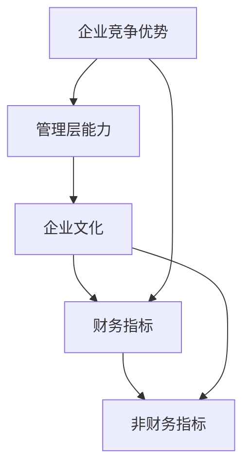
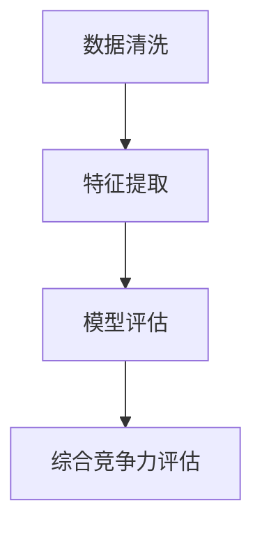
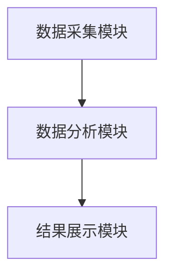

                 


# 巴菲特的定性分析方法：超越数字的洞察

---

## 关键词：巴菲特，定性分析，投资方法，竞争优势，管理层能力，企业文化

---

## 摘要

巴菲特的定性分析方法是一种超越数字的投资分析方式，强调从企业基本面出发，关注企业的竞争优势、管理层能力和企业文化等非财务因素。本文通过系统性地分析巴菲特定性分析的核心概念、方法论、系统架构以及实际案例，揭示如何通过定性分析做出更明智的投资决策。文章结合技术语言和逻辑推理，深入剖析定性分析的本质，并提供可操作的实战指导。

---

## 第1章: 引言

### 1.1 巴菲特投资理念的核心思想

巴菲特的投资理念以“价值投资”为核心，强调买入并持有优质企业，而非频繁交易。他主张通过深入分析企业的基本面，寻找具有持续竞争优势、良好管理层和企业文化的企业进行投资。

### 1.2 定性分析的背景与问题背景

传统的定量分析依赖财务指标（如市盈率、ROE等）进行估值，但其局限性在于忽视了企业的非财务因素。例如，一家企业可能有良好的财务表现，但如果其管理层能力差或企业缺乏核心竞争优势，长期来看其价值可能难以持续增长。因此，定性分析的引入弥补了这一不足，帮助投资者更全面地评估企业的潜在价值。

### 1.3 定性分析的核心目标与范围

定性分析的目标是通过对企业竞争优势、管理层能力和企业文化的深入研究，识别出那些具有长期竞争优势和稳定增长潜力的企业。其范围涵盖企业战略、管理决策、行业地位等多个维度。

---

## 第2章: 定性分析的核心要素与联系

### 2.1 企业竞争优势

#### 2.1.1 企业竞争优势的定义

企业竞争优势是指企业在市场中相对于竞争对手的独特优势，包括技术、品牌、成本控制、资源垄断等方面。竞争优势是企业长期盈利能力的基石。

#### 2.1.2 核心竞争优势的识别方法

- 技术优势：企业的技术创新能力、专利数量等。
- 品牌优势：品牌知名度和客户忠诚度。
- 成本优势：生产成本的控制能力。
- 资源垄断：企业是否拥有独特的资源或市场准入。

#### 2.1.3 竞争优势的持续性与可扩展性

竞争优势不仅需要存在，还需要具有持续性和可扩展性。例如，技术优势需要不断更新迭代，品牌优势需要持续维护客户关系。

### 2.2 管理层能力

#### 2.2.1 管理层能力的评估维度

- 战略决策能力：管理层是否能够制定正确的战略方向。
- 执行能力：管理层是否能够有效执行战略。
- 诚信与责任感：管理层是否以股东利益为重。

#### 2.2.2 管理层决策对企业的影响

管理层的决策直接影响企业的经营成果。例如，优秀的管理层能够在市场低迷时逆势扩张，抓住发展机遇。

#### 2.2.3 管理层能力的动态变化

管理层能力并非一成不变，需要动态评估。例如，一家企业在高速增长期可能拥有优秀的管理层，但在扩张期可能因管理团队的扩展而出现能力不足的问题。

### 2.3 企业文化

#### 2.3.1 企业文化对企业行为的影响

企业文化是企业的灵魂，决定了企业的行为方式和长期发展方向。例如，创新型企业文化能够推动企业不断进行产品和服务创新。

#### 2.3.2 企业文化与企业长期发展的关系

良好的企业文化能够增强员工的凝聚力和创造力，是企业长期发展的关键因素。

#### 2.3.3 企业文化评估的指标体系

- 企业使命和愿景：是否清晰且具有吸引力。
- 企业价值观：是否符合行业特点和企业发展阶段。
- 企业氛围：员工是否感到被尊重和激励。

### 2.4 财务指标与非财务指标的结合

#### 2.4.1 财务指标的局限性

财务指标虽然能够反映企业的财务健康状况，但无法全面反映企业的经营能力和市场竞争力。

#### 2.4.2 非财务指标的重要性

非财务指标（如研发投入、员工满意度、客户忠诚度等）能够更全面地反映企业的综合竞争力。

#### 2.4.3 财务与非财务指标的综合分析

通过结合财务和非财务指标，可以更全面地评估企业的价值。例如，一家企业可能有较高的利润率，但如果其研发投入不足，可能在未来面临竞争优势的削弱。

### 2.5 核心概念联系的Mermaid图



---

## 第3章: 定性分析的方法论与算法原理

### 3.1 定性分析的方法论框架

定性分析的方法论框架包括以下几个步骤：

1. **数据收集**：收集企业的财务数据、行业信息、管理层背景等。
2. **数据清洗**：对数据进行筛选和整理，去除无效信息。
3. **特征提取**：提取与竞争优势、管理层能力、企业文化相关的特征。
4. **模型评估**：通过定性分析模型对企业的综合竞争力进行评估。

### 3.2 定性分析的算法原理

#### 3.2.1 数据清洗与特征提取

```python
# 示例代码：数据清洗与特征提取
import pandas as pd

# 假设df为原始数据
df = pd.DataFrame({
    '企业名称': ['A', 'B', 'C'],
    '净利润率': [10, 20, 15],
    '研发投入占比': [5, 10, 7],
    '管理层稳定性': ['高', '中', '低']
})

# 数据清洗：去除重复值
df.drop_duplicates()

# 特征提取：提取与竞争优势相关的特征
features = df[['净利润率', '研发投入占比', '管理层稳定性']]
```

#### 3.2.2 定性分析模型



### 3.3 定性分析的数学模型

#### 3.3.1 竞争优势评分模型

$$ 竞争优势评分 = \alpha \times \text{技术优势} + \beta \times \text{品牌优势} + \gamma \times \text{成本优势} $$

其中，$\alpha + \beta + \gamma = 1$，且$\alpha > \beta > \gamma$。

#### 3.3.2 管理层能力评分模型

$$ 管理层能力评分 = \delta \times \text{战略决策能力} + \epsilon \times \text{执行能力} + \zeta \times \text{诚信与责任感} $$

---

## 第4章: 系统架构设计与实现

### 4.1 系统架构设计

#### 4.1.1 系统功能设计

- 数据采集模块：采集企业的财务数据、行业信息、管理层背景等。
- 数据分析模块：对数据进行清洗、特征提取和模型评估。
- 结果展示模块：将定性分析结果以图表形式展示。

#### 4.1.2 系统架构图



### 4.2 系统实现

#### 4.2.1 环境安装

```bash
pip install pandas matplotlib
```

#### 4.2.2 核心代码实现

```python
import pandas as pd
import matplotlib.pyplot as plt

# 示例代码：企业竞争优势分析
def analyze_competitive Advantage(df):
    # 假设df为包含企业数据的DataFrame
    # 计算竞争优势评分
    df['竞争优势评分'] = df['技术优势'] * 0.4 + df['品牌优势'] * 0.3 + df['成本优势'] * 0.2
    # 绘制柱状图
    df.plot(kind='bar', x='企业名称', y='竞争优势评分')
    plt.title('企业竞争优势评分')
    plt.show()

# 调用函数
analyze_competitive Advantage(df)
```

---

## 第5章: 项目实战与案例分析

### 5.1 项目实战

#### 5.1.1 项目背景

以某行业中的三家典型企业为例，分析其竞争优势、管理层能力和企业文化。

#### 5.1.2 数据收集与清洗

```python
# 示例代码：数据收集与清洗
import pandas as pd

# 假设df为原始数据
df = pd.DataFrame({
    '企业名称': ['A', 'B', 'C'],
    '净利润率': [10, 20, 15],
    '研发投入占比': [5, 10, 7],
    '管理层稳定性': ['高', '中', '低']
})

# 数据清洗：去除无效值
df.dropna()
```

#### 5.1.3 分析与结果解读

通过分析，企业B在净利润率和研发投入占比方面表现最佳，但其管理层稳定性为“中”，而企业A在管理层稳定性方面表现最佳。因此，综合来看，企业B的综合竞争力更强。

### 5.2 案例分析

以苹果公司为例，分析其竞争优势、管理层能力和企业文化。

#### 5.2.1 竞争优势分析

苹果公司在技术优势、品牌优势和成本控制方面均具有显著的竞争优势。

#### 5.2.2 管理层能力分析

苹果公司的管理层以乔布斯和库克为代表，具有卓越的战略决策能力和执行力。

#### 5.2.3 企业文化分析

苹果公司以创新为核心企业文化，员工具有高度的创造力和凝聚力。

---

## 第6章: 总结与最佳实践

### 6.1 总结

巴菲特的定性分析方法通过关注企业竞争优势、管理层能力和企业文化，帮助投资者识别出具有长期竞争优势和稳定增长潜力的企业。本文通过系统性地分析定性分析的核心概念、方法论和系统架构，并结合实际案例，揭示了定性分析的实践价值。

### 6.2 最佳实践

- 在实际投资中，定性分析应与定量分析相结合，以全面评估企业的综合竞争力。
- 定期更新和调整定性分析模型，以适应市场环境的变化。
- 注重对企业管理层的动态评估，以识别潜在风险。

### 6.3 小结

巴菲特的定性分析方法是一种超越数字的洞察力，它不仅帮助投资者识别优质企业，还为企业的长期发展提供了重要的指导意义。通过本文的系统性分析，读者可以更好地理解和应用定性分析方法，做出更明智的投资决策。

---

## 作者：AI天才研究院 & 禅与计算机程序设计艺术

