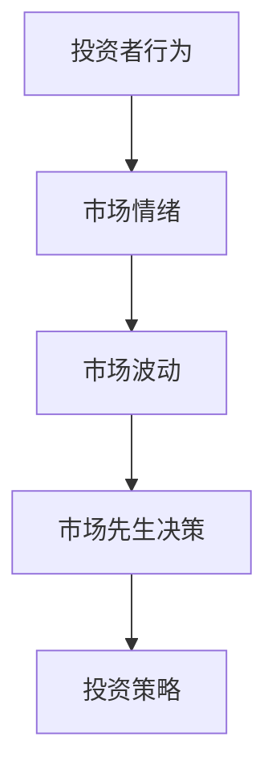

                 


# 巴菲特的市场先生比喻：理解市场的非理性

## 关键词：市场先生，巴菲特，非理性，投资决策，市场波动，投资者心理，情绪驱动

## 摘要：本文通过分析巴菲特的市场先生比喻，深入探讨市场的非理性行为及其对投资者决策的影响。文章从市场先生的定义、市场的非理性表现、理性与非理性的应用等方面展开，结合数学模型和系统架构，为读者提供全面的理解和实用的分析工具。

---

# 第一部分：引言

## 1.1 市场先生比喻的背景与重要性

### 1.1.1 巴菲特投资理念的概述

- 巴菲特的投资策略基于价值投资，强调长期持有优质资产。
- 市场先生比喻是巴菲特用来解释市场波动和投资者心理的重要工具。

### 1.1.2 市场先生比喻的核心意义

- 通过市场先生的形象，巴菲特揭示了市场的非理性行为。
- 帮助投资者理解市场波动的本质，避免被短期情绪左右。

---

# 第二部分：市场先生比喻的核心概念

## 2.1 市场先生的定义与特点

### 2.1.1 市场先生的定义

- 市场先生代表市场的整体，每天为投资者提供买卖机会。
- 市场先生的情绪化导致市场的波动。

### 2.1.2 市场先生的特点

- 情绪驱动的市场波动。
- 短期预测能力有限，长期趋势更可靠。

## 2.2 市场先生与市场运作的关系

### 2.2.1 市场先生的运作机制

- 市场波动的周期性。
- 投资者行为对市场的反馈效应。

### 2.2.2 市场先生与市场参与者的互动

- 投资者情绪影响市场先生的行为。
- 市场先生的行为反过来影响投资者决策。

---

# 第三部分：市场的非理性表现

## 3.1 市场情绪的波动性

### 3.1.1 市场情绪的周期性变化

- 市场情绪的波动周期：从乐观到悲观，再回到乐观。
- 市场情绪与市场波动的关系：情绪高涨导致市场上涨，情绪低落导致市场下跌。

### 3.1.2 市场情绪的极端表现

- 市场恐慌与市场狂热。
- 极端情绪对市场的影响：泡沫形成与破裂。

## 3.2 投资者行为偏差

### 3.2.1 羊群效应

- 羊群效应的定义与表现：投资者跟随市场趋势，忽视基本面。
- 羊群效应对市场的影响：加剧市场波动。

### 3.2.2 过度自信

- 过度自信的表现：投资者高估自己的判断能力。
- 过度自信对投资决策的影响：可能导致错误决策。

## 3.3 市场的非理性决策

### 3.3.1 非理性决策的类型

- 短期决策与长期决策。
- 情感决策与理性决策。

### 3.3.2 非理性决策的后果

- 市场泡沫的形成与破裂。
- 投资者的损失与教训。

---

# 第四部分：市场先生的理性与非理性

## 4.1 市场先生的理性分析

### 4.1.1 市场先生的理性决策

- 理性决策的标准：基于基本面分析和长期趋势。
- 市场先生的理性决策过程：分析市场趋势，评估资产价值。

### 4.1.2 市场先生的理性与非理性的平衡

- 理性与非理性的相互作用。
- 市场先生的理性决策对市场的稳定作用。

## 4.2 市场先生的非理性分析

### 4.2.1 非理性决策的成因

- 心理因素的影响：恐惧与贪婪。
- 社会环境的影响：市场情绪的传染效应。

### 4.2.2 非理性决策的周期性

- 非理性决策的周期性特征：市场波动的周期性规律。
- 市场先生的非理性行为对市场的影响。

---

# 第五部分：市场先生的理性与非理性的应用

## 5.1 理解市场先生的非理性行为

### 5.1.1 非理性行为的识别

- 市场情绪的识别方法：观察市场波动和投资者行为。
- 投资者行为的识别方法：分析投资决策的合理性。

### 5.1.2 非理性行为的应对策略

- 保持冷静，避免跟随市场情绪。
- 坚持价值投资，关注长期趋势。

## 5.2 理性与非理性的平衡

### 5.2.1 理性决策的重要性

- 基于基本面分析的投资决策。
- 长期趋势的判断。

### 5.2.2 非理性决策的防范

- 提高自我认知，识别情绪影响。
- 制定合理的投资策略，避免非理性决策。

---

# 第六部分：数学模型与系统架构

## 6.1 市场波动的数学模型

### 6.1.1 市场情绪的量化

- 使用统计学方法量化市场情绪。
- 示例：计算市场情绪指数。

### 6.1.2 情绪驱动的市场波动模型

- 概率论在市场波动中的应用。
- 示例：计算市场上涨的概率。

## 6.2 系统架构设计

### 6.2.1 系统功能设计

- 数据采集：收集市场数据和投资者行为数据。
- 数据分析：分析市场情绪和投资者行为。
- 决策支持：提供理性投资建议。

### 6.2.2 系统架构图



---

# 第七部分：项目实战

## 7.1 环境安装

### 7.1.1 工具安装

- 安装Python和相关库（如pandas、numpy）。
- 安装数据可视化工具（如Matplotlib）。

## 7.2 核心实现

### 7.2.1 市场情绪指数计算

```python
import pandas as pd
import numpy as np

# 示例数据
data = pd.DataFrame({
    'Price': [100, 105, 98, 102, 101],
    'Volume': [1000, 1200, 900, 1100, 1050]
})

# 计算市场情绪指数
market_sentiment = data['Price'].pct_change().mean() * 100
print(f"市场情绪指数：{market_sentiment}%")
```

### 7.2.2 投资者行为分析

```python
import matplotlib.pyplot as plt

# 示例数据
investor_behavior = pd.DataFrame({
    'Date': ['2023-01-01', '2023-01-02', '2023-01-03', '2023-01-04'],
    'Action': ['Buy', 'Sell', 'Hold', 'Buy']
})

# 绘制投资者行为图
plt.figure(figsize=(10,5))
plt.plot(investor_behavior['Date'], investor_behavior['Action'])
plt.title('投资者行为分析')
plt.xticks(rotation=45)
plt.show()
```

## 7.3 案例分析

### 7.3.1 市场波动案例

- 分析过去一年的市场波动，识别市场情绪的变化。
- 基于模型预测未来的市场趋势。

## 7.4 项目小结

- 通过项目实战，读者可以实际应用市场先生比喻进行投资分析。
- 强调理性决策的重要性，避免非理性行为。

---

# 第八部分：总结与展望

## 8.1 总结

- 巴菲特的市场先生比喻帮助我们理解市场的非理性。
- 投资者应保持理性，避免被市场情绪左右。

## 8.2 展望

- 进一步研究市场情绪的量化方法。
- 开发更完善的市场分析系统。

---

# 作者

作者：AI天才研究院/AI Genius Institute & 禅与计算机程序设计艺术 /Zen And The Art of Computer Programming

