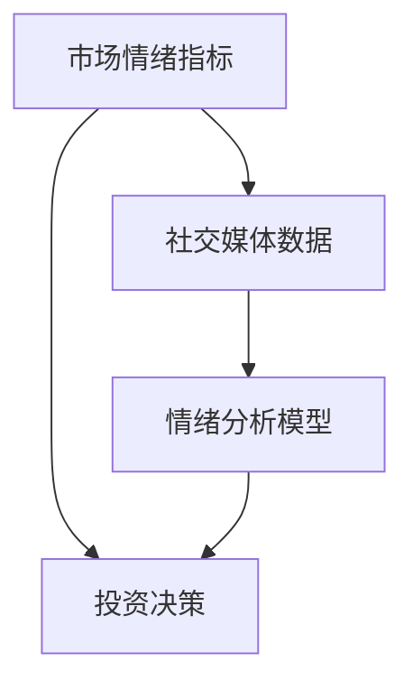
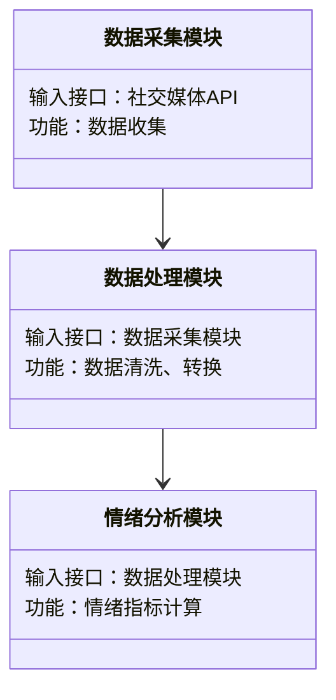

                 


# 巴菲特的市场情绪指标2.0：社交媒体时代的舆情分析

## 关键词：市场情绪指标，社交媒体，舆情分析，巴菲特投资理念，大数据，量化投资

## 摘要：本书探讨如何利用社交媒体数据优化市场情绪指标，结合巴菲特投资理念，提出2.0版本的情绪分析方法，通过大数据和量化投资提升投资决策。

---

# 目录大纲

## 第一部分：市场情绪指标的背景与概念

### 第1章：市场情绪指标的演变

#### 1.1 巴菲特时代的情绪指标
- 1.1.1 传统市场情绪指标的定义
- 1.1.2 巴菲特对市场情绪的重视
- 1.1.3 传统情绪指标的局限性

#### 1.2 社交媒体时代的舆情分析
- 1.2.1 社交媒体数据的兴起
- 1.2.2 舆情分析在投资中的价值
- 1.2.3 巴菲特市场情绪指标的2.0升级

#### 1.3 本书的核心目标
- 1.3.1 提供社交媒体时代的情绪指标分析方法
- 1.3.2 结合巴菲特投资理念，优化情绪指标模型
- 1.3.3 为投资者提供实战指导

### 第2章：市场情绪指标2.0的核心概念

#### 2.1 核心概念与定义
- 2.1.1 市场情绪指标的定义
- 2.1.2 社交媒体数据的特征
- 2.1.3 情绪指标的分类与层次

#### 2.2 核心概念的联系
- 2.2.1 情绪指标与市场行为的关系
- 2.2.2 数据源与分析方法的关联
- 2.2.3 巴菲特投资理念与情绪指标的结合

### 第3章：市场情绪指标2.0的背景与问题

#### 3.1 问题背景
- 3.1.1 传统情绪指标的局限性
- 3.1.2 社交媒体数据的复杂性
- 3.1.3 投资者面临的挑战

#### 3.2 问题描述
- 3.2.1 如何从社交媒体数据中提取有效情绪信息
- 3.2.2 如何构建实时情绪指标模型
- 3.2.3 如何结合巴菲特理念优化投资决策

#### 3.3 问题解决
- 3.3.1 提出社交媒体舆情分析的新方法
- 3.3.2 构建基于大数据的情绪指标模型
- 3.3.3 结合巴菲特投资理念优化策略

### 第4章：市场情绪指标2.0的核心要素

#### 4.1 核心概念的属性特征对比
- 4.1.1 数据源对比：传统媒体 vs 社交媒体
- 4.1.2 情绪指标的计算方法对比
- 4.1.3 模型的适用场景对比

#### 4.2 实体关系图


---

## 第二部分：算法原理与系统架构

### 第5章：算法原理

#### 5.1 数据预处理
- 5.1.1 数据清洗
- 5.1.2 文本分词与情感分析

#### 5.2 特征提取
- 5.2.1 关键词提取
- 5.2.2 用户行为分析

#### 5.3 模型训练
- 5.3.1 使用机器学习算法
- 5.3.2 情感得分计算公式：
$$ \text{情感得分} = \sum (\text{关键词权重} \times \text{情感倾向}) $$

### 第6章：系统架构设计

#### 6.1 项目介绍
- 6.1.1 项目目标
- 6.1.2 项目范围

#### 6.2 系统功能设计


#### 6.3 系统架构设计
```mermaid
context 系统边界 {
    数据采集模块 --> 数据存储模块
    数据处理模块 --> 数据分析模块
    数据分析模块 --> 可视化模块
    可视化模块 --> 投资决策模块
}
```

---

## 第三部分：项目实战与高级主题

### 第7章：项目实战

#### 7.1 环境配置
- 7.1.1 安装Python和相关库

#### 7.2 核心代码实现
```python
import pandas as pd
from sklearn.model import LinearRegression

# 示例数据加载
data = pd.read_csv('social_media_data.csv')

# 情绪得分计算
def calculate_emotion_score(text):
    # 文本预处理
    # 文本分析
    return score
```

#### 7.3 结果分析
- 7.3.1 情绪指标与市场走势的对比
- 7.3.2 模型准确性的评估

### 第8章：高级主题

#### 8.1 舆情分析的延伸应用
- 8.1.1 与其他投资策略的结合

#### 8.2 数据偏差与噪声的处理
- 8.2.1 常见问题及解决方案

#### 8.3 模型优化与扩展
- 8.3.1 模型调优建议

---

## 第四部分：总结

### 第9章：总结与展望

#### 9.1 核心内容回顾
- 9.1.1 背景介绍
- 9.1.2 核心概念
- 9.1.3 算法与系统设计

#### 9.2 未来展望
- 9.2.1 技术发展
- 9.2.2 应用前景

---

# 作者：AI天才研究院 & 禅与计算机程序设计艺术

