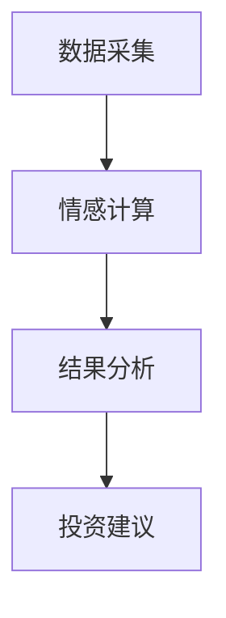

                 


# 巴菲特的市场情绪指标6.0：量子情感计算的金融应用

> 关键词：巴菲特、市场情绪指标、量子计算、情感计算、金融应用、投资策略

> 摘要：本文深入探讨了巴菲特市场情绪指标的演变及其与量子情感计算的结合，分析了量子情感计算在金融领域的应用潜力，并通过具体案例展示了其在投资决策中的实际应用。

---

## 第1章: 市场情绪指标的历史与现状

### 1.1 市场情绪指标的定义与背景

#### 1.1.1 市场情绪指标的定义
市场情绪指标是衡量投资者情绪和市场心理状态的工具，反映了市场参与者对当前市场状况的乐观或悲观程度。它是金融分析中的重要组成部分，帮助投资者预测市场趋势和风险。

#### 1.1.2 市场情绪指标在金融分析中的作用
市场情绪指标可以帮助投资者识别市场的过度乐观或过度悲观情绪，从而避免盲目跟风或错失投资机会。传统的市场情绪指标包括恐慌指数（VIX）、投资者情绪指数（AAII）等，但它们存在一定的局限性。

#### 1.1.3 巴菲特投资理念与市场情绪的关系
巴菲特的投资策略强调长期价值，但市场情绪在短期市场波动中起着重要作用。巴菲特曾指出，市场情绪的波动是投资机会的来源之一。

### 1.2 传统市场情绪指标的局限性

#### 1.2.1 基于价量分析的传统指标
传统市场情绪指标主要依赖价格和成交量数据，难以捕捉市场参与者的心理变化。

#### 1.2.2 传统指标的局限性与改进方向
传统指标的局限性包括数据来源单一、计算方法简单、无法捕捉非结构化数据等。量子情感计算的引入为克服这些局限性提供了新的思路。

#### 1.2.3 巴菲特投资策略中的情绪因素
巴菲特的投资策略中，情绪因素主要体现在市场恐慌时的买入机会和市场狂热时的谨慎态度。然而，传统情绪指标的不足限制了其在实际操作中的应用。

---

## 第2章: 量子情感计算的引入

### 2.1 量子计算的基本原理

#### 2.1.1 量子位与经典位的区别
量子位（qubit）与经典位（bit）的区别在于，qubit可以同时处于多个状态的叠加态，而bit只能是0或1。

#### 2.1.2 量子叠加与量子纠缠
量子叠加允许qubit同时表示多个可能性，量子纠缠则使得多个qubit之间形成强关联。

#### 2.1.3 量子计算在金融分析中的潜力
量子计算的并行性和强大的计算能力为金融数据分析提供了新的可能性。

### 2.2 情感计算的核心概念

#### 2.2.1 情感计算的定义与目标
情感计算是通过分析人类情感和情绪，利用计算机技术模拟和预测情感状态。

#### 2.2.2 情感计算在金融中的应用
情感计算可以用于分析社交媒体、新闻标题等非结构化数据，捕捉市场参与者的心理变化。

#### 2.2.3 量子情感计算的优势
量子情感计算结合了量子计算的高效性和情感计算的深度分析能力，能够在短时间内处理大量非结构化数据。

---

## 第3章: 量子情感计算的算法与数学模型

### 3.1 量子情感计算的算法原理

#### 3.1.1 情感数据的量子表示
情感数据可以通过量子态表示，利用量子叠加和纠缠特性捕捉数据间的复杂关系。

#### 3.1.2 情感计算的量子叠加与测量
通过量子叠加，情感计算可以在多个可能性之间进行并行计算；通过量子测量，可以得到最终的情感强度和趋势。

#### 3.1.3 情感趋势的量子预测
利用量子计算的并行性，情感计算可以快速预测市场情绪的变化趋势。

### 3.2 量子情感计算的数学模型

#### 3.2.1 情感强度计算的量子公式
$$ 情感强度 = \sum_{i=1}^{n} \lambda_i \cdot q_i $$
其中，$\lambda_i$ 是情感权重，$q_i$ 是量子态。

#### 3.2.2 情感分类的量子判别函数
$$ D(x) = \begin{cases} 1 & \text{如果 } x \text{ 属于乐观情绪} \\ 0 & \text{否则} \end{cases} $$

---

## 第4章: 量子情感计算的系统架构与应用

### 4.1 量子情感计算的系统架构

#### 4.1.1 问题场景介绍
系统需要实时监测市场情绪，分析社交媒体、新闻标题等数据，预测市场趋势。

#### 4.1.2 系统功能设计
- 数据采集模块：收集市场数据。
- 情感计算模块：分析情感数据。
- 结果分析模块：生成投资建议。

#### 4.1.3 系统架构设计（Mermaid图）


### 4.2 项目实战

#### 4.2.1 环境安装
安装必要的库，如Qiskit和NumPy。

#### 4.2.2 核心代码实现
```python
from qiskit import QuantumCircuit, execute, Aer

def quantum_emotion_calculation(qubit_count):
    qc = QuantumCircuit(qubit_count)
    # 添加量子叠加操作
    qc.h(range(qubit_count))
    qc.measure_all()
    return qc
```

#### 4.2.3 代码解读与分析
代码实现了量子叠加操作，用于情感数据的量子表示和测量。

#### 4.2.4 实际案例分析
通过分析社交媒体数据，生成市场情绪指数，帮助投资者做出决策。

---

## 第5章: 总结与展望

### 5.1 量子情感计算的优势与局限性
量子情感计算的优势包括高效性和深度分析能力，但目前仍面临技术成熟度和成本等问题。

### 5.2 未来研究方向
未来的研究可以集中在优化量子计算算法和扩大数据来源，进一步提升情感计算的准确性和实时性。

---

## 作者：AI天才研究院 & 禅与计算机程序设计艺术

