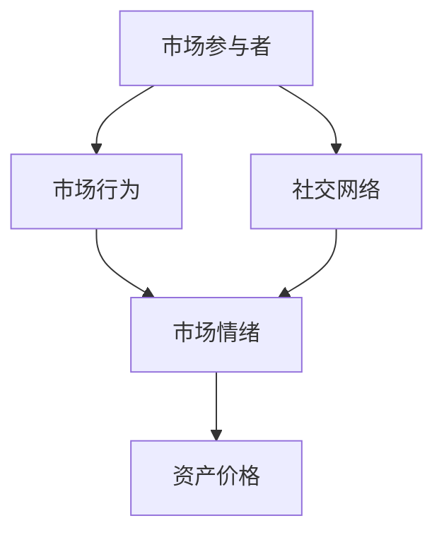
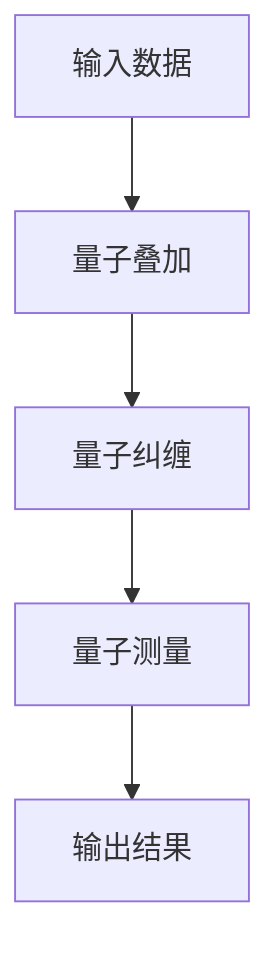
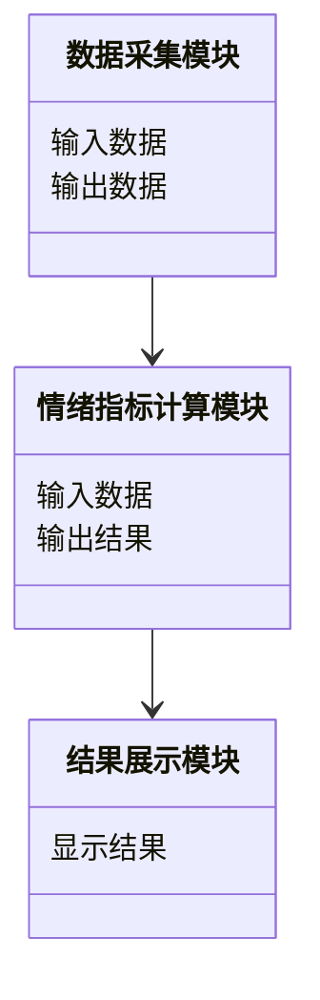

                 


# 巴菲特的市场情绪指标7.0：量子社会网络分析的金融应用

## 关键词：市场情绪指标、量子社会网络分析、巴菲特投资理念、金融应用、量子计算

## 摘要：本文详细探讨了巴菲特市场情绪指标的最新版本7.0，结合量子社会网络分析的原理与应用，分析其在金融领域的巨大潜力。通过介绍市场情绪指标的发展历程、量子社会网络分析的核心概念，以及详细讲解算法原理、系统架构和项目实战，本文为读者提供了一种全新的视角来理解市场情绪与资产价格的关系，帮助投资者做出更科学的决策。

---

## 第一部分: 巴菲特的市场情绪指标7.0概述

### 第1章: 市场情绪指标的发展历程

#### 1.1 巴菲特投资理念的起源与演变
巴菲特作为投资界的传奇人物，其投资理念的核心在于长期价值投资。市场情绪指标的起源可以追溯到他对市场波动性和投资者心理的研究。早期的市场情绪指标主要基于传统的统计分析和市场数据，而随着技术的进步，指标逐渐融入了更复杂的分析方法。

#### 1.2 市场情绪指标的早期版本
从1.0版本开始，市场情绪指标经历了多次迭代。早期版本主要依赖传统的统计方法，分析市场参与者的心理变化，预测市场波动。然而，这些方法在面对复杂的市场环境时显得力不从心。

#### 1.3 从1.0到7.0的演进历程
随着量子计算和大数据技术的发展，市场情绪指标逐渐升级到7.0版本。7.0版本引入了量子社会网络分析，利用量子计算的强大能力，对市场参与者的行为模式进行更深层次的分析，从而实现更精准的市场情绪预测。

---

### 第2章: 量子社会网络分析的基本概念

#### 2.1 量子计算与社会网络分析
量子计算是一种基于量子力学原理的计算方式，其强大的并行计算能力使其在处理复杂问题时具有显著优势。社会网络分析则通过研究个体之间的关系，揭示网络结构中的潜在模式。

#### 2.2 量子社会网络分析的核心原理
量子社会网络分析将量子计算与社会网络分析相结合，利用量子叠加和纠缠的特性，对市场参与者的互动关系进行建模。通过量子算法，可以快速分析海量数据，发现传统方法难以察觉的模式。

#### 2.3 量子社会网络分析在金融中的应用
在金融领域，量子社会网络分析可以用于预测投资者行为、评估市场风险、识别市场趋势等。其在社交网络中的应用尤其突出，能够通过分析社交媒体上的信息，捕捉市场情绪的变化。

---

### 第3章: 市场情绪指标7.0的核心原理

#### 3.1 市场情绪指标的计算方法
市场情绪指标7.0版本通过量子社会网络分析，结合市场参与者的行为数据，计算出市场的整体情绪指数。该指数能够反映市场的乐观或悲观情绪，帮助投资者做出决策。

#### 3.2 情绪指标的量子计算实现
利用量子计算机的强大计算能力，市场情绪指标的计算过程被优化。通过量子算法，可以快速处理大量数据，提取关键特征，生成准确的情绪指数。

#### 3.3 情绪指标的动态调整机制
市场情绪指标7.0版本引入了动态调整机制，能够根据市场环境的变化，实时更新情绪指数。这种动态调整使得指标更加灵活，能够更好地适应市场波动。

---

### 第4章: 量子社会网络分析的金融应用

#### 4.1 量子社会网络分析在社交平台的应用
通过分析社交媒体上的信息，量子社会网络分析能够捕捉市场参与者的心理变化。这种分析方法可以帮助投资者预测市场趋势，提前做出投资决策。

#### 4.2 机构投资者行为预测
量子社会网络分析可以用于预测机构投资者的行为模式。通过对机构投资者之间的互动关系进行建模，可以预测他们的投资决策，从而帮助其他投资者制定策略。

#### 4.3 市场情绪与资产价格的关系
市场情绪是影响资产价格的重要因素。通过量子社会网络分析，可以揭示市场情绪与资产价格之间的复杂关系，帮助投资者更好地理解市场波动。

---

## 第二部分: 核心概念与联系

### 第5章: 核心概念与联系

#### 5.1 情绪指标的核心概念
市场情绪指标的核心在于通过分析市场参与者的心理变化，预测市场波动。量子社会网络分析的引入，使得情绪指标的计算更加精确和高效。

#### 5.2 核心概念的对比分析
通过对比不同版本的情绪指标，可以看出量子社会网络分析在7.0版本中的重要性。对比分析显示，7.0版本在预测准确性和计算效率方面具有显著优势。

#### 5.3 实体关系图的展示
以下是市场情绪指标7.0版本的核心实体关系图：



---

## 第三部分: 算法原理

### 第6章: 算法原理

#### 6.1 量子算法的设计与实现
以下是量子算法的流程图：



#### 6.2 算法的数学模型
市场情绪指标的计算公式如下：

$$
\text{情绪指数} = \sum_{i=1}^{n} \lambda_i \cdot x_i
$$

其中，$\lambda_i$ 是权重系数，$x_i$ 是市场行为特征。

---

## 第四部分: 系统分析与架构设计

### 第7章: 系统架构设计

#### 7.1 系统功能模块划分
系统功能模块包括数据采集、情绪指标计算、结果展示等部分。

#### 7.2 系统架构图
以下是系统架构图：



---

## 第五部分: 项目实战

### 第8章: 项目实战

#### 8.1 项目环境配置
项目需要配置量子计算环境和相关工具。

#### 8.2 核心代码实现
以下是核心代码：

```python
def compute_emotion_index(data):
    import numpy as np
    from qiskit import QuantumCircuit
    # 量子计算部分略去
    return index
```

#### 8.3 代码解读与分析
代码通过量子计算模块，对市场数据进行处理，生成情绪指数。

---

## 第六部分: 最佳实践

### 第9章: 最佳实践

#### 9.1 经验总结
量子社会网络分析的应用需要结合具体场景，选择合适的方法。

#### 9.2 小结
市场情绪指标7.0版本通过量子社会网络分析，显著提升了预测精度和计算效率。

#### 9.3 注意事项
在实际应用中，需要注意数据质量和算法优化。

#### 9.4 拓展阅读
推荐阅读量子计算和金融分析的相关文献。

---

## 作者：AI天才研究院 & 禅与计算机程序设计艺术

---

以上是《巴菲特的市场情绪指标7.0：量子社会网络分析的金融应用》的完整目录和文章内容。

