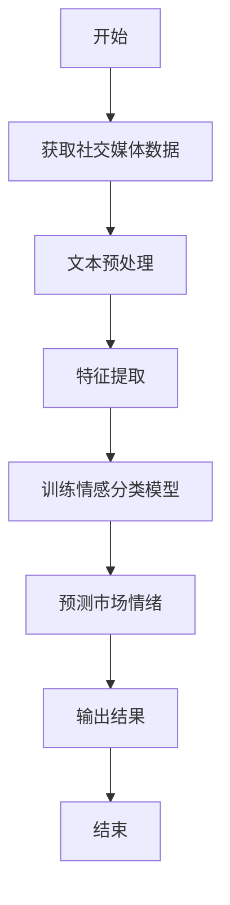
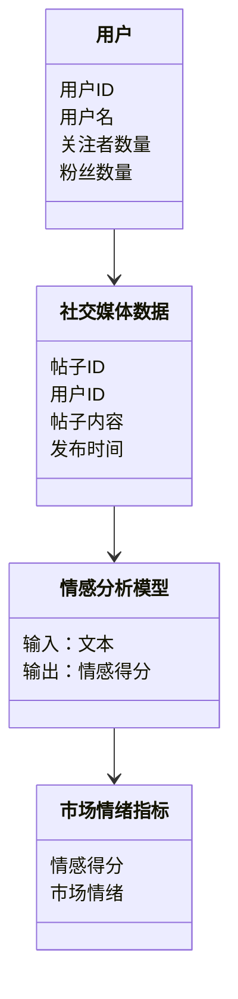

                 


# 巴菲特的市场情绪指标：社交媒体情绪分析的新维度

**关键词**：巴菲特，市场情绪指标，社交媒体，情绪分析，投资决策，数据挖掘，人工智能

**摘要**：  
本文探讨了如何利用巴菲特的市场情绪指标，结合社交媒体情绪分析，构建一种新的市场情绪分析维度。通过分析社交媒体数据，我们可以更及时、更全面地捕捉市场情绪的变化，从而为投资决策提供更有力的支持。文章从背景、核心概念、算法原理、系统架构、项目实战等方面展开，详细阐述了社交媒体情绪分析的应用价值和技术实现。

---

# 第一部分: 背景介绍

## 第1章: 市场情绪分析概述

### 1.1 市场情绪分析的背景与意义

市场情绪分析是研究投资者情绪对金融市场影响的重要领域。投资者的情绪波动往往会影响市场走势，因此，准确捕捉和分析市场情绪对于投资决策具有重要意义。

#### 1.1.1 市场情绪分析的定义与重要性  
市场情绪分析是指通过对市场参与者的言论、行为和交易数据的分析，推断市场整体或特定资产的情绪状态。市场情绪可以分为乐观、中性和悲观三种状态，而投资者的情绪往往会在市场波动中表现出一定的规律性。

市场情绪分析的重要性体现在以下几个方面：  
1. **预测市场走势**：情绪是市场的风向标，情绪指标可以帮助投资者预测市场的短期走势。  
2. **辅助投资决策**：通过分析市场情绪，投资者可以更好地判断市场是否存在泡沫或低估，从而做出更明智的投资决策。  
3. **风险管理**：市场情绪的极端波动往往伴随着较大的风险，情绪分析可以帮助投资者提前规避风险。  

#### 1.1.2 投资者情绪对市场的影响  
投资者情绪是影响市场的重要因素之一。当市场情绪过于乐观时，往往会导致资产价格的过度上涨，而当市场情绪过于悲观时，又可能导致资产价格的过度下跌。因此，投资者情绪的波动对市场的波动性具有重要影响。

#### 1.1.3 社会媒体在市场情绪分析中的作用  
随着社交媒体的普及，投资者可以通过社交媒体表达自己的观点和情绪。社交媒体上的信息具有实时性和广泛性，能够反映市场的实时情绪变化。例如，Twitter上的推文、Reddit上的讨论都可以作为市场情绪分析的来源。

---

### 1.2 巴菲特市场情绪指标的核心概念

#### 1.2.1 巴菲特投资理念与情绪分析的关系  
巴菲特的投资理念强调长期价值投资，但市场情绪的变化也会影响市场的短期波动。巴菲特曾说过：“价格是市场的决定因素，而价值是内在的决定因素。”尽管他不依赖短期情绪指标，但情绪分析可以帮助投资者更好地理解市场的波动性。

#### 1.2.2 市场情绪指标的分类与特点  
市场情绪指标可以分为以下几类：  
1. **市场广度指标**：例如，纽约证券交易所的广度指标（ADL），用于衡量市场的上涨和下跌股票数量。  
2. **市场情绪调查**：例如，美国的消费者信心指数，用于衡量市场的乐观程度。  
3. **市场波动性指标**：例如，VIX指数，用于衡量市场的波动性。  

这些指标各有特点，但社交媒体情绪分析作为一种新兴的指标，具有实时性强、数据量大、信息丰富的特点。

#### 1.2.3 社会媒体情绪分析的现状与挑战  
社交媒体情绪分析的现状：  
1. 数据量大：社交媒体每天产生的数据量庞大，为情绪分析提供了丰富的数据源。  
2. 数据多样性：社交媒体上的信息包括文本、图片、视频等多种形式，信息更加丰富。  
3. 实时性：社交媒体信息可以实时反映市场情绪的变化。  

社交媒体情绪分析的挑战：  
1. 数据噪声大：社交媒体上的信息可能存在大量的噪声，例如虚假信息、情绪化言论等。  
2. 数据处理复杂：社交媒体数据的格式多样，处理起来较为复杂。  
3. 情感分析的准确性：如何准确地从社交媒体数据中提取情绪信息是一个技术难题。  

---

### 1.3 社会媒体情绪分析的价值与必要性

#### 1.3.1 社会媒体数据的特点与优势  
社交媒体数据具有以下特点：  
1. **实时性**：社交媒体上的信息可以实时反映市场的最新动态。  
2. **信息丰富**：社交媒体上的信息包括文本、图片、视频等多种形式，信息量大。  
3. **互动性**：社交媒体上的信息具有较强的互动性，用户之间的交流可以反映市场的集体情绪。  

#### 1.3.2 基于社交媒体的情绪分析对传统市场情绪指标的补充  
传统的情绪指标通常基于市场数据或调查数据，而社交媒体情绪分析可以提供更实时、更广泛的情绪信息。例如，社交媒体上的讨论可以反映市场的局部情绪变化，而这些变化可能在传统指标中尚未体现。

#### 1.3.3 社会媒体情绪分析的创新与应用前景  
社交媒体情绪分析的创新之处在于它利用了新兴的数据源，能够更及时地捕捉市场的动态。未来，随着人工智能技术的发展，社交媒体情绪分析将更加精准，应用场景也将更加广泛。

---

## 第2章: 社会媒体情绪分析的核心概念

### 2.1 市场情绪指标与社交媒体的联系

#### 2.1.1 社会媒体数据的特征与分类  
社交媒体数据可以分为以下几类：  
1. **文本数据**：包括社交媒体上的帖子、评论等。  
2. **用户数据**：包括用户的基本信息、行为数据等。  
3. **互动数据**：包括点赞、转发、评论等互动行为。  

#### 2.1.2 市场情绪指标与社交媒体数据的关系  
社交媒体数据可以通过文本分析、用户行为分析等方式提取情绪信息，进而构建市场情绪指标。

#### 2.1.3 社会媒体情绪分析的边界与外延  
社交媒体情绪分析的边界包括：  
1. 数据范围：仅限于社交媒体上的数据，不包括其他数据源。  
2. 情绪范围：通常仅限于投资者情绪，不包括其他类型的情绪。  

其外延包括：  
1. 数据源的扩展：未来可以结合其他数据源，例如新闻媒体、市场数据等。  
2. 情绪维度的扩展：除了投资者情绪，还可以分析其他情绪维度，例如市场情绪的变化趋势等。  

---

### 2.2 核心概念与联系的详细分析

#### 2.2.1 市场情绪指标的属性特征对比表格  
以下是一个对比表格，展示了市场情绪指标和社交媒体情绪分析的属性特征：

| 属性 | 市场情绪指标 | 社会媒体情绪分析 |
|------|-------------|-----------------|
| 数据源 | 市场数据、调查数据 | 社交媒体数据 |
| 数据类型 | 数值型 | 文本型、行为型 |
| 数据实时性 | 低 | 高 |
| 数据范围 | 有限 | 广泛 |
| 分析难度 | 中等 | 高 |

#### 2.2.2 市场情绪指标与社交媒体数据的ER实体关系图  
以下是市场情绪指标与社交媒体数据的ER实体关系图：

```mermaid
er
actor: 用户
action: 情绪分析
tweet: 社会媒体帖子
emotion_score: 情绪得分
market_sentiment: 市场情绪
```

---

## 第3章: 社会媒体情绪分析的算法原理

### 3.1 算法原理概述

#### 3.1.1 文本预处理与特征提取  
文本预处理包括：  
1. **分词**：将文本分割成词语或短语。  
2. **去停用词**：去除常见的停用词，例如“的”、“是”等。  
3. **词干提取**：将词语还原为词干。  

特征提取包括：  
1. **词袋模型**：将文本表示为词语的出现频率。  
2. **TF-IDF**：计算词语的重要性。  
3. **词嵌入**：使用Word2Vec等模型生成词语向量。  

#### 3.1.2 情感分类模型的构建  
情感分类模型可以使用机器学习算法，例如支持向量机（SVM）、随机森林（Random Forest）等，也可以使用深度学习算法，例如卷积神经网络（CNN）、循环神经网络（RNN）等。

#### 3.1.3 基于社交媒体数据的市场情绪预测  
市场情绪预测模型可以基于社交媒体数据，结合市场数据，预测市场情绪的变化。

---

### 3.2 算法流程图



---

### 3.3 算法实现

#### 3.3.1 Python源代码实现

```python
import pandas as pd
from sklearn.model_selection import train_test_split
from sklearn.feature_extraction.text import TfidfVectorizer
from sklearn.svm import SVC

# 数据加载
data = pd.read_csv('social_media_data.csv')

# 文本预处理
def preprocess(text):
    return text.lower().strip()

data['processed_text'] = data['text'].apply(preprocess)

# 特征提取
vectorizer = TfidfVectorizer(max_features=5000)
X = vectorizer.fit_transform(data['processed_text'])

# 数据划分
X_train, X_test, y_train, y_test = train_test_split(X, data['label'], test_size=0.2)

# 模型训练
model = SVC()
model.fit(X_train, y_train)

# 模型预测
y_pred = model.predict(X_test)

# 输出结果
print('准确率:', model.accuracy_score(y_test, y_pred))
```

#### 3.3.2 算法流程图


---

## 第4章: 数学模型

### 4.1 情感得分计算公式

$$ \text{情感得分} = \sum_{i=1}^{n} w_i \cdot \text{词}_i $$

其中，\( w_i \) 是词语 \( \text{词}_i \) 的权重，可以通过TF-IDF计算得到。

---

## 第5章: 系统分析与架构设计

### 5.1 系统功能设计

#### 5.1.1 领域模型



---

### 5.2 系统架构设计


---

## 第6章: 项目实战

### 6.1 环境安装

```bash
pip install pandas scikit-learn
```

---

## 第7章: 总结

### 7.1 本章小结

---

**作者：AI天才研究院/AI Genius Institute & 禅与计算机程序设计艺术 /Zen And The Art of Computer Programming**

