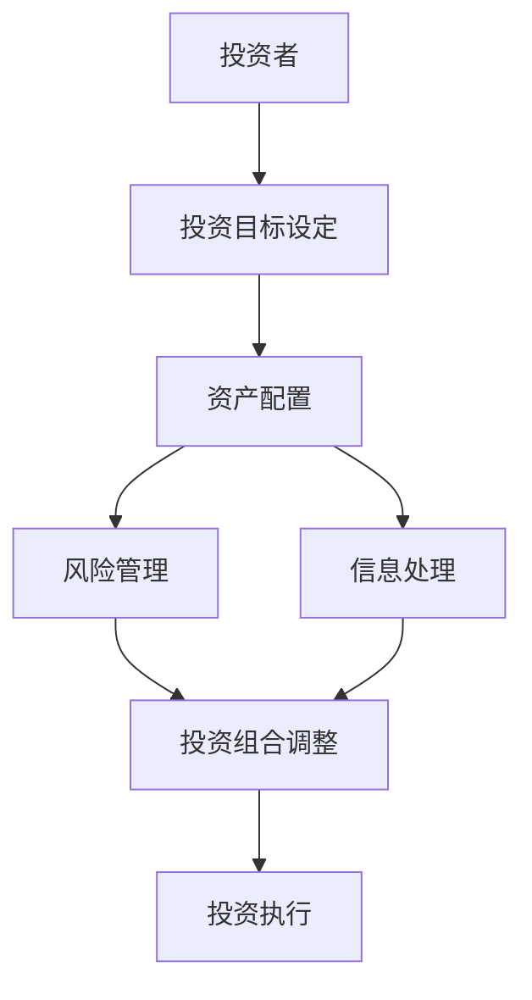
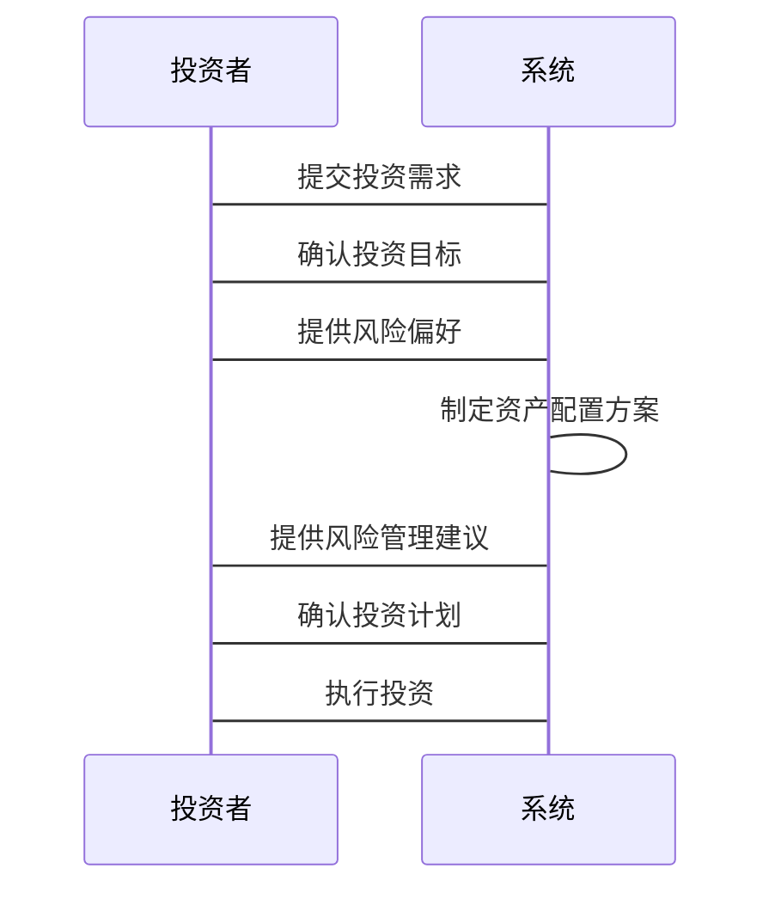

                 


# 巴菲特的市场择时观点更新：长期主义在当代的应用

## 关键词：
巴菲特，市场择时，长期主义，投资策略，价值投资，投资哲学

## 摘要：
本文将探讨巴菲特的长期主义投资哲学及其在当代市场环境中的应用。通过分析巴菲特的市场择时观点，结合现代投资理论与实践，详细阐述长期主义在投资决策中的重要性，并通过具体案例和数学模型，展示长期主义在应对市场波动和实现稳健收益中的独特价值。

---

## 第1章: 长期主义的起源与发展

### 1.1 长期主义的核心概念

#### 1.1.1 长期主义的定义与内涵
长期主义（Long-termism）是一种投资哲学，强调以长期视角看待投资，关注企业的内在价值和持续发展能力，而非短期市场波动。它主张通过持有优质资产，逐步积累财富，而非频繁交易以追求短期收益。

#### 1.1.2 巴菲特与长期主义的渊源
巴菲特（Warren Buffett）是长期主义的代表人物。他的投资理念深受价值投资理论的影响，强调买入并持有优质企业股票，长期持有以获得企业成长的收益。巴菲特认为，短期市场波动是投资的敌人，而长期持有的优质资产才是制胜的关键。

#### 1.1.3 长期主义在投资领域的应用
长期主义在投资领域的主要应用包括：
- **价值投资**：寻找具有持续盈利能力、良好管理和竞争优势的企业。
- **资产配置**：通过合理的资产配置分散风险，平衡短期波动与长期收益。
- **风险管理**：通过长期视角，降低短期市场波动对企业价值的影响。

### 1.2 巴菲特的投资哲学

#### 1.2.1 巴菲特的投资策略
巴菲特的投资策略以价值投资为核心，强调以下几点：
1. **买入优秀企业**：选择具有强大竞争优势、良好管理和优秀管理层的企业。
2. **长期持有**：避免频繁交易，减少交易成本和市场波动的影响。
3. **分散投资**：通过多样化投资降低风险，同时集中投资于少数优质资产。

#### 1.2.2 巴菲特的选股标准
巴菲特选股的核心标准包括：
- **低市盈率（P/E）**：寻找市盈率低于行业平均水平的企业。
- **高ROE（净资产收益率）**：选择ROE高且稳定的公司。
- **强大的财务状况**：企业应具备健康的资产负债表，低负债率和高现金流。

#### 1.2.3 巴菲特对市场的看法
巴菲特认为，市场是疯狂的，短期波动难以预测。但长期来看，市场会反映企业的真正价值。因此，投资者应关注企业的基本面，而非短期市场情绪。

### 1.3 长期主义与短期投资的对比

#### 1.3.1 短期投资的特点与风险
- **短期投资**：以短期收益为目标，频繁买卖资产。
- **风险**：市场波动大，交易成本高，难以获得稳定收益。

#### 1.3.2 长期投资的优势与挑战
- **优势**：避免短期波动影响，复利效应显著，交易成本低。
- **挑战**：需要较强的风险承受能力和长期耐心，市场波动可能对短期资金需求造成压力。

#### 1.3.3 长期主义与短期投资的平衡
长期主义并不意味着完全忽视短期市场波动，而是通过合理的资产配置和风险管理，在长期目标与短期需求之间找到平衡点。

---

## 第2章: 巴菲特的市场择时观点

### 2.1 市场择时的基本概念

#### 2.1.1 市场择时的定义
市场择时（Market Timing）是指通过预测市场走势，选择最佳时机买卖资产，以最大化收益或减少损失。

#### 2.1.2 市场择时的必要性
市场择时的必要性在于减少短期波动对投资组合的影响，但其难度和不确定性较高。

#### 2.1.3 市场择时的挑战
- **市场预测的不确定性**：市场走势难以预测，择时风险高。
- **交易成本**：频繁交易会增加佣金、税费等成本。
- **心理因素**：投资者情绪化决策可能导致错误判断。

### 2.2 巴菲特对市场择时的看法

#### 2.2.1 巴菲特对市场择时的否定
巴菲特认为市场择时是不确定的，且择时的难度远大于选股。他强调，长期持有优质资产比频繁交易更能获得稳定收益。

#### 2.2.2 巴菲特的长期投资理念
巴菲特的长期投资理念认为，市场的短期波动无法预测，但优质企业的长期价值是可衡量的。因此，长期持有优质资产比短期择时更可靠。

#### 2.2.3 巴菲特对市场的长期展望
巴菲特认为，长期来看，股市是企业价值的反映。通过持有优质企业，投资者能够分享企业的成长收益。

### 2.3 长期主义在市场择时中的应用

#### 2.3.1 长期主义与市场周期的关系
- 长期主义不追求短期市场高点，而是关注企业的长期价值。
- 在市场低谷时，长期主义投资者会坚持持有，甚至增加投资，以利用市场的低估机会。

#### 2.3.2 长期主义在市场波动中的应对策略
- **坚持长期视角**：避免因短期波动而改变投资策略。
- **利用市场波动**：在市场下跌时，增加优质资产的配置。
- **分散投资**：通过多样化投资降低市场波动的影响。

#### 2.3.3 长期主义对投资者心理的影响
- 长期主义要求投资者具备强大的心理素质，能够承受短期市场的波动。
- 通过长期持有优质资产，投资者可以减少心理压力，专注于长期目标。

---

## 第3章: 长期主义在当代的应用

### 3.1 当代市场的特点

#### 3.1.1 全球化与市场一体化
- 全球化使得市场更加一体化，投资者可以接触到更多的资产和市场。
- 跨国投资增加了市场的复杂性，但也提供了更多的机会。

#### 3.1.2 数字经济与科技革命
- 数字经济的发展推动了科技行业的崛起，科技公司成为长期投资的重点对象。
- 科技创新改变了传统行业的经营模式，也带来了新的投资机会。

#### 3.1.3 疫情对市场的长期影响
- 疫情导致全球经济放缓，但长期来看，数字化转型和远程办公等趋势将持续影响市场。
- 优质企业在疫情期间表现强劲，进一步验证了长期主义的可行性。

### 3.2 长期主义在现代投资中的演变

#### 3.2.1 从巴菲特到现代长期投资策略
- 现代长期投资策略结合了巴菲特的价值投资理念和现代金融理论。
- 强调ESG（环境、社会、治理）投资，关注企业的可持续发展能力。

#### 3.2.2 长期主义与ESG投资的结合
- ESG投资强调企业的社会责任和可持续发展能力。
- 长期主义者认为，ESG表现优秀的企业更具长期投资价值。

#### 3.2.3 长期主义与被动投资的融合
- 被动投资（指数投资）通过跟踪市场指数，降低交易成本和择时风险。
- 长期主义者可以采用被动投资策略，长期持有指数基金，分享市场的长期增长。

### 3.3 长期主义在个人投资中的实践

#### 3.3.1 长期投资计划的制定
- 设定明确的投资目标，如财富积累、退休规划等。
- 根据个人风险承受能力，制定合理的资产配置方案。

#### 3.3.2 长期投资中的风险管理
- 通过多样化投资分散风险。
- 定期审视投资组合，调整持仓以适应市场变化。

#### 3.3.3 长期投资的心理与行为调整
- 建立长期投资心态，避免情绪化决策。
- 通过持续学习和反思，提升投资能力。

---

## 第4章: 长期主义与现代投资理论

### 4.1 现代投资组合理论

#### 4.1.1 现代投资组合理论的基本假设
现代投资组合理论（MPT）假设市场是有效的，投资者可以通过多样化投资降低风险。

#### 4.1.2 现代投资组合理论与长期主义的联系
- MPT强调长期投资，避免短期波动。
- 长期主义与MPT在资产配置和风险管理上具有相似性。

#### 4.1.3 现代投资组合理论的局限性
- MPT假设市场是有效的，但实际市场中存在非理性因素。
- 长期主义需要关注企业的基本面，而MPT更多关注资产的波动性。

### 4.2 价值投资与长期主义

#### 4.2.1 价值投资的核心理念
价值投资强调寻找被市场低估的资产，长期持有以获得超额收益。

#### 4.2.2 巴菲特与价值投资的关联
巴菲特是价值投资的代表人物，他的投资理念与价值投资高度契合。

#### 4.2.3 价值投资在长期主义中的应用
- 价值投资者通过长期持有优质资产，分享企业的长期增长。
- 价值投资强调安全边际，降低投资风险。

### 4.3 行为金融学与长期投资

#### 4.3.1 行为金融学的基本理论
行为金融学研究投资者心理和行为对市场的影响，认为市场并非完全理性。

#### 4.3.2 长期投资中的行为偏差
- 投资者容易受到情绪影响，做出非理性决策。
- 长期投资需要克服短期亏损的心理压力。

#### 4.3.3 行为金融学对长期投资的启示
- 通过心理调节，减少行为偏差对投资决策的影响。
- 建立严格的投资纪律，避免情绪化决策。

---

## 第5章: 长期主义的系统架构与实现

### 5.1 系统分析与架构设计

#### 5.1.1 问题场景介绍
长期主义投资需要面对复杂的市场环境和多变的经济条件。

#### 5.1.2 系统功能设计
- 资产配置模块：根据投资者风险偏好和目标，制定投资计划。
- 风险管理模块：监控投资组合的风险，及时调整持仓。
- 信息处理模块：分析市场数据和企业基本面信息。

#### 5.1.3 系统架构设计


#### 5.1.4 系统接口设计
- 输入接口：投资者风险偏好、市场数据、企业信息。
- 输出接口：投资计划、风险管理策略、投资组合调整建议。

#### 5.1.5 系统交互流程


### 5.2 算法原理与实现

#### 5.2.1 长期主义投资算法
长期主义投资算法基于以下步骤：
1. 确定投资目标和风险偏好。
2. 选择优质企业，构建投资组合。
3. 定期审视投资组合，调整持仓。
4. 长期持有，避免频繁交易。

#### 5.2.2 算法实现的数学模型
以下是一个简单的长期主义投资模型：
```latex
\text{投资收益} = \sum_{i=1}^{n} w_i \times r_i
```
其中，\( w_i \) 是资产 \( i \) 的权重，\( r_i \) 是资产 \( i \) 的预期收益率。

#### 5.2.3 算法实现的代码示例
```python
def长期主义投资算法(目标, 风险偏好):
    资产组合 = []
    预期收益 = []
    风险评估 = []
    
    for 资产 in 所有可能的资产:
        计算资产的预期收益率和风险
        如果资产符合目标和风险偏好:
            资产组合.append(资产)
            预期收益.append(预期收益率)
            风险评估.append(风险)
    
    return 资产组合, 预期收益, 风险评估
```

---

## 第6章: 项目实战与案例分析

### 6.1 环境安装与准备

#### 6.1.1 投资环境分析
选择具有长期增长潜力的行业和企业，如科技、消费、医疗等。

#### 6.1.2 投资组合构建
根据长期主义理念，选择具有强大竞争优势和良好管理的企业，构建投资组合。

### 6.2 核心实现与代码解读

#### 6.2.1 投资组合优化
```python
import numpy as np
import pandas as pd

def优化投资组合(资产收益, 资产协方差, 风险偏好):
    n = 资产收益.shape[1]
    # 确定优化目标：最小化风险，最大化收益
    # 约束条件：投资权重之和为1，权重非负
    # 使用凸优化方法求解
    # 这里简化为一个示例，实际中需要使用专业优化工具
    return 最优权重
```

#### 6.2.2 投资组合监控
```python
def监控投资组合(实际收益, 预期收益):
    计算实际收益与预期收益的差异
    如果差异显著，调整投资组合
    返回新的投资组合
```

### 6.3 案例分析与解读

#### 6.3.1 案例背景
假设投资者选择投资科技企业，如苹果（Apple）、微软（Microsoft）和亚马逊（Amazon）。

#### 6.3.2 投资组合构建
根据长期主义理念，选择这些企业的股票，长期持有。

#### 6.3.3 投资组合监控
定期审视投资组合的收益和风险，根据市场变化调整持仓。

---

## 第7章: 总结与展望

### 7.1 总结
长期主义是一种科学的投资哲学，它帮助投资者在复杂多变的市场中保持理性和耐心，通过长期持有优质资产实现稳健收益。

### 7.2 未来展望
随着全球经济的不断发展和科技的进步，长期主义将在更多领域展现其价值。投资者需要不断学习和适应，以应对新的市场挑战。

---

## 作者：AI天才研究院/AI Genius Institute & 禅与计算机程序设计艺术 /Zen And The Art of Computer Programming

---

通过以上结构和内容安排，我们可以系统地探讨巴菲特的市场择时观点，并结合现代投资理论和实践，深入分析长期主义在当代的应用。

