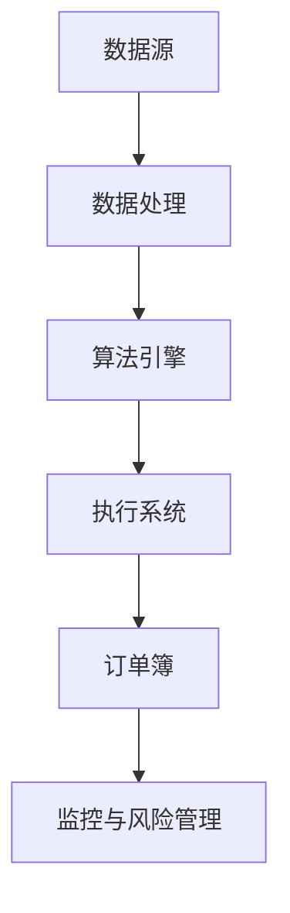

                 


# 巴菲特的市场效率理论批判：高频交易和算法偏差

## 关键词：市场效率，高频交易，算法交易，算法偏差，巴菲特，金融理论

## 摘要：本文批判性地分析了巴菲特的市场效率理论在高频交易和算法交易兴起背景下的局限性，探讨了高频交易和算法偏差对市场效率的影响，并通过数学模型和系统架构分析了高频交易的核心原理。文章结合实际案例，展示了算法交易对市场效率的潜在影响，提出了对未来金融市场的展望。

---

# 第1章：引言

## 1.1 巴菲特的市场效率理论概述

### 1.1.1 市场有效性的定义
市场有效性是指市场价格能够反映所有可获得信息的状态。市场效率理论认为，价格已反映所有相关信息，因此投资者无法通过分析股价获得超额收益。

### 1.1.2 巴菲特的基本面分析法
巴菲特的投资策略基于市场效率理论的低效性，通过基本面分析寻找被低估的股票。他认为市场短期可能波动，但长期会回归其内在价值。

### 1.1.3 市场效率理论的局限性
市场效率理论假设市场参与者理性且信息对称，但在现实中存在信息不对称、市场操纵和高频交易等现象，这些因素削弱了市场效率理论的有效性。

---

## 1.2 高频交易与算法交易的兴起

### 1.2.1 高频交易的定义与特点
高频交易是指通过计算机算法在极短时间内进行大量交易的行为。其特点包括快速决策、高频执行和算法驱动。

### 1.2.2 算法交易的起源与发展
算法交易起源于20世纪70年代，随着计算机技术的发展，算法交易逐渐成熟，并在2000年后随着高频交易技术的普及而迅速发展。

### 1.2.3 高频交易与算法交易的区别
高频交易强调交易速度和频率，而算法交易则强调基于算法的自动化决策。两者结合后，高频交易成为算法交易的重要组成部分。

---

## 1.3 理论与实践的冲突

### 1.3.1 巴菲特理论在现代市场中的局限性
现代市场中，高频交易和算法交易的兴起使得市场信息不再完全对称，巴菲特的基本面分析法在短期内面临挑战。

### 1.3.2 高频交易对市场效率的影响
高频交易可能导致市场波动加剧，价格不再反映长期基本面，而是短期算法决策的结果。

### 1.3.3 算法偏差的形成机制
算法交易依赖于历史数据和统计模型，可能导致价格偏差，即算法偏差，影响市场效率。

---

# 第2章：高频交易与算法偏差的核心概念

## 2.1 高频交易的数学模型

### 2.1.1 市场微观结构模型
市场微观结构模型描述了订单簿的状态、订单流动和价格形成的机制。

### 2.1.2 价格预测模型
价格预测模型基于时间序列分析，如ARIMA模型，用于预测未来的价格走势。

### 2.1.3 订单簿分析模型
订单簿分析模型通过分析订单簿的深度和流动性，预测价格变化的方向。

## 2.2 算法交易的核心算法

### 2.2.1 市场微观结构模型
市场微观结构模型用于分析订单簿数据，帮助算法交易者做出决策。

### 2.2.2 价格预测模型
价格预测模型使用机器学习算法，如LSTM，预测未来的价格走势。

### 2.2.3 订单簿分析模型
订单簿分析模型通过分析订单簿的买卖价差、订单深度和订单流，预测价格变化。

---

# 第3章：系统分析与架构设计

## 3.1 高频交易系统的组成部分

### 3.1.1 数据源模块
数据源模块从交易所或数据供应商获取实时市场数据。

### 3.1.2 算法引擎模块
算法引擎模块执行交易算法，生成买卖信号。

### 3.1.3 执行系统模块
执行系统模块负责快速下单和成交。

### 3.1.4 监控与风险管理模块
监控与风险管理模块实时监控交易风险，确保系统稳定运行。

## 3.2 系统架构设计

### 3.2.1 高频交易系统的架构图


### 3.2.2 系统模块之间的交互关系
数据源模块向数据处理模块传递数据，数据处理模块将数据传递给算法引擎模块，算法引擎模块生成买卖信号，执行系统模块根据信号下单，订单簿模块监控订单状态，监控与风险管理模块实时监控风险。

---

# 第4章：项目实战与案例分析

## 4.1 高频交易系统实战

### 4.1.1 环境配置与工具安装
安装Python、Jupyter Notebook和相关库，如pandas、numpy、scikit-learn。

### 4.1.2 代码实现
```python
import pandas as pd
import numpy as np
from sklearn.linear_model import LinearRegression

# 示例数据
data = pd.DataFrame({'price': np.random.randn(100) * 100 + 100})

# 训练模型
model = LinearRegression()
model.fit(data[['price']], data[['price']])

# 预测价格
predicted_price = model.predict(data[['price']])
print(predicted_price)
```

### 4.1.3 案例分析
分析一个具体案例，如某股票的价格预测，展示算法交易在实际中的应用。

### 4.1.4 项目总结
总结项目实施的经验和教训，提出改进建议。

---

# 第5章：总结与展望

## 5.1 总结
本文批判性地分析了巴菲特的市场效率理论在高频交易和算法交易背景下的局限性，探讨了高频交易和算法偏差对市场效率的影响，并通过数学模型和系统架构分析了高频交易的核心原理。

## 5.2 展望
未来的研究可以进一步探讨高频交易对市场流动性的长期影响，以及如何通过改进算法设计减少算法偏差。

---

作者：AI天才研究院 & 禅与计算机程序设计艺术

