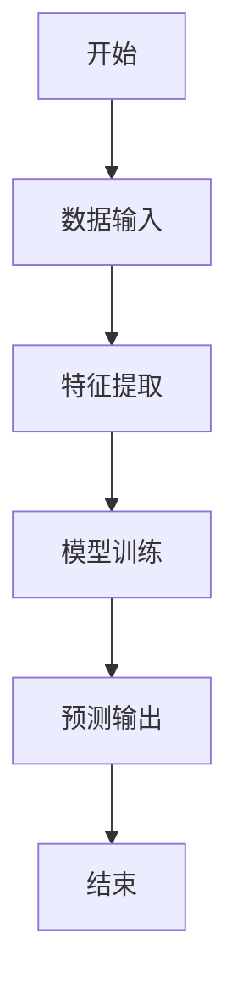
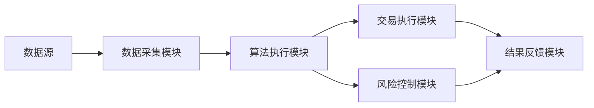
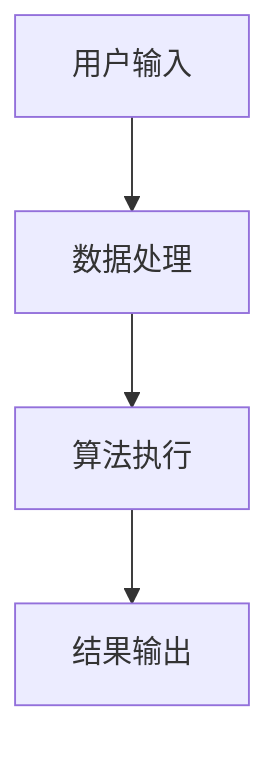

                 

---

# 巴菲特的市场效率理论批判：高频交易和量化策略的影响

---

## 关键词：市场效率，巴菲特，高频交易，量化策略，金融理论，投资策略

---

## 摘要：  
本文批判性地分析了巴菲特的市场效率理论，并探讨了高频交易和量化策略对现代金融市场的影响。通过结合金融理论与技术实现，本文详细阐述了高频交易和量化策略的运作机制、数学模型以及系统架构，并分析了它们对市场效率的多维度影响。文章从理论到实践，系统性地揭示了技术进步如何改变金融市场的游戏规则。

---

## 目录大纲

### 第一部分: 巴菲特的市场效率理论概述

#### 第1章: 巴菲特的市场效率理论核心观点

##### 1.1 市场效率理论的定义与背景

###### 1.1.1 市场效率理论的基本概念

###### 1.1.2 巴菲特对市场效率理论的贡献

###### 1.1.3 理论的适用范围与边界

##### 1.2 巴菲特市场效率理论的核心观点

###### 1.2.1 市场非完全有效性的论证

###### 1.2.2 投资者行为对市场效率的影响

###### 1.2.3 长期投资与价值发现的逻辑

##### 1.3 巴菲特市场效率理论的争议与批评

###### 1.3.1 理论的局限性与缺陷

###### 1.3.2 学术界对巴菲特理论的评价

###### 1.3.3 实践中对理论的挑战

##### 1.4 本章小结

---

### 第二部分: 高频交易与量化策略的运作机制

#### 第2章: 高频交易的定义与运作机制

##### 2.1 高频交易的基本概念

###### 2.1.1 高频交易的定义

###### 2.1.2 高频交易的核心特征

###### 2.1.3 高频交易与传统交易的区别

##### 2.2 高频交易的运作流程

###### 2.2.1 数据收集与处理

###### 2.2.2 算法设计与执行

###### 2.2.3 风险控制与收益优化

##### 2.3 高频交易对市场效率的影响

###### 2.3.1 市场流动性的影响

###### 2.3.2 市场波动性的影响

###### 2.3.3 市场深度与订单簿的影响

##### 2.4 本章小结

---

### 第三部分: 量化策略的数学模型与算法原理

#### 第3章: 量化策略的数学模型

##### 3.1 时间序列分析模型

###### 3.1.1 ARIMA模型

###### 3.1.2 GARCH模型

###### 3.1.3 状态空间模型

##### 3.2 机器学习模型在量化策略中的应用

###### 3.2.1 支持向量机（SVM）

###### 3.2.2 随机森林（Random Forest）

###### 3.2.3 神经网络（Neural Networks）

##### 3.3 量化策略中的风险管理模型

###### 3.3.1 风险价值（VaR）

###### 3.3.2 凸性风险（Convex Risk）

###### 3.3.3 压力测试模型

##### 3.4 算法流程图

---

#### 第4章: 量化策略的算法实现与优化

##### 4.1 量化策略的核心算法实现

###### 4.1.1 基于Python的量化交易框架

###### 4.1.2 算法交易的代码实现示例

###### 4.1.3 算法优化与调优技巧

##### 4.2 量化策略的数学模型与公式推导

###### 4.2.1 时间序列模型的公式表示

###### 4.2.2 机器学习模型的损失函数

###### 4.2.3 风险管理模型的优化目标函数

##### 4.3 本章小结

---

#### 第5章: 高频交易与量化策略的系统架构设计

##### 5.1 系统功能设计

###### 5.1.1 数据采集模块

###### 5.1.2 算法执行模块

###### 5.1.3 风险控制模块

##### 5.2 系统架构设计

##### 5.3 系统接口设计

###### 5.3.1 数据接口规范

###### 5.3.2 算法接口规范

###### 5.3.3 交易接口规范

##### 5.4 系统交互流程图

##### 5.5 本章小结

---

### 第四部分: 高频交易和量化策略对市场效率的影响分析

#### 第6章: 高频交易对市场效率的系统性影响

##### 6.1 高频交易对市场流动性的促进作用

##### 6.2 高频交易对市场波动性的放大效应

##### 6.3 高频交易对市场深度的重构影响

##### 6.4 本章小结

---

#### 第7章: 量化策略对市场效率的优化与挑战

##### 7.1 量化策略对市场信息处理效率的提升

##### 7.2 量化策略对市场参与者行为模式的改变

##### 7.3 量化策略对市场结构的长期影响

##### 7.4 本章小结

---

### 第五部分: 结论与展望

#### 第8章: 结论

##### 8.1 本文的主要结论

##### 8.2 巴菲特市场效率理论的局限性

##### 8.3 高频交易和量化策略的双刃剑效应

#### 第9章: 对未来的展望

##### 9.1 技术进步对市场效率的持续影响

##### 9.2 量化策略的未来发展方向

##### 9.3 市场监管与技术创新的平衡点

---

### 参考文献

---

### 作者：AI天才研究院 & 禅与计算机程序设计艺术

---

### 附录: 代码示例与数据源

---

通过以上目录大纲，文章将系统性地分析巴菲特的市场效率理论，并结合高频交易和量化策略的技术实现，深入探讨其对市场效率的影响。

