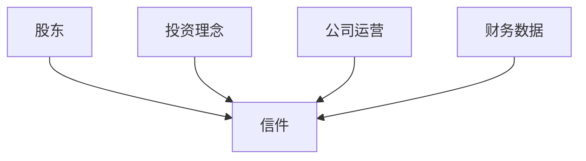
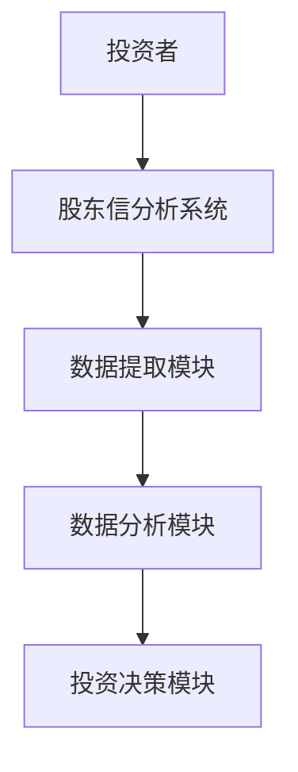
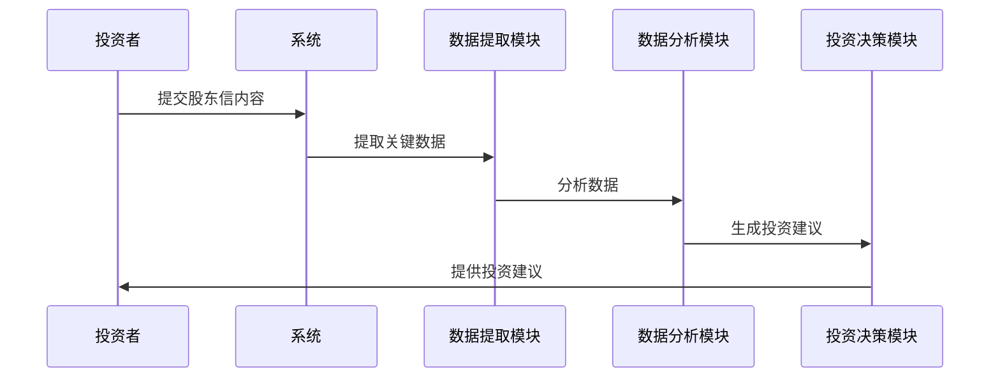

                 


# 巴菲特的年度股东信：价值投资智慧的年度盛宴

## 关键词：
- 价值投资
- 巴菲特股东信
- 内在价值
- 安全边际
- 投资策略
- 股东信分析
- 数学模型

## 摘要：
本文深入分析了巴菲特的年度股东信，揭示了其价值投资智慧的核心理念和实战方法。通过系统性地解读股东信的结构、内容和背后的数学模型，本文为读者提供了从理论到实践的完整指南。文章结合巴菲特的投资哲学，详细讲解了如何通过股东信提炼关键信息，并将其转化为有效的投资策略。最后，本文还提供了实际案例分析和系统设计思路，帮助读者更好地理解和应用价值投资的理念。

---

# 第一部分: 巴菲特投资理念与股东信背景

# 第1章: 巴菲特投资理念概述

## 1.1 巴菲特投资理念的核心思想

### 1.1.1 价值投资的定义与核心要素

价值投资是一种以低于内在价值的价格买入优质资产的投资策略。其核心要素包括：

1. **内在价值**：资产的真正价值，基于其未来现金流的现值。
2. **安全边际**：买入价格与内在价值之间的差距，作为投资的安全垫。
3. **长期视角**：关注企业的长期盈利能力，而非短期市场波动。

### 1.1.2 巴菲特的价值投资体系

巴菲特的价值投资体系可以概括为“价格围绕价值波动”，即市场短期可能偏离价值，但长期会回归。他的投资策略强调寻找具有持续竞争优势的公司，并以合理的价格买入并长期持有。

### 1.1.3 股东信在价值投资中的独特地位

巴菲特通过股东信与投资者分享他的投资理念、决策过程和对市场的看法。这些信件不仅是他投资哲学的集中体现，也是投资者学习价值投资的宝贵资源。

## 1.2 巴菲特股东信的历史与特点

### 1.2.1 巴菲特股东信的起源与发展

巴菲特自1951年开始撰写股东信，最初是为了向合伙企业的投资者汇报投资情况。随着时间的推移，这些信件逐渐成为他分享投资理念的重要平台，并被广泛传播和研究。

### 1.2.2 股东信的写作特点与风格

巴菲特的股东信以简洁明了、逻辑清晰著称。他善于用简单易懂的语言解释复杂的金融概念，并通过实际案例和数据支持他的观点。

### 1.2.3 股东信的阅读群体与影响力

股东信的阅读群体包括专业投资者、普通投资者和学术界人士。它们不仅影响了无数投资者，还成为研究价值投资的重要文献。

## 1.3 股东信的价值与学习方法

### 1.3.1 股东信的学习价值

股东信的价值在于其提供了巴菲特投资理念的原始来源，帮助投资者直接理解他的思考方式和决策逻辑。

### 1.3.2 如何系统性地阅读股东信

系统性阅读股东信的方法包括：
1. 从早期信件入手，了解巴菲特的投资理念演变。
2. 结合市场环境和时代背景，分析信中提到的策略。
3. 研究信中的具体案例，提炼可操作的投资原则。

### 1.3.3 股东信的分析框架与工具

分析框架包括：
1. **内容分类**：将信件内容分为投资理念、市场分析、公司分析等模块。
2. **数据提取**：从信中提取关键数据，如投资组合变化、市场预测等。
3. **逻辑推理**：通过逻辑推理，理解巴菲特的投资决策过程。

---

# 第2章: 价值投资的核心概念与数学模型

## 2.1 价值投资的核心概念

### 2.1.1 价值投资的三要素：安全边际、内在价值、市场价格

- **内在价值**：$$ V = \frac{CF}{r - g} $$
  - $CF$：未来现金流
  - $r$：折现率
  - $g$：现金流增长率
- **安全边际**：买入价格与内在价值的差距，公式为：
  $$ \text{安全边际} = \text{买入价} < \text{内在价值} $$

### 2.1.2 股东信中的核心概念联系

股东信通过具体案例和数据，展示了内在价值、安全边际和市场价格之间的关系。例如，巴菲特在信中常常提到以低于内在价值的价格买入优质资产。

### 2.1.3 价值投资的决策模型

决策模型包括：
1. **确定目标公司**：选择具有持续竞争优势的公司。
2. **评估内在价值**：使用数学模型计算公司的内在价值。
3. **评估安全边际**：确保买入价格低于内在价值。

## 2.2 价值投资的数学模型与公式

### 2.2.1 内在价值计算公式

$$ V = \frac{CF}{r - g} $$

### 2.2.2 安全边际的计算方法

$$ \text{安全边际} = \text{买入价} < V $$

### 2.2.3 股票估值的简化模型

$$ P \leq \frac{E}{r} $$

## 2.3 价值投资的决策流程

### 2.3.1 从股东信中提取关键数据

- **财务数据**：收入、利润、现金流等。
- **市场数据**：市盈率、市净率等。

### 2.3.2 构建投资决策树

1. **确定目标公司**：选择具有竞争优势的公司。
2. **评估内在价值**：使用数学模型计算内在价值。
3. **评估安全边际**：确保买入价低于内在价值。

### 2.3.3 通过数学模型验证投资决策

- 使用内在价值公式验证公司的估值是否合理。
- 通过安全边际公式确保买入价格的合理性。

---

# 第3章: 巴菲特股东信的分析框架

## 3.1 股东信的结构与内容分析

### 3.1.1 股东信的逻辑结构

1. **引言**：简要说明信件的目的。
2. **投资理念**：介绍巴菲特的投资哲学。
3. **市场分析**：分析当前市场环境。
4. **公司分析**：具体分析投资组合中的公司。
5. **总结**：总结投资策略和未来展望。

### 3.1.2 股东信的核心内容模块

- 投资理念
- 市场分析
- 公司分析
- 投资策略
- 未来展望

### 3.1.3 股东信的写作技巧

- 使用简单明了的语言。
- 结合具体案例和数据。
- 强调长期投资和价值投资。

## 3.2 股东信的实体关系与系统架构

### 3.2.1 股东信的实体关系图（Mermaid）



### 3.2.2 股东信的系统架构图（Mermaid）



## 3.3 股东信的系统接口与交互

### 3.3.1 系统接口设计

- 数据输入接口：接收股东信内容。
- 数据输出接口：提供分析结果。

### 3.3.2 股东信分析的交互流程图（Mermaid）



---

# 第4章: 项目实战——股东信分析与投资策略

## 4.1 环境安装与工具准备

- **工具**：文本分析工具、数据分析软件（如Excel、Python）。
- **数据来源**：获取巴菲特的股东信文本。

## 4.2 系统核心实现源代码

### 4.2.1 数据提取模块

```python
def extract_data(text):
    # 提取财务数据
    import re
    revenue = re.findall(r'\b\d+\.\d+\b', text)
    profit = re.findall(r'\b\d+\.\d+\b', text)
    return revenue, profit
```

### 4.2.2 数据分析模块

```python
def calculate_intrinsic_value(revenue, profit, r=0.1, g=0.05):
    return sum(revenue) / (r - g)
```

### 4.2.3 投资决策模块

```python
def make_investment_decision(price, value):
    if price < value:
        return "买入"
    else:
        return "观望"
```

## 4.3 实际案例分析与解读

### 4.3.1 案例分析

假设某年的股东信中提到，某公司的收入为1000万美元，利润为200万美元，折现率为10%，增长率5%。计算内在价值：

$$ V = \frac{1000}{0.1 - 0.05} = 20000000 $$

如果当前股价为1500万美元，则：

$$ \text{安全边际} = 1500 < 20000000 $$

因此，建议买入。

## 4.4 项目小结

通过实际案例分析，我们可以看到如何将股东信中的数据转化为具体的投资决策。关键在于准确提取数据，并使用数学模型进行验证。

---

# 第5章: 最佳实践与小结

## 5.1 最佳实践 tips

- **持续学习**：定期阅读股东信，更新投资理念。
- **数据驱动**：基于数据和模型做出决策。
- **风险管理**：关注安全边际，避免过度投资。

## 5.2 小结

巴菲特的年度股东信不仅是价值投资的智慧盛宴，更是投资者学习和实践的重要资源。通过系统性地分析和应用股东信中的理念，我们可以更好地理解价值投资的核心，并将其转化为实际的投资策略。

---

作者：AI天才研究院/AI Genius Institute & 禅与计算机程序设计艺术/Zen And The Art of Computer Programming

