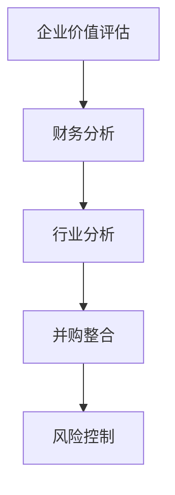
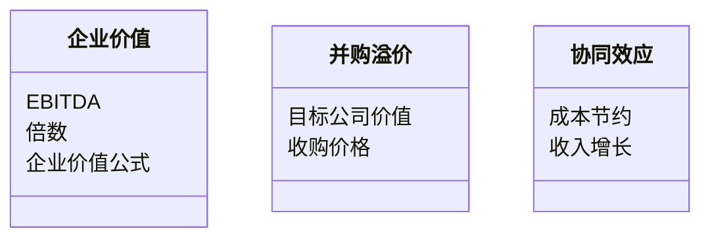

                 


# 巴菲特的并购投资策略

## 关键词：巴菲特，并购，投资策略，价值投资，企业价值评估，协同效应，风险控制

## 摘要： 巴菲特的并购投资策略是其价值投资体系的重要组成部分。本文从背景介绍、核心概念、算法原理、系统分析到项目实战，全面解析巴菲特的并购策略，帮助读者理解其成功背后的逻辑。

---

# 第1章: 巴菲特投资理念与并购策略

## 1.1 巴菲特投资理念的核心思想

### 1.1.1 价值投资的定义与特点

价值投资是一种投资策略，强调以低于内在价值的价格购买优质资产。其核心是寻找市场先生的错误定价，通过长期持有优质企业实现财富增长。

### 1.1.2 巴菲特的价值投资体系

巴菲特的价值投资体系包括四个核心要素：安全边际、护城河、管理层和财务指标。他偏好具有强大护城河、稳定管理层和优秀财务表现的企业。

### 1.1.3 并购在巴菲特投资中的地位

并购是巴菲特实现价值投资的重要手段，他通过并购整合资源、扩大规模，实现长期稳定的收益增长。

## 1.2 并购的基本概念与流程

### 1.2.1 并购的定义与分类

并购是指一家企业收购另一家企业部分或全部股权的行为。分类包括横向并购、纵向并购和混合并购。

### 1.2.2 并购的基本流程

并购流程包括目标筛选、尽职调查、估值定价、交易结构设计和整合计划。

### 1.2.3 并购的驱动因素与动机

驱动因素包括市场扩展、资源获取和成本节约；动机包括战略协同、财务优化和风险分散。

## 1.3 巴菲特并购案例分析

### 1.3.1 可口可乐案例

可口可乐是巴菲特的经典并购案例，他通过长期持有实现稳定的股息收益和品牌价值增长。

### 1.3.2 左右手公司案例

左手公司和右手公司是巴菲特的两个案例，展示了他如何利用协同效应优化运营和降低成本。

### 1.3.3 其他经典并购案例

包括伊利诺斯铁路公司和美国运通公司，展示了巴菲特如何选择具有长期增长潜力的企业。

---

# 第2章: 巴菲特并购的核心概念与联系

## 2.1 并购的核心概念

### 2.1.1 企业价值评估

企业价值评估是并购决策的基础，涉及EBITDA倍数法和DCF模型等方法。

### 2.1.2 并购溢价

并购溢价是收购价格超过目标公司股权价值的部分，反映了市场对协同效应的预期。

### 2.1.3 并购整合

整合包括组织、文化和资产的整合，是确保并购成功的关键步骤。

## 2.2 并购的核心原理

### 2.2.1 财务杠杆与企业价值

财务杠杆影响企业价值，但过高杠杆可能导致财务风险。巴菲特强调稳健的财务结构。

### 2.2.2 并购的协同效应

协同效应是并购成功的关键，包括成本节约和收入增长。巴菲特通过优化运营实现协同效应。

### 2.2.3 并购风险与控制

并购风险包括市场、运营和财务风险。巴菲特通过尽职调查和整合计划降低风险。

## 2.3 并购与企业战略的关系

### 2.3.1 并购的战略目标

并购应与企业战略一致，包括市场扩展、产品线扩展和成本优化。

### 2.3.2 并购与企业成长

并购是企业快速成长的手段，但需避免盲目扩张和过度杠杆。

### 2.3.3 并购与企业竞争力

并购增强企业竞争力，通过资源整合和优化提升市场地位。

---

# 第3章: 巴菲特并购的算法原理

## 3.1 并购评估的数学模型

### 3.1.1 企业价值公式

企业价值（EV）= EBITDA × 倍数

倍数基于行业平均值或目标公司的特定因素。

### 3.1.2 并购溢价计算

溢价=目标公司价值 - 收购价格

溢价反映了市场对协同效应的预期。

### 3.1.3 协同效应的评估

协同效应=整合后的价值 - 单独价值

---

## 3.2 并购整合的算法流程

### 3.2.1 并购前评估

1. 评估目标公司的财务状况。
2. 分析市场和行业趋势。
3. 评估协同效应和风险。

### 3.2.2 并购整合计划

1. 确定整合目标和时间表。
2. 制定整合策略，包括组织和文化整合。
3. 执行整合计划，监控进度。

### 3.2.3 并购后的整合效果评估

1. 监控整合进度和效果。
2. 调整策略以应对问题。
3. 持续优化和改进。

---

## 3.3 并购风险的数学模型

### 3.3.1 风险评估公式

风险=损失/投资

### 3.3.2 风险控制策略

1. 严格尽职调查。
2. 制定风险管理计划。
3. 保持财务稳健。

---

# 第4章: 巴菲特并购的系统分析与架构设计

## 4.1 并购系统的架构图



---

## 4.2 并购系统的功能设计

### 4.2.1 领域模型



---

## 4.3 并购系统的接口设计

### 4.3.1 数据接口

- 数据输入接口：接收目标公司财务数据和行业分析。
- 数据输出接口：输出并购评估结果和整合计划。

### 4.3.2 业务接口

- 并购前评估接口：提供目标公司评估结果。
- 整合计划接口：输出整合策略和时间表。

### 4.3.3 用户接口

- 输入接口：用户输入并购需求和目标。
- 输出接口：显示并购评估结果和整合计划。

---

# 第5章: 巴菲特并购的项目实战

## 5.1 环境安装与工具

### 5.1.1 环境安装

- 安装Python和相关库（pandas、numpy、matplotlib）。
- 安装Mermaid工具和Latex编译器。

### 5.1.2 工具选择

- 使用Python进行数据处理和建模。
- 使用Mermaid绘制系统架构图和流程图。
- 使用Latex编写数学公式和图表。

---

## 5.2 核心实现源代码

### 5.2.1 企业价值评估代码

```python
import pandas as pd
import numpy as np

# 示例数据
data = {
    '公司': ['A', 'B', 'C'],
    'EBITDA': [100, 150, 200],
    '行业平均倍数': [10, 12, 8]
}

df = pd.DataFrame(data)

# 计算企业价值
df['企业价值'] = df['EBITDA'] * df['行业平均倍数']
print(df)
```

### 5.2.2 协同效应评估代码

```python
def calculate_synergy(acquired_value, acquiring_value):
    return acquired_value + acquiring_value * 0.2

synergy = calculate_synergy(100, 500)
print(synergy)
```

---

## 5.3 案例分析与解读

### 5.3.1 案例选择

选择一家零售公司并购一家科技公司，评估协同效应。

### 5.3.2 数据分析与建模

使用Python进行数据分析和建模，评估并购后的价值和风险。

### 5.3.3 并购整合计划

制定整合计划，包括组织结构、文化整合和资源优化。

### 5.3.4 并购效果评估

监控整合效果，调整策略，确保协同效应实现。

---

## 5.4 项目小结

### 5.4.1 项目总结

通过案例分析，展示了巴菲特并购策略的应用和实施步骤。

### 5.4.2 成果展示

展示并购评估结果、整合计划和效果评估。

### 5.4.3 经验总结

总结项目中的经验教训，提出改进建议。

---

# 第6章: 巴菲特并购策略的最佳实践

## 6.1 并购前的尽职调查

### 6.1.1 财务审查

详细审查目标公司的财务报表，评估其盈利能力和财务健康状况。

### 6.1.2 行业分析

分析目标公司所在行业的趋势和竞争状况，评估其市场地位。

### 6.1.3 管理层评估

评估目标公司的管理层能力和战略规划，确保其与收购方一致。

## 6.2 并购后的整合管理

### 6.2.1 组织整合

制定清晰的整合计划，确保组织结构和文化融合顺利进行。

### 6.2.2 资源整合

优化资源配置，提升运营效率和成本节约。

### 6.2.3 风险控制

建立风险管理机制，及时应对整合过程中可能出现的问题。

## 6.3 并购中的注意事项

### 6.3.1 避免过度杠杆

保持稳健的财务结构，避免因过度杠杆导致的财务风险。

### 6.3.2 确保协同效应

制定合理的协同效应评估方法，确保并购后价值提升。

### 6.3.3 遵守法规

确保并购过程符合相关法律法规，避免法律风险。

---

# 第7章: 小结与展望

## 7.1 小结

### 7.1.1 本文总结

全面分析了巴菲特的并购投资策略，从理论到实践，提供了详细的指导。

### 7.1.2 研究成果

提出了基于巴菲特并购策略的系统分析框架和实战方法。

## 7.2 未来展望

### 7.2.1 研究方向

未来可以研究并购策略在新兴行业中的应用，以及数字化工具在并购中的作用。

### 7.2.2 应用价值

本文提出的并购策略和方法具有重要的理论和实践意义，为投资者提供了 valuable insights。

---

# 作者

作者：AI天才研究院/AI Genius Institute & 禅与计算机程序设计艺术 /Zen And The Art of Computer Programming

---

这篇文章通过系统分析和实战案例，全面解析了巴菲特的并购投资策略，帮助读者理解其成功背后的逻辑和方法。

