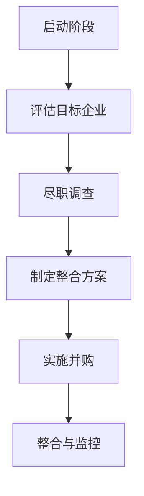
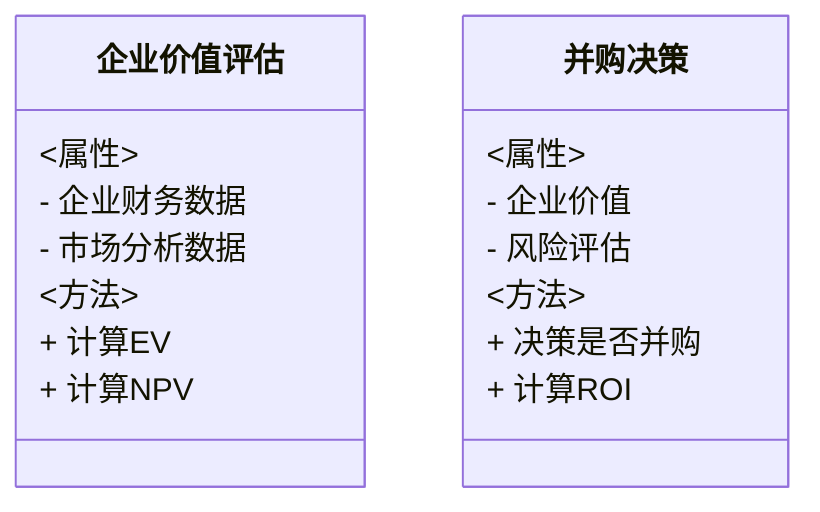
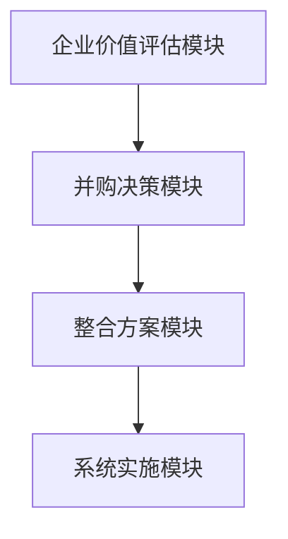

                 

# 巴菲特的并购策略更新：数字时代的企业整合

> **关键词**：巴菲特并购策略、数字时代、企业整合、价值评估、系统架构

> **摘要**：本文探讨了巴菲特并购策略在数字时代的变化，分析了企业整合的新特点和挑战，提出了基于数学模型和系统架构的整合方法，并通过实际案例展示了如何在数字时代成功实施企业整合。

---

## 第一部分: 巴菲特并购策略的背景与核心概念

### 第1章: 巴菲特并购策略概述

#### 1.1 巴菲特并购策略的基本概念

##### 1.1.1 并购的基本定义
企业并购（Mergers and Acquisitions，简称M&A）是指一家企业合并或收购另一家企业，以实现业务扩展、市场扩张或资源优化配置。并购可以分为两类：**横向并购**（同一行业）和**纵向并购**（上下游产业）。

##### 1.1.2 巴菲特并购策略的核心要素
巴菲特的并购策略以**价值投资**为核心，注重企业的内在价值和长期盈利能力。他倾向于收购具有强大竞争优势、良好管理团队和合理估值的企业。

##### 1.1.3 并购在企业战略中的作用
并购是企业战略的重要组成部分，可以帮助企业快速进入新市场、获取新技术、扩大市场份额，并实现规模经济。

#### 1.2 巴菲特并购策略的特点

##### 1.2.1 价值投资导向
巴菲特注重企业的基本面，包括盈利能力、财务健康状况和管理团队。他倾向于收购价格低于企业内在价值的企业。

##### 1.2.2 财务杠杆的运用
巴菲特通常避免过度依赖财务杠杆，强调企业的财务稳健性，以降低财务风险。

##### 1.2.3 风险控制与安全边际
巴菲特强调安全边际，即以低于内在价值的价格收购企业，以确保投资的回报。

#### 1.3 数字时代并购的新特点

##### 1.3.1 数字化转型对企业整合的影响
数字时代，企业整合需要考虑数据、技术、组织文化等因素，传统的财务评估需要结合技术评估。

##### 1.3.2 数据驱动的并购决策
数字时代，数据成为核心资产。企业整合需要依赖数据分析来评估目标企业的价值和整合风险。

##### 1.3.3 技术对企业价值评估的改变
技术是数字时代的核心竞争力，企业整合需要评估目标企业的技术优势、研发投入和创新能力。

---

### 第2章: 巴菲特并购策略的核心概念与联系

#### 2.1 并购的核心概念

##### 2.1.1 并购的类型
| 类型 | 定义 | 适用场景 |
|------|------|----------|
| 横向并购 | 同一行业内的企业并购 | 扩大市场份额，提高市场占有率 |
| 纵向并购 | 上下游产业的企业并购 | 控制供应链，降低生产成本 |
| 混合并购 | 不同行业或业务领域的企业并购 | 多元化经营，分散风险 |

##### 2.1.2 并购的驱动因素
| 驱动因素 | 描述 |
|----------|------|
| 市场扩张 | 进入新市场或区域 |
| 技术获取 | 获取新技术或专利 |
| 成本协同 | 通过规模经济降低成本 |
| 管理协同 | 优化管理团队和流程 |

##### 2.1.3 并购的流程

#### 2.2 并购与整合的联系

##### 2.2.1 整合的定义
整合是指在并购后，将目标企业的业务、组织、文化和资源与原有企业进行融合的过程。

##### 2.2.2 整合的关键环节
| 环节 | 描述 |
|------|------|
| 战略整合 | 确定整合目标和战略 |
| 组织整合 | 优化组织结构和职责 |
| 文化整合 | 促进企业文化的融合 |
| 资源整合 | 整合技术、数据和人力资源 |

##### 2.2.3 整合的挑战与解决方案
| 挑战 | 解决方案 |
|------|--------|
| 文化冲突 | 加强沟通与培训，建立共同的企业文化 |
| 组织摩擦 | 明确职责和权限，建立高效的沟通机制 |
| 数据孤岛 | 采用统一的数据平台，实现数据共享与整合 |

---

### 第3章: 巴菲特并购策略的数学模型与公式

#### 3.1 并购决策的数学模型

##### 3.1.1 企业价值评估公式
企业价值（EV）可以通过以下公式计算：
$$ EV = EBITDA \times 倍数 $$

例如，假设目标企业的EBITDA为1000万美元，行业平均EV/EBITDA倍数为8，则EV为8000万美元。

##### 3.1.2 净现值法（NPV）的应用
净现值（NPV）用于评估并购项目的盈利能力：
$$ NPV = \sum_{t=1}^{n} \frac{CF_t}{(1 + r)^t} + \frac{残值}{(1 + r)^n} $$

其中，\( CF_t \) 是第t年的现金流，\( r \) 是贴现率，\( n \) 是项目周期。

##### 3.1.3 投资回报率（ROI）的计算
投资回报率（ROI）用于评估并购的投资回报：
$$ ROI = \frac{净收益}{投入成本} \times 100\% $$

例如，若净收益为500万美元，投入成本为1000万美元，则ROI为50%。

#### 3.2 并购整合的数学模型

##### 3.2.1 整合成本的分摊模型
整合成本通常需要在相关部门之间分摊：
$$ 成本分摊 = \frac{总整合成本}{参与整合的部门数量} $$

##### 3.2.2 整合效果的评估模型
整合效果可以通过以下公式评估：
$$ 整合效果 = \frac{整合后的效益}{整合前的效益} \times 100\% $$

---

### 第4章: 巴菲特并购策略的系统分析与架构设计

#### 4.1 并购系统的功能设计

##### 4.1.1 领域模型

##### 4.1.2 系统架构设计

---

## 结语

数字时代，企业整合需要结合技术评估和文化整合，以实现真正的协同效应。巴菲特的并购策略在数字时代依然适用，但需要结合新的技术和管理方法。通过数学模型和系统架构的设计，企业可以在数字时代更高效地实施并购和整合，实现可持续发展。

---

**作者：AI天才研究院/AI Genius Institute & 禅与计算机程序设计艺术 /Zen And The Art of Computer Programming**

