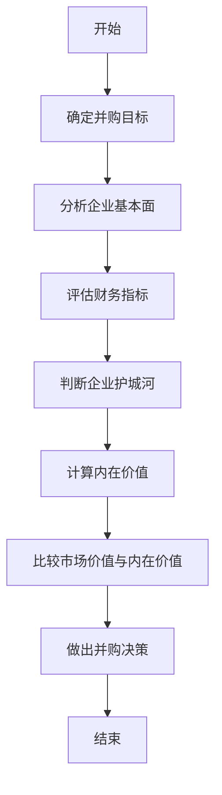

                 


# 巴菲特的并购策略：如何评估收购目标

> 关键词：巴菲特，并购策略，企业评估，投资分析，价值投资，风险管理

> 摘要：本文深入分析了巴菲特的并购策略，从背景介绍、核心概念到评估方法、案例分析，再到风险管理，系统地阐述了如何评估收购目标。通过详细讲解并购评估的核心概念、数学模型和实际案例，本文为投资者提供了实用的并购策略和风险管理思路。

---

## 第一部分：并购在投资中的重要性

### 第1章：并购的基本概念与定义

#### 1.1 并购的基本概念与定义

- **并购的定义**：并购（Mergers and Acquisitions, M&A）是指一家企业与其他企业合并或收购其资产、股权等行为，以实现企业扩张或优化资本结构。

- **并购的分类**：
  1. **横向并购**：同一行业内的企业合并，旨在扩大市场份额。
  2. **纵向并购**：产业链上下游企业合并，以控制更多环节。
  3. **混合并购**：跨行业或跨领域的并购，寻求多元化发展。

- **并购与企业成长的关系**：
  - 并购是企业快速扩张的手段。
  - 并购可以优化资源配置，提升效率。
  - 并购可能带来协同效应，降低成本。

---

### 第2章：巴菲特的投资理念与并购策略

#### 2.1 巴菲特的投资哲学

- **价值投资的核心理念**：
  - 买入低于内在价值的股票。
  - 长期持有优质资产。
  - 重视企业的基本面和长期盈利能力。

- **巴菲特的“企业护城河”理论**：
  - 企业护城河是指企业竞争优势的持久性。
  - 护城河的类型包括成本优势、品牌优势、技术壁垒等。

- **对管理层的重视**：
  - 管理层的能力和诚信是企业成功的关键。
  - 选择管理层优秀的企业作为并购目标。

#### 2.2 巴菲特并购策略的核心框架

- **购买优秀企业而非廉价企业**：
  - 选择具有强大竞争优势的企业。
  - 价格合理，而非追求廉价。

- **企业价值的评估标准**：
  - 内在价值：企业未来现金流的现值。
  - 市场价值：市场对企业的估值。

- **并购中的风险管理**：
  - 避免过度杠杆。
  - 评估整合风险和协同效应。

---

## 第二部分：并购评估的核心概念与联系

### 第3章：并购评估的核心概念与联系

#### 3.1 核心概念的定义与属性对比

- **企业价值与内在价值的对比**：
  | 比较维度 | 企业价值 | 内在价值 |
  |----------|----------|----------|
  | 定义     | 市场对企业的整体估值 | 企业未来现金流的现值 |
  | 计算方式 | 市场价格 | 贴现现金流模型 |
  | 受市场影响 | 高 | 低 |

- **财务指标与非财务指标的对比**：
  | 比较维度 | 财务指标 | 非财务指标 |
  |----------|----------|------------|
  | 示例     | 净利润、ROE | 企业竞争优势、管理层能力 |
  | 作用     | 量化企业表现 | 评估企业软实力 |

- **企业护城河的类型与特征**：
  - **成本优势**：企业能够以更低的成本生产产品。
  - **品牌优势**：强大的品牌影响力吸引消费者。
  - **技术壁垒**：拥有独特的技术或专利。

#### 3.2 实体关系图：企业价值评估的ER架构

```mermaid
er
  entity 企业价值 {
    <属性> 企业盈利能力
    <属性> 企业成长性
    <属性> 企业风险
    <属性> 企业护城河
  }
  entity 财务指标 {
    <属性> 净利润
    <属性> 营业收入
    <属性> 净资产收益率(ROE)
    <属性> 资产回报率(ROA)
  }
  entity 并购目标 {
    <属性> 企业价值
    <属性> 内在价值
    <属性> 市场价值
  }
```

#### 3.3 并购评估的流程图



---

## 第三部分：巴菲特并购评估的数学模型与公式

### 第4章：核心公式

#### 4.1 核心公式

- **净资产收益率（ROE）公式**：
  $$ROE = \frac{净利润}{净资产}$$

- **资产回报率（ROA）公式**：
  $$ROA = \frac{净利润}{总资产}$$

---

## 第四部分：案例分析与实际操作

### 第5章：实际案例分析

#### 5.1 案例背景

- **案例名称**：可口可乐的并购策略
- **并购目标**：一家小型饮料公司。
- **评估过程**：
  - 分析企业的盈利能力。
  - 计算ROE和ROA。
  - 判断企业护城河。

#### 5.2 并购整合策略

- **协同效应**：
  - 优化供应链。
  - 共享销售渠道。
- **整合步骤**：
  1. 尽职调查。
  2. 确定整合方案。
  3. 实施整合并监控效果。

---

## 第五部分：风险管理与总结

### 第6章：并购中的风险管理

#### 6.1 风险评估

- **财务风险**：
  - 过度杠杆。
  - 现金流风险。
- **管理风险**：
  - 管理层整合问题。
  - 文化冲突。

#### 6.2 风险管理策略

- **分散投资**：避免将所有资金投入单一并购项目。
- **严格评估**：在并购前进行详细的尽职调查。
- **建立监控机制**：并购后持续监控企业表现。

---

## 第六部分：总结与展望

### 第7章：总结与展望

- **总结**：
  - 巴菲特的并购策略强调企业质量、财务指标和管理层能力。
  - 并购评估需要综合考虑内在价值和市场价值。
  - 风险管理是并购成功的关键。

- **展望**：
  - 未来并购将更加注重数字化和技术创新。
  - 人工智能和大数据将在并购评估中发挥更大作用。

---

## 作者：AI天才研究院/AI Genius Institute & 禅与计算机程序设计艺术 /Zen And The Art of Computer Programming

