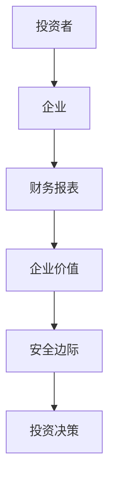
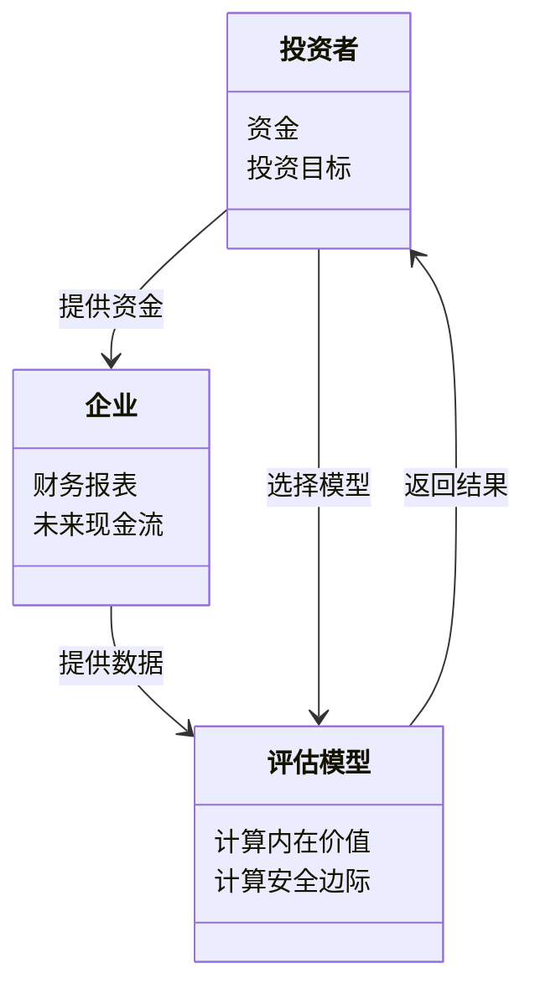

                 


# 巴菲特的投资决策框架

> 关键词：巴菲特，价值投资，投资决策，企业评估，安全边际，长期投资

> 摘要：本文系统地分析了巴菲特的投资决策框架，从其核心理念、决策模型、算法原理到实际应用进行了全面探讨。通过详细阐述企业价值评估、安全边际计算和复利效应等关键概念，结合实际案例和系统架构设计，展示了巴菲特投资框架的科学性与实用性。

---

# 第一部分：巴菲特投资决策框架概述

## 第1章：巴菲特投资理念的背景与核心概念

### 1.1 投资的本质与目标

#### 1.1.1 投资的定义与分类
投资是将资源（如资金）投入到特定资产或项目中，以期在未来获得收益或增值的过程。投资可以分为实物投资（如房地产、制造业）和金融投资（如股票、债券）两类。本文主要关注巴菲特的金融投资理念。

#### 1.1.2 巴菲特的投资哲学与价值观
巴菲特的投资哲学的核心是“以合理的价格买入优秀的公司”，并长期持有。他强调投资的本质是通过分析企业的基本面，找到具有持续竞争优势和良好管理团队的公司。

#### 1.1.3 价值投资的起源与发展
价值投资起源于20世纪初，由本杰明·格雷厄姆和戴维·多德提出。巴菲特师承格雷厄姆，但进一步发展了这一理论，强调企业内在价值的评估和安全边际的重要性。

---

### 1.2 巴菲特投资框架的核心要素

#### 1.2.1 企业基本面分析
巴菲特认为，投资的第一步是深入分析企业的基本面，包括财务状况、盈利能力、竞争优势和管理层质量。

#### 1.2.2 安全边际的概念
安全边际是指买入价格与企业内在价值之间的差距。通过预留安全边际，投资者可以在市场波动中避免重大损失。

#### 1.2.3 长期投资的重要性
巴菲特强调长期投资，认为市场短期波动无法预测，但优秀企业的长期表现可以通过复利效应带来巨大收益。

---

### 1.3 巴菲特投资框架的边界与外延

#### 1.3.1 投资的边界条件
- 只投资于易于理解的行业和企业。
- 优先选择具有强大竞争优势的企业。
- 避免短期市场波动的干扰。

#### 1.3.2 投资框架的适用范围
巴菲特的投资框架适用于长期价值投资，尤其适合寻找具有持续盈利能力的优秀企业。

#### 1.3.3 投资框架的局限性
- 不适用于短期交易或高频交易。
- 对于新兴行业或技术驱动型企业的适用性有限。

---

### 1.4 巴菲特投资框架的概念结构与核心要素

#### 1.4.1 企业价值的定义与计算
企业内在价值是未来现金流的现值。计算公式如下：
$$
V = \sum_{t=1}^{n} \frac{CF_t}{(1+r)^t}
$$
其中，\(CF_t\) 是第 \(t\) 年的现金流，\(r\) 是折现率。

#### 1.4.2 投资决策的逻辑流程
1. 确定投资目标。
2. 分析企业基本面。
3. 计算内在价值。
4. 确定安全边际。
5. 做出投资决策。

#### 1.4.3 案例分析：巴菲特的经典投资案例
以可口可乐为例：
- 分析：可口可乐具有强大的品牌优势和稳定的现金流。
- 内在价值计算：假设未来现金流为 $100 million，折现率为 5%。
- 结论：内在价值远高于市场价格，具有安全边际。

---

## 第2章：巴菲特投资决策的核心概念与联系

### 2.1 核心概念原理

#### 2.1.1 企业价值的评估
企业价值是未来现金流的现值，可以通过以下步骤计算：
1. 预测未来现金流。
2. 选择合理的折现率。
3. 计算现值。

#### 2.1.2 安全边际的数学模型
安全边际 = 内在价值 - 市场价格。

#### 2.1.3 复利效应的原理
复利效应是投资增长的核心动力，公式为：
$$
A = P(1 + r)^n
$$
其中，\(A\) 是终值，\(P\) 是本金，\(r\) 是年化收益率，\(n\) 是时间（年）。

---

### 2.2 核心概念属性特征对比表格

| 概念         | 企业价值 | 安全边际 | 复利效应 |
|--------------|----------|----------|----------|
| 数量化       | 是       | 是       | 是       |
| 可持续性     | 是       | 是       | 是       |
| 可比性       | 是       | 否       | 是       |

---

### 2.3 ER实体关系图（Mermaid流程图）



---

## 第3章：巴菲特投资决策框架的算法原理

### 3.1 算法原理概述

#### 3.1.1 企业价值评估算法
企业价值评估算法基于未来现金流的现值计算。以下是简化模型的Python代码：

```python
def calculate_intrinsic_value(revenue, profit_margin, growth_rate, discount_rate):
    # 计算未来现金流
    cash_flow = revenue * profit_margin * (1 + growth_rate)
    # 计算现值
    present_value = cash_flow / (1 + discount_rate)
    return present_value

# 示例计算
revenue = 1000000
profit_margin = 0.2
growth_rate = 0.1
discount_rate = 0.05

intrinsic_value = calculate_intrinsic_value(revenue, profit_margin, growth_rate, discount_rate)
print(f"企业内在价值为：{intrinsic_value}")
```

#### 3.1.2 安全边际计算算法
安全边际的计算公式为：
$$
\text{安全边际} = \text{内在价值} - \text{市场价格}
$$

#### 3.1.3 复利效应模拟算法
复利效应的模拟代码如下：

```python
def compound_interest(principal, rate, time):
    return principal * (1 + rate) ** time

# 示例计算
principal = 10000
rate = 0.05
time = 10

final_amount = compound_interest(principal, rate, time)
print(f"复利后的金额为：{final_amount}")
```

---

## 第4章：巴菲特投资决策框架的系统分析与架构设计

### 4.1 系统功能设计（领域模型Mermaid类图）



---

## 第5章：巴菲特投资决策框架的项目实战

### 5.1 环境安装
需要安装Python和相关数据分析库（如Pandas、NumPy）。

### 5.2 核心实现代码

```python
import pandas as pd
import numpy as np

def calculate_intrinsic_value(financials, discount_rate):
    # 提取收入和利润
    revenue = financials['revenue']
    net_income = financials['net_income']
    # 计算未来现金流
    cash_flow = revenue * net_income
    # 计算现值
    present_value = cash_flow / (1 + discount_rate)
    return present_value

# 示例数据
financials = {
    'revenue': 1000000,
    'net_income': 0.2
}
discount_rate = 0.05

intrinsic_value = calculate_intrinsic_value(financials, discount_rate)
print(f"企业内在价值为：{intrinsic_value}")
```

### 5.3 实际案例分析
以可口可乐为例，通过分析其财务报表和竞争优势，计算其内在价值和安全边际，最终得出投资决策。

---

## 第6章：巴菲特投资决策框架的最佳实践与总结

### 6.1 关键点总结
- 理解企业内在价值的计算方法。
- 确保安全边际的存在。
- 长期投资，避免短期波动。

### 6.2 小结
巴菲特的投资决策框架是一种科学且实用的方法，通过深入分析企业的基本面和市场环境，可以帮助投资者做出明智的投资决策。

### 6.3 注意事项
- 避免过度依赖单一模型。
- 定期更新财务数据和市场信息。

### 6.4 拓展阅读
建议阅读巴菲特的《聪明的投资者》和彼得·林奇的《投资漫步者》。

---

# 作者：AI天才研究院 & 禅与计算机程序设计艺术

---

以上是完整的技术博客文章，涵盖巴菲特投资决策框架的各个方面，结合技术语言与实际案例，确保内容的深度与可读性。

