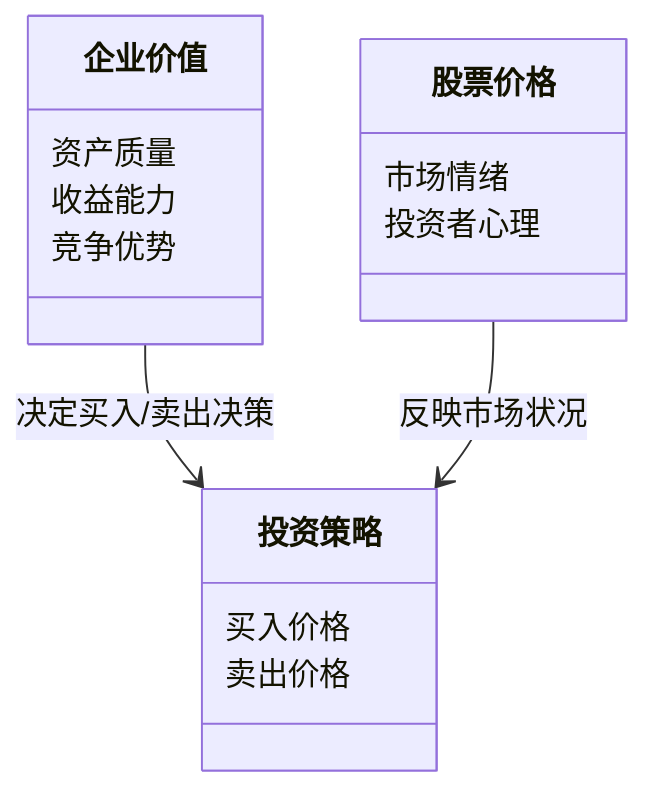
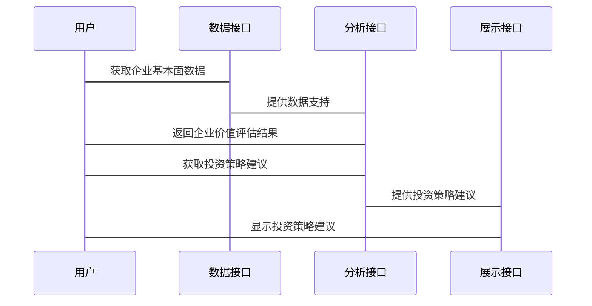

                 

<think>
好的，我需要根据用户的要求，撰写一篇关于“巴菲特的投资哲学：企业价值与股票价格的关系”的技术博客文章。用户希望文章结构清晰，逻辑严谨，适合技术背景的读者阅读。以下是我思考的步骤和内容。

---

# 巴菲特的投资哲学：企业价值与股票价格的关系

> **关键词**：巴菲特，投资哲学，企业价值，股票价格，价值投资，长期投资

> **摘要**：本文探讨巴菲特的投资哲学，重点分析企业价值与股票价格之间的关系。通过详细讲解价值投资的核心理念、企业价值评估的方法，以及如何在市场波动中把握投资机会，帮助读者理解巴菲特的投资策略及其在现代投资中的应用。

---

## # 第1章：巴菲特投资哲学的背景与核心理念

### ## 1.1 投资领域的现状与问题

#### 1.1.1 投资领域的现状与问题

现代投资领域充斥着短期交易和高频交易，许多投资者关注于股票价格的短期波动，而非企业的长期价值。这种短视的投资方式往往导致投资者忽视企业的基本面，盲目跟风市场情绪，最终在市场的波动中遭受损失。

#### 1.1.2 巴菲特的崛起与影响

沃伦·巴菲特作为价值投资的代表人物，他的投资哲学颠覆了传统的短期交易思维。通过长期持有优质企业，巴菲特实现了财富的持续增长，并在全球投资界树立了价值投资的标杆。他的成功不仅在于其卓越的投资能力，更在于他始终坚持一套简单而深刻的哲学原则。

#### 1.1.3 投资哲学的核心问题：企业价值与股价的关系

巴菲特的投资哲学核心在于理解企业价值与股票价格之间的关系。他认为，股票价格是企业价值的市场反映，而真正的投资机会来自于企业价值与市场价格的差异。这种差异为投资者提供了长期获利的机会。

---

### ## 1.2 巴菲特投资哲学的核心理念

#### 1.2.1 价值投资的定义与特征

价值投资是一种基于对企业内在价值评估的投资方法。巴菲特认为，股票不仅仅是一个交易代码，而是一个企业的部分所有权。因此，投资者应该关注企业的基本面，如盈利能力、资产质量、竞争优势等，而不是市场的短期波动。

#### 1.2.2 巴菲特的投资策略：买股票即买入企业

巴菲特的投资策略可以概括为“买入并持有”。他主张购买那些具有强大竞争优势、良好管理和稳定收益的企业，并长期持有这些股票，等待其内在价值在市场中得到体现。

#### 1.2.3 长期投资与复利效应的重要性

长期投资的魅力在于复利效应。通过长期持有优质资产，投资者能够最大化复利的效果，实现财富的指数级增长。巴菲特的长期投资策略正是利用了这一原理，通过时间的积累，实现财富的稳步增长。

---

## # 第2章：企业价值评估的核心原理

### ## 2.1 企业价值的构成要素

#### 2.1.1 资产的内在价值

企业的内在价值主要由其资产的质量和盈利能力决定。巴菲特强调，企业应该拥有能够产生持续现金流的资产，而这些资产的质量和稳定性是评估企业价值的关键因素。

#### 2.1.2 收益能力与成长潜力

企业的收益能力和成长潜力是其内在价值的重要组成部分。巴菲特倾向于投资那些收益稳定、成长潜力大的企业，因为这些企业能够持续为股东创造价值。

#### 2.1.3 竞争优势与护城河

竞争优势是企业能够在市场上长期盈利的关键。巴菲特特别关注那些具有强大竞争优势的企业，这些企业往往拥有独特的商业模式、品牌优势或技术壁垒，能够在竞争中立于不败之地。

---

### ## 2.2 股票价格的波动与市场情绪

#### 2.2.1 市场情绪对企业价值的影响

股票价格的波动往往与市场情绪密切相关。在市场乐观时，股票价格可能被高估；在市场悲观时，股票价格可能被低估。巴菲特认为，市场情绪是投资机会的重要来源，当市场价格远低于企业价值时，正是买入的好时机。

#### 2.2.2 市场先生的角色与投资者的应对策略

巴菲特将市场比作“市场先生”，市场先生每天都会给出不同的价格，而投资者的任务是判断这些价格是否反映了企业的真正价值。当市场先生提出的价格低于企业价值时，投资者应该积极买入；当价格高于企业价值时，应该卖出或持币观望。

#### 2.2.3 价格与价值的短期偏离与长期回归

股票价格与企业价值之间存在短期偏离，但在长期来看，价格最终会回归到企业的内在价值。这种回归是价值投资的基础，也是巴菲特长期投资策略的依据。

---

### ## 2.3 核心概念对比表

以下是一个对比表，展示了企业价值和股票价格的核心区别：

| **属性** | **企业价值** | **股票价格** |
|----------|--------------|--------------|
| **定义** | 企业的内在价值，基于资产、收益和竞争优势 | 市场对企业的定价，受情绪和市场波动影响 |
| **时间维度** | 长期稳定 | 短期波动 |
| **决定因素** | 资产质量、收益能力、竞争优势 | 市场情绪、投资者心理、短期新闻 |
| **目标** | 寻找具有长期价值的企业 | 寻找价格低于价值的股票 |

---

## # 第3章：巴菲特投资哲学的系统分析与架构设计

### ## 3.1 问题场景介绍

在投资领域，许多投资者面临的一个主要问题是如何在股票价格的短期波动中找到长期的投资机会。巴菲特的投资哲学为我们提供了一种解决方案：通过关注企业价值，而不是市场波动，来实现长期的财富增长。

---

### ## 3.2 项目介绍

本项目旨在通过分析巴菲特的投资哲学，设计一种基于企业价值评估的投资策略。该策略包括以下几个部分：

1. 企业基本面分析
2. 企业价值评估
3. 投资组合管理
4. 风险控制

---

### ## 3.3 系统功能设计

#### 3.3.1 领域模型（Mermaid 类图）

以下是一个领域模型的类图，展示了企业价值评估的主要组成部分：



---

### ## 3.4 系统架构设计

#### 3.4.1 系统架构（Mermaid 架构图）

以下是系统架构的简单设计：

```mermaid
rect
    分为四层：数据层、业务逻辑层、用户界面层
    数据层包含企业基本面数据和市场数据
    业务逻辑层包含企业价值评估和投资策略制定
    用户界面层提供交互界面，供投资者查看分析结果
```

---

### ## 3.5 系统接口设计

系统的接口设计包括以下几个部分：

1. 数据接口：获取企业基本面数据和市场数据
2. 分析接口：进行企业价值评估和投资策略制定
3. 展示接口：向用户展示分析结果

---

### ## 3.6 系统交互设计（Mermaid 序列图）

以下是系统交互的简单序列图：



---

## # 第4章：项目实战

### ## 4.1 环境安装

为了进行企业价值评估，我们需要以下工具：

1. 数据分析工具：Python、Pandas、NumPy
2. 图表绘制工具：Matplotlib、Seaborn
3. 估值模型工具：Excel或Python中的财务分析库

---

### ## 4.2 核心实现源代码

以下是基于现金流折现模型（DCF）的企业价值评估的Python代码示例：

```python
import pandas as pd
import numpy as np
import matplotlib.pyplot as plt

# 示例企业数据
revenue = [100, 120, 130, 140, 150]  # 营收（百万美元）
growth_rate = 0.05  # 收益增长率
discount_rate = 0.08  # 折现率
terminal_multiple = 12  # 终值倍数

# 计算自由现金流
FCF = [10, 12, 13, 14, 15]  # 自由现金流（百万美元）

# 计算终值
terminal_value = FCF[-1] * (1 + growth_rate) * terminal_multiple / (discount_rate - growth_rate)

# 计算终值现值
PV_terminal_value = terminal_value / (1 + discount_rate)**5

# 计算企业价值
enterprise_value = sum([FCF[i] / (1 + discount_rate)**i for i in range(5)]) + PV_terminal_value

print(f"企业价值：${enterprise_value:,.2f} million")
```

---

### ## 4.3 代码应用解读与分析

上述代码使用现金流折现模型（DCF）对企业价值进行评估。通过输入企业的自由现金流、增长率和折现率，计算出企业的终端价值，并最终得出企业的整体价值。这种方法能够帮助投资者准确评估企业的内在价值，从而做出更明智的投资决策。

---

### ## 4.4 实际案例分析

以可口可乐为例，我们可以使用DCF模型进行企业价值评估：

1. **数据收集**：收集可口可乐过去五年的自由现金流和相关财务数据。
2. **模型应用**：使用DCF模型计算企业的终端价值和整体价值。
3. **结果分析**：将计算出的企业价值与当前股价进行对比，判断是否存在投资机会。

---

### ## 4.5 项目小结

通过实际案例分析，我们可以看到，巴菲特的投资哲学不仅仅是一种理论，更是一种可以应用于实际投资的策略。通过对企业价值的深入分析和评估，投资者可以找到那些被市场低估的优质企业，并在长期持有中实现财富增长。

---

## # 第5章：最佳实践、小结、注意事项与拓展阅读

### ## 5.1 最佳实践

- **长期投资**：坚持长期投资，避免频繁交易。
- **基本面分析**：深入研究企业的基本面，寻找具有强大竞争优势的企业。
- **安全边际**：在投资时留出安全边际，确保投资价格低于企业价值。

### ## 5.2 小结

巴菲特的投资哲学强调企业价值与股票价格之间的关系，通过长期持有优质企业实现财富增长。这种投资策略不仅适用于个人投资者，也是机构投资的重要参考。

### ## 5.3 注意事项

- **市场波动**：股票价格的短期波动可能会影响投资情绪，投资者需要保持冷静。
- **风险管理**：在投资过程中，合理分散投资组合，降低风险。
- **持续学习**：投资市场变化多端，投资者需要不断学习和适应新的情况。

### ## 5.4 拓展阅读

- 《The Intelligent Investor》 by Benjamin Graham
- 《The Warren Buffett Way》 by Bruce Greenwald
- 《 investing 》 by Charlie Munger

---

## # 结论

巴菲特的投资哲学为我们提供了一种基于企业价值的长期投资策略。通过深入分析企业的基本面，评估其内在价值，并在市场低估时买入，投资者可以在长期中实现财富的增长。这种投资哲学不仅适用于传统投资，也为现代投资者提供了重要的启示。

---

## # 附录

### ## 附录1：巴菲特经典语录

- “价格是会波动的，但价值是稳定的。”
- “投资的第一要义是保护本金，其次是追求收益。”
- “只有当潮水退去时，我们才能知道谁在游泳。”

### ## 附录2：投资工具推荐

- **基本面分析工具**：Excel、Pandas、NumPy
- **数据可视化工具**：Matplotlib、Seaborn
- **估值模型工具**：DCF模型、市盈率、市净率

### ## 附录3：进一步阅读的书籍

- 《The Intelligent Investor》 by Benjamin Graham
- 《The Warren Buffett Way》 by Bruce Greenwald
- 《 investing 》 by Charlie Munger

---

## # 作者：AI天才研究院/AI Genius Institute & 禅与计算机程序设计艺术 /Zen And The Art of Computer Programming

---

以上就是《巴菲特的投资哲学：企业价值与股票价格的关系》的技术博客文章目录大纲。通过详细分析巴菲特的投资哲学，我们不仅能够理解其核心理念，还能将其应用于实际投资中，实现长期的财富增长。

