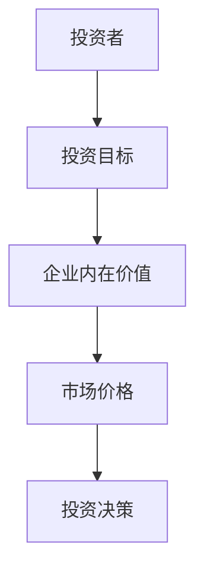
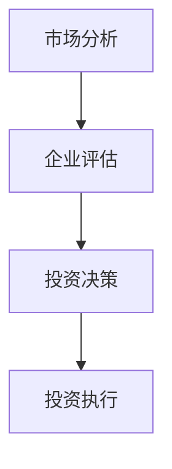
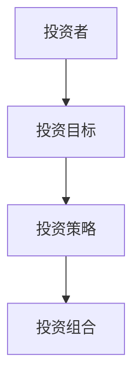
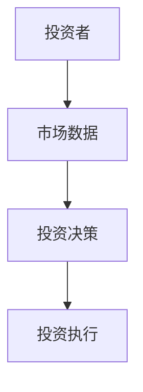

                 


# 巴菲特的投资哲学：在市场恐慌时贪婪

> **关键词**：巴菲特，投资哲学，价值投资，安全边际，市场恐慌，贪婪策略  
> **摘要**：本文深入探讨巴菲特的投资哲学，特别是他在市场恐慌时的贪婪策略。通过分析价值投资的核心理念、安全边际的重要性以及在市场波动中的投资机会，本文为读者提供一个系统化的投资框架，帮助他们在市场低谷时识别并抓住优质资产的投资机会。

---

## 第一章：巴菲特的投资哲学背景

### 1.1 投资的定义与核心问题

#### 1.1.1 投资的定义与核心要素

投资是将资金投入某个资产或企业，以期在未来获得超过初始投入的收益。核心要素包括：

1. **资金分配**：如何将资金分配到不同资产类别中。
2. **风险与收益**：评估投资的风险和潜在收益。
3. **时间因素**：投资的时间跨度对收益的影响。

#### 1.1.2 投资的主要问题与挑战

投资面临的主要问题包括：

1. **信息不对称**：投资者难以完全掌握市场的所有信息。
2. **市场波动**：价格波动可能导致短期损失。
3. **情绪影响**：投资者的贪婪和恐惧会影响决策。

#### 1.1.3 投资的哲学与方法论

巴菲特的投资哲学基于长期、价值导向和逆向思维。他强调长期持有优质资产，而非短期波动。

---

### 1.2 巴菲特投资哲学的起源与演变

#### 1.2.1 巴菲特的早期投资经历

巴菲特在哥伦比亚大学师从本杰明·格雷厄姆，学习价值投资的基本原理。他的早期投资生涯注重安全边际和内在价值。

#### 1.2.2 巴菲特投资哲学的形成过程

巴菲特的投资哲学形成于20世纪60年代，他将格雷厄姆的安全边际概念与彼得·林奇的成长投资理念结合，发展出自己的价值投资体系。

#### 1.2.3 巴菲特投资哲学的核心理念

- **长期投资**：避免频繁交易，降低交易成本。
- **价值投资**：寻找市场价格低于内在价值的资产。
- **安全边际**：确保投资的安全性，避免本金损失。

---

### 1.3 巴菲特投资哲学的核心概念与联系

#### 1.3.1 价值投资的定义与特点

价值投资是寻找市场价格低于内在价值的资产。其特点包括：

- **逆向思维**：在市场恐慌时寻找机会。
- **安全边际**：确保投资的安全性。

#### 1.3.2 价值投资与其他投资方法的对比

| 投资方法 | 核心理念 | 适用场景 |
|----------|----------|----------|
| 价值投资 | 寻找低估资产 | 市场恐慌时 |
| 股票投资 | 跟踪趋势 | 市场稳定时 |
| 债券投资 | 确保固定收益 | 风险厌恶时 |

#### 1.3.3 巴菲特投资哲学的ER实体关系图



---

## 第二章：巴菲特投资哲学的核心概念

### 2.1 投资价值的计算公式

$$\text{内在价值} = \frac{\text{未来现金流}}{\text{折现率}}$$

### 2.2 安全边际的计算方法

$$\text{安全边际} = \text{内在价值} - \text{市场价格}$$

### 2.3 投资组合的优化模型

$$\text{投资组合收益} = \sum (\text{权重} \times \text{资产收益})$$

---

## 第三章：巴菲特投资哲学的系统分析与架构设计

### 3.1 投资决策的系统模型



### 3.2 投资架构的系统设计



### 3.3 投资接口与交互设计



---

## 第四章：巴菲特投资哲学的项目实战

### 4.1 投资环境的安装与配置

- **数据源**：选择可靠的财务数据源，如 Yahoo Finance 或 Bloomberg。
- **工具安装**：安装数据分析工具，如Excel、Python（Pandas库）。

### 4.2 投资系统的核心实现代码

```python
def calculate_intrinsic_value(cash_flow, discount_rate):
    return cash_flow / discount_rate
```

### 4.3 投资系统的应用与解读

- **案例分析**：分析某公司的现金流和折现率，计算其内在价值。
- **投资决策**：根据计算结果，判断是否投资。

### 4.4 投资案例的分析与总结

- **案例选择**：选择一家具有稳定现金流的企业。
- **数据分析**：计算内在价值和安全边际。
- **投资决策**：在市场恐慌时，如果安全边际较大，选择投资。

---

## 第五章：巴菲特投资哲学的成功经验与总结

### 5.1 投资中的注意事项

- **避免情绪化决策**：市场恐慌时保持冷静。
- **长期持有**：避免频繁交易。

### 5.2 投资的拓展阅读

- **书籍推荐**：《聪明的投资者》、《价值投资实战》。
- **资源推荐**：巴菲特股东大会的演讲和采访。

---

**作者：AI天才研究院/AI Genius Institute & 禅与计算机程序设计艺术 /Zen And The Art of Computer Programming**

