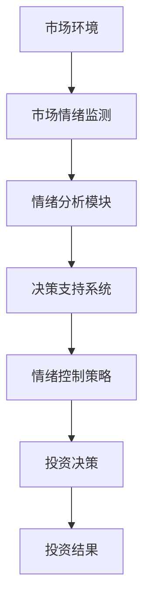

                 


# 巴菲特的投资心理学：情绪控制的重要性

---

## 关键词：巴菲特、投资心理学、情绪控制、价值投资、投资策略

---

## 摘要：本文深入探讨巴菲特的投资心理学，特别是情绪控制在投资决策中的重要性。通过分析巴菲特的投资理念、情绪对决策的影响、认知偏差及应对策略，结合实际案例和系统架构，揭示如何通过自我认知和纪律管理情绪，实现长期稳健的投资回报。

---

## 正文

### 第一部分：投资心理学的基础

#### 第1章：巴菲特的投资理念与情绪控制的重要性

##### 1.1 巴菲特的投资哲学

- **1.1.1 价值投资的定义与核心理念**
  - 价值投资：寻找市场定价低于其内在价值的股票。
  - 核心理念：长期持有优质资产，关注企业的基本面。
  - 股价波动是市场的噪音，长期价值才是关键。

- **1.1.2 巴菲特的投资策略与长期视角**
  - 专注于企业基本面分析，寻找具有持续竞争优势的企业。
  - 长期投资，避免短期波动干扰决策。
  - 价值投资的核心是内在价值的发现与判断。

- **1.1.3 情绪控制在投资中的关键作用**
  - 情绪波动可能导致非理性的投资决策。
  - 理性判断是长期投资成功的关键，情绪控制帮助投资者避免短期波动的干扰。

##### 1.2 情绪对投资决策的具体影响

- **1.2.1 情绪对投资决策的影响**
  - 贪婪与恐惧：贪婪可能导致高估资产价值，恐惧可能导致错失良机。
  - 情绪波动使投资者偏离理性判断，影响决策质量。

- **1.2.2 认知偏差与决策错误**
  - 认知偏差：投资者常见的心理偏差，如确认偏差、过度自信偏差等。
  - 这些偏差导致错误判断，影响投资决策。

- **1.2.3 情绪控制的重要性**
  - 通过情绪管理，投资者可以减少偏差影响，做出更理性的决策。

##### 1.3 投资者心理分析

- **1.3.1 投资者的心理特征**
  - 过度自信：认为自己能预测市场走势。
  - 从众心理：跟随市场潮流，忽视独立判断。

- **1.3.2 常见的心理陷阱与误区**
  - 过度关注短期收益，忽视长期价值。
  - 情绪化交易，缺乏纪律。

- **1.3.3 如何克服心理障碍**
  - 建立明确的投资策略，减少情绪干扰。
  - 通过学习和实践，增强自我认知和情绪管理能力。

---

### 第二部分：情绪控制的核心策略

#### 第2章：情绪对投资决策的具体影响

##### 2.1 贪婪与恐惧的双重影响

- **2.1.1 贪婪的定义与表现**
  - 贪婪：过度追求收益，忽视风险。
  - 表现：高价买入，追求短期收益。

- **2.1.2 恐惧的定义与表现**
  - 恐惧：对损失的过度担忧。
  - 表现：低价卖出，错失长期收益。

- **2.1.3 贪婪与恐惧如何影响投资决策**
  - 贪婪导致高估资产价值，恐惧导致低估资产价值。
  - 影响投资者的买卖时机，导致错失良机或重大损失。

##### 2.2 认知偏差与决策错误

- **2.2.1 认知偏差的定义与类型**
  - 认知偏差：个体在信息处理过程中产生的系统性偏差。
  - 常见类型：确认偏差、过度自信偏差、可得性偏差等。

- **2.2.2 认知偏差对投资的影响**
  - 确认偏差：只关注支持自己观点的信息，忽略反面信息。
  - 过度自信偏差：过高估计自己的判断能力，忽视不确定性。
  - 可得性偏差：根据容易获取的信息做出决策，忽视全面分析。

- **2.2.3 如何识别和应对认知偏差**
  - 识别偏差：了解常见偏差类型，自我反思。
  - 应对策略：多角度分析，避免单一信息源，寻求专业建议。

##### 2.3 情绪波动与市场周期

- **2.3.1 市场周期的定义与特征**
  - 市场周期：从繁荣到衰退，再到复苏的循环过程。
  - 特征：波动性、不可预测性、周期性。

- **2.3.2 情绪波动与市场周期的关系**
  - 市场繁荣时，贪婪情绪主导；市场衰退时，恐惧情绪主导。
  - 情绪波动加剧市场波动，影响资产定价。

- **2.3.3 如何在市场波动中保持冷静**
  - 建立长期投资目标，避免短期波动干扰。
  - 通过情绪管理，减少市场波动的影响。

---

### 第三部分：情绪管理与自我认知

#### 第3章：自我认知与情绪管理

##### 3.1 自我认知的重要性

- **3.1.1 自我认知的定义与作用**
  - 自我认知：个体对自己心理状态的认知和理解。
  - 作用：帮助识别情绪，避免决策偏差。

- **3.1.2 如何进行自我认知**
  - 反思：定期回顾自己的投资决策，分析情绪影响。
  - 记录：保持情绪日志，记录投资决策时的情绪状态。

- **3.1.3 自我认知与情绪管理的关系**
  - 自我认知是情绪管理的基础，帮助识别和控制情绪。

##### 3.2 情绪管理的具体方法

- **3.2.1 情绪管理的定义与目标**
  - 情绪管理：通过调节情绪，做出理性的决策。
  - 目标：减少情绪波动对投资的影响，提高决策质量。

- **3.2.2 情绪管理的具体方法**
  - 暂时搁置：遇到重大决策时，先搁置情绪，冷静分析。
  - 寻求反馈：与他人讨论，获取不同视角。
  - 专注长期目标：将注意力集中在长期投资目标上。

##### 3.3 建立个人投资纪律

- **3.3.1 投资纪律的定义与作用**
  - 投资纪律：严格遵守既定的投资策略和计划。
  - 作用：减少情绪干扰，保持理性决策。

- **3.3.2 如何制定个人投资纪律**
  - 设定明确的投资目标：短期、中期、长期目标明确。
  - 制定详细的投资计划：包括买入、卖出标准，定期复盘。
  - 坚持纪律执行：严格执行计划，避免随意更改。

- **3.3.3 投资纪律的重要性**
  - 纪律执行帮助投资者避免情绪波动的干扰，坚持长期投资策略。

---

## 系统分析与架构设计方案

### 系统架构图



---

### 数学公式与算法实现

#### 情绪指数计算模型

$$ \text{情绪指数} = \alpha \times \text{贪婪指数} + \beta \times \text{恐惧指数} $$

其中，$\alpha$ 和 $\beta$ 是权重系数，$\alpha + \beta = 1$。

---

### 项目实战

#### 环境安装

- 安装Python和相关库：numpy、pandas、scikit-learn。

```python
import numpy as np
import pandas as pd
from sklearn import preprocessing
```

#### 核心代码实现

```python
def calculate_emotion_index(data):
    # 计算情绪指数
    greedy = data['greedy']
    fear = data['fear']
    # 标准化处理
    scaler = preprocessing.StandardScaler()
    scaled_greedy = scaler.fit_transform(greedy.reshape(-1, 1))
    scaled_fear = scaler.fit_transform(fear.reshape(-1, 1))
    # 计算情绪指数
    emotion_index = np.mean(scaled_greedy) * 0.5 + np.mean(scaled_fear) * 0.5
    return emotion_index

# 示例数据
data = {
    'greedy': [0.8, 0.6, 0.7],
    'fear': [0.3, 0.5, 0.4]
}

emotion_index = calculate_emotion_index(data)
print("情绪指数:", emotion_index)
```

---

## 案例分析

#### 巴菲特的经典投资案例

- **案例：巴菲特定投策略**
  - 在市场恐慌时，巴菲特定价抄底，长期持有优质资产。
  - 通过情绪控制，避免恐慌性抛售，抓住长期收益机会。

---

## 结论

### 投资智慧

- 理解并控制情绪，避免贪婪和恐惧的干扰。
- 建立清晰的投资策略和纪律，坚持长期投资。
- 通过自我认知和情绪管理，提高决策质量。

### 未来展望

- 情绪控制是投资成功的关键，未来将继续深入研究投资心理学，探索更多情绪管理方法。

---

## 作者信息

作者：AI天才研究院/AI Genius Institute & 禅与计算机程序设计艺术 /Zen And The Art of Computer Programming

联系方式：[email protected]

社交媒体链接：[LinkedIn](#) | [GitHub](#) | [Twitter](#)

---

通过以上详细的内容和结构安排，这篇文章系统地探讨了巴菲特的投资心理学，特别是情绪控制的重要性，结合理论、案例和实际操作，帮助读者全面理解并应用这些策略。

