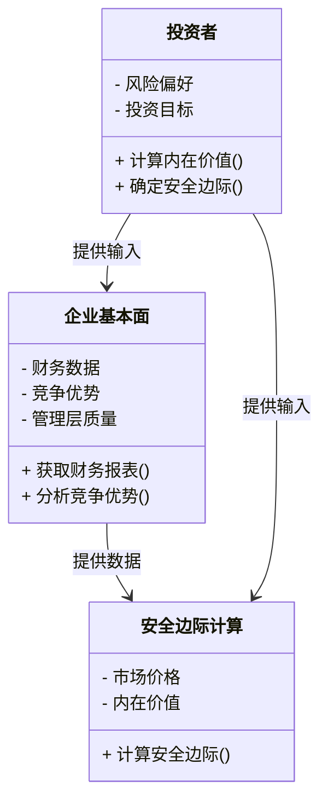

                 


# 巴菲特的投资清单：系统化决策的重要性

> 关键词：巴菲特投资哲学，系统化决策，投资清单，价值投资，安全边际，投资策略

> 摘要：本文探讨了巴菲特的投资哲学及其系统化决策的重要性，详细分析了投资清单的核心要素、决策框架、算法原理以及系统化流程。通过实际案例和项目实战，展示了如何将巴菲特的投资理念应用于实际投资决策中，强调了系统化方法在投资中的关键作用。

---

# 第一部分: 巴菲特的投资哲学与系统化决策

## 第1章: 巴菲特的投资哲学概述

### 1.1 投资的本质与核心目标

投资的本质是通过合理配置资源实现资产增值的过程。核心目标包括财富增长、风险控制和资产保值。投资不仅仅是购买股票，更是一种系统化的决策过程，需要深入分析企业的基本面和市场趋势。

#### 1.1.1 投资的定义与分类

- **定义**：投资是指将资金投入到能够产生收益的资产中，以实现资产增值。
- **分类**：包括股票、债券、房地产等多种形式，每种形式都有其独特的风险和收益特征。

### 1.2 系统化决策的重要性

传统投资决策往往依赖于直觉和情绪，容易受到市场波动的影响。系统化决策则通过建立明确的框架和模型，减少人为错误，提高决策的科学性和一致性。巴菲特的成功很大程度上归功于他系统化的方法，包括对企业基本面的深入分析和对安全边际的严格计算。

---

## 第2章: 巴菲特投资清单的核心要素

### 2.1 企业基本面分析

基本面分析是巴菲特选股的核心。需要关注财务报表中的关键指标，如净利润、营业收入、资产负债率等。通过这些指标评估企业的盈利能力、成长性和财务健康状况。

#### 2.1.1 财务报表分析的关键指标

- **净利润**：衡量企业盈利能力的核心指标。
- **营业收入**：反映企业主营业务的收入情况。
- **资产负债率**：评估企业财务健康状况的重要指标。

### 2.2 投资组合管理策略

资产配置是投资成功的关键。巴菲特强调分散化投资，避免过度集中。同时，定期复盘和动态调整是保持投资组合健康的重要手段，确保风险可控，收益最大化。

#### 2.2.1 资产配置与风险控制

- **分散化投资**：通过投资不同类型的资产降低风险。
- **定期复盘**：定期检查投资组合的表现，及时调整。

---

## 第3章: 巴菲特投资清单的决策框架

### 3.1 投资清单的核心步骤

投资决策流程包括目标设定、企业筛选、定价模型应用和安全边际计算。每一步都需要细致分析，确保决策的科学性和严谨性。

#### 3.1.1 问题场景介绍

- **场景描述**：投资者需要选择一家公司进行投资，需基于巴菲特的清单进行系统化决策。
- **目标设定**：明确投资目标和风险偏好。

### 3.2 投资清单的数学模型

#### 3.2.1 内在价值计算公式

$$
\text{内在价值} = \sum_{t=1}^{\infty} \frac{CF_t}{(r - g)^t}
$$

其中，$CF_t$ 是第 $t$ 年的现金流，$r$ 是折现率，$g$ 是现金流增长率。

#### 3.2.2 安全边际计算公式

$$
\text{安全边际} = \text{市场价格} < \text{内在价值} \times (1 - \text{margin})
$$

---

## 第4章: 巴菲特投资清单的系统化流程

### 4.1 系统化决策的流程框架

系统化的流程包括需求分析、数据收集、模型构建、决策执行和结果评估。每个环节都需要细致处理，确保流程的高效性和准确性。

#### 4.1.1 系统功能设计（领域模型 mermaid 类图）



#### 4.1.2 系统架构设计（mermaid 架构图）


---

## 第5章: 项目实战

### 5.1 环境安装

需要安装Python和相关库，如pandas和numpy。代码示例展示了如何计算内在价值和安全边际。

#### 5.1.1 环境配置

```bash
pip install pandas numpy
```

### 5.2 代码实现

提供Python代码，演示如何读取财务数据，计算内在价值和安全边际。代码详细注释帮助读者理解每一步的操作。

#### 5.2.1 计算内在价值的代码示例

```python
import pandas as pd
import numpy as np

def calculate_intrinsic_value(fcf, discount_rate, growth_rate, perpetuity):
    if perpetuity == 0:
        return fcf / discount_rate
    else:
        terminal_value = fcf * (1 + growth_rate) / (discount_rate - growth_rate)
        return (terminal_value) / (1 + discount_rate)
```

---

## 第6章: 最佳实践与小结

总结系统化决策的重要性，强调在实际操作中需要注意的风险和挑战。建议读者持续学习和实践，优化投资策略。

---

# 小结

通过本文的系统化分析和实际案例，我们可以看到，巴菲特的投资清单不仅仅是一份简单的选股标准，更是一种科学的投资方法。系统化决策在投资中起到了至关重要的作用，帮助投资者在复杂多变的市场中做出更明智的决策。希望本文能为读者提供有价值的参考，帮助他们在投资道路上走得更稳、更远。

---

作者：AI天才研究院/AI Genius Institute & 禅与计算机程序设计艺术 /Zen And The Art of Computer Programming

