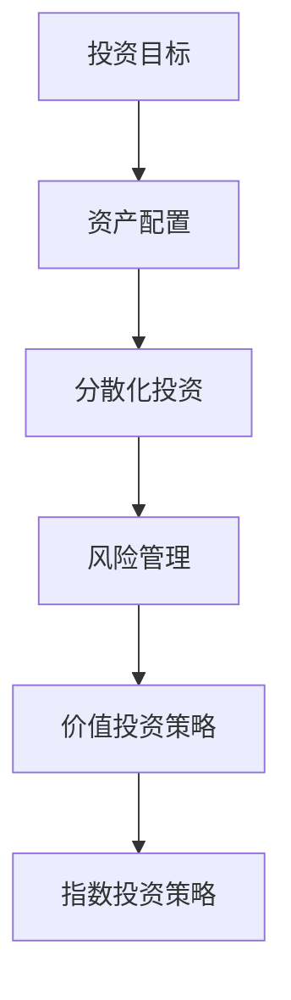

                 


# 巴菲特的投资风格：价值投资vs指数投资

> 关键词：巴菲特、价值投资、指数投资、投资策略、风险管理、投资分析

> 摘要：本文深入分析了巴菲特的投资风格，重点探讨了价值投资和指数投资的异同点，通过实际案例分析和系统架构设计，帮助读者理解这两种投资方式的核心理念和实际应用。文章还结合技术分析方法，从系统架构和算法原理的角度，详细讲解了投资策略的实现过程，并给出了实际的操作建议。

---

## 第一章：巴菲特的生平与投资理念

### 1.1 巴菲特的生平简介
沃伦·巴菲特（Warren Buffett）是世界上最著名的职业投资者之一，被誉为“股神”。他于1934年出生在美国奥马哈市，早年展现出非凡的商业才能。15岁时，巴菲特开始研究股票投资，并在20岁时完成了第一笔股票投资。通过长期的价值投资和稳健的管理，巴菲特积累了巨额财富，并成为全球最受尊敬的投资者之一。

### 1.2 巴菲特的投资理念
巴菲特的投资理念以价值投资为核心，强调寻找被市场低估的优秀企业进行长期投资。他倡导“以合理的价格购买优秀的公司”，并注重企业的财务健康状况、竞争优势和管理层能力。巴菲特认为，投资的最终目标是通过持有优质资产实现财富的长期增长。

---

## 第二章：价值投资与指数投资的核心概念

### 2.1 价值投资的定义与特点
#### 2.1.1 价值投资的定义
价值投资是一种以低于市场价买入优质资产的投资策略。它强调通过深入分析企业的内在价值，寻找市场价格低于内在价值的投资机会。

#### 2.1.2 价值投资的核心特点
- **注重内在价值**：关注企业的基本面，如盈利能力、财务状况和竞争优势。
- **长期持有**：价值投资者倾向于长期持有优质资产，等待市场价回归内在价值。
- **逆向投资**：在市场恐慌时买入，市场狂热时卖出。

#### 2.1.3 价值投资与传统投资的区别
| 特性       | 价值投资               | 传统投资               |
|------------|------------------------|------------------------|
| 投资目标     | 寻找低估资产             | 追求短期收益             |
| 投资期限     | 长期持有                 | 短期交易                 |
| 分析方法     | 深入基本面分析           | 依赖技术分析或市场情绪   |

### 2.2 指数投资的定义与特点
#### 2.2.1 指数投资的定义
指数投资是一种通过跟踪市场指数（如标普500）进行投资的策略。投资者通过购买指数基金或ETF，间接持有市场上的所有股票，以获得市场的平均收益。

#### 2.2.2 指数投资的核心特点
- **分散风险**：通过投资整个市场的股票，降低个股风险。
- **低成本**：指数基金的管理费用较低，适合长期投资。
- **被动管理**：无需频繁调整投资组合，降低交易成本。

#### 2.2.3 指数投资与主动投资的区别
| 特性       | 指数投资               | 主动投资               |
|------------|------------------------|------------------------|
| 管理方式     | 被动跟踪市场指数         | 主动选股、择时           |
| 成本         | 低管理费用               | 高管理费用               |
| 风险         | 散化风险                 | 集中风险                 |

---

## 第三章：价值投资与指数投资的优缺点对比

### 3.1 价值投资的优缺点
#### 3.1.1 价值投资的优点
- **潜在高回报**：通过挖掘低估资产，实现超额收益。
- **注重企业质量**：投资优质企业，长期增长潜力大。
- **逆向思维**：在市场低点买入，长期收益丰厚。

#### 3.1.2 价值投资的缺点
- **市场波动风险**：短期可能大幅亏损，需要耐心等待。
- **选股难度高**：需要深入分析企业，对投资者能力要求高。
- **流动性风险**：某些低估资产流动性差，难以快速变现。

### 3.2 指数投资的优缺点
#### 3.2.1 指数投资的优点
- **分散风险**：投资整个市场，降低个股波动风险。
- **操作简单**：适合普通投资者，无需选股和择时。
- **长期稳定收益**：通过复利效应，实现财富稳步增长。

#### 3.2.2 价值投资的缺点
- **市场平均收益**：无法超越市场指数的超额收益。
- **收益波动小**：长期表现较为平稳，但可能错过大牛股的收益。

---

## 第四章：价值投资与指数投资的适用场景

### 4.1 价值投资的适用场景
- **市场深度调整**：当市场出现恐慌性抛售时，价值投资机会较多。
- **具备选股能力**：投资者具备深入分析企业基本面的能力。
- **长期投资计划**：适合有耐心、追求长期稳定收益的投资者。

### 4.2 指数投资的适用场景
- **市场稳定**：当市场整体表现稳定时，指数投资收益可靠。
- **缺乏选股能力**：普通投资者可以通过指数投资获得市场平均收益。
- **风险厌恶型投资者**：适合那些无法承受高风险的投资者。

---

## 第五章：巴菲特的投资策略与风险管理

### 5.1 巴菲特的价值投资策略
#### 5.1.1 选股标准
巴菲特选股的核心标准包括：
- **企业盈利能力**：ROE（净资产收益率）高且稳定。
- **财务状况健康**：低负债率，现金流充足。
- **竞争优势明显**：企业具有护城河，能够持续盈利。

#### 5.1.2 股票估值方法
巴菲特常用“安全边际”概念，即以低于内在价值的价格买入股票。具体计算公式为：
$$ \text{内在价值} = \frac{\text{净利润} \times (1 + g)}{r - g} $$
其中，$g$为增长率，$r$为贴现率。

#### 5.1.3 长期持有策略
巴菲特主张长期持有优质资产，避免频繁交易，降低交易成本。

### 5.2 巴菲特的风险管理策略
#### 5.2.1 风险控制原则
- **分散投资**：通过投资多个行业和企业，降低风险。
- **避免过度集中**：单个投资的权重不宜过高。
- **安全边际**：买入价格低于内在价值，确保安全空间。

#### 5.2.2 投资组合的分散化
通过投资不同行业的企业，降低单一行业波动带来的风险。

---

## 第六章：价值投资与指数投资的实际案例分析

### 6.1 价值投资案例分析
#### 6.1.1 巴菲特的经典投资案例
- **可口可乐案例**：巴菲特于1988年开始投资可口可乐，长期持有，获得丰厚回报。
- **IBM案例**：2011年投资IBM，尽管短期表现不佳，但长期来看仍具增长潜力。

#### 6.1.2 案例分析与经验总结
- 价值投资需要耐心和信心，市场波动是暂时的。
- 选择具有强大竞争优势的企业是关键。

### 6.2 指数投资案例分析
#### 6.2.1 指数基金的长期表现
以标普500指数为例，长期持有指数基金的年化回报率约为10%。

#### 6.2.2 案例分析与经验总结
- 指数投资适合普通投资者，操作简单且风险分散。
- 长期持有是获得复利收益的关键。

---

## 第七章：价值投资与指数投资的系统分析与架构设计方案

### 7.1 投资组合的设计与优化
#### 7.1.1 投资组合的设计原则
- 根据风险承受能力和收益目标设计投资组合。
- 通过资产配置实现风险分散。

#### 7.1.2 投资组合的优化方法
- 使用均值-方差优化模型，计算最优投资组合。

### 7.2 系统架构设计
#### 7.2.1 投资系统功能设计
- 数据采集：获取市场数据和企业基本面信息。
- 数据分析：计算股票内在价值和市场估值。
- 投资决策：根据模型生成买入或卖出信号。

#### 7.2.2 系统架构图


### 7.3 投资系统实现
#### 7.3.1 数据采集与处理
- 使用Python的Pandas库处理历史数据。
- 通过网络API获取实时市场数据。

#### 7.3.2 投资策略实现
- 价值投资策略：通过基本面分析筛选优质企业。
- 指数投资策略：计算市场指数并跟踪其表现。

#### 7.3.3 系统接口设计
- 数据接口：与数据源对接，获取股票信息。
- 用户接口：提供投资建议和风险提示。

---

## 第八章：价值投资与指数投资的数学模型与算法原理

### 8.1 价值投资的数学模型
#### 8.1.1 股票内在价值计算
$$ \text{内在价值} = \frac{\text{净利润}}{r - g} \times (1 + g) $$
其中，$r$为折现率，$g$为净利润增长率。

### 8.2 指数投资的数学模型
#### 8.2.1 指数基金收益计算
$$ \text{收益} = \sum_{i=1}^{n} w_i \times r_i $$
其中，$w_i$为第$i$只股票的权重，$r_i$为第$i$只股票的收益率。

---

## 第九章：价值投资与指数投资的项目实战

### 9.1 项目环境安装
- Python版本：3.8及以上
- 需要安装的库：Pandas、NumPy、Matplotlib

### 9.2 核心实现代码
#### 9.2.1 价值投资策略实现
```python
import pandas as pd
import numpy as np

def calculate_intrinsic_value(net_profit, growth_rate, discount_rate):
    return net_profit * (1 + growth_rate) / (discount_rate - growth_rate)

# 示例数据
net_profit = 100
growth_rate = 0.05
discount_rate = 0.10

intrinsic_value = calculate_intrinsic_value(net_profit, growth_rate, discount_rate)
print(f"内在价值：{intrinsic_value}")
```

#### 9.2.2 指数投资策略实现
```python
import pandas as pd
import yfinance as yf

# 下载指数数据
index_ticker = "SPY"
data = yf.download(index_ticker, start="2020-01-01", end="2023-12-31")

# 计算指数收益
returns = data['Close'].pct_change().dropna()
average_return = returns.mean() * 100
print(f"平均收益率：{average_return}%")
```

---

## 第十章：总结与展望

### 10.1 总结
- 价值投资和指数投资各有优缺点，适用于不同的投资者和市场环境。
- 巴菲特的价值投资理念强调长期持有优质资产，而指数投资则适合普通投资者追求市场平均收益。

### 10.2 未来展望
- 随着人工智能和大数据技术的发展，投资策略将更加多样化。
- 未来可能会出现更多结合价值投资和指数投资的混合策略，以适应不同的市场环境。

---

## 作者信息
作者：AI天才研究院/AI Genius Institute  
联系邮箱：contact@aicourse.com  
版权所有：禁止转载，如有侵权请联系作者删除。

---

**声明**：本文内容基于公开资料整理，不构成投资建议。投资需谨慎，入市有风险。

