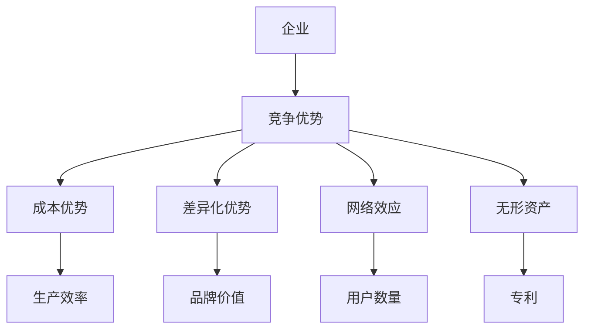
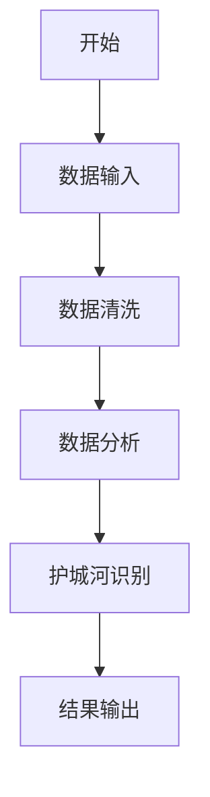
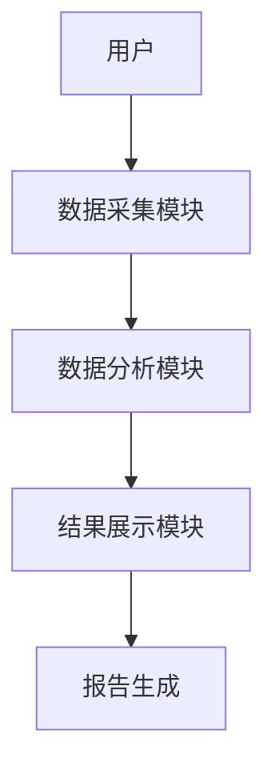

                 


# 巴菲特的护城河理论

## 关键词：护城河理论，巴菲特，投资策略，经济护城河，竞争优势

## 摘要：巴菲特的护城河理论是投资学中的经典理论，强调企业竞争优势的持久性和稳定性。本文详细分析了护城河理论的核心概念、不同类型、量化分析方法，并通过实际案例展示了如何在投资中应用这一理论。文章从理论背景、核心要素、算法原理、系统架构到项目实战，全面解析了护城河理论的深度和广度，为投资者提供了科学的分析框架和实用的指导。

---

# 第一部分：巴菲特的护城河理论概述

## 第1章：巴菲特的护城河理论背景

### 1.1 护城河理论的起源与核心概念

#### 1.1.1 护城河理论的起源

巴菲特的护城河理论起源于他对企业长期竞争优势的研究。他认为，企业能够在市场上长期获得超额利润，是因为它们拥有某种“护城河”，即竞争对手难以复制的核心优势。这种优势可以是成本优势、品牌影响力、技术专利，或是网络效应等。

#### 1.1.2 护城河理论的核心概念

护城河理论的核心在于识别企业是否具备持久的竞争优势。具体来说：

- **经济护城河**：企业通过某种机制（如成本优势、差异化、网络效应等）形成壁垒，阻止竞争对手进入市场或获取相同的利润水平。
- **竞争优势**：企业在市场上相对于竞争对手的显著优势，包括成本、质量、创新等方面。
- **市场地位**：企业在市场中的位置，通常表现为市场份额、品牌影响力和客户忠诚度等。

#### 1.1.3 护城河理论在投资中的应用

在投资实践中，护城河理论帮助投资者识别那些具备长期竞争优势的企业。通过分析企业的护城河，投资者可以更好地判断企业的长期盈利能力，从而做出更明智的投资决策。

---

## 第2章：护城河理论的核心要素

### 2.1 经济护城河的类型

#### 2.1.1 成本优势

成本优势是护城河的重要类型之一。企业通过规模化生产、技术革新或供应链优化等手段，降低生产成本，从而在价格上具有竞争力。例如，制造企业通过自动化生产降低成本，形成价格优势。

#### 2.1.2 差异化优势

差异化优势是指企业通过提供独特的產品或服务，区别于竞争对手。这种差异可以是功能、质量、品牌或用户体验等方面。例如，高端品牌通过独特的设计和优质的售后服务吸引消费者。

#### 2.1.3 网络效应

网络效应是指用户数量的增加会导致产品或服务的价值提升。例如，社交平台随着用户数量的增加，每个用户的价值也增加，从而形成正反馈循环，阻止新竞争者进入市场。

#### 2.1.4 无形资产

无形资产包括品牌价值、专利、商标、专有技术等。这些资产难以被竞争对手复制，为企业提供了长期的竞争优势。例如，可口可乐的品牌价值使其在饮料市场中占据重要地位。

---

### 2.2 护城河的边界与外延

#### 2.2.1 护城河的边界

护城河的边界是指企业竞争优势的范围。并非所有竞争优势都能构成护城河，只有那些能够长期抵御竞争对手侵蚀的优势才是有效的护城河。

#### 2.2.2 护城河的外延

护城河的外延是指企业竞争优势的延伸领域。例如，技术创新可以延伸到新产品开发，品牌优势可以延伸到市场推广等方面。

---

### 2.3 护城河的核心要素组成

#### 2.3.1 企业竞争优势

竞争优势是企业相对于竞争对手的独特优势，包括成本、质量、创新等方面。

#### 2.3.2 企业核心竞争力

核心竞争力是指企业能够在市场上持续获胜的关键能力，通常表现为技术创新、管理效率或品牌影响力等。

#### 2.3.3 企业市场地位

市场地位反映企业在市场中的影响力，通常表现为市场份额、品牌忠诚度和客户基础等方面。

---

## 第3章：护城河理论与投资策略

### 3.1 护城河理论在投资中的应用

#### 3.1.1 护城河理论与价值投资

价值投资强调寻找那些被市场低估的企业。护城河理论为价值投资提供了筛选标准，帮助投资者识别具备长期竞争优势的企业。

#### 3.1.2 护城河理论与成长投资

成长投资关注企业的成长潜力。护城河理论帮助投资者识别那些具备可持续竞争优势的企业，从而实现长期收益。

#### 3.1.3 护城河理论与风险投资

护城河理论帮助投资者评估企业的风险。具备强大护城河的企业通常具有较高的抗风险能力，能够在市场波动中保持稳定。

---

### 3.2 护城河的量化分析

#### 3.2.1 护城河的量化指标

- **市场份额**：企业占整个市场的比例，反映其市场影响力。
- **利润率**：企业的盈利能力，反映其成本控制和定价能力。
- **品牌忠诚度**：客户对品牌的偏好程度，反映品牌价值。

#### 3.2.2 护城河的财务指标分析

- **净利率**：净利润与营业收入的比率，反映企业的盈利能力。
- **资产周转率**：营业收入与总资产的比率，反映资产使用效率。
- **研发投入**：企业在研发上的投入，反映技术创新能力。

#### 3.2.3 护城河的市场表现分析

- **股价表现**：具备强大护城河的企业通常具有稳定的股价表现。
- **市盈率**：股价与每股收益的比率，反映市场对企业的估值。

---

## 第4章：护城河理论的核心概念与联系

### 4.1 护城河的核心概念原理

#### 4.1.1 护城河的定义与特征

护城河是指企业通过某种机制形成的竞争优势壁垒，具有持久性和不可复制性。

#### 4.1.2 护城河的形成机制

护城河的形成通常需要时间和资源的积累，例如技术研发、品牌建设或市场拓展。

#### 4.1.3 护城河的可持续性

具备强大护城河的企业通常能够长期保持竞争优势，从而实现持续的盈利能力。

---

### 4.2 护城河核心概念对比表格

| 护城河类型 | 定义 | 特征 | 示例 |
|------------|------|------|------|
| 成本优势   | 低成本生产 | 规模化、自动化 | 制造业企业 |
| 差异化优势 | 独特產品或服务 | 品质、品牌 | 消费品企业 |
| 网络效应   | 用户数量增加价值 | 网络平台 | 社交媒体 |
| 无形资产   | 品牌、专利等 | 无法复制 | 高端品牌 |

---

### 4.3 护城河的ER实体关系图



---

## 第5章：护城河理论的算法原理讲解

### 5.1 护城河分析的算法流程

#### 5.1.1 算法输入

- 企业数据：包括市场份额、利润率、研发投入等。
- 市场数据：包括行业趋势、竞争格局等。

#### 5.1.2 算法处理

1. 数据清洗：剔除异常值，确保数据准确性。
2. 数据分析：计算各项指标，评估企业的竞争优势。
3. 护城河识别：根据指标结果，判断企业是否具备护城河。

#### 5.1.3 算法输出

- 护城河类型：成本优势、差异化优势等。
- 护城河深度：量化评估护城河的强弱。

---

### 5.2 护城河分析的Mermaid流程图



---

## 第6章：护城河理论的系统分析与架构设计

### 6.1 护城河理论的系统架构

#### 6.1.1 系统功能设计

- 数据采集：收集企业数据和市场数据。
- 数据分析：计算各项指标，评估竞争优势。
- 结果展示：生成报告，展示护城河分析结果。

#### 6.1.2 系统架构设计



---

## 第7章：护城河理论的项目实战

### 7.1 项目介绍

以某企业为例，分析其护城河情况。

### 7.2 核心实现

#### 7.2.1 环境安装

安装数据分析工具，例如Python、Pandas、Matplotlib。

#### 7.2.2 核心代码实现

```python
import pandas as pd
import matplotlib.pyplot as plt

# 数据加载
data = pd.read_csv('企业数据.csv')

# 数据清洗
data.dropna()

# 数据分析
market_share = data['市场份额'].mean()
profitability = data['利润率'].mean()

# 结果展示
print(f"平均市场份额：{market_share}%")
print(f"平均利润率：{profitability}%")

# 可视化
plt.bar(['市场份额', '利润率'], [market_share, profitability])
plt.show()
```

---

## 第8章：总结与展望

### 8.1 总结

巴菲特的护城河理论为投资者提供了识别具备长期竞争优势的企业的方法。通过分析企业的护城河，投资者可以更好地做出投资决策。

### 8.2 展望

未来，随着市场环境的变化，护城河理论将不断发展和完善。投资者需要结合新的市场趋势，灵活应用护城河理论，以实现更好的投资收益。

---

## 作者：AI天才研究院/AI Genius Institute & 禅与计算机程序设计艺术/Zen And The Art of Computer Programming

---

**参考文献**：
- 巴菲特的护城河理论相关书籍和论文。
- 相关投资策略和经济理论的研究资料。

