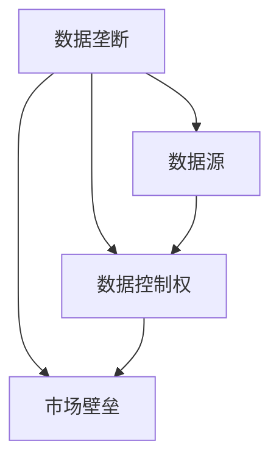

                 


# 巴菲特的护城河理论4.0：数据垄断与隐私保护的平衡

> 关键词：护城河理论，数据垄断，隐私保护，数据隐私权，企业竞争优势

> 摘要：本文探讨巴菲特护城河理论的4.0版本，重点分析数据垄断与隐私保护之间的平衡。通过详细分析数据垄断的核心要素、隐私保护的法律框架与技术实现，结合算法原理、系统架构和实际案例，阐述如何在数据驱动的经济中构建可持续的竞争优势。

---

## 第一部分: 巴菲特护城河理论的演变与数据垄断的崛起

### 第1章: 巴菲特护城河理论的起源与演变

#### 1.1 护城河理论的起源

护城河理论由巴菲特提出，最初用于识别具有长期竞争优势的企业。其核心在于识别那些能够抵御市场竞争的企业特征。随着技术的发展，护城河理论经历了多次演变。

- **1.1.1 护城河理论的提出背景**
  巴菲特在20世纪提出的护城河理论，主要基于企业的竞争优势，如品牌、成本优势、网络效应等。这些因素帮助企业构建长期的市场壁垒。

- **1.1.2 护城河理论的核心概念**
  护城河理论强调企业应具备某种独特的竞争优势，使其能够在长期内保持高于平均水平的利润率。这种竞争优势可以是资源、技术、品牌或市场准入等。

- **1.1.3 护城河理论的商业价值**
  通过识别具有强大护城河的企业，投资者可以找到那些能够在竞争中长期生存并创造超额收益的企业。

#### 1.2 护城河理论的演变历程

- **1.2.1 1.0版本：竞争优势的初步定义**
  护城河理论的1.0版本主要关注企业的竞争优势，如成本优势和品牌忠诚度。

- **1.2.2 2.0版本：竞争优势的深化**
  在2.0版本中，护城河理论扩展到更广泛的竞争优势，包括技术壁垒、知识产权和市场准入。

- **1.2.3 3.0版本：数据驱动的竞争优势**
  随着大数据时代的到来，护城河理论的3.0版本将数据视为企业的重要资产。企业通过数据收集、分析和应用，构建数据驱动的竞争优势。

- **1.2.4 4.0版本：数据垄断与隐私保护的平衡**
  在4.0版本中，护城河理论进一步扩展到数据垄断与隐私保护的平衡。企业需要在数据垄断带来的竞争优势与用户隐私保护之间找到平衡点。

### 第2章: 数据垄断的定义与特征

#### 2.1 数据垄断的核心概念

- **2.1.1 数据垄断的定义**
  数据垄断是指企业在市场中对特定数据的独占性控制，这种控制使得其他企业难以获取或利用这些数据。

- **2.1.2 数据垄断的形成机制**
  数据垄断的形成通常基于企业对数据的独占性收集、分析和应用能力。例如，社交平台通过用户数据构建网络效应，形成数据垄断。

- **2.1.3 数据垄断的经济影响**
  数据垄断可以带来竞争优势，但也可能导致市场垄断和消费者隐私问题。企业需要在数据垄断与隐私保护之间找到平衡。

#### 2.2 数据垄断与隐私保护的关系

- **2.2.1 数据垄断对隐私的影响**
  数据垄断可能导致企业对用户数据的过度收集和利用，威胁用户隐私。

- **2.2.2 隐私保护对数据垄断的制约**
  隐私保护法规（如GDPR）限制了企业对数据的收集和使用，从而影响数据垄断的形成。

- **2.2.3 数据垄断与隐私保护的平衡点**
  企业需要在数据垄断带来的竞争优势和用户隐私保护之间找到平衡点，通过合法合规的数据利用和隐私保护措施，构建可持续的竞争优势。

---

## 第二部分: 数据垄断与隐私保护的核心概念

### 第3章: 数据垄断的核心要素与分析框架

#### 3.1 数据垄断的实体关系图



数据垄断涉及数据源、数据控制权和市场壁垒三个核心要素。数据源是数据垄断的基础，数据控制权是数据垄断的关键，市场壁垒是数据垄断的外在表现。

#### 3.2 数据垄断与隐私保护的对比分析

| **属性**       | **数据垄断**                          | **隐私保护**                          |
|-----------------|--------------------------------------|--------------------------------------|
| **定义**       | 数据的独占性控制                     | 数据的合法使用和保护                  |
| **目标**       | 构建市场竞争优势                     | 保护用户隐私                          |
| **手段**       | 数据收集、分析和应用                 | 数据加密、匿名化和访问控制            |
| **影响**       | 提高企业竞争力                        | 保护用户隐私，防止数据滥用            |
| **挑战**       | 可能威胁用户隐私                     | 需要企业合规和技术创新                |

### 第4章: 隐私保护的法律框架与技术实现

#### 4.1 隐私保护的法律框架

- **4.1.1 数据保护相关法律法规**
  全球范围内，隐私保护法规如《通用数据保护条例》（GDPR）和《加州消费者隐私法》（CCPA）对企业数据处理提出严格要求。

- **4.1.2 数据隐私的国际标准**
  国际标准化组织（ISO）制定了一系列数据隐私标准，为企业提供合规指导。

- **4.1.3 数据隐私的合规要求**
  企业需要遵守数据隐私法规，确保数据处理的合法性、透明性和安全性。

#### 4.2 隐私保护的技术实现

- **4.2.1 数据加密技术**
  数据加密是保护隐私的重要手段。通过加密技术，企业可以确保数据在传输和存储过程中的安全性。

  ```python
  import cryptography
  key = cryptography.utils.rand_prime(1024)
  encrypted_data = cryptography.encode(data, key)
  ```

- **4.2.2 数据匿名化处理**
  数据匿名化是通过技术手段去除数据中的个人身份信息，降低隐私泄露风险。

  ```python
  def anonymize_data(data):
      # 去除敏感字段
      anonymized = data.drop(['name', 'email'], axis=1)
      return anonymized
  ```

- **4.2.3 数据访问控制**
  通过访问控制策略，限制数据的访问权限，确保只有授权人员可以访问敏感数据。

---

## 第三部分: 数据垄断与隐私保护的算法原理

### 第5章: 数据处理与隐私保护的算法原理

#### 5.1 数据加密算法

- **5.1.1 加密算法的分类**
  数据加密算法主要分为对称加密和非对称加密。对称加密速度快，适用于大量数据加密；非对称加密安全性高，适用于数字签名。

  ```mermaid
  graph TD
      A[明文] --> B[加密算法]
      B --> C[密文]
      C --> D[解密算法]
      D --> E[明文]
  ```

- **5.1.2 加密算法的数学模型**

  对称加密的数学模型可以表示为：
  $$ C = E(k, P) $$
  其中，$C$ 是密文，$P$ 是明文，$k$ 是密钥。

  非对称加密的数学模型可以表示为：
  $$ C = E/pub(k_p, P) $$
  $$ P = D/pri(k_p, C) $$

  其中，$k_p$ 是公钥，$k_p$ 是私钥。

#### 5.2 数据匿名化处理算法

- **5.2.1 数据匿名化的核心算法**
  数据匿名化通常采用数据扰动、数据替换和数据摘要等技术。例如，利用差分隐私技术对数据进行扰动处理，确保数据无法被逆向还原。

  ```python
  import dp
  def differential_privacy(data, epsilon=1):
      return dp.add_noise(data, epsilon)
  ```

- **5.2.2 数据匿名化的应用场景**
  数据匿名化适用于需要公开数据的场景，如学术研究和数据分析。通过匿名化处理，可以在保护隐私的前提下进行数据共享。

---

## 第四部分: 数据垄断与隐私保护的系统架构

### 第6章: 数据垄断与隐私保护的系统架构

#### 6.1 系统功能设计

- **6.1.1 领域模型设计**
  领域模型描述了系统的核心实体及其关系。例如，用户、数据、权限和日志等。

  ```mermaid
  classDiagram
      class 用户 {
          用户ID
          用户名
          密码
      }
      class 数据 {
          数据ID
          数据内容
          数据类型
      }
      class 权限 {
          权限ID
          权限名称
      }
      class 日志 {
          日志ID
          操作时间
          操作类型
      }
      用户 --> 数据
      用户 --> 权限
      数据 --> 日志
  ```

- **6.1.2 系统架构设计**
  系统架构采用分层设计，包括数据层、业务逻辑层和表现层。数据层负责数据的存储和管理，业务逻辑层负责数据处理和权限控制，表现层负责用户交互。

  ```mermaid
  graph TD
      A[数据层] --> B[业务逻辑层]
      B --> C[表现层]
  ```

- **6.1.3 系统接口设计**
  系统接口包括数据采集、数据处理和数据访问控制。通过API实现数据的采集、分析和共享。

  ```python
  from flask import Flask
  app = Flask(__name__)
  
  @app.route('/api/data', methods=['GET'])
  def get_data():
      return {'status': 'success', 'data': [...]}
  ```

- **6.1.4 系统交互流程图**
  系统交互流程图描述了用户与系统之间的交互流程，包括登录、数据请求和数据返回。

  ```mermaid
  sequenceDiagram
      user ->> server: 请求数据
      server ->> database: 查询数据
      database ->> server: 返回数据
      server ->> user: 响应数据
  ```

---

## 第五部分: 数据垄断与隐私保护的项目实战

### 第7章: 数据垄断与隐私保护的项目实战

#### 7.1 项目背景

- **项目介绍**
  本项目旨在通过构建数据垄断与隐私保护的系统，展示如何在实际应用中平衡数据垄断与隐私保护。

- **项目目标**
  通过实际案例分析，展示数据垄断与隐私保护的实现方法。

#### 7.2 项目环境安装

- **环境要求**
  需要安装Python、Flask框架和相关数据处理库。

  ```bash
  pip install flask
  pip install pandas
  pip install cryptography
  ```

#### 7.3 系统核心实现源代码

- **数据采集模块**
  ```python
  import requests
  def collect_data(url):
      response = requests.get(url)
      return response.json()
  ```

- **数据处理模块**
  ```python
  import pandas as pd
  def process_data(data):
      df = pd.DataFrame(data)
      return df
  ```

- **数据加密模块**
  ```python
  import cryptography
  def encrypt_data(data, key):
      return cryptography.encode(data, key)
  ```

#### 7.4 项目小结

通过实际项目的实现，我们可以看到数据垄断与隐私保护的实现过程。企业需要在数据处理的每个环节中，考虑隐私保护的要求，确保数据的安全性和合规性。

---

## 第六部分: 数据垄断与隐私保护的最佳实践

### 第8章: 数据垄断与隐私保护的最佳实践

#### 8.1 小结

数据垄断与隐私保护的平衡是企业在数据驱动时代必须面对的挑战。企业需要通过技术创新和合规管理，构建可持续的竞争优势。

#### 8.2 注意事项

- 数据垄断不应以牺牲用户隐私为代价。
- 隐私保护需要在数据处理的每个环节中得到体现。
- 企业应积极参与数据隐私相关的法律法规和行业标准的制定。

#### 8.3 拓展阅读

- 《数据隐私与保护》
- 《数据垄断与企业竞争》
- 《隐私保护的技术与实践》

---

## 作者

作者：AI天才研究院/AI Genius Institute & 禅与计算机程序设计艺术 /Zen And The Art of Computer Programming

