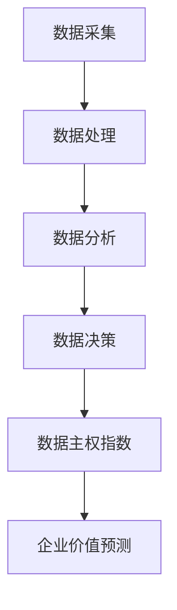
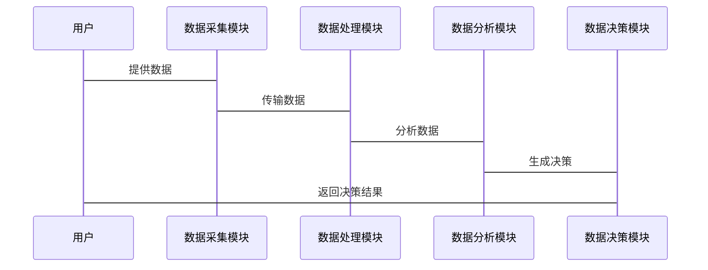

                 


# 巴菲特的护城河理论5.0：数据主权时代的竞争优势

## 关键词：  
巴菲特、护城河理论、数据主权、竞争优势、企业治理、人工智能、数字化转型

## 摘要：  
在数字化转型和人工智能快速发展的背景下，传统的护城河理论面临新的挑战和机遇。本文基于巴菲特的经典护城河理论，结合数据主权的核心概念，提出护城河理论5.0版本，重点分析数据主权时代的企业竞争优势。通过构建数据主权驱动的护城河模型，探讨企业在数据驱动决策、技术创新和生态系统构建等方面的优势，并结合实际案例，为企业制定数据主权战略提供指导。

---

# 第1章: 巴菲特护城河理论的背景与核心概念

## 1.1 护城河理论的起源与演变  
### 1.1.1 护城河理论的起源  
护城河理论由巴菲特提出，核心思想是企业通过构建独特的竞争优势（如成本优势、网络效应等），防止竞争对手侵蚀其市场份额。这些竞争优势就像中世纪城堡的护城河，为企业提供长期的防御能力。

### 1.1.2 护城河理论的演变历程  
1. **1.0版本**：基于财务指标和成本优势。  
2. **2.0版本**：引入网络效应和品牌忠诚度。  
3. **3.0版本**：加入技术创新和知识产权。  
4. **4.0版本**：数据驱动的决策优势逐渐崛起。  
5. **5.0版本**：数据主权成为核心竞争优势。  

### 1.1.3 护城河理论的核心思想  
- 企业竞争优势是动态变化的。  
- 护城河的核心是不可复制的资源和能力。  
- 数据主权是未来竞争优势的关键。

---

## 1.2 数据主权时代的竞争优势  
### 1.2.1 数据主权的定义与内涵  
数据主权是指企业在数据的生成、存储、处理和使用过程中，对数据的控制权和使用权的合法权利。它包括数据的法律主权、技术主权和生态主权。

### 1.2.2 数据主权与企业竞争优势的关系  
- 数据主权是企业构建护城河的核心资源。  
- 数据驱动的决策优势让企业能够在竞争中占据先机。  
- 数据主权的生态系统让企业能够形成协同效应。

### 1.2.3 护城河理论5.0的核心特征  
- 数据主权是护城河的核心要素。  
- 数据驱动的决策能力成为竞争优势的关键。  
- 技术创新与数据主权的结合是未来发展的方向。

---

## 1.3 本章小结  
本章介绍了护城河理论的起源与演变，并重点分析了数据主权时代的企业竞争优势。数据主权不仅是企业护城河的核心要素，也是未来竞争优势的关键。

---

# 第2章: 护城河理论5.0的核心要素  

## 2.1 数据主权的法律与伦理框架  
### 2.1.1 数据主权的法律基础  
- 数据主权的法律定义。  
- 数据主权与国际法律的冲突与协调。  

### 2.1.2 数据主权的伦理挑战  
- 数据使用的道德问题。  
- 数据隐私与企业责任。  

### 2.1.3 数据主权与企业治理的关系  
- 数据主权对企业发展战略的影响。  
- 数据主权与企业治理模式的结合。  

---

## 2.2 数据驱动的竞争优势  
### 2.2.1 数据作为核心资产  
- 数据的资产化管理。  
- 数据的价值评估。  

### 2.2.2 数据驱动的决策优势  
- 数据驱动的决策模型。  
- 数据驱动的预测能力。  

### 2.2.3 数据生态系统的构建  
- 数据生态系统的构建原则。  
- 数据生态系统的优势。  

---

## 2.3 技术创新与护城河的构建  
### 2.3.1 技术创新对企业护城河的影响  
- 技术创新对数据主权的促进作用。  
- 技术创新对企业竞争优势的提升作用。  

### 2.3.2 人工智能与数据主权的结合  
- 人工智能在数据主权中的应用。  
- 人工智能对护城河构建的推动作用。  

### 2.3.3 数字化转型中的护城河策略  
- 数字化转型的核心策略。  
- 数字化转型中的护城河构建方法。  

---

## 2.4 本章小结  
本章分析了护城河理论5.0的核心要素，包括数据主权的法律与伦理框架、数据驱动的竞争优势以及技术创新与护城河的构建。这些要素共同构成了数据主权时代的企业竞争优势。

---

# 第3章: 护城河理论5.0的分析框架  

## 3.1 数据主权与企业竞争力的评估模型  
### 3.1.1 评估模型的构建  
- 数据主权评估模型的构建逻辑。  
- 数据主权与企业竞争力的关系。  

### 3.1.2 评估模型的指标体系  
- 数据主权的核心指标。  
- 企业竞争力的评估指标。  

### 3.1.3 评估模型的实施步骤  
- 数据收集与处理。  
- 数据分析与评估。  
- 结果解读与优化。  

---

## 3.2 数据主权与企业护城河的关系  
### 3.2.1 数据主权对企业护城河的影响  
- 数据主权对护城河稳定性的保障。  
- 数据主权对护城河扩展能力的提升。  

### 3.2.2 护城河的动态演化  
- 护城河的动态性分析。  
- 护城河的演化路径。  

### 3.2.3 数据主权与企业长期价值的关系  
- 数据主权对长期价值的影响。  
- 长期价值的实现路径。  

---

## 3.3 本章小结  
本章构建了数据主权与企业竞争力的评估模型，并分析了数据主权与企业护城河的关系。通过动态演化和长期价值的视角，进一步明确了数据主权在护城河构建中的作用。

---

# 第4章: 护城河理论5.0的算法与数学模型  

## 4.1 数据主权评估的数学模型  
### 4.1.1 数据主权评估的公式推导  
- 数据主权指数的计算公式：  
$$ S = \frac{\sum_{i=1}^{n} w_i x_i}{\sum_{i=1}^{n} w_i} $$  
其中，\( w_i \) 是第 \( i \) 个指标的权重，\( x_i \) 是第 \( i \) 个指标的得分。

### 4.1.2 数据主权指数的计算方法  
- 数据主权指数的计算步骤。  
- 数据主权指数的验证与优化。  

### 4.1.3 数据主权与企业价值的数学关系  
- 数据主权与企业价值的函数关系：  
$$ V = aS + b $$  
其中，\( V \) 是企业价值，\( S \) 是数据主权指数，\( a \) 和 \( b \) 是常数。  

---

## 4.2 护城河强度的算法实现  
### 4.2.1 护城河强度的算法流程  
1. 数据收集与预处理。  
2. 指标权重的确定。  
3. 数据主权指数的计算。  
4. 企业价值的预测与分析。  

### 4.2.2 护城河强度的计算代码  
```python
def calculate_shielding_strength(data, weights):
    # 计算数据主权指数
    numerator = sum(w * d for w, d in zip(weights, data))
    denominator = sum(weights)
    shielding_strength = numerator / denominator
    return shielding_strength

# 示例数据和权重
data = [0.8, 0.6, 0.7]
weights = [0.3, 0.4, 0.3]
result = calculate_shielding_strength(data, weights)
print(f"数据主权指数为: {result}")
```

### 4.2.3 护城河强度的可视化展示  
- 使用 matplotlib 绘制数据主权指数的变化趋势图。  
- 使用 seaborn 进行数据分布的可视化分析。  

---

## 4.3 本章小结  
本章通过数学模型和算法实现，详细分析了数据主权与企业价值的关系。通过公式推导和代码实现，进一步验证了护城河理论5.0的科学性和实用性。

---

# 第5章: 护城河理论5.0的系统架构设计  

## 5.1 数据主权驱动的系统架构  
### 5.1.1 系统架构的总体设计  
- 数据主权驱动的系统架构图（使用 mermaid 绘制）。  

### 5.1.2 数据主权的系统模块划分  
- 数据采集模块。  
- 数据处理模块。  
- 数据分析模块。  
- 数据决策模块。  

---

## 5.2 数据主权驱动的系统架构图  


---

## 5.3 系统接口设计  
### 5.3.1 数据接口的设计  
- 数据接口的定义。  
- 数据接口的实现。  

### 5.3.2 数据决策接口的设计  
- 数据决策接口的功能。  
- 数据决策接口的实现。  

---

## 5.4 系统交互序列图  


---

## 5.5 本章小结  
本章通过系统架构设计和接口设计，详细展示了数据主权驱动的护城河理论5.0在系统中的实现。通过 mermaid 图表和代码示例，进一步明确了系统的实现路径。

---

# 第6章: 护城河理论5.0的项目实战  

## 6.1 项目背景与目标  
### 6.1.1 项目背景  
- 数据主权的重要性。  
- 项目的目标。  

### 6.1.2 项目目标  
- 构建数据主权驱动的护城河模型。  
- 实现数据主权指数的计算与分析。  

---

## 6.2 项目实施步骤  
### 6.2.1 环境安装  
- 安装必要的开发工具。  
- 安装 Python 和相关库（如 pandas、numpy、matplotlib）。  

### 6.2.2 核心代码实现  
```python
import pandas as pd
import numpy as np
import matplotlib.pyplot as plt

# 示例数据
data = pd.DataFrame({
    '指标1': [0.8, 0.6, 0.7],
    '指标2': [0.6, 0.7, 0.8],
    '指标3': [0.7, 0.8, 0.6]
})

# 权重
weights = [0.3, 0.4, 0.3]

# 计算数据主权指数
def calculate_index(data, weights):
    return sum(w * d for w, d in zip(weights, data)) / sum(weights)

# 计算结果
result = calculate_index(data.iloc[0], weights)
print(f"数据主权指数为: {result}")

# 可视化
data.plot(kind='bar')
plt.title('数据指标对比')
plt.show()
```

### 6.2.3 代码应用解读与分析  
- 代码功能的解读。  
- 代码运行结果的分析。  

---

## 6.3 实际案例分析  
### 6.3.1 案例背景  
- 某企业的数据主权现状。  

### 6.3.2 数据分析与结果  
- 数据主权指数的计算与分析。  
- 企业价值的预测与优化。  

---

## 6.4 本章小结  
本章通过项目实战，详细展示了护城河理论5.0在实际中的应用。通过环境安装、代码实现和案例分析，进一步验证了理论的可行性和实用性。

---

# 第7章: 护城河理论5.0的总结与展望  

## 7.1 本章总结  
- 护城河理论5.0的核心思想。  
- 数据主权在护城河构建中的作用。  

## 7.2 数据主权时代的挑战与机遇  
- 数据主权面临的挑战。  
- 数据主权带来的机遇。  

## 7.3 未来研究方向  
- 数据主权的进一步研究。  
- 护城河理论的持续优化。  

---

## 7.4 最佳实践 tips  
- 数据主权是企业竞争优势的关键。  
- 数据驱动的决策能力是未来的核心竞争力。  
- 技术创新与数据主权的结合是未来发展的重要方向。

---

## 7.5 本章小结  
本章总结了护城河理论5.0的核心思想，并展望了数据主权时代的挑战与机遇。通过最佳实践 tips，为企业的数据主权战略提供了指导。

---

# 作者：AI天才研究院 & 禅与计算机程序设计艺术

---

通过以上目录和内容，我们可以看到，护城河理论5.0在数据主权时代的竞争优势中，数据主权是核心要素。企业需要通过数据驱动的决策、技术创新和生态系统构建，构建强大的护城河，以应对未来的挑战和机遇。

