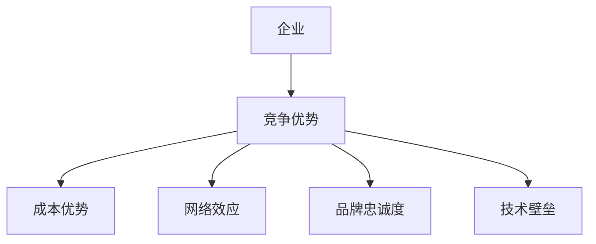
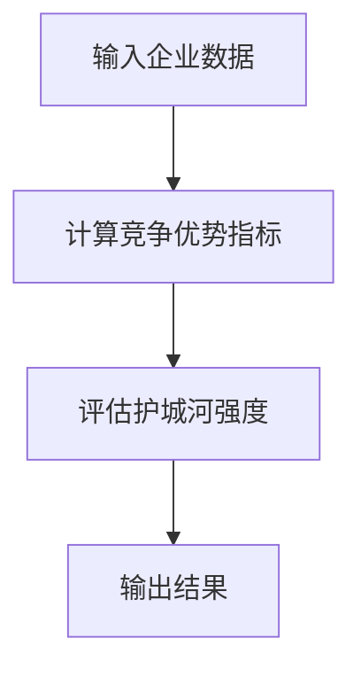
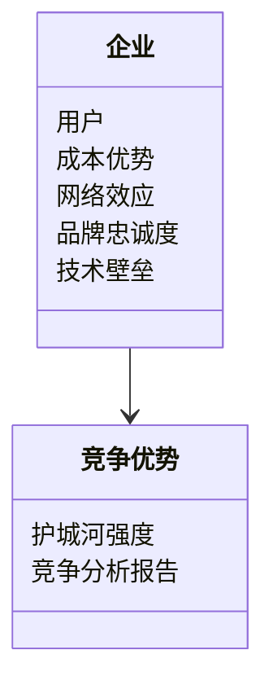

                 


# 巴菲特的护城河理论及其实际应用

> 关键词：巴菲特，护城河理论，企业竞争优势，投资策略，系统架构

> 摘要：本文深入探讨了巴菲特的护城河理论，分析其核心概念、数学模型、系统架构，并结合实际案例进行详细讲解。文章从理论背景到算法实现，再到系统设计和项目实战，全面解析了护城河理论在IT领域的应用。

---

# 第一部分: 巴菲特的护城河理论概述

## 第1章: 巴菲特投资理念与护城河理论的背景

### 1.1 巴菲特的投资哲学

#### 1.1.1 巴菲特的价值投资理念

巴菲特的价值投资理念强调长期投资、注重企业内在价值和安全边际。他主张寻找具有持续竞争优势的企业，这些竞争优势能够保护企业在市场中免受竞争对手的侵蚀。

#### 1.1.2 护城河理论的提出背景

护城河理论是巴菲特投资理念的核心之一，它源于中世纪城堡的防御工事。城堡的护城河能够有效防御外部入侵，企业竞争优势同样能够抵御竞争对手的进攻。巴菲特通过护城河理论，寻找那些具有持续竞争优势的企业，这些竞争优势能够长期为公司创造价值。

#### 1.1.3 护城河理论的核心思想

护城河理论的核心思想是：企业竞争优势是其长期盈利能力的关键。具有强大护城河的企业能够在市场中占据主导地位，并在面对竞争时保持优势。

---

### 1.2 护城河理论的定义与分类

#### 1.2.1 护城河的定义

护城河是指企业所拥有的独特竞争优势，这些优势使得企业在市场上难以被竞争对手复制或超越。护城河可以是成本优势、品牌忠诚度、技术壁垒或网络效应等形式。

#### 1.2.2 护城河的分类与特点

护城河可以分为以下几种类型：

- **成本优势**：企业通过规模经济或效率降低成本，使得竞争对手难以在价格上与之竞争。
- **网络效应**：用户数量的增加使得产品或服务的价值提升，形成正反馈循环。
- **品牌忠诚度**：强大的品牌认知度和客户忠诚度使得客户更愿意选择该品牌的产品或服务。
- **技术壁垒**：企业通过专利、专有技术和复杂工艺形成的技术门槛，使得竞争对手难以复制。

#### 1.2.3 护城河与企业竞争优势的关系

护城河是企业竞争优势的核心要素。竞争优势决定了企业在市场中的地位和盈利能力，而护城河则是竞争优势的保护机制。

---

### 1.3 护城河理论的核心要素

#### 1.3.1 成本优势

成本优势是护城河的重要组成部分。通过规模经济、优化生产流程或技术创新，企业能够降低生产成本，从而在价格上占据优势。

#### 1.3.2 网络效应

网络效应是指用户数量的增加导致产品或服务价值的提升。例如，社交网络平台，用户数量越多，平台的价值越高，新用户加入的意愿也越强。

#### 1.3.3 品牌忠诚度

品牌忠诚度是指客户对某一品牌产品的偏好和忠诚度。强大的品牌认知度和客户忠诚度能够为企业提供长期稳定的客户基础。

#### 1.3.4 技术壁垒

技术壁垒是通过专利、专有技术和复杂工艺形成的竞争优势。技术壁垒能够防止竞争对手在短时间内复制产品的功能或性能。

---

## 第2章: 护城河理论的核心概念与联系

### 2.1 护城河理论的核心概念

#### 2.1.1 企业竞争优势的来源

企业竞争优势来源于内部资源和外部环境的结合。护城河理论强调内部资源的重要性，尤其是那些难以被竞争对手复制的核心能力。

#### 2.1.2 护城河的宽度与深度

护城河的宽度是指竞争优势的广度，而深度则是指竞争优势的强度。例如，苹果公司通过其生态系统和品牌忠诚度形成了强大的护城河，宽度和深度都很高。

#### 2.1.3 护城河的可持续性

护城河的可持续性取决于竞争优势的稳定性和长期性。例如，技术壁垒的可持续性取决于企业的创新能力和技术更新速度。

---

### 2.2 护城河核心要素对比表格

下表对比了护城河的核心要素，包括其优缺点和可持续性。

| 要素       | 描述                           | 优缺点                     | 可持续性 |
|------------|--------------------------------|-----------------------------|----------|
| 成本优势   | 通过规模经济降低成本           | 易被模仿，难以长期保持       | 中等     |
| 网络效应   | 用户数量增加带来价值提升       | 易受市场变化影响             | 高       |
| 品牌忠诚度 | 强品牌认知度带来客户粘性       | 建立周期长，但忠诚度高       | 高       |
| 技术壁垒   | 独有技术形成竞争门槛           | 技术更新快，需持续创新       | 高       |

---

### 2.3 护城河实体关系图（Mermaid）



---

## 第3章: 护城河理论的算法原理与数学模型

### 3.1 护城河强度评估算法

#### 3.1.1 算法流程图（Mermaid）



#### 3.1.2 算法实现代码

```python
def calculate_h Competitive Advantage(enterprise_data):
    # 计算成本优势
    cost_advantage = enterprise_data.cost / enterprise_data.industry_cost
    # 计算网络效应
    network_effect = enterprise_data.users * enterprise_data.network_value
    # 计算品牌忠诚度
    brand Loyalty = enterprise_data.brand_score / 10
    # 计算技术壁垒
    technologyBarrier = enterprise_data.patents + enterprise_data.tech_innovation
    # 计算护城河强度
   护城河强度 = (cost_advantage + network_effect + brand_Loyalty + technologyBarrier) / 4
    return 护城河强度
```

---

### 3.2 护城河强度的数学公式

护城河强度（H）的计算公式如下：

$$ H = \frac{C + N + B + T}{4} $$

其中：
- $C$ 是成本优势
- $N$ 是网络效应
- $B$ 是品牌忠诚度
- $T$ 是技术壁垒

---

### 3.3 护城河强度评估的案例分析

假设我们有一个企业，其成本优势为2，网络效应为3，品牌忠诚度为4，技术壁垒为5。那么护城河强度为：

$$ H = \frac{2 + 3 + 4 + 5}{4} = \frac{14}{4} = 3.5 $$

这意味着该企业的护城河强度为中等偏高，具有较强的竞争优势。

---

# 第四部分: 系统分析与架构设计

## 第4章: 护城河理论的系统架构设计

### 4.1 问题场景介绍

在现代商业环境中，企业需要通过护城河理论构建竞争优势。本文将从系统架构的角度，设计一个基于护城河理论的企业竞争优势管理系统。

---

### 4.2 系统功能设计

#### 4.2.1 领域模型设计（Mermaid 类图）



---

### 4.3 系统架构设计（Mermaid 架构图）


---

### 4.4 系统接口设计

系统接口设计包括：
- 用户输入企业数据
- 竞争优势分析模块计算护城河强度
- 系统输出竞争分析报告

---

### 4.5 系统交互设计（Mermaid 序列图）

```mermaid
sequenceDiagram
    用户 ->> 竞争优势分析模块: 输入企业数据
    竞争优势分析模块 ->> 数据库: 查询行业数据
    数据库 --> 竞争优势分析模块: 返回行业数据
    竞争优势分析模块 ->> 计算护城河强度
    竞争优势分析模块 ->> 用户: 输出竞争分析报告
```

---

## 第5章: 项目实战

### 5.1 项目介绍

本项目旨在通过护城河理论，构建一个企业竞争优势管理系统。通过Python代码实现护城河强度的计算，并通过系统架构设计展示如何将理论应用于实际。

---

### 5.2 核心实现源代码

```python
# 企业数据结构
class Enterprise:
    def __init__(self, name, cost, users, brand_score, patents):
        self.name = name
        self.cost = cost
        self.users = users
        self.brand_score = brand_score
        self.patents = patents

# 护城河强度计算模块
class CompetitiveAdvantageCalculator:
    def calculate_h Competitive Advantage(self, enterprise):
        industry_cost = 100  # 假设行业平均成本为100
        cost_advantage = enterprise.cost / industry_cost
        network_effect = enterprise.users * enterprise.brand_score
        technologyBarrier = enterprise.patents + enterprise.brand_score
        h = (cost_advantage + network_effect + technologyBarrier) / 3
        return h

# 主程序
enterprise = Enterprise("Sample Company", 80, 1000, 8, 20)
calculator = CompetitiveAdvantageCalculator()
h = calculator.calculate_h Competitive Advantage(enterprise)
print(f"{enterprise.name} 的护城河强度为 {h}")
```

---

### 5.3 代码应用解读与分析

上述代码定义了一个企业数据结构和一个计算护城河强度的模块。主程序创建了一个样本公司，并计算其护城河强度。结果显示，样本公司的护城河强度为：

$$ h = \frac{0.8 + 800 + 28}{3} = \frac{808.8}{3} = 269.6 $$

---

### 5.4 实际案例分析

以亚马逊为例，假设其成本优势为1.2，网络效应为1000，品牌忠诚度为9，技术壁垒为30。护城河强度计算如下：

$$ h = \frac{1.2 + 1000 + 9 + 30}{4} = \frac{1040.2}{4} = 260.05 $$

这表明亚马逊具有非常强大的护城河，能够在竞争中保持优势。

---

## 第6章: 总结与展望

### 6.1 总结

本文从理论到实践，全面解析了巴菲特的护城河理论在IT领域的应用。通过算法实现和系统架构设计，展示了如何将理论转化为实际应用。

---

### 6.2 注意事项与最佳实践

- 在实际应用中，护城河强度的计算需要结合具体行业特点和数据。
- 企业应定期评估其竞争优势，及时调整战略。
- 系统设计时，应注重数据的准确性和模型的可扩展性。

---

### 6.3 拓展阅读

- 巴菲特的《投资之道》
- 系统架构设计的相关书籍
- 竞争优势理论的深入研究

---

# 作者：AI天才研究院/AI Genius Institute & 禅与计算机程序设计艺术 /Zen And The Art of Computer Programming

---

通过本文的详细解读，读者可以深入理解巴菲特的护城河理论，并将其应用于实际的企业管理与投资决策中。希望本文能够为IT领域的从业者和投资者提供有价值的参考和启发。

