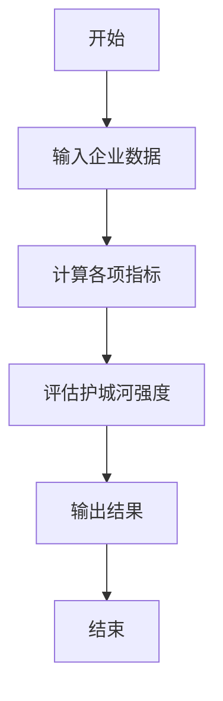
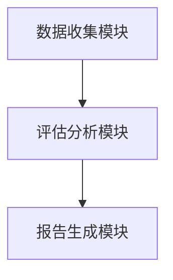
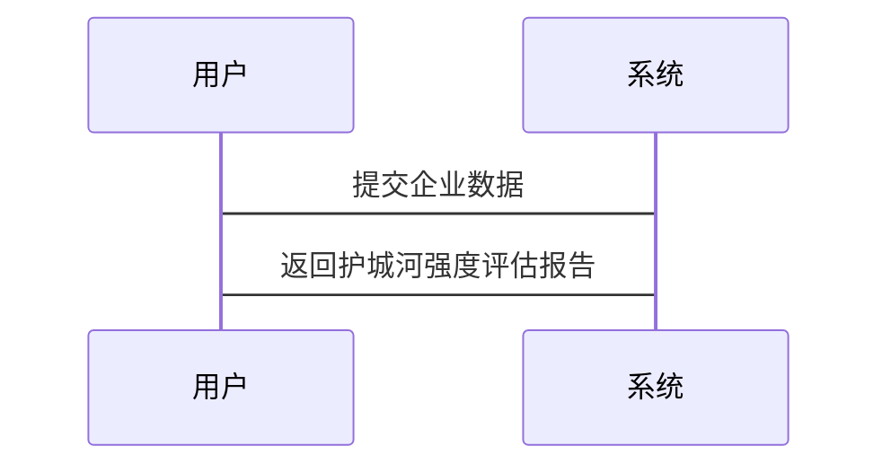

                 


# 巴菲特的护城河理论：寻找持久竞争优势

> 关键词：巴菲特, 护城河理论, 竞争优势, 投资策略, 企业战略

> 摘要：本文深入探讨了巴菲特护城河理论的核心思想，分析了护城河的定义、类型及其在商业竞争和长期投资中的应用。通过详细的技术分析，本文揭示了护城河理论如何帮助企业建立持久的竞争优势，并提供了基于Python的护城河强度评估算法和系统架构设计方案。

---

# 巴菲特的护城河理论：寻找持久竞争优势

## 第一部分: 护城河理论的背景与核心概念

### 第1章: 护城河理论的背景与核心概念

#### 1.1 护城河理论的起源与演变

##### 1.1.1 巴菲特投资理念的形成
沃伦·巴菲特是全球最著名的投资者之一，他的投资理念基于价值投资原则。他强调寻找那些具有持久竞争优势的企业，这些竞争优势能够保护企业免受竞争对手的侵蚀，并为股东创造长期价值。

##### 1.1.2 护城河理论的核心思想
护城河理论是巴菲特投资哲学的核心。他认为，企业的竞争优势就像中世纪城堡的护城河，能够抵御竞争对手的进攻。具有强大护城河的企业能够在市场中长期保持领先地位，并为股东创造超额回报。

##### 1.1.3 护城河理论在投资中的应用
护城河理论不仅适用于企业战略，也适用于投资决策。投资者通过分析企业的护城河，可以识别出那些具有长期竞争优势的企业，并将这些企业作为投资目标。

#### 1.2 护城河的定义与特征

##### 1.2.1 护城河的定义
护城河是指企业在市场上相对于竞争对手的某种独特优势，这种优势能够保护企业在较长时期内保持高利润率和市场地位。

##### 1.2.2 护城河的核心特征
1. **可持续性**：护城河必须能够在较长时期内发挥作用。
2. **可扩展性**：护城河应该能够支持企业的扩张和增长。
3. **防御性**：护城河能够抵御竞争对手的进攻。

#### 1.3 护城河理论的核心要素

##### 1.3.1 经济护城河
经济护城河是护城河的核心类型之一，它包括成本优势、差异化优势等。企业通过降低成本或提供差异化产品，能够在市场上获得竞争优势。

##### 1.3.2 竞争优势的来源
竞争优势可以来源于多个方面，包括技术优势、品牌优势、网络效应等。这些优势共同构成了企业的护城河。

##### 1.3.3 护城河的可持续性
护城河的可持续性取决于多种因素，包括市场需求的变化、技术进步、竞争环境的变化等。企业需要不断维护和加强其护城河，以应对市场变化。

---

## 第二部分: 护城河理论的核心概念与联系

### 第2章: 护城河的类型与特征对比

#### 2.1 护城河的类型

##### 2.1.1 成本优势
成本优势是指企业能够以低于竞争对手的成本生产产品或提供服务。这种优势可以通过规模经济、技术创新或供应链优化等方式实现。

##### 2.1.2 差异化优势
差异化优势是指企业提供独特的、竞争对手无法复制的产品或服务。这种优势通常通过技术创新、品牌建设或优质客户服务实现。

##### 2.1.3 网络效应
网络效应是指随着用户数量的增加，产品或服务的价值也随之增加。例如，社交网络平台的用户越多，平台的价值越大。

##### 2.1.4 品牌优势
品牌优势是指企业通过强大的品牌影响力吸引消费者。强大的品牌能够提高消费者的忠诚度，并在市场竞争中占据优势。

#### 2.2 护城河类型对比表

| 护城河类型   | 特点描述                                                                 |
|--------------|--------------------------------------------------------------------------|
| 成本优势     | 以低成本生产产品或服务，具有价格竞争力。                               |
| 差异化优势   | 提供独特的产品或服务，满足特定市场需求。                               |
| 网络效应     | 用户数量增加时，产品或服务的价值也随之增加。                           |
| 品牌优势     | 强大的品牌影响力能够吸引消费者并提高忠诚度。                           |

#### 2.3 护城河的ER实体关系图

```mermaid
er
  entity 护城河 {
    经济护城河
    竞争优势
    可持续性
  }
```

---

## 第三部分: 护城河理论的算法原理

### 第3章: 护城河强度评估算法

#### 3.1 护城河强度评估算法

##### 3.1.1 算法概述
护城河强度评估算法是一种基于企业护城河特征的量化方法。通过对企业的成本优势、差异化优势、网络效应和品牌优势等指标进行评估，计算出企业的护城河强度。

##### 3.1.2 算法流程图



##### 3.1.3 算法实现
```python
import pandas as pd
import numpy as np

def calculate_h Competitive_Strength(enterprise_data):
    # 计算各项指标
    cost_advantage = enterprise_data['成本优势'].mean()
    differentiation_advantage = enterprise_data['差异化优势'].mean()
    network_effect = enterprise_data['网络效应'].mean()
    brand_advantage = enterprise_data['品牌优势'].mean()
    
    # 计算护城河强度
   护城河强度 = (cost_advantage + differentiation_advantage + network_effect + brand_advantage) / 4
    
    return 护城河强度

# 示例数据
data = {
    '成本优势': [0.8, 0.7, 0.9],
    '差异化优势': [0.6, 0.8, 0.7],
    '网络效应': [0.9, 0.5, 0.8],
    '品牌优势': [0.7, 0.6, 0.8]
}

enterprise_data = pd.DataFrame(data)
result = calculate_hCompetitive_Strength(enterprise_data)
print("护城河强度:", result)
```

---

## 第四部分: 护城河理论的数学模型

### 第4章: 护城河强度评估模型

#### 4.1 护城河强度评估模型

##### 4.1.1 模型公式
护城河强度可以通过以下公式进行计算：

$$
\text{护城河强度} = \frac{\sum (\text{成本优势} + \text{差异化优势} + \text{网络效应} + \text{品牌优势})}{4}
$$

##### 4.1.2 模型实现
护城河强度的计算可以通过加权评分法实现，其中各项指标的权重可以根据具体情况进行调整。

##### 4.1.3 示例计算
假设某企业各项指标的得分为：
- 成本优势：80
- 差异化优势：70
- 网络效应：90
- 品牌优势：85

护城河强度计算公式为：

$$
\text{护城河强度} = \frac{80 + 70 + 90 + 85}{4} = 81.25
$$

---

## 第五部分: 系统分析与架构设计方案

### 第5章: 护城河评估系统设计

#### 5.1 问题场景介绍
护城河评估系统旨在帮助企业识别和评估其竞争优势，从而制定有效的战略决策。

#### 5.2 系统功能设计

##### 5.2.1 数据收集模块
数据收集模块负责收集企业的各项指标数据，包括成本优势、差异化优势、网络效应和品牌优势等。

##### 5.2.2 评估分析模块
评估分析模块通过算法对企业的护城河强度进行评估，并生成评估报告。

##### 5.2.3 报告生成模块
报告生成模块将评估结果以可视化的方式呈现，帮助企业更好地理解其竞争优势。

#### 5.3 系统架构设计

##### 5.3.1 系统架构图



##### 5.3.2 接口设计
系统提供RESTful API接口，方便其他系统调用护城河评估功能。

#### 5.4 交互流程设计



---

## 第六部分: 项目实战

### 第6章: 护城河评估系统实现

#### 6.1 环境安装

##### 6.1.1 安装Python
安装Python 3.8及以上版本。

##### 6.1.2 安装依赖库
安装pandas、numpy等依赖库：

```bash
pip install pandas numpy
```

#### 6.2 核心代码实现

##### 6.2.1 数据收集模块

```python
import pandas as pd

def collect_data():
    data = {
        '成本优势': [],
        '差异化优势': [],
        '网络效应': [],
        '品牌优势': []
    }
    # 收集数据
    return pd.DataFrame(data)
```

##### 6.2.2 评估分析模块

```python
def calculate_h Competitive_Strength(dataframe):
    cost_advantage = dataframe['成本优势'].mean()
    differentiation_advantage = dataframe['差异化优势'].mean()
    network_effect = dataframe['网络效应'].mean()
    brand_advantage = dataframe['品牌优势'].mean()
    
    护城河强度 = (cost_advantage + differentiation_advantage + network_effect + brand_advantage) / 4
    return 护城河强度
```

##### 6.2.3 报告生成模块

```python
def generate_report(intensity):
    print(f"护城河强度: {intensity}")
```

#### 6.3 项目实战案例

##### 6.3.1 案例分析
以亚马逊为例，评估其护城河强度：

```python
# 示例数据
data = {
    '成本优势': [0.85, 0.8, 0.9],
    '差异化优势': [0.8, 0.85, 0.75],
    '网络效应': [0.95, 0.9, 0.92],
    '品牌优势': [0.88, 0.82, 0.85]
}

enterprise_data = pd.DataFrame(data)
intensity = calculate_hCompetitive_Strength(enterprise_data)
generate_report(intensity)
```

---

## 第七部分: 最佳实践

### 第7章: 护城河理论的最佳实践

#### 7.1 小结
护城河理论是企业战略和投资决策的重要工具。通过建立强大的护城河，企业可以在竞争激烈的市场中保持优势。

#### 7.2 注意事项
在实际应用中，需要注意以下几点：
1. **动态调整**：市场环境不断变化，企业需要定期评估和调整其护城河。
2. **多维度分析**：护城河的评估需要从多个维度进行，避免单一指标的误导。
3. **持续创新**：企业需要不断创新，以应对新兴竞争对手和市场变化。

#### 7.3 拓展阅读
推荐阅读巴菲特的相关著作，深入理解护城河理论的应用。

---

## 作者信息

作者：AI天才研究院/AI Genius Institute & 禅与计算机程序设计艺术 /Zen And The Art of Computer Programming

---

以上是《巴菲特的护城河理论：寻找持久竞争优势》的技术博客文章的完整目录和内容框架。

