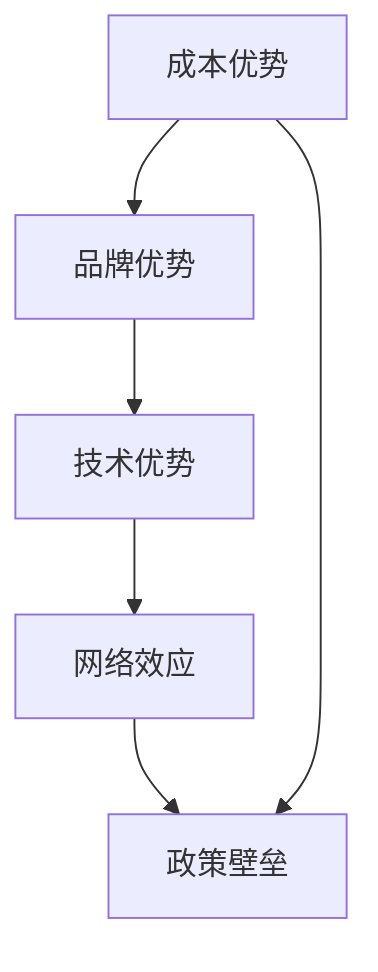
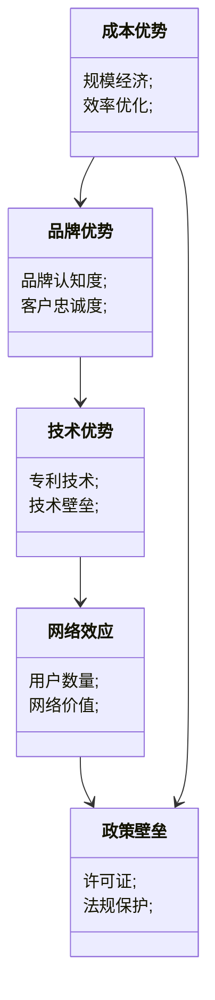
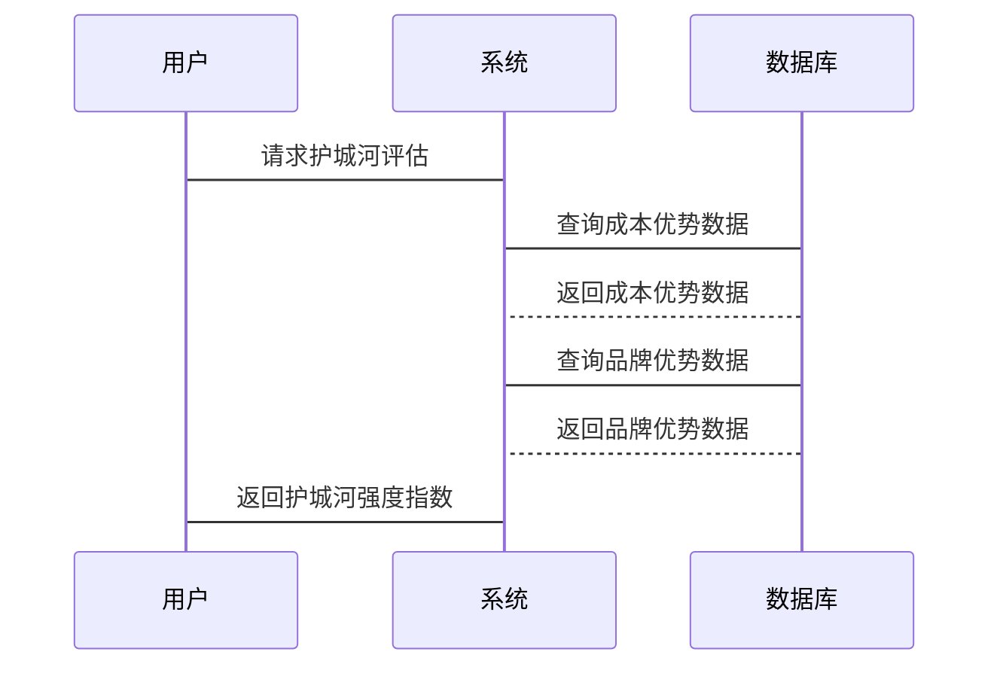

                 


# 巴菲特的护城河理论：寻找持久竞争优势

## 关键词：巴菲特, 护城河理论, 持久竞争优势, 竞争战略, 企业价值

## 摘要：  
巴菲特的护城河理论是投资和商业策略中的核心概念，强调企业如何通过建立持久的竞争优势来实现长期价值增长。本文深入分析护城河理论的背景、核心要素、数学模型、系统架构以及实际案例，探讨如何通过护城河理论找到具备持久竞争优势的企业，从而在投资和商业竞争中占据优势。

---

## 第一部分：背景介绍

### 1.1 核心概念术语说明  
护城河理论由沃伦·巴菲特提出，强调企业通过构建独特的竞争优势（如成本优势、品牌影响力、技术壁垒等），在行业内形成难以被竞争对手复制或超越的能力，从而确保长期的市场地位和盈利能力。

### 1.2 问题背景  
在商业竞争中，企业若无独特的竞争优势，容易被竞争对手取代市场份额，导致利润下降甚至被淘汰。护城河理论帮助企业识别和构建可持续的竞争优势，从而实现长期价值增长。

### 1.3 问题描述  
如何通过护城河理论识别具备持久竞争优势的企业？护城河的核心要素有哪些？如何量化护城河的强度？

### 1.4 问题解决  
通过分析护城河的五种主要类型（成本优势、品牌优势、技术优势、网络效应、政策壁垒），并结合数学模型和实际案例，提出构建和评估护城河的方法。

### 1.5 边界与外延  
护城河理论适用于各种行业，但其强度受行业特性、市场环境和企业战略的影响。本文主要关注企业层面的护城河构建，不涉及宏观经济政策的直接分析。

### 1.6 核心要素组成  
护城河的核心要素包括：  
1. **成本优势**：企业通过规模经济或效率降低成本，使竞争对手难以盈利。  
2. **品牌优势**：强大的品牌认知度和客户忠诚度。  
3. **技术优势**：拥有独特的专利或技术壁垒。  
4. **网络效应**：产品或服务的使用价值随用户数量增加而提升。  
5. **政策壁垒**：通过政策或法规获得的竞争优势。

---

## 第二部分：护城河的核心概念与联系

### 2.1 护城河的分类与特征

| 类型         | 特征描述                                                                 |
|--------------|--------------------------------------------------------------------------|
| 成本优势     | 企业通过规模经济或效率降低成本，使竞争对手难以盈利。                  |
| 品牌优势     | 强大的品牌认知度和客户忠诚度，竞争对手难以在短时间内建立同等品牌影响力。 |
| 技术优势     | 拥有独特的专利或技术壁垒，竞争对手难以在短时间内复制。               |
| 网络效应     | 产品或服务的使用价值随用户数量增加而提升，形成正反馈循环。           |
| 政策壁垒     | 通过政策或法规获得的竞争优势，如许可证、行业准入限制等。             |

### 2.2 护城河的系统架构图



---

## 第三部分：护城河的数学模型与算法原理

### 3.1 护城河强度指数模型

$$
\text{护城河强度} = a \times \text{成本优势} + b \times \text{品牌优势} + c \times \text{技术优势} + d \times \text{网络效应} + e \times \text{政策壁垒}
$$

其中，$a, b, c, d, e$ 是权重系数，根据具体行业和企业情况调整。

### 3.2 护城河的动态变化模型

```mermaid
graph LR
    Start --> Monitor
    Monitor --> (评估当前护城河要素)
    (评估当前护城河要素) --> Adjust(根据市场变化调整)
    Adjust --> End
```

---

## 第四部分：系统分析与架构设计

### 4.1 问题场景介绍  
以一家互联网公司为例，分析其如何通过护城河理论构建持久竞争优势。

### 4.2 系统功能设计  
- **领域模型图**：展示护城河要素之间的关系。



### 4.3 系统架构设计  
- **分层架构**：  
  ```
  网络层 --> 服务层 --> 应用层
  ```

### 4.4 系统接口设计  
- **RESTful API**：  
  ```
  GET /api/competitive-edge
  ```

### 4.5 系统交互图  


---

## 第五部分：项目实战

### 5.1 环境安装  
- 安装Python和必要的库（如numpy、pandas、scikit-learn）。

### 5.2 核心实现代码

```python
import numpy as np
import pandas as pd

# 定义护城河强度模型
def calculate_h Competitive_edge(cost_adv, brand_adv, tech_adv, network_adv, policy_adv):
    weights = [0.3, 0.3, 0.2, 0.1, 0.1]
    return sum(w * adv for w, adv in zip(weights, [cost_adv, brand_adv, tech_adv, network_adv, policy_adv]))

# 示例数据
data = {
    '成本优势': [0.8],
    '品牌优势': [0.7],
    '技术优势': [0.6],
    '网络效应': [0.5],
    '政策壁垒': [0.4]
}

df = pd.DataFrame(data)
result = df.apply(lambda x: calculate_h Competitive_edge(*x), axis=1)

print("护城河强度指数:", result.values[0])
```

### 5.3 代码解读  
- **函数定义**：`calculate_h Competitive_edge`计算护城河强度，权重根据经验调整。  
- **数据准备**：使用`pandas`创建包含护城河要素的数据框。  
- **结果计算**：应用函数计算护城河强度，并输出结果。

### 5.4 案例分析  
以可口可乐为例，分析其护城河要素：

- **成本优势**：全球供应链和规模化生产降低成本。  
- **品牌优势**：强大的品牌认知度和客户忠诚度。  
- **网络效应**：广泛的分销网络和消费者习惯。  
- **政策壁垒**：饮料行业的法规保护。

---

## 第六部分：最佳实践与总结

### 6.1 小结  
护城河理论帮助企业识别和构建持久竞争优势，确保长期价值增长。

### 6.2 注意事项  
- 定期评估和调整护城河要素。  
- 结合行业特点选择合适的护城河类型。  

### 6.3 拓展阅读  
- 巴菲特投资策略  
- 企业竞争力分析  

---

## 作者：AI天才研究院/AI Genius Institute & 禅与计算机程序设计艺术/Zen And The Art of Computer Programming

