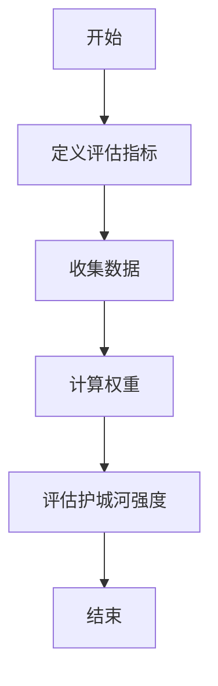
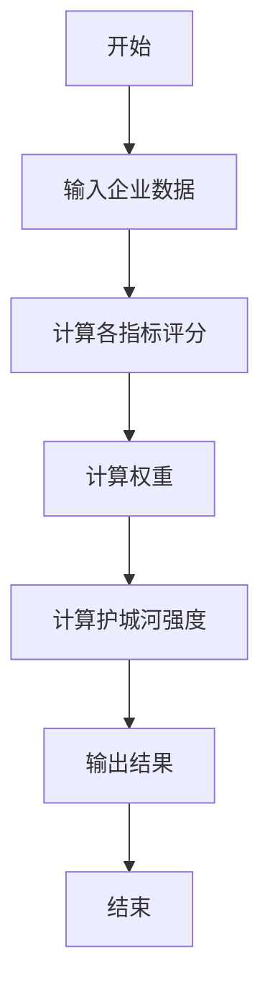
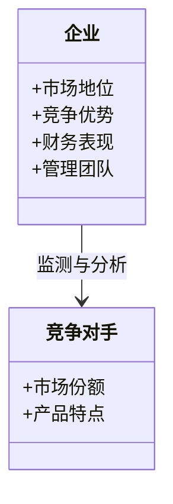
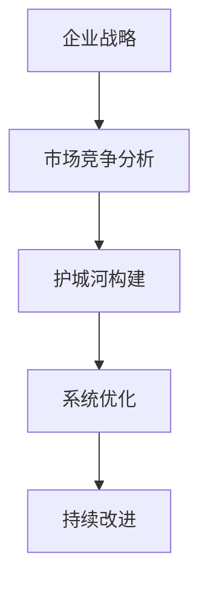
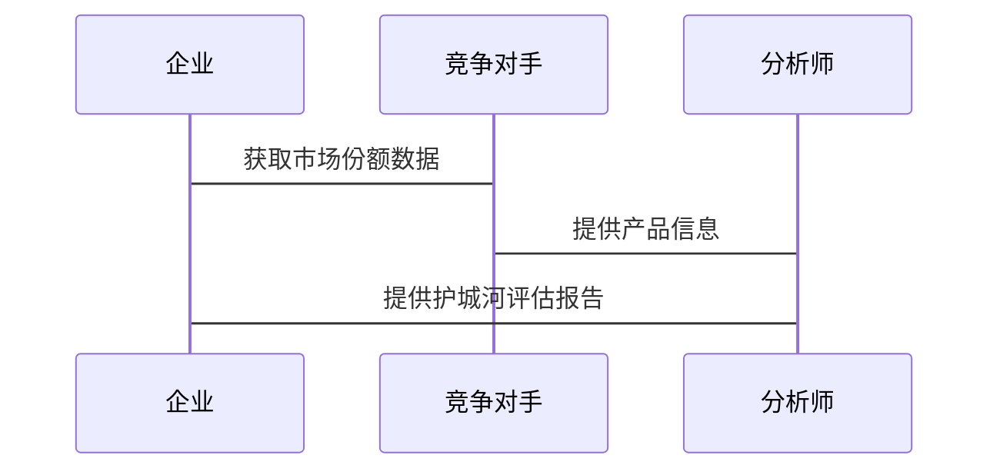

                 


# 巴菲特的护城河理论：寻找持久竞争优势

## 关键词：巴菲特、护城河、竞争优势、投资策略、企业战略、长期价值

## 摘要：
本文深入探讨了巴菲特的护城河理论，分析了其核心概念、评估方法、构建策略以及实际应用。通过系统分析和案例研究，本文揭示了护城河如何为企业创造持久竞争优势，并提供了实用的分析工具和方法论，帮助读者在商业决策中有效应用这一理论。

---

# 第1章: 护城河理论的背景与核心思想

## 1.1 巴菲特投资理念的背景
### 1.1.1 巴菲特投资哲学的形成
巴菲特的投资哲学源于他的导师本杰明·格雷厄姆的价值投资理论，强调以合理价格买入优质企业。护城河理论是这一哲学的深化，旨在识别具备长期竞争优势的企业。

### 1.1.2 护城河理论的提出与演变
护城河理论在巴菲特的投资实践中逐渐形成，核心在于识别那些能够抵御竞争者侵蚀的企业。随着时间推移，这一理论不断完善，成为巴菲特选股的重要标准。

### 1.1.3 护城河理论的核心思想
巴菲特认为，真正的护城河来源于企业的独特竞争优势，如成本优势、品牌忠诚度或技术壁垒。这些优势使企业在长期内具备定价权和盈利能力。

## 1.2 护城河理论的核心概念
### 1.2.1 什么是护城河
护城河是指企业在市场竞争中形成的独特优势，能够抵御竞争对手的侵蚀，保持长期的市场份额和盈利能力。

### 1.2.2 护城河的四大类型
1. **成本优势**：企业通过规模经济或专有技术降低成本，提供更具竞争力的价格。
2. **品牌优势**：强大的品牌忠诚度使企业能够在价格和质量上享有溢价。
3. **网络效应**：产品或服务的使用价值随着用户数量的增加而增强，形成正反馈循环。
4. **创新优势**：持续的创新能力使企业保持技术领先，不断推出新产品。

### 1.2.3 护城河的动态性与可持续性
护城河并非一成不变，企业需要不断创新和适应市场变化，才能维持其竞争优势。

## 1.3 护城河理论的现实意义
### 1.3.1 企业竞争优势的核心要素
护城河理论帮助企业识别和培养核心竞争力，确保在激烈市场中立于不败之地。

### 1.3.2 护城河理论对企业战略的指导意义
企业战略应围绕构建和强化护城河展开，从长期视角制定目标和计划。

### 1.3.3 护城河理论与长期投资价值
具备强大护城河的企业通常具有稳定的盈利能力，是长期投资的优质标的。

## 1.4 本章小结
本章介绍了护城河理论的背景、核心概念及其在企业战略和投资中的重要性，为后续分析奠定了基础。

---

# 第2章: 护城河的核心要素与分类

## 2.1 护城河的核心要素
### 2.1.1 成本优势
成本优势是护城河的重要组成部分，企业通过规模化生产、专有技术和供应链管理降低成本，提高利润率。

### 2.1.2 品牌优势
强大的品牌影响力能够吸引并留住客户，形成品牌忠诚度，从而在价格和质量上享有溢价。

### 2.1.3 网络效应
网络效应使产品或服务的价值随着用户数量的增加而增加，形成正反馈循环，增强企业的市场地位。

### 2.1.4 规模经济
通过规模化生产降低成本，提高效率，从而在价格和质量上形成竞争优势。

## 2.2 护城河的分类与特征
### 2.2.1 经济护城河
经济护城河是通过成本优势、规模经济等方式构建的竞争壁垒，能够有效防御竞争对手。

### 2.2.2 品牌护城河
品牌护城河依赖于强大的品牌影响力和客户忠诚度，通常在消费领域表现尤为突出。

### 2.2.3 知识资本护城河
知识资本护城河基于企业的专有技术和创新能力，通过持续创新维持竞争优势。

### 2.2.4 创新护城河
创新护城河依赖于企业的研发能力和创新能力，通过不断推出新产品和技术保持市场领先地位。

## 2.3 护城河要素之间的关系
### 2.3.1 护城河要素的相互作用
不同类型的护城河要素相互作用，共同构建企业的竞争优势。例如，技术创新可以增强品牌影响力，而品牌忠诚度又能促进规模经济。

### 2.3.2 护城河要素的动态平衡
护城河要素需要动态平衡，企业需要根据市场变化调整其战略，以维持竞争优势。

### 2.3.3 护城河要素的综合评估
综合评估护城河要素时，需要考虑其强度、可持续性和相互作用，确保企业在市场竞争中具备长期优势。

## 2.4 本章小结
本章详细分析了护城河的核心要素及其分类，揭示了不同类型护城河的特征和相互作用，为后续分析提供了理论基础。

---

# 第3章: 护城河的评估与分析方法

## 3.1 护城河的评估维度
### 3.1.1 市场地位
市场地位是评估护城河的重要指标，通常通过市场份额、品牌影响力和客户忠诚度来衡量。

### 3.1.2 竞争优势
竞争优势包括成本优势、技术创新和网络效应等，是护城河的核心要素。

### 3.1.3 财务表现
财务表现是评估护城河的重要依据，包括盈利能力、资产回报率和现金流等指标。

### 3.1.4 管理团队
管理团队的能力和战略眼光对护城河的构建和维护至关重要。

## 3.2 护城河的分析框架
### 3.2.1 五力分析模型
五力分析模型（波特五力分析）帮助企业评估市场竞争环境，识别潜在的护城河机会。

### 3.2.2 价值链分析
价值链分析帮助企业识别在价值创造过程中具备竞争优势的环节，构建护城河。

### 3.2.3 竞争对手分析
通过分析竞争对手的优势和劣势，识别自身护城河的潜在威胁和机会。

## 3.3 护城河评估的数学模型
### 3.3.1 护城河强度指数公式
$$ \text{护城河强度} = \sum_{i=1}^{n} w_i \times s_i $$
其中，\( w_i \) 是第 \( i \) 项的权重，\( s_i \) 是第 \( i \) 项的评分。

### 3.3.2 护城河评估流程图


## 3.4 案例分析：可口可乐的护城河
以可口可乐为例，分析其品牌优势、网络效应和成本优势，展示如何构建和维护护城河。

## 3.5 本章小结
本章介绍了护城河的评估维度和分析方法，并通过案例展示了如何在实际中应用这些方法。

---

# 第4章: 护城河的构建策略

## 4.1 护城河的构建原则
### 4.1.1 突出核心竞争力
企业应专注于自身的核心竞争力，构建独特的竞争优势。

### 4.1.2 持续创新
技术创新和管理创新是维持护城河的关键，企业需要不断适应市场变化。

### 4.1.3 强化品牌影响力
强大的品牌影响力能够吸引并留住客户，形成品牌忠诚度。

### 4.1.4 优化成本结构
通过规模经济和专有技术降低成本，提高竞争力。

## 4.2 护城河的动态管理
### 4.2.1 监测市场变化
企业需要密切关注市场变化，及时调整战略。

### 4.2.2 维护竞争优势
定期评估和优化护城河要素，确保其持续有效。

### 4.2.3 应对竞争威胁
制定应对策略，有效防御竞争对手的侵蚀。

## 4.3 护城河的长期维护
### 4.3.1 建立创新机制
通过持续创新保持技术领先，抵御竞争对手的挑战。

### 4.3.2 加强内部管理
优化组织结构和流程，提高运营效率。

### 4.3.3 提升客户价值
通过提供优质产品和服务，增强客户忠诚度。

## 4.4 本章小结
本章探讨了护城河的构建策略，强调企业需要从核心竞争力、品牌影响力、成本结构和创新能力等多个方面入手，构建和维护持久的竞争优势。

---

# 第5章: 护城河的数学模型与算法

## 5.1 护城河强度评估模型
### 5.1.1 模型假设
- 企业具备至少一种类型的护城河。
- 各评估指标的权重可以根据行业特点进行调整。

### 5.1.2 模型公式
$$ \text{护城河强度} = w_1 \times s_1 + w_2 \times s_2 + \dots + w_n \times s_n $$
其中，\( w_i \) 是第 \( i \) 项的权重，\( s_i \) 是第 \( i \) 项的评分。

### 5.1.3 模型实现
通过Python代码实现护城河强度评估，包括数据输入、权重分配和强度计算。

## 5.2 护城河评估算法流程图


## 5.3 算法实现代码
```python
def calculate_h护城河强度(weights, scores):
    return sum(w * s for w, s in zip(weights, scores))

weights = [0.4, 0.3, 0.2]
scores = [0.8, 0.7, 0.9]
强度 = calculate_h护城河强度(weights, scores)
print(强度)
```

## 5.4 算法优化与改进
### 5.4.1 动态调整权重
根据市场变化和企业战略调整各指标的权重，以反映其重要性变化。

### 5.4.2 结合案例分析
通过实际案例验证模型的有效性，不断优化评估方法。

## 5.5 本章小结
本章通过数学模型和算法展示了如何量化护城河强度，为企业提供了一种科学的评估方法。

---

# 第6章: 护城河的系统分析与架构设计

## 6.1 系统分析框架
### 6.1.1 问题场景介绍
通过分析企业面临的市场竞争环境，识别潜在的护城河机会。

### 6.1.2 领域模型设计
使用Mermaid绘制领域模型图，展示企业各要素之间的关系。



### 6.1.3 系统架构设计
使用Mermaid绘制系统架构图，展示各模块之间的交互和数据流。



## 6.2 系统接口设计
### 6.2.1 输入接口
数据输入，包括市场数据、企业财务数据和竞争对手信息。

### 6.2.2 输出接口
评估结果输出，包括护城河强度、竞争优势分析和优化建议。

## 6.3 系统交互设计
使用Mermaid绘制序列图，展示系统各角色之间的交互流程。



## 6.4 本章小结
本章通过系统分析和架构设计，展示了如何将护城河理论应用于实际的企业管理中。

---

# 第7章: 护城河的项目实战

## 7.1 项目背景与目标
以某企业为例，分析其市场竞争环境，识别潜在的护城河机会。

## 7.2 项目实施步骤
### 7.2.1 数据收集
收集企业的市场地位、竞争优势、财务表现和管理团队信息。

### 7.2.2 指标评估
使用护城河强度评估模型，计算各指标的评分和权重。

### 7.2.3 战略制定
根据评估结果，制定护城河构建和优化策略。

### 7.2.4 实施与监控
实施战略并持续监控市场变化，调整护城河要素。

## 7.3 代码实现
### 7.3.1 数据处理
```python
import pandas as pd

data = pd.read_csv('企业数据.csv')
print(data.head())
```

### 7.3.2 护城河强度计算
```python
weights = [0.4, 0.3, 0.2]
scores = [data['市场地位'].mean(), data['竞争优势'].mean(), data['管理团队'].mean()]
强度 = sum(w * s for w, s in zip(weights, scores))
print(强度)
```

## 7.4 案例分析与结果解读
通过具体案例分析，展示如何应用护城河理论优化企业战略。

## 7.5 项目小结
本章通过项目实战展示了护城河理论的实际应用，为企业提供了可操作的指导。

---

# 第8章: 护城河的最佳实践与小结

## 8.1 最佳实践
### 8.1.1 定期评估
企业应定期评估护城河强度，及时调整战略。

### 8.1.2 竞争对手分析
密切关注竞争对手的动向，识别潜在威胁和机会。

### 8.1.3 持续创新
通过技术创新和管理优化，维持护城河的持续有效性。

## 8.2 小结
护城河理论是企业长期竞争优势的重要来源，通过构建和维护护城河，企业可以在激烈的市场竞争中立于不败之地。

## 8.3 注意事项
### 8.3.1 动态调整
市场环境不断变化，企业需要灵活调整护城河策略。

### 8.3.2 风险管理
识别潜在风险，制定应对策略，降低护城河被侵蚀的风险。

## 8.4 拓展阅读
推荐相关书籍和文章，帮助读者深入学习护城河理论。

---

# 附录

## 附录A: 术语表
- 护城河：企业竞争优势的总称。
- 成本优势：通过规模经济或专有技术降低成本的竞争优势。

## 附录B: 参考文献
- 巴菲特股东大会演讲。
- 格雷厄姆《价值投资》。

## 附录C: 扩展资源
推荐相关课程和工具，帮助读者进一步学习和实践。

---

# 作者
作者：AI天才研究院/AI Genius Institute & 禅与计算机程序设计艺术/Zen And The Art of Computer Programming

---

以上是文章的详细结构，您可以根据实际需求进行扩展和补充。

