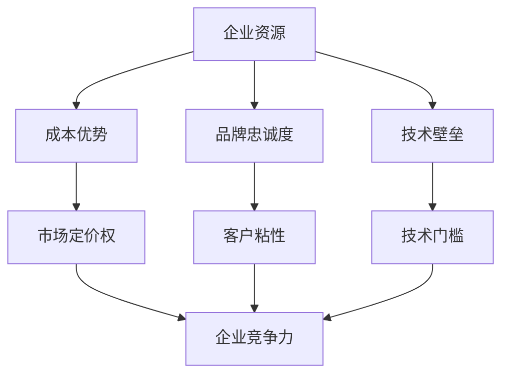

                 


# 巴菲特的护城河理论：寻找持久竞争优势

> 关键词：巴菲特，护城河，竞争优势，投资策略，企业战略

> 摘要：本文深入探讨了巴菲特的护城河理论，分析了护城河的四种类型及其在企业中的应用，结合实际案例详细说明了如何通过系统分析和架构设计来建立持久的竞争优势，并给出了投资策略和最佳实践。

---

## 第一部分：巴菲特投资理念与护城河理论基础

### 第1章：巴菲特投资理念概述

#### 1.1 巴菲特的投资哲学

- **价值投资的核心理念**：巴菲特强调以合理价格投资优质企业，长期持有，分享企业成长的成果。
- **长期投资的重要性**：通过长期持有优质资产，避免短期市场波动的影响，实现财富的稳定增长。
- **安全边际的概念**：安全边际是指买入价格低于企业内在价值的部分，确保投资的安全性和收益性。

#### 1.2 什么是护城河

- **护城河的定义与内涵**：护城河是指企业竞争优势的持久性，能够有效防止竞争对手侵蚀市场份额的能力。
- **护城河的四种类型**：
  1. **成本优势**：通过规模效应和学习曲线降低成本，提供价格优势。
  2. **网络效应**：用户之间的相互依赖性，用户越多，平台价值越大。
  3. **品牌忠诚度**：强大的品牌影响力和客户忠诚度，增强客户粘性。
  4. **技术壁垒**：拥有独特的专利和技术，形成进入壁垒。

- **护城河的边界与外延**：护城河并非一成不变，需要根据市场环境和企业战略进行动态调整。

### 第2章：护城河的核心要素与企业竞争优势

#### 2.1 护城河的分类与特征

- **成本优势**：规模效应和学习曲线的数学模型
  - **规模效应**：成本随着产量增加而降低，公式：LAC = FC/Q + (VC/Q) × Q。
  - **学习曲线**：生产效率随着经验积累而提高，经验曲线效应公式：C(n) = C(1) × n^(-λ)。

- **网络效应**：平台型企业如何通过用户增长实现价值倍增，公式：V = k × n^2，其中V为平台价值，n为用户数量，k为网络效应系数。

- **品牌忠诚度**：品牌资产对企业定价权的影响，公式：定价能力 = 品牌强度 × 市场份额。

- **技术壁垒**：专利和技术研发对企业竞争力的影响，公式：技术创新速度 = 研发投入 × 创新效率。

#### 2.2 护城河的强度评估

- **护城河强度的量化指标**：通过市场占有率、利润率和竞争壁垒宽度等指标进行评估。
- **护城河强度与企业定价权的关系**：强大的护城河赋予企业更高的定价权，公式：定价权 = 护城河强度 × 市场地位。

### 第3章：护城河的系统分析与架构设计

#### 3.1 护城河的系统分析框架

- **企业战略目标与护城河的关系**：企业通过明确战略目标，选择合适的护城河类型。
- **企业资源、能力与护城河的匹配**：资源和能力分析，确定最适合的护城河类型。
- **竞争环境分析与护城河的选择**：分析行业竞争结构，选择能够有效应对竞争的护城河。

#### 3.2 护城河的系统架构图



## 第二部分：护城河理论的实践应用与案例分析

### 第4章：护城河的识别与分析方法

#### 4.1 成本优势的识别

- **案例分析：亚马逊的成本优势**
  - **规模效应**：亚马逊通过巨大的销售量摊薄固定成本，降低单位成本。
  - **学习曲线**：自动化仓储系统和高效物流网络的应用，进一步降低成本。

#### 4.2 网络效应的识别

- **案例分析：WhatsApp的网络效应**
  - 用户越多，平台价值越高，形成正反馈循环，增强用户粘性。

#### 4.3 品牌忠诚度的识别

- **案例分析：可口可乐的品牌忠诚度**
  - 强大的品牌影响力和营销策略，形成消费者习惯，增强品牌忠诚度。

#### 4.4 技术壁垒的识别

- **案例分析：特斯拉的技术壁垒**
  - 电动汽车专利和技术研发，形成技术壁垒，防止竞争对手快速复制。

### 第5章：护城河的动态调整与管理

#### 5.1 护城河的动态变化

- **环境变化对企业护城河的影响**：技术进步、市场需求变化等因素可能削弱现有护城河的有效性。
- **企业如何应对环境变化**：通过持续创新和调整战略，维护和增强护城河。

#### 5.2 护城河的管理策略

- **战略选择**：根据市场环境和企业资源，选择最适合的护城河类型。
- **组织管理**：建立高效的组织结构和管理制度，支持护城河的建设。
- **持续创新**：通过技术创新和管理创新，保持护城河的竞争力。

## 第三部分：抽丝剥茧：护城河与企业长期价值

### 第6章：护城河对企业长期价值的影响

#### 6.1 护城河与企业竞争优势

- **护城河如何影响企业长期价值**：强大的护城河能够为企业带来持续的高利润和市场份额，增强企业的长期竞争力。
- **护城河的宽度与企业价值的关系**：护城河越宽越深，企业价值越高。

#### 6.2 护城河的宽度、深度和可持续性

- **宽度**：护城河覆盖的业务范围和市场领域。
- **深度**：护城河在各个业务领域的竞争优势程度。
- **可持续性**：护城河在面对市场变化和竞争压力时的持久能力。

## 第四部分：投资策略：寻找具有护城河的公司

### 第7章：投资策略与护城河分析

#### 7.1 如何在投资中应用护城河理论

- **寻找具有强大护城河的公司**：关注成本优势、网络效应、品牌忠诚度和技术壁垒等方面。
- **评估护城河的宽度和深度**：分析企业的竞争优势是否持久，能否抵御竞争对手的侵蚀。

#### 7.2 投资组合的构建

- **分散投资**：通过投资不同类型护城河的公司，分散风险。
- **长期持有**：避免短期波动，长期分享企业成长的成果。

## 第五部分：项目实战与最佳实践

### 第8章：项目实战：护城河分析框架的应用

#### 8.1 环境安装

- **工具安装**：安装Mermaid和相关数据分析工具，用于绘制系统架构图和流程图。

#### 8.2 核心实现

- **代码实现**：编写Python代码，用于护城河强度评估和市场竞争力分析。
  ```python
  import pandas as pd

  def calculate_h Competitive Advantage(company_data):
      # 假设company_data包含成本、品牌、技术和网络效应数据
      cost_adv = company_data['cost'] / company_data['cost'].mean()
      brand_adv = company_data['brand'] / company_data['brand'].mean()
      tech_adv = company_data['tech'] / company_data['tech'].mean()
      network_adv = company_data['network'] / company_data['network'].mean()
      
      return cost_adv + brand_adv + tech_adv + network_adv

  data = pd.DataFrame({
      'cost': [0.8, 1.2, 0.9, 1.1],
      'brand': [1.5, 0.8, 1.2, 1.0],
      'tech': [0.7, 1.3, 0.8, 1.2],
      'network': [1.0, 1.1, 0.9, 1.3]
  })
  print(calculate_h Competitive Advantage(data))
  ```

#### 8.3 案例分析

- **护城河分析的详细解读**：通过具体案例分析，展示如何使用系统架构图和流程图进行护城河分析。

#### 8.4 项目小结

- **项目总结**：护城河分析框架的有效性，以及在实际投资中的应用价值。

## 第六部分：最佳实践 tips、小结、注意事项、拓展阅读

### 第9章：最佳实践 tips

- **持续学习与更新**：市场环境不断变化，护城河的分析需要持续学习和更新。
- **多维度分析**：结合财务指标、市场数据和行业趋势，全面评估企业的护城河。
- **关注长期价值**：投资护城河企业的核心在于其长期价值，而非短期收益。

### 第10章：总结与展望

- **文章总结**：护城河理论的重要性，以及如何在实际投资和企业管理中应用。
- **未来展望**：护城河理论的发展趋势，以及其在数字化转型中的应用潜力。

### 第11章：注意事项

- **风险提示**：护城河并非绝对，可能因环境变化而削弱。
- **投资风险**：投资护城河企业需考虑市场风险和企业自身经营状况。

### 第12章：拓展阅读

- **推荐阅读书籍**：巴菲特的《 Intelligent Investor》和《 The Art of War》等。
- **相关课程推荐**：系统架构设计和战略管理的相关课程。

---

## 作者：AI天才研究院/AI Genius Institute & 禅与计算机程序设计艺术 /Zen And The Art of Computer Programming

---

通过以上目录大纲，我们可以看到，文章系统地介绍了巴菲特的护城河理论，并结合技术领域的分析方法，详细讲解了护城河的识别、分析和应用。通过实际案例和系统架构图，帮助读者更好地理解和应用护城河理论，寻找具有持久竞争优势的企业。

