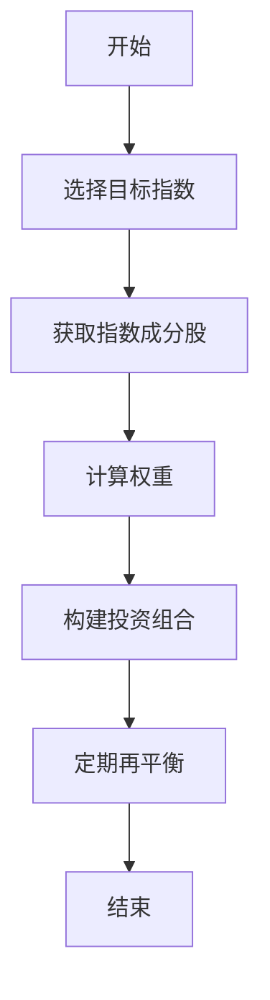
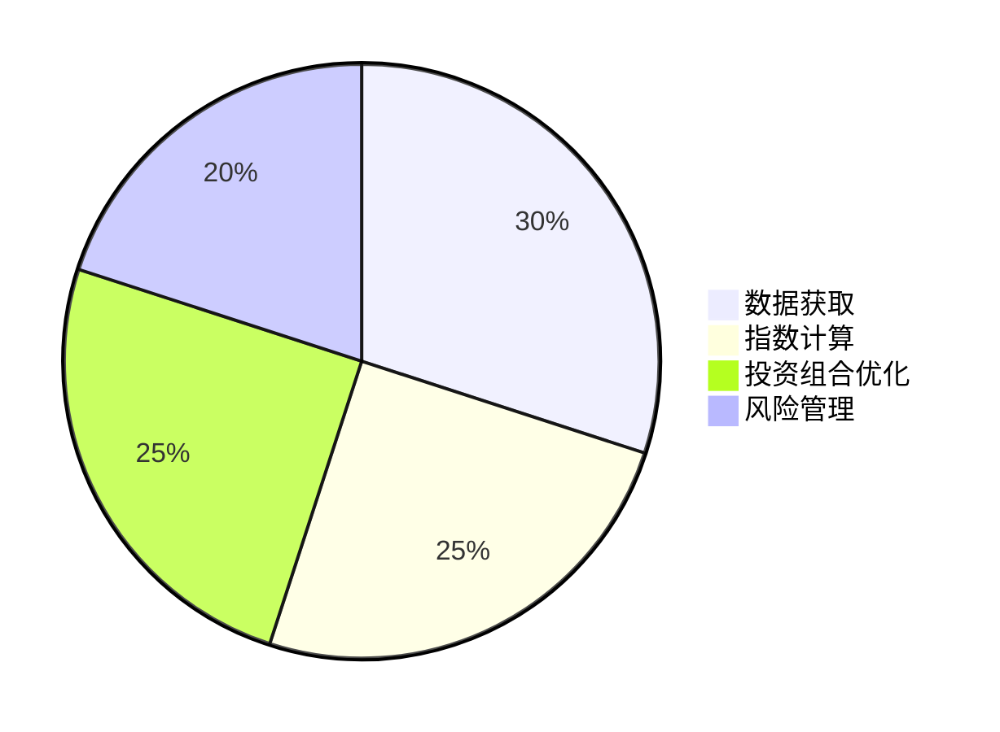

                 


# 巴菲特的指数投资观：大多数投资者的选择

> 关键词：指数投资，巴菲特，被动投资，长期投资，投资组合优化，风险管理

> 摘要：本文深入探讨了巴菲特推崇的指数投资理念，分析了指数投资的核心概念、优势、风险以及实际应用。通过详细阐述指数投资的背景、原理、系统架构和项目实战，本文为投资者提供了科学的决策依据和实用的策略。

---

## 第一章: 指数投资的背景与概念

### 1.1 指数投资的基本概念

指数投资是一种被动投资策略，通过跟踪特定市场指数的表现来实现投资收益。投资者购买指数基金或ETF（交易所交易基金），以复制指数的组成和权重，从而获得与市场同步的回报。这种策略的核心在于分散风险，避免依赖单一资产或市场的波动。

### 1.2 巴菲特的投资理念

巴菲特是价值投资的倡导者，但他也多次强调指数投资的长期优势。他认为，对于大多数投资者而言，特别是那些不具备专业选股能力的投资者，指数投资是一种简单有效的选择。巴菲特指出，长期来看，指数基金的回报通常能够超越主动管理型基金的平均表现。

### 1.3 指数投资的背景与发展

指数投资的起源可以追溯到20世纪70年代，随着金融理论的发展和投资工具的创新，指数基金逐渐成为投资者的热门选择。近年来，特别是在全球金融危机后，指数投资因其低风险、低成本的特点，吸引了大量投资者的关注。

### 1.4 指数投资的核心优势

- **分散风险**：通过投资多个资产，降低单一资产的风险。
- **低成本**：指数基金的管理费用通常低于主动管理型基金。
- **长期稳定**：长期来看，市场指数往往能够跑赢通胀，为投资者提供稳定的收益。

### 1.5 本章小结

本章介绍了指数投资的基本概念、巴菲特的投资理念以及指数投资的优势。这些内容为后续章节的深入分析奠定了基础。

---

## 第二章: 指数投资的核心概念与联系

### 2.1 指数基金的定义与分类

指数基金是一种跟踪特定指数的基金，其投资组合模拟该指数的成分股和权重。根据指数的不同，指数基金可以分为股票指数基金、债券指数基金等。每种类型的基金都有其独特的风险收益特征。

### 2.2 市场指数的构建与计算

市场指数的构建需要考虑多个因素，包括成分股的选择、权重的分配以及价格的计算。常见的市场指数包括标普500指数、纳斯达克指数等。指数的权重分配通常基于市值，但也可以采用等权重或其他方法。

### 2.3 被动投资与主动投资的对比

| 对比维度 | 被动投资 | 主动投资 |
|----------|----------|----------|
| 管理方式 | 按指数配置 | 主动选股、择时 |
| 成本 | 低 | 高 |
| 风险 | 低 | 高 |

### 2.4 指数投资的风险与收益

指数投资的风险主要来源于市场的整体波动，但其长期收益通常较为稳定。通过分散投资，指数基金能够有效降低非系统性风险。

### 2.5 本章小结

本章详细分析了指数基金、市场指数以及被动投资与主动投资的对比，帮助读者理解指数投资的核心概念及其与其他投资策略的区别。

---

## 第三章: 指数投资的算法原理

### 3.1 指数投资的数学模型

指数投资的数学模型主要基于现代投资组合理论（MPT）。以下是CAPM模型的公式：

$$
E(r_i) = r_f + \beta_i (E(r_m) - r_f)
$$

其中，$E(r_i)$ 是资产的预期收益，$r_f$ 是无风险利率，$\beta_i$ 是资产的贝塔系数，$E(r_m)$ 是市场预期收益。

### 3.2 指数投资的优化算法

指数投资的优化算法通常包括以下步骤：

1. 确定目标指数。
2. 获取指数成分股的权重。
3. 构建投资组合，按权重购买成分股。
4. 定期再平衡投资组合以维持初始权重。

### 3.3 指数投资的流程图



### 3.4 本章小结

本章通过数学模型和流程图，详细讲解了指数投资的算法原理，为读者提供了理论依据和操作步骤。

---

## 第四章: 指数投资的系统分析与架构设计

### 4.1 投资平台的组成部分

投资平台主要包括数据获取模块、指数计算模块、投资组合优化模块和风险管理模块。

### 4.2 系统架构图



### 4.3 系统功能设计

- 数据获取：从金融数据源获取指数成分股的价格和权重。
- 指数计算：根据数据计算目标指数的值。
- 投资组合优化：根据指数权重构建投资组合。
- 风险管理：监控投资组合的风险，并进行调整。

### 4.4 本章小结

本章通过系统架构图和功能设计，详细分析了指数投资的系统结构和功能模块。

---

## 第五章: 指数投资的项目实战

### 5.1 环境安装

为了进行指数投资实战，首先需要安装必要的工具和库，如Python、Pandas、NumPy等。

### 5.2 核心代码实现

以下是构建指数投资组合的Python代码示例：

```python
import pandas as pd
import numpy as np

# 获取指数成分股数据
data = pd.read_csv('index_components.csv')

# 计算权重
weights = data['weight'].values / np.sum(data['weight'].values)

# 构建投资组合
portfolio = data['stock'].values * weights
```

### 5.3 代码应用与解读

上述代码首先读取指数成分股的数据，计算各成分股的权重，然后根据权重构建投资组合。通过这种方式，投资者可以简单有效地复制指数的表现。

### 5.4 本章小结

本章通过实战项目，详细讲解了指数投资的环境安装、代码实现和应用，帮助读者掌握指数投资的实际操作方法。

---

## 第六章: 指数投资的最佳实践与注意事项

### 6.1 最佳实践

- 定期再平衡投资组合，以维持初始权重。
- 选择费用低、流动性好的指数基金。
- 长期持有，避免频繁交易。

### 6.2 小结

指数投资是一种简单有效的投资策略，通过分散风险和长期持有，能够为大多数投资者提供稳定的收益。

### 6.3 注意事项

- 指数投资不适合短期投机。
- 需要关注指数的成分股调整和市场变化。
- 考虑税收和费用的影响。

### 6.4 拓展阅读

建议进一步阅读《指数投资策略》和巴菲特的著作，以深入理解指数投资的理论和实践。

---

## 作者信息

作者：AI天才研究院/AI Genius Institute & 禅与计算机程序设计艺术 /Zen And The Art of Computer Programming

---

# 结语

通过本文的详细讲解，读者可以全面了解巴菲特的指数投资观，掌握指数投资的核心概念、算法原理和实际应用。指数投资作为一种适合大多数投资者的策略，值得我们深入研究和实践。

