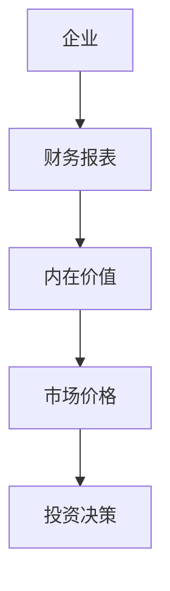
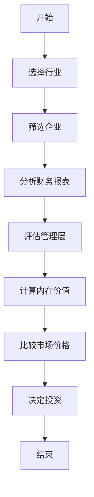
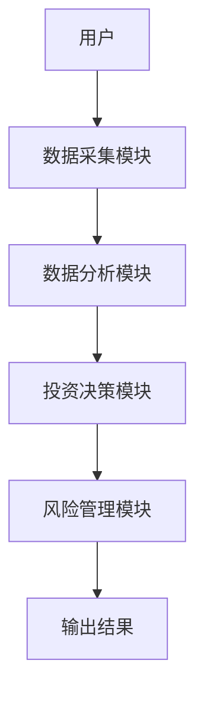

                 


# 巴菲特的焦点投资策略

## 关键词：巴菲特、价值投资、股票分析、风险管理、投资组合优化

## 摘要：  
巴菲特的焦点投资策略是一种基于长期价值投资的理念，通过深入分析企业的基本面、评估管理层的质量以及识别企业的竞争优势，从而做出明智的投资决策。本文将从巴菲特的投资哲学、核心分析方法、风险管理策略、系统化投资框架以及实际案例等方面，详细阐述其焦点投资策略的核心思想和具体实施方法。通过技术化的分析和系统化的解读，帮助读者更好地理解巴菲特的投资智慧，并将其应用于实际投资实践中。

---

## 第一部分：巴菲特的焦点投资策略概述

### 第1章：巴菲特投资理念的背景与核心概念

#### 1.1 巴菲特投资理念的起源

##### 1.1.1 价值投资的定义与历史背景  
价值投资是一种以低于其内在价值的价格购买优质股票的投资策略。它的核心思想是通过分析企业的基本面，找到市场低估的股票并长期持有，等待其价值回归。这种投资理念起源于20世纪30年代，由本杰明·格雷厄姆和戴维·多德共同提出。巴菲特是格雷厄姆的学生，深受其影响，并将价值投资的理念发扬光大。

##### 1.1.2 巴菲特的投资哲学与个人经历  
巴菲特的投资哲学可以总结为“简单即是伟大”。他认为，投资的本质是通过购买优质企业的一部分，长期持有，分享企业的成长。他的个人经历包括在哥伦比亚大学学习价值投资、创办合伙公司以及管理伯克希尔哈撒韦公司，这些经历塑造了他对投资的理解。

##### 1.1.3 价值投资的核心理念与边界  
价值投资的核心理念是寻找具有持续竞争优势、良好治理结构和优秀管理层的企业，并以合理的价格买入。其边界在于，投资者必须具备足够的知识和能力，专注于自己熟悉的企业和行业，避免盲目跟风。

#### 1.2 巴菲特投资策略的核心要素

##### 1.2.1 财务报表分析的重要性  
巴菲特非常重视企业的财务报表，尤其是盈利能力、成长能力和财务健康状况。以下是关键的财务指标：

$$ \text{ROE} = \frac{\text{净利润}}{\text{股东权益}} $$
$$ \text{ROA} = \frac{\text{净利润}}{\text{总资产}} $$
$$ \text{股息率} = \frac{\text{股息支付}}{\text{股价}} $$

##### 1.2.2 企业竞争优势的评估标准  
巴菲特认为，企业的竞争优势是其长期盈利能力的保障。他通过分析企业的市场地位、产品差异化能力、成本优势以及品牌影响力来评估竞争优势。

##### 1.2.3 管理层质量与企业治理结构  
管理层的质量直接影响企业的经营成果。巴菲特倾向于投资由诚信、能力强的管理层领导的企业，并且企业治理结构透明、高效。

#### 1.3 巴菲特投资策略的数学模型与公式

##### 1.3.1 市盈率（P/E）的计算与应用  
$$ \text{P/E} = \frac{\text{股价}}{\text{每股收益}} $$  
市盈率反映了市场对公司未来盈利的预期。巴菲特通常寻找P/E低于行业平均水平的企业。

##### 1.3.2 市净率（P/B）的计算与应用  
$$ \text{P/B} = \frac{\text{股价}}{\text{每股净资产}} $$  
市净率用于评估企业的资产价值，尤其适用于银行、制造业等资产密集型行业。

##### 1.3.3 股息率的计算与投资决策  
$$ \text{股息率} = \frac{\text{每股股息}}{\text{股价}} $$  
高股息率的股票通常被视为稳健的投资选择，但需警惕过高的股息率可能暗示企业财务状况不佳。

---

### 第2章：巴菲特投资策略的核心概念与联系

#### 2.1 核心概念原理

##### 2.1.1 价值投资的核心原理  
价值投资的原理是通过分析企业的内在价值，寻找市场价格低于内在价值的股票。内在价值的计算公式为：

$$ \text{内在价值} = \frac{\text{未来现金流的现值}}{\text{折现率}} $$

##### 2.1.2 股票估值与市场估值的关系  
股票的内在价值与市场估值可能存在差异。当市场价格低于内在价值时，是买入的好时机。

##### 2.1.3 企业竞争优势的数学模型  
企业竞争优势可以用以下模型表示：

$$ \text{竞争优势} = \text{成本优势} + \text{产品差异化} + \text{市场地位} $$

#### 2.2 核心概念属性对比表格

##### 2.2.1 价值投资与成长投资的对比

| 比较维度 | 价值投资 | 成长投资 |
|----------|-----------|----------|
| 目标     | 低于内在价值的价格 | 高成长性企业 |
| 风险     | 较低       | 较高     |
| 时间跨度 | 长期       | 长期     |

##### 2.2.2 股票估值与市场估值的对比

| 比较维度 | 股票估值 | 市场估值 |
|----------|----------|----------|
| 基础     | 内在价值 | 市场价格 |
| 影响因素 | 财务状况 | 市场情绪 |
| 目标     | 确定价值 | 反映预期 |

##### 2.2.3 内在价值与市场价格的关系

| 关系类型 | 内在价值 < 市场价格 | 内在价值 > 市场价格 |
|----------|--------------------|--------------------|
| 投资决策 | 避免买入            | 买入                |

#### 2.3 ER实体关系图



---

### 第3章：巴菲特投资策略的算法原理

#### 3.1 算法原理流程图



#### 3.2 算法实现代码

```python
def calculate_intrinsic_value(company_data):
    # 计算每股收益
    earnings_per_share = company_data['净利润'] / company_data['总股本']
    # 计算股息率
    dividend_yield = company_data['股息'] / company_data['股价']
    # 计算市盈率
    p_e_ratio = company_data['股价'] / earnings_per_share
    # 计算内在价值
    intrinsic_value = company_data['股价'] / (1 + company_data['ROE'] / 100)
    return intrinsic_value

# 示例数据
company_data = {
    '股价': 100,
    '净利润': 50,
    '总股本': 10,
    'ROE': 20,
    '股息': 5
}

# 调用函数
intrinsic_value = calculate_intrinsic_value(company_data)
print(f"内在价值: {intrinsic_value}")
```

---

## 第4章：巴菲特投资策略的数学公式与系统架构

### 4.1 投资决策的数学公式

#### 4.1.1 投资组合优化模型  
$$ \text{投资组合收益} = \sum_{i=1}^{n} w_i \times r_i $$
$$ \text{投资组合风险} = \sqrt{\sum_{i=1}^{n} \sum_{j=1}^{n} w_i w_j \sigma_i \sigma_j} $$

#### 4.1.2 风险管理模型  
$$ \text{VaR} = \text{损失的95%分位数} $$

---

### 4.2 系统架构与设计

#### 4.2.1 系统功能设计  
以下是投资分析系统的功能模块：

- 数据采集模块：收集企业财务数据、市场数据等。
- 数据分析模块：计算内在价值、市盈率、市净率等指标。
- 投资决策模块：根据分析结果生成投资建议。
- 风险管理模块：评估投资组合的风险并进行优化。

#### 4.2.2 系统架构设计  


---

## 第5章：项目实战与案例分析

### 5.1 环境安装与配置  
建议使用Python的Pandas、NumPy和Matplotlib库进行数据分析和可视化。

### 5.2 核心实现代码  
```python
import pandas as pd
import numpy as np

# 示例数据
data = {
    '企业名称': ['A公司', 'B公司', 'C公司'],
    '股价': [100, 80, 120],
    'ROE': [20, 15, 25],
    '净利润': [50, 30, 60],
    '总股本': [10, 8, 12]
}

df = pd.DataFrame(data)

# 计算内在价值
def calculate_intrinsic_value(row):
    return row['股价'] / (1 + row['ROE'] / 100)

df['内在价值'] = df.apply(calculate_intrinsic_value, axis=1)
print(df)
```

### 5.3 案例分析  
以某企业为例，分析其财务数据并计算其内在价值，最终得出投资建议。

---

## 第6章：未来展望与总结

### 6.1 未来展望  
随着人工智能和大数据技术的发展，价值投资策略将更加系统化和自动化。

### 6.2 总结  
巴菲特的焦点投资策略是一种长期、价值导向的投资方法，通过深入分析企业的基本面和市场估值，找到具有持续竞争优势的企业进行投资。这种策略不仅适用于个人投资者，也可以为机构投资者提供参考。

---

## 作者：AI天才研究院/AI Genius Institute & 禅与计算机程序设计艺术 /Zen And The Art of Computer Programming

