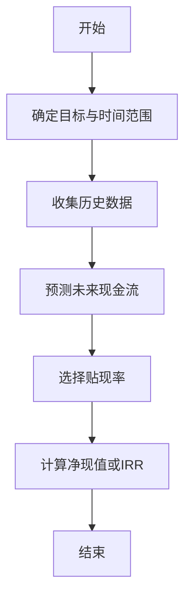

                 


# 巴菲特的现金流分析：量子金融衍生品的风险评估

---

## 关键词

- 巴菲特
- 现金流分析
- 量子金融
- 衍生品
- 风险评估

---

## 摘要

本文深入探讨了巴菲特的现金流分析方法及其在量子金融衍生品风险评估中的应用。通过分析现金流的核心要素、数学模型，以及量子金融衍生品的定义、分类及其风险来源，本文提出了结合巴菲特现金流分析框架的量子化方法，以创新的风险评估策略应对量子金融市场的挑战。

---

## 正文

### 第一部分：巴菲特的现金流分析基础

#### 第1章：现金流分析概述

##### 1.1 现金流分析的定义与重要性

现金流分析是评估企业财务健康状况的重要工具，它通过分析现金流入和流出，评估企业的盈利能力和偿债能力。巴菲特特别强调现金流分析，认为它是评估企业价值的核心指标。

##### 1.2 现金流分析的核心要素

现金流入包括营业收入、投资收益等，而现金流出则包括购买资产、偿还债务等。现金流净额是流入与流出的差额，反映企业的净现金流量。现金流分析的关键指标包括净现值（NPV）、内部收益率（IRR）等。

##### 1.3 巴菲特现金流分析方法

巴菲特的现金流分析框架包括三步法：预测未来现金流、确定合理的贴现率、计算净现值。这种方法注重现金流的可预测性和稳定性，以评估企业的长期价值。

#### 第2章：现金流的数学模型

##### 2.1 现金流分析的基本公式

净现值（NPV）计算公式为：

$$ NPV = \sum_{t=1}^{n} \frac{CF_t}{(1 + r)^t} $$

其中，$CF_t$ 是第t年的现金流，$r$ 是贴现率。内部收益率（IRR）是使净现值为零的贴现率。

##### 2.2 现金流分析的图表与流程

以下是现金流分析的流程图：



##### 2.3 现金流分析的Python实现

以下是计算净现值的Python代码：

```python
def npv(cash_flows, discount_rate):
    return sum(cash_flow / (1 + discount_rate)**t for t, cash_flow in enumerate(cash_flows))

cash_flows = [100, 200, 300]
discount_rate = 0.1
print(npv(cash_flows, discount_rate))
```

### 第二部分：量子金融衍生品的风险评估

#### 第3章：量子金融衍生品概述

##### 3.1 量子金融衍生品的定义与分类

量子金融衍生品是基于量子计算和量子力学原理设计的金融工具，包括期权、期货等。它们具有量子叠加和纠缠特性，与传统衍生品不同。

##### 3.2 量子金融衍生品的市场现状

当前市场中的量子衍生品类型多样，交易机制复杂，市场规模快速增长。量子衍生品的交易依赖于量子计算技术，提高了交易效率和准确性。

#### 第4章：量子金融衍生品的风险来源

##### 4.1 量子金融衍生品的主要风险

市场风险、利率风险、信用风险和操作风险是量子衍生品的主要风险来源。量子不确定性原理加剧了这些风险的影响。

##### 4.2 量子衍生品风险的量子特性

量子叠加效应导致多个可能结果同时存在，量子纠缠使风险在不同资产间传播，不确定性原理增加了风险预测的难度。

#### 第5章：量子金融衍生品的风险评估方法

##### 5.1 传统风险评估方法的局限性

传统VaR方法依赖历史数据，无法捕捉量子衍生品的量子特性。方差-协方差方法在处理复杂依赖关系时效果有限。

##### 5.2 量子风险评估方法的创新

量子蒙特卡洛模拟和量子态风险评估模型是创新的方法，利用量子计算的优势提高评估效率和准确性。

##### 5.3 巴菲特现金流分析的量子化应用

结合量子计算，巴菲特的现金流分析框架可以应用于量子衍生品的风险评估，提供新的视角和方法。

### 结论

巴菲特的现金流分析方法为量子金融衍生品的风险评估提供了新的思路。通过结合量子计算技术，可以更准确地评估和管理量子衍生品的风险，为投资者和金融机构提供有力支持。

---

## 作者

作者：AI天才研究院/AI Genius Institute & 禅与计算机程序设计艺术 /Zen And The Art of Computer Programming

