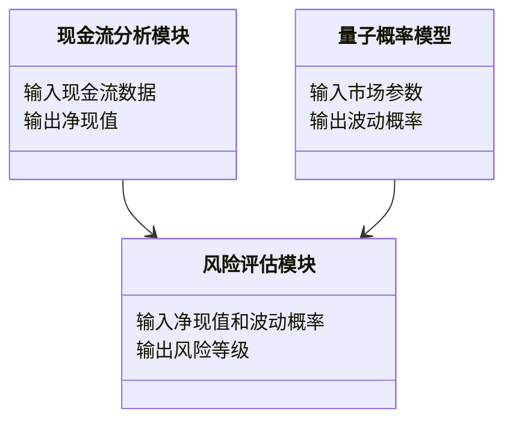
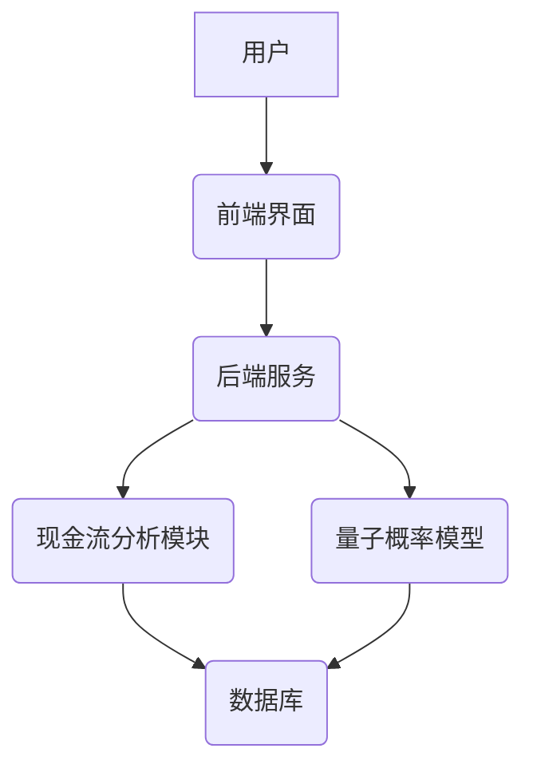
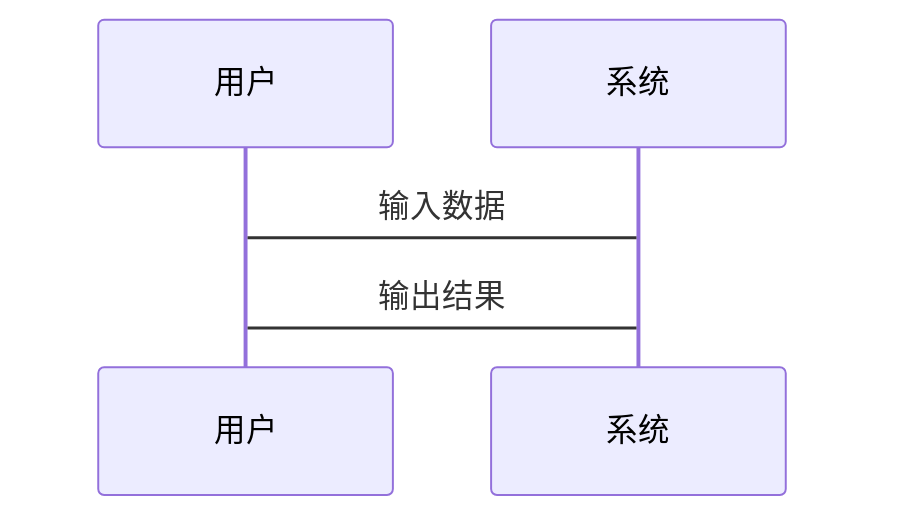

                 


---

# 巴菲特的现金流分析：量子金融衍生品的风险量化

## 关键词：巴菲特，现金流分析，量子金融，金融衍生品，风险量化，数学模型

## 摘要

本文探讨了巴菲特的现金流分析方法及其在量子金融衍生品风险量化中的应用。通过结合传统现金流分析与量子概率模型，提出了一种创新的风险评估方法，为金融衍生品的投资决策提供了新的视角。

---

## 第1章 巴菲特的现金流分析方法

### 1.1 巴菲特投资理念概述

#### 1.1.1 巴菲特的价值投资理念

巴菲特的价值投资理念强调企业内在价值的评估，认为市场价格波动不应影响企业的长期价值。他主张通过分析企业的现金流来评估其内在价值。

#### 1.1.2 巴菲特现金流分析的核心思想

现金流是企业财务健康的核心指标。巴菲特认为，企业未来现金流的稳定性和增长性是决定其价值的关键因素。

#### 1.1.3 巴菲特现金流分析的实践案例

以可口可乐为例，巴菲特通过分析其现金流情况，评估了其长期增长潜力，从而做出投资决策。

### 1.2 量子金融衍生品的基本概念

#### 1.2.1 量子金融的定义与特点

量子金融是一种新兴的金融分析方法，利用量子力学原理来建模金融市场，考虑微观粒子的不确定性。

#### 1.2.2 量子金融与传统金融的区别

传统金融分析基于经典概率，而量子金融利用量子叠加和纠缠效应，能够捕捉金融市场中的非线性波动。

#### 1.2.3 量子金融衍生品的分类与应用

包括量子期权、量子互换等，用于对冲和投资复杂的金融市场风险。

### 1.3 巴菲特现金流分析与量子金融的结合

#### 1.3.1 现金流分析在金融衍生品中的重要性

现金流分析帮助投资者评估衍生品的内在价值和风险。

#### 1.3.2 量子金融衍生品的风险量化需求

传统方法难以捕捉量子波动，因此需要结合量子模型进行风险量化。

#### 1.3.3 巴菲特现金流分析在量子金融中的应用前景

通过结合现金流分析和量子模型，提供更精确的风险评估方法。

---

## 第2章 现金流分析的方法论

### 2.1 现金流分析的基本原理

#### 2.1.1 现金流的定义与分类

现金流分为经营活动、投资活动和筹资活动的现金流，是企业财务状况的重要指标。

#### 2.1.2 现金流的时间价值与风险评估

现金流的时间价值需要考虑资金的时间价值和风险因素。

#### 2.1.3 现金流分析的核心步骤

包括数据收集、分析、预测和评估四个步骤。

### 2.2 巴菲特现金流分析的三步法

#### 2.2.1 第一步：识别企业现金流的来源

分析企业的主要现金流来源，如营业收入、投资收益等。

#### 2.2.2 第二步：评估现金流的质量与稳定性

评估现金流的持续性和稳定性，判断企业的财务健康状况。

#### 2.2.3 第三步：预测现金流的未来变化

基于历史数据和市场趋势，预测未来现金流的变化情况。

### 2.3 现金流分析的数学模型

#### 2.3.1 现金流净现值（NPV）公式

$$ NPV = \sum_{t=1}^{n} \frac{CF_t}{(1+r)^t} $$

其中，\( CF_t \) 是第t期的现金流，\( r \) 是折现率。

#### 2.3.2 内部收益率（IRR）公式

$$ IRR = r \text{ 使得 } NPV = 0 $$

IRR是使净现值为零的折现率，用于评估投资项目的盈利能力。

### 2.4 本章小结

现金流分析是评估企业价值的重要工具，巴菲特的三步法提供了系统的分析框架。

---

## 第3章 量子金融衍生品的风险量化原理

### 3.1 量子概率与金融风险

#### 3.1.1 量子概率的基本概念

量子概率基于量子叠加和纠缠原理，考虑事件的不确定性。

#### 3.1.2 量子概率在金融风险评估中的应用

用于捕捉金融市场中的非线性波动和不确定性。

#### 3.1.3 量子概率与传统概率的区别

传统概率基于独立事件，而量子概率考虑事件的相互作用。

### 3.2 量子金融衍生品的波动性分析

#### 3.2.1 量子波动性的定义

金融市场的波动性可以用量子概率模型来描述。

#### 3.2.2 量子波动性对衍生品风险的影响

波动性越大，衍生品的风险越高。

#### 3.2.3 量子波动性的数学模型

$$ P(\text{波动性}) = \sqrt{p(1-p)} $$

其中，\( p \) 是波动性的概率。

### 3.3 量子金融衍生品的风险量化

#### 3.3.1 量子风险模型的构建

基于量子概率和现金流分析，构建风险量化模型。

#### 3.3.2 量子风险模型的应用

用于评估衍生品的风险暴露和潜在损失。

#### 3.3.3 量子风险模型的优势

能够捕捉传统模型无法捕捉的非线性风险因素。

### 3.4 本章小结

量子金融衍生品的风险量化需要结合量子概率和现金流分析，提供更精确的风险评估。

---

## 第4章 风险量化模型

### 4.1 风险量化模型的构建

#### 4.1.1 数学模型的选择

选择合适的量子概率模型和现金流分析模型。

#### 4.1.2 模型参数的确定

确定模型中的参数，如波动率、相关系数等。

### 4.2 风险量化模型的实现

#### 4.2.1 模型的输入与输出

输入包括现金流数据和市场参数，输出为风险评估结果。

#### 4.2.2 模型的实现步骤

包括数据预处理、模型训练和结果分析。

### 4.3 模型的验证与优化

#### 4.3.1 模型的验证方法

通过回测和压力测试验证模型的准确性。

#### 4.3.2 模型的优化策略

调整参数和模型结构以提高预测精度。

### 4.4 本章小结

构建有效的风险量化模型是实现准确风险评估的关键。

---

## 第5章 系统分析与架构设计

### 5.1 项目介绍

本项目旨在开发一个基于量子金融衍生品的风险量化系统。

### 5.2 系统功能设计

#### 5.2.1 领域模型



#### 5.2.2 系统架构



### 5.3 系统接口设计

#### 5.3.1 输入接口

包括现金流数据输入和市场参数输入。

#### 5.3.2 输出接口

包括风险评估结果输出和日志输出。

### 5.4 系统交互设计

#### 5.4.1 用户与系统交互流程

用户输入数据，系统进行分析并输出结果。

#### 5.4.2 交互流程图



### 5.5 本章小结

系统架构设计为实现风险量化提供了框架支持。

---

## 第6章 项目实战

### 6.1 环境安装

需要安装Python、NumPy、Mermaid等工具。

### 6.2 核心代码实现

#### 6.2.1 现金流分析模块

```python
def calculate_npv(cash_flows, discount_rate):
    return sum(cf / (1 + discount_rate)**t for t, cf in enumerate(cash_flows))
```

#### 6.2.2 量子概率模型

```python
import numpy as np
def quantum_probability(p):
    return np.sqrt(p * (1 - p))
```

### 6.3 案例分析

以某金融衍生品为例，进行现金流分析和量子概率计算，评估其风险等级。

### 6.4 项目小结

通过项目实战，验证了模型的有效性和实用性。

---

## 第7章 总结与展望

### 7.1 本章总结

本文探讨了巴菲特现金流分析与量子金融衍生品风险量化的方法，构建了数学模型并进行了系统设计。

### 7.2 实际应用中的注意事项

模型的参数选择和数据质量影响结果准确性。

### 7.3 未来的发展方向

探索更复杂的量子模型和多因素分析方法。

### 7.4 最佳实践 tips

选择合适工具，确保数据质量和模型准确性。

### 7.5 本章小结

未来的研究将进一步完善模型，提高风险评估的精确性。

---

## 作者：AI天才研究院 & 禅与计算机程序设计艺术

---

本文结合了巴菲特的现金流分析方法和量子金融衍生品的风险量化，通过系统的方法和模型构建，为金融投资提供了新的思路。

