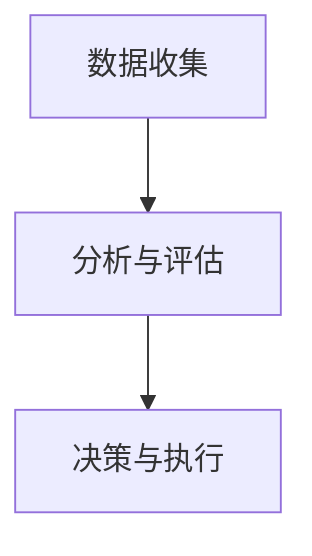

                 


# 巴菲特的现金管理哲学：保持流动性与把握机会的平衡

> 关键词：巴菲特，现金管理，流动性，投资机会，价值投资

> 摘要：本文深入探讨了巴菲特的现金管理哲学，分析了他在保持流动性的同时如何把握投资机会。通过详细阐述流动性和机会之间的平衡策略，结合数学模型和实际案例，本文为读者提供了理解和应用巴菲特投资哲学的实用指南。

---

# 第1章：巴菲特的投资哲学与现金管理

## 1.1 巴菲特的投资哲学

### 1.1.1 巴菲特的生平与投资理念
沃伦·巴菲特（Warren Buffett）是全球最著名的投资者之一，他的投资哲学以价值投资为核心。巴菲特强调购买低于内在价值的股票，并长期持有。他的成功源于对基本面分析的深刻理解和对风险的严格控制。

### 1.1.2 巴菲特的价值投资原则
巴菲特的价值投资原则包括以下几点：
1. **安全边际**：买入价格远低于内在价值的资产，以降低风险。
2. **长期持有**：避免频繁交易，减少交易成本。
3. **集中投资**：将资金集中在少数优质资产上，而不是分散投资。

### 1.1.3 现金管理的重要性
巴菲特认为，现金是企业的“氧气”，没有足够的现金储备，企业无法应对突发事件和市场波动。

---

## 1.2 现金管理的核心原则

### 1.2.1 现金在投资组合中的角色
现金是投资组合的重要组成部分，起到缓冲和灵活应对市场变化的作用。

### 1.2.2 流动性与机会的平衡
巴菲特强调在保持流动性的同时，抓住投资机会。他通常会保留一部分现金用于投资优质资产，同时确保在市场恐慌时能够迅速行动。

### 1.2.3 现金管理的长期与短期目标
短期目标：应对突发事件和市场波动；长期目标：抓住长期投资机会。

---

# 第2章：流动性的概念与管理策略

## 2.1 流动性的定义与重要性

### 2.1.1 流动性的定义
流动性指资产能够迅速转换为现金而不损失价值的能力。

### 2.1.2 流动性在投资中的作用
1. 应对紧急情况。
2. 抓住投资机会。
3. 降低投资组合的整体风险。

### 2.1.3 不同资产类别的流动性分析
1. 现金：最高流动性。
2. 股票：流动性较高，但取决于市场情况。
3. 债券：流动性次于现金和股票。

---

## 2.2 巴菲特的流动性管理策略

### 2.2.1 保持足够的现金储备
巴菲特通常会将部分资金保留为现金，以应对市场波动和投资机会。

### 2.2.2 现金储备的用途
1. 投资优质资产。
2. 应对突发事件。
3. 追加投资。

### 2.2.3 现金储备的动态调整
根据市场环境和投资机会调整现金储备比例。

---

# 第3章：机会识别与把握

## 3.1 投资机会的定义与分类

### 3.1.1 投资机会的定义
投资机会指在特定市场条件下，能够以低于内在价值的价格购买优质资产的机会。

### 3.1.2 不同类型的投资机会
1. 股票：低估的优质公司。
2. 债券：高收益债券。
3. 其他资产：房地产、私募股权等。

### 3.1.3 机会识别的关键因素
1. 资产的内在价值。
2. 市场情绪。
3. 财务状况。

---

## 3.2 巴菲特的机会识别方法

### 3.2.1 价值投资的核心理念
买入低于内在价值的资产，长期持有。

### 3.2.2 股票选择的标准
1. 股票价格低于其内在价值。
2. 公司具有持续盈利能力。
3. 公司管理层优秀。

### 3.2.3 抓住市场恐慌的机会
巴菲通常在市场恐慌时买入优质资产，因为他认为这是价值投资者的最佳时机。

---

# 第4章：数学模型与投资决策

## 4.1 股息率与投资决策

### 4.1.1 股息率的定义
股息率是股票的股息与股票价格的比率，用于衡量股票的投资回报。

### 4.1.2 股息率的计算公式
$$ 股息率 = \frac{每股股息}{股票价格} $$

### 4.1.3 股息率与投资决策的关系
巴菲特通常关注高股息率的股票，因为它们具有较高的投资价值。

---

## 4.2 市盈率与投资决策

### 4.2.1 市盈率的定义
市盈率是股票价格与每股收益的比率，用于衡量股票的估值。

### 4.2.2 市盈率的计算公式
$$ 市盈率 = \frac{股票价格}{每股收益} $$

### 4.2.3 市盈率与投资决策的关系
巴菲特通常寻找市盈率低于行业平均水平的股票。

---

# 第5章：系统分析与架构设计

## 5.1 投资决策的系统架构

### 5.1.1 系统功能设计
1. 数据收集：收集市场数据和公司财务数据。
2. 分析与评估：评估资产的内在价值。
3. 决策与执行：根据分析结果做出投资决策。

### 5.1.2 系统架构图


### 5.1.3 系统接口设计
1. 数据接口：与数据源对接。
2. 用户接口：供用户查看分析结果。

---

# 第6章：项目实战

## 6.1 环境安装
安装必要的工具和软件，例如Python和Pandas库。

## 6.2 核心实现

### 6.2.1 股票筛选
使用Python代码筛选股息率高于行业平均水平的股票。

```python
import pandas as pd

# 假设df是股票数据
def screen_stocks(df, industry_avg_dividend):
    df['筛选结果'] = df['股息率'] > industry_avg_dividend
    return df[df['筛选结果']]
```

### 6.2.2 投资组合构建
根据筛选结果构建投资组合，并计算其预期收益。

---

# 第7章：总结与展望

## 7.1 最佳实践
1. 保持足够的现金储备。
2. 抓住市场恐慌中的投资机会。
3. 长期持有优质资产。

## 7.2 小结
巴菲特的现金管理哲学强调流动性与机会的平衡，这为投资者提供了宝贵的指导。

## 7.3 注意事项
1. 投资需谨慎，避免盲目跟风。
2. 定期评估投资组合，及时调整。

## 7.4 拓展阅读
推荐阅读《巴菲特传》和《投资学基础》。

---

# 作者：AI天才研究院 & 禅与计算机程序设计艺术

---

通过以上结构，文章系统地介绍了巴菲特的现金管理哲学，结合理论分析和实际案例，帮助读者更好地理解和应用这些策略。

