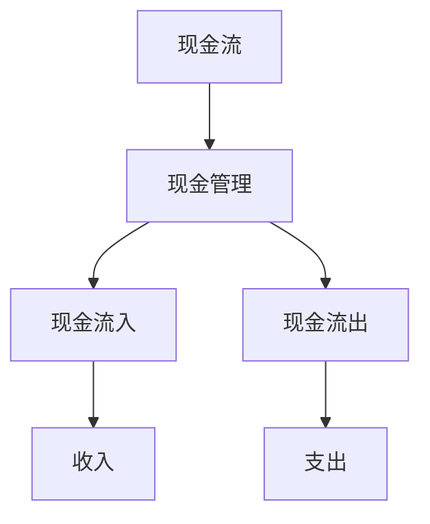
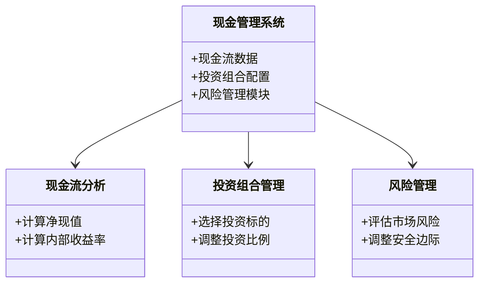
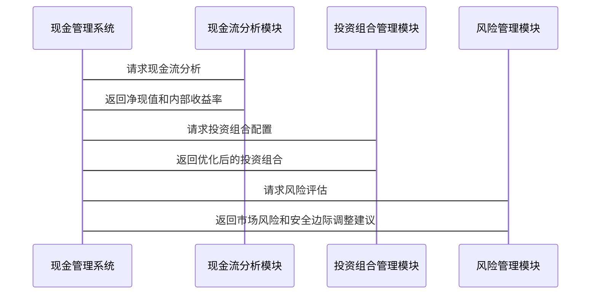

                 


# 巴菲特的现金管理策略

> 关键词：巴菲特，现金管理，投资策略，风险管理，价值投资，安全边际

> 摘要：本文将深入探讨巴菲特的现金管理策略，从其投资理念、核心原则到具体的数学模型和系统架构，结合实例分析，全面解析巴菲特如何通过科学的现金管理实现长期投资收益。

---

## 第一部分: 巴菲特的现金管理策略概述

### 第1章: 巴菲特与现金管理概述

#### 1.1 巴菲特的生平与投资理念
- 1.1.1 巴菲特的早期经历
  - 青少年时期的投资启蒙
  - 哈佛大学的学术背景
- 1.1.2 巴菲特的投资哲学
  - 价值投资的核心理念
  - 长期持有与复利效应
- 1.1.3 巴菲特对现金管理的重视
  - 现金管理在投资组合中的地位
  - 现金储备的用途与风险控制

#### 1.2 现金管理的核心概念
- 1.2.1 现金管理的定义
  - 现金流的定义与分类
  - 现金管理的目标与原则
- 1.2.2 现金管理的边界与外延
  - 现金流的时间价值
  - 现金流的风险评估
- 1.2.3 现金管理的系统性与目标性
  - 现金管理的可操作性
  - 现金管理的动态调整

#### 1.3 巴菲特现金管理策略的特点
- 1.3.1 长期投资视角
  - 现金管理与长期投资的结合
  - 投资组合的时间维度分析
- 1.3.2 价值投资原则
  - 估值分析与安全边际
  - 股票选择的标准与策略
- 1.3.3 安全边际策略
  - 安全边际的概念与应用
  - 现金储备与风险管理

#### 1.4 本章小结
- 本章总结了巴菲特的生平及其投资理念，重点分析了现金管理的核心概念和特点，为后续章节奠定了理论基础。

---

## 第二部分: 巴菲特现金管理策略的核心原理

### 第2章: 巴菲特现金管理策略的核心概念与联系

#### 2.1 核心概念原理
- 2.1.1 现金流的定义与分类
  - 现金流入与现金流出的区分
  - 现金流的时间价值与风险评估
- 2.1.2 现金流的时间价值
  - 现金流的现值与终值计算
  - 利息与投资回报的关系
- 2.1.3 现金流的风险评估
  - 风险与收益的权衡
  - 投资组合的风险分散策略

#### 2.2 核心概念属性对比表格
| 概念       | 时间性 | 数量性 | 风险性 |
|------------|--------|--------|--------|
| 现金流     | 是     | 是     | 是     |
| 现金管理   | 是     | 是     | 是     |

#### 2.3 ER实体关系图（Mermaid流程图）



### 第3章: 巴菲特现金管理策略的数学模型与公式

#### 3.1 现金流的数学模型
- 3.1.1 现金流的净现值计算
  $$ NPV = \sum_{t=1}^{n} \frac{CF_t}{(1+r)^t} $$
- 3.1.2 内部收益率计算
  $$ IRR = r \text{ 使得 } NPV = 0 $$

#### 3.2 巴菲特投资组合的数学公式
- 3.2.1 投资组合的期望收益
  $$ E(R_p) = \sum_{i=1}^{n} w_i E(R_i) $$
- 3.2.2 投资组合的风险（方差）
  $$ Var(R_p) = \sum_{i=1}^{n} \sum_{j=1}^{n} w_i w_j Cov(R_i, R_j) $$

#### 3.3 实例分析
- 3.3.1 现金流实例
  - 假设某公司未来三年现金流分别为$100, $200, $300，贴现率为10%。
  - 计算净现值NPV：$$ NPV = \frac{100}{1.1} + \frac{200}{1.1^2} + \frac{300}{1.1^3} $$

---

## 第三部分: 巴菲特现金管理策略的系统架构与实战案例

### 第4章: 巴菲特现金管理策略的系统架构设计

#### 4.1 问题场景介绍
- 现金管理系统的功能需求
- 巴菲特策略的应用场景

#### 4.2 系统功能设计（领域模型Mermaid类图）



#### 4.3 系统架构设计（Mermaid架构图）


#### 4.4 系统接口设计
- 现金流分析接口
- 投资组合管理接口
- 风险管理接口

#### 4.5 系统交互设计（Mermaid序列图）



### 第5章: 巴菲特现金管理策略的实战案例

#### 5.1 环境安装
- 安装Python编程环境
- 安装相关库（numpy, pandas, matplotlib）

#### 5.2 核心实现源代码
```python
import numpy as np
import pandas as pd

def calculate_npvcash_flows(cf, r):
    return np.npv(r, *cf)

def calculate_irr(cf):
    return np.irr(cf)

# 示例数据
cash_flows = [-100, 200, 300]
rate = 0.1

npv = calculate_npvcash_flows(cash_flows, rate)
irr = calculate_irr(cash_flows)

print(f"净现值: {npv}")
print(f"内部收益率: {irr}")
```

#### 5.3 代码应用解读与分析
- 函数`calculate_npvcash_flows`用于计算净现值
- 函数`calculate_irr`用于计算内部收益率
- 示例数据：初始投资-100，第一年现金流200，第二年现金流300，贴现率10%
- 输出结果：净现值和内部收益率

#### 5.4 实际案例分析
- 某公司投资项目的现金流分析
- 计算净现值和内部收益率，评估项目可行性

#### 5.5 项目小结
- 巴菲特现金管理策略的系统架构与实战案例分析
- 现金管理系统的功能实现与优化建议

---

## 第四部分: 巴菲特现金管理策略的高级应用与总结

### 第6章: 巴菲特现金管理策略的高级策略

#### 6.1 动态调整与风险管理
- 现金管理的动态调整策略
- 市场波动下的风险管理措施

#### 6.2 税务优化与资产配置
- 税务优化对现金管理的影响
- 资产配置的优化策略

#### 6.3 巴菲特策略的拓展应用
- 巴菲特策略在不同市场环境下的应用
- 投资组合的动态优化

### 第7章: 总结与展望

#### 7.1 总结
- 巴菲特现金管理策略的核心思想
- 系统架构与数学模型的实现

#### 7.2 展望
- 现金管理策略的未来发展趋势
- 巴菲特策略的创新与应用

---

## 作者：AI天才研究院/AI Genius Institute & 禅与计算机程序设计艺术 /Zen And The Art of Computer Programming

---

通过以上结构化的目录大纲，我们可以逐步深入探讨巴菲特的现金管理策略，从理论到实践，从基础到高级，系统地分析其策略的数学模型、系统架构和实战案例，最终帮助读者掌握巴菲特的现金管理智慧。

