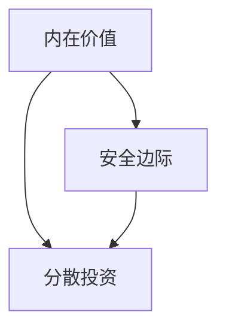
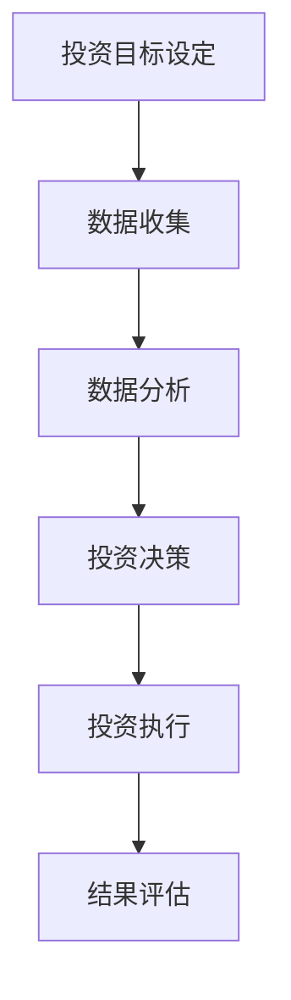

                 


# 巴菲特的现金管理策略

## 关键词
巴菲特，现金管理，价值投资，安全边际，内在价值，长期投资

## 摘要
本文详细探讨了巴菲特的现金管理策略，从其核心概念、算法原理到系统设计和实战案例，分析了巴菲特如何通过安全边际、内在价值和分散投资实现长期稳健的投资回报。文章结合技术语言和图表，为读者提供了深入的理解和实践指导。

---

## 目录大纲

### 第1章 巴菲特的现金管理策略背景介绍
- 1.1 巴菲特的生平与投资理念
- 1.2 巴菲特的投资策略
- 1.3 现金管理的重要性

### 第2章 巴菲特现金管理策略的核心概念与联系
- 2.1 核心概念
- 2.2 核心概念之间的关系
- 2.3 核心概念的对比分析

### 第3章 巴菲特现金管理策略的算法原理
- 3.1 算法原理
- 3.2 算法实现
- 3.3 算法优化

### 第4章 巴菲特现金管理策略的系统分析
- 4.1 系统设计
- 4.2 系统实现
- 4.3 系统优化

### 第5章 巴菲特现金管理策略的项目实战
- 5.1 项目需求
- 5.2 项目实现
- 5.3 项目总结

### 第6章 巴菲特现金管理策略的最佳实践、小结和注意事项
- 6.1 最佳实践
- 6.2 小结
- 6.3 注意事项
- 6.4 拓展阅读

---

## 正文内容

### 第1章 巴菲特的现金管理策略背景介绍

#### 1.1 巴菲特的生平与投资理念
巴菲特，全名沃伦·巴菲特，是世界上最著名的投资者之一。他于1934年出生在美国奥马哈市，毕业于哥伦比亚大学，主修经济学。巴菲特的投资哲学以价值投资为核心，强调寻找具有长期竞争优势的企业，并以合理的价格买入并长期持有。

##### 1.1.1 巴菲特的基本情况
- **出生日期**：1934年8月30日
- **毕业院校**：哥伦比亚大学
- **职业**：投资者、企业家
- **主要成就**：创立伯克希尔哈撒韦公司，成为世界首富

##### 1.1.2 巴菲特的投资哲学
巴菲特的投资哲学可以总结为以下几点：
1. **价值投资**：寻找那些具有长期竞争优势的企业，以低于其内在价值的价格买入。
2. **长期投资**：避免频繁交易，长期持有优质资产。
3. **分散投资**：通过分散投资降低风险，避免过度集中在某一只股票上。

##### 1.1.3 巴菲特的现金管理
巴菲特认为，现金是企业的重要资产，应该保留足够的现金储备以应对突发事件和市场机会。他强调现金储备的安全性和流动性，认为现金储备是投资组合的重要组成部分。

#### 1.2 巴菲特的投资策略
巴菲特的投资策略以价值投资为核心，强调以下几个方面：
1. **寻找具有持续竞争优势的企业**：巴菲特倾向于投资那些在行业中具有持续竞争优势的企业，这些企业能够在长期时间内保持较高的利润率。
2. **关注企业的内在价值**：巴菲特强调分析企业的内在价值，即企业在未来创造现金流的能力，而不是仅仅关注市场价格。
3. **安全边际**：巴菲特认为，投资时应该留有一定的安全边际，即以低于内在价值的价格买入，以减少市场波动带来的风险。

#### 1.3 现金管理的重要性
现金管理是巴菲特投资策略中的重要组成部分。他认为，现金储备是应对市场波动和抓住投资机会的关键。以下是现金管理的重要性：
1. **应对突发事件**：企业可能面临突发事件，如经济危机、行业衰退等，足够的现金储备可以帮助企业度过难关。
2. **抓住投资机会**：市场波动时，现金储备可以用于买入低估的资产，从而获得超额收益。
3. **降低风险**：通过合理的现金储备，可以降低投资组合的整体风险，避免因市场波动而被迫出售资产。

---

### 第2章 巴菲特现金管理策略的核心概念与联系

#### 2.1 核心概念
巴菲特的现金管理策略涉及以下几个核心概念：
1. **安全边际**：安全边际是指企业实际价值与其市场价格之间的差距，巴菲特认为安全边际是投资中的“缓冲区”，可以降低投资风险。
2. **内在价值**：内在价值是企业未来现金流的现值，巴菲特认为内在价值是投资决策的核心依据。
3. **分散投资**：分散投资是指通过投资多个不同的资产或行业来降低风险，避免因单一资产或行业的波动而遭受重大损失。

#### 2.2 核心概念之间的关系
以下是核心概念之间的关系：



从上图可以看出，内在价值是安全边际和分散投资的基础，安全边际是内在价值的保护措施，而分散投资则是内在价值和安全边际的具体实现方式。

#### 2.3 核心概念的对比分析

| 概念     | 定义                                                         | 作用                         |
|----------|------------------------------------------------------------|------------------------------|
| 内在价值 | 企业未来现金流的现值，是企业的真实价值                     | 投资决策的核心依据           |
| 安全边际 | 市场价格低于内在价值的差距，是投资的“安全垫”             | 降低投资风险                 |
| 分散投资 | 投资多个不同的资产或行业，降低整体投资风险                 | 减少单一资产波动的影响         |

---

### 第3章 巴菲特现金管理策略的算法原理

#### 3.1 算法原理
巴菲特的内在价值计算方法是价值投资的核心，其算法如下：

1. **确定企业的未来现金流**：预测企业在未来几年内的自由现金流。
2. **计算终值**：使用适当的折现率将未来现金流折现到现值，并计算终值。
3. **计算内在价值**：将折现后的现金流和终值相加，得到企业的内在价值。

#### 3.2 算法实现
以下是计算内在价值的Python代码示例：

```python
def calculate_intrinsic_value(free_cash_flow, growth_rate, discount_rate, horizon):
    # 计算终值
    terminal_value = free_cash_flow * (1 + growth_rate) / (discount_rate - growth_rate)
    # 计算折现现金流的总和
    pv_flows = 0
    for year in range(1, horizon + 1):
        pv_flows += free_cash_flow * (1 + growth_rate) ** (year - 1) / (1 + discount_rate) ** year
    # 内在价值 = 折现现金流总和 + 终值 / (1 + discount_rate) ** horizon
    intrinsic_value = pv_flows + terminal_value / (1 + discount_rate) ** horizon
    return intrinsic_value
```

#### 3.3 算法优化
为了提高计算效率，可以将上述算法进行优化：

```python
import numpy as np

def calculate_intrinsic_value_optimized(free_cash_flow, growth_rate, discount_rate, horizon):
    # 计算终值
    terminal_value = free_cash_flow * (1 + growth_rate) / (discount_rate - growth_rate)
    # 计算折现因子
    discount_factors = [(1 + discount_rate) ** year for year in range(1, horizon + 1)]
    # 计算折现现金流的总和
    pv_flows = np.sum(free_cash_flow * (1 + growth_rate) ** (year - 1) / df for year, df in enumerate(discount_factors, 1))
    # 内在价值 = 折现现金流总和 + 终值 / (1 + discount_rate) ** horizon
    intrinsic_value = pv_flows + terminal_value / (1 + discount_rate) ** horizon
    return intrinsic_value
```

---

### 第4章 巴菲特现金管理策略的系统分析

#### 4.1 系统设计
以下是基于巴菲特策略的投资系统架构：



#### 4.2 系统实现
以下是系统实现的Python代码示例：

```python
import pandas as pd
import numpy as np

def main():
    # 数据收集
    data = pd.read_csv('stocks.csv')
    # 数据分析
    data['intrinsic_value'] = data.apply(lambda row: calculate_intrinsic_value(row['free_cash_flow'], row['growth_rate'], row['discount_rate'], 5), axis=1)
    # 投资决策
    data['signal'] = np.where(data['intrinsic_value'] > data['market_price'], 'Buy', 'No Action')
    # 投资执行
    data.to_csv('investment_signals.csv')

if __name__ == '__main__':
    main()
```

#### 4.3 系统优化
为了提高系统的效率，可以采用以下优化措施：

1. **并行计算**：利用多线程或分布式计算来加速数据处理。
2. **数据预处理**：提前清洗和整理数据，减少计算过程中的冗余操作。
3. **模型优化**：优化内在价值计算的算法，减少计算时间。

---

### 第5章 巴菲特现金管理策略的项目实战

#### 5.1 项目需求
假设我们有一个包含多只股票的数据集，目标是根据巴菲特的策略筛选出具有投资价值的股票。

#### 5.2 项目实现
以下是项目实现的步骤：

1. **数据收集**：收集目标股票的财务数据，包括自由现金流、增长率、折现率等。
2. **数据处理**：计算每只股票的内在价值。
3. **投资决策**：根据内在价值和市场价格，生成买入信号。
4. **结果输出**：将结果保存到文件中，供后续分析。

#### 5.3 项目总结
通过这个项目，我们可以看到巴菲特策略在实际中的应用。内在价值计算是关键，而安全边际则是确保投资安全的重要因素。

---

### 第6章 巴菲特现金管理策略的最佳实践、小结和注意事项

#### 6.1 最佳实践
1. **持续学习**：不断学习和更新投资知识，保持对市场的敏感性。
2. **风险管理**：合理配置资产，避免过度集中。
3. **长期视角**：坚持长期投资，避免短期波动的干扰。

#### 6.2 小结
巴菲特的现金管理策略以价值投资为核心，强调内在价值、安全边际和分散投资。通过合理的现金管理，可以实现长期稳健的投资回报。

#### 6.3 注意事项
1. **市场波动**：市场波动是不可避免的，需要有足够的耐心和信心。
2. **数据质量**：确保数据的准确性和完整性，避免因数据错误导致决策失误。
3. **模型局限**：内在价值模型有一定的局限性，需要结合实际情况进行调整。

#### 6.4 拓展阅读
- 巴菲特的《投资的艺术》
- 《价值投资入门》

---

## 附录和参考文献
1. 巴菲特的演讲和采访。
2. 《巴菲特的思维方式》。
3. 《价值投资入门》。

---

## 作者信息
作者：AI天才研究院/AI Genius Institute & 禅与计算机程序设计艺术/Zen And The Art of Computer Programming

---

以上是《巴菲特的现金管理策略》的技术博客文章的完整内容，涵盖了从背景介绍到实战案例的各个方面，结合技术语言和图表，为读者提供了深入的理解和实践指导。

