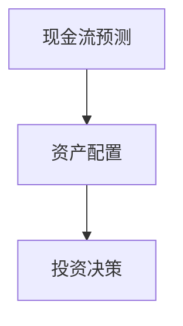
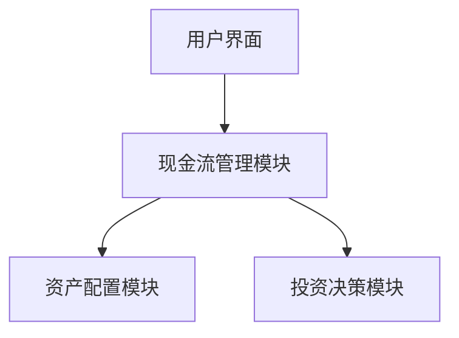
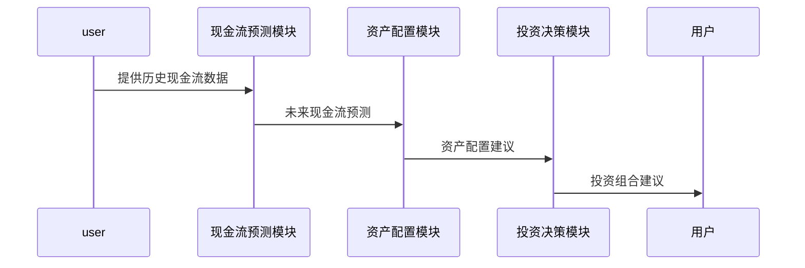

                 

# 巴菲特的现金管理策略：在低利率环境中的调整

## 关键词：巴菲特、现金管理、低利率、价值投资、投资策略、防御性投资

## 摘要：本文深入分析了巴菲特的现金管理策略，特别是在低利率环境下的调整。通过探讨现金流管理、资产配置、价值投资和防御性投资等核心概念，结合数学模型和实际案例，详细阐述了巴菲特的现金管理策略及其在当前经济环境下的应用。文章还提供了系统设计和项目实战，帮助读者更好地理解和应用这些策略。

---

# 第1章: 巴菲特的现金管理策略背景

## 1.1 巴菲特投资理念概述

### 1.1.1 巴菲特的生平与投资哲学

沃伦·巴菲特（Warren Buffett）是全球最著名的投资者之一，他的投资哲学以价值投资为核心。巴菲特的价值投资理念强调购买低于内在价值的股票，并长期持有。他相信市场的短期波动不可预测，但长期趋势可以通过基本面分析来判断。

### 1.1.2 巴菲特的价值投资理念

巴菲特的价值投资理念主要包括以下几点：
1. **安全边际**：购买价格低于内在价值的资产，以确保有足够的安全边际。
2. **长期视角**：投资不是赌博，而是通过持有优质资产来实现长期收益。
3. **集中投资**：将大部分资金投资于少数优质企业，而不是分散投资。

### 1.1.3 巴菲特的长期投资策略

巴菲特的投资策略强调长期性，他更关注企业的内在价值，而不是市场的短期波动。他认为，市场的短期波动为长期投资者提供了廉价买入优质资产的机会。

---

## 1.2 现金管理的重要性

### 1.2.1 现金在投资组合中的角色

现金是投资组合的重要组成部分，它具有流动性高、风险低的特点。在投资组合中，现金可以用于应对突发事件、把握投资机会或规避市场风险。

### 1.2.2 现金管理的核心原则

1. **流动性原则**：确保有足够的现金应对短期需求。
2. **安全性原则**：避免将现金投资于高风险资产。
3. **收益性原则**：在保证安全性的前提下，尽可能提高现金的收益。

### 1.2.3 巴菲特对现金管理的重视

巴菲特认为，现金是企业的“氧气”，在市场低迷时期尤为重要。他倾向于在市场低迷时持有更多现金，以利用廉价的机会进行投资。

---

## 1.3 低利率环境下的投资挑战

### 1.3.1 低利率环境的定义与特征

低利率环境是指中央银行将基准利率降至极低水平，以刺激经济增长。在低利率环境下，债券收益率较低，股票相对更具吸引力。

### 1.3.2 低利率对传统投资策略的影响

1. **债券收益率下降**：债券投资者面临再投资风险。
2. **股票估值上升**：低利率通常会导致股票市盈率上升。
3. **资产配置挑战**：传统的资产配置策略可能需要调整。

### 1.3.3 巴菲特在低利率环境下的应对策略

1. **增加股票配置**：巴菲特倾向于投资于那些具有稳定现金流和高内在价值的企业。
2. **关注防御性投资**：在低利率环境下，巴菲特更倾向于投资那些具有稳定收益和防御性的企业。
3. **利用市场波动**：通过市场的短期波动，寻找廉价买入的机会。

---

# 第2章: 巴菲特的现金管理策略核心概念

## 2.1 现金流与资产配置

### 2.1.1 现金流的定义与分类

现金流是企业在一定时期内现金的流入和流出。主要包括经营活动现金流、投资活动现金流和筹资活动现金流。

### 2.1.2 现金流在投资中的作用

1. **衡量企业盈利能力**：通过现金流可以更准确地评估企业的盈利能力。
2. **评估企业偿债能力**：现金流可以反映企业的偿债能力。
3. **制定投资决策**：现金流是制定投资决策的重要依据。

### 2.1.3 资产配置的基本原理

资产配置是将资金分配到不同的资产类别中，以实现风险和收益的最优组合。资产配置的基本原理包括确定投资目标、选择资产类别、分配资金比例等。

---

## 2.2 价值投资与现金流分析

### 2.2.1 价值投资的核心要素

价值投资的核心要素包括企业的基本面、财务状况、管理团队和行业前景等。

### 2.2.2 现金流贴现模型的介绍

现金流贴现模型（DCF模型）是一种评估企业内在价值的方法，通过将未来现金流折现到现值来确定企业的价值。

### 2.2.3 巴菲特的现金流分析方法

巴菲特使用现金流贴现模型来评估企业的内在价值，并结合安全边际进行投资决策。

---

## 2.3 巴菲特的防御性投资策略

### 2.3.1 防御性投资的定义

防御性投资是指投资于那些具有稳定收益、低波动性和高防御性的资产。

### 2.3.2 防御性投资的特征

1. **稳定性**：收益稳定，波动性低。
2. **防御性**：能够抵御市场波动的影响。
3. **高分红**：通常具有较高的股息收益率。

### 2.3.3 巴菲特的防御性投资策略

巴菲特倾向于投资于那些具有稳定现金流、高分红和强大竞争优势的企业。

---

# 第3章: 巴菲特的现金管理策略分析

## 3.1 短期现金管理策略

### 3.1.1 短期现金流的预测与管理

短期现金流的预测与管理包括制定预算、监控现金流和调整资金分配等。

### 3.1.2 短期投资工具的选择

短期投资工具包括货币市场基金、短期债券和高流动性股票等。

### 3.1.3 巴菲特的短期现金管理实践

巴菲特通常在市场低迷时持有大量现金，以利用廉价买入的机会。

---

## 3.2 长期现金管理策略

### 3.2.1 长期现金流的规划与管理

长期现金流的规划与管理包括制定长期财务计划、评估企业未来现金流和优化资本结构等。

### 3.2.2 长期资产配置的优化

长期资产配置的优化包括调整股票和债券的比例，以应对市场的变化。

### 3.2.3 巴菲特的长期投资策略

巴菲特的长期投资策略强调持有优质资产，长期持有，避免频繁交易。

---

## 3.3 防御性现金管理策略

### 3.3.1 防御性投资的资产选择

防御性投资的资产选择包括投资于具有稳定收益和高防御性的企业。

### 3.3.2 防御性投资的风险控制

防御性投资的风险控制包括分散投资、严格筛选投资标的和定期评估投资组合等。

### 3.3.3 巴菲特的防御性投资案例

巴菲特在2008年金融危机期间大量买入美国运通和高盛的股票，展现了其防御性投资策略。

---

# 第4章: 巴菲特的现金管理策略数学模型

## 4.1 现金流贴现模型

### 4.1.1 现金流贴现模型的定义

现金流贴现模型是一种通过将未来现金流折现到现值来评估企业内在价值的方法。

### 4.1.2 现金流贴现模型的公式

$$ V = \frac{CF_1}{(1+r)^1} + \frac{CF_2}{(1+r)^2} + \cdots + \frac{CF_n}{(1+r)^n} $$

其中，$CF_i$ 是第i年的现金流，$r$ 是折现率。

### 4.1.3 现金流贴现模型的计算步骤

1. 确定未来现金流。
2. 确定折现率。
3. 计算各年现金流的现值。
4. 求和得到企业价值。

---

## 4.2 股息贴现模型

### 4.2.1 股息贴现模型的定义

股息贴现模型（DDM）是一种通过将未来股息折现到现值来评估股票价值的方法。

### 4.2.2 股息贴现模型的公式

$$ P = \frac{D_1}{(1+r)^1} + \frac{D_2}{(1+r)^2} + \cdots + \frac{D_n}{(1+r)^n} $$

其中，$D_i$ 是第i年的股息，$r$ 是折现率。

### 4.2.3 股息贴现模型的计算步骤

1. 确定未来股息。
2. 确定折现率。
3. 计算各年股息的现值。
4. 求和得到股票价值。

---

# 第5章: 巴菲特的现金管理策略系统分析与架构设计

## 5.1 系统功能设计

### 5.1.1 现金流管理系统模块

1. 现金流预测模块。
2. 资产配置模块。
3. 投资决策模块。

### 5.1.2 系统功能模块图

---

## 5.2 系统架构设计

### 5.2.1 系统架构图

---

## 5.3 系统接口设计

### 5.3.1 现金流预测接口

1. 输入：历史现金流数据。
2. 输出：未来现金流预测。

### 5.3.2 资产配置接口

1. 输入：投资目标、风险偏好。
2. 输出：资产配置建议。

---

## 5.4 系统交互设计

### 5.4.1 现金流管理系统交互图

---

# 第6章: 巴菲特的现金管理策略项目实战

## 6.1 模拟投资案例

### 6.1.1 投资目标

假设我们有100万元资金，目标是在低利率环境下实现长期稳健收益。

### 6.1.2 投资组合构建

1. 30%资金投资于股票。
2. 30%资金投资于债券。
3. 20%资金投资于现金。
4. 20%资金投资于其他资产。

---

## 6.2 投资组合调整

### 6.2.1 市场变化应对

根据市场变化，动态调整投资组合。

### 6.2.2 案例分析

在2020年疫情期间，巴菲特大量买入股票，展现了其防御性投资策略。

---

## 6.3 投资组合表现评估

### 6.3.1 投资收益计算

根据实际投资结果，计算投资组合的收益和风险。

### 6.3.2 性能优化

根据评估结果，优化投资组合。

---

# 第7章: 巴菲特的现金管理策略最佳实践

## 7.1 最佳实践 tips

### 7.1.1 理解巴菲特的投资理念

### 7.1.2 学习现金流分析方法

### 7.1.3 注重长期投资

---

## 7.2 小结

巴菲特的现金管理策略强调长期投资、价值投资和防御性投资。在低利率环境下，投资者应注重现金流分析，优化资产配置，并利用市场波动寻找投资机会。

---

## 7.3 注意事项

### 7.3.1 风险控制

### 7.3.2 市场波动应对

### 7.3.3 资产配置调整

---

## 7.4 拓展阅读

### 7.4.1 巴菲特的经典著作

1. 《巴菲特致股东的信》
2. 《聪明的投资者》

### 7.4.2 相关书籍

1. 《投资学》
2. 《财务报表分析》

---

# 作者：AI天才研究院/AI Genius Institute & 禅与计算机程序设计艺术 /Zen And The Art of Computer Programming

