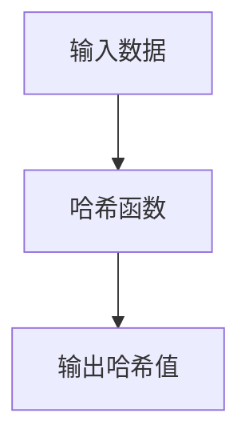
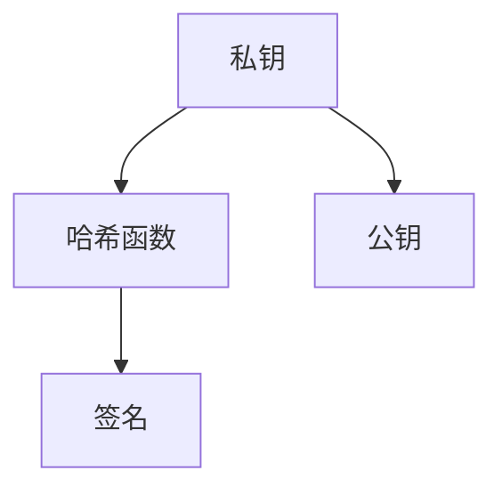
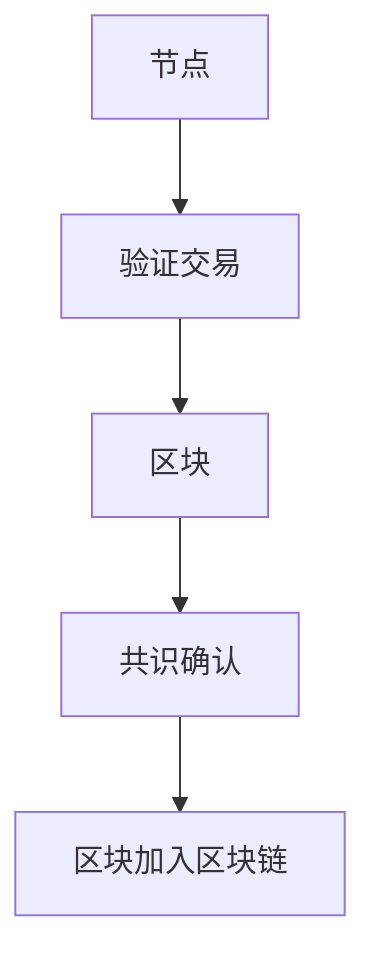
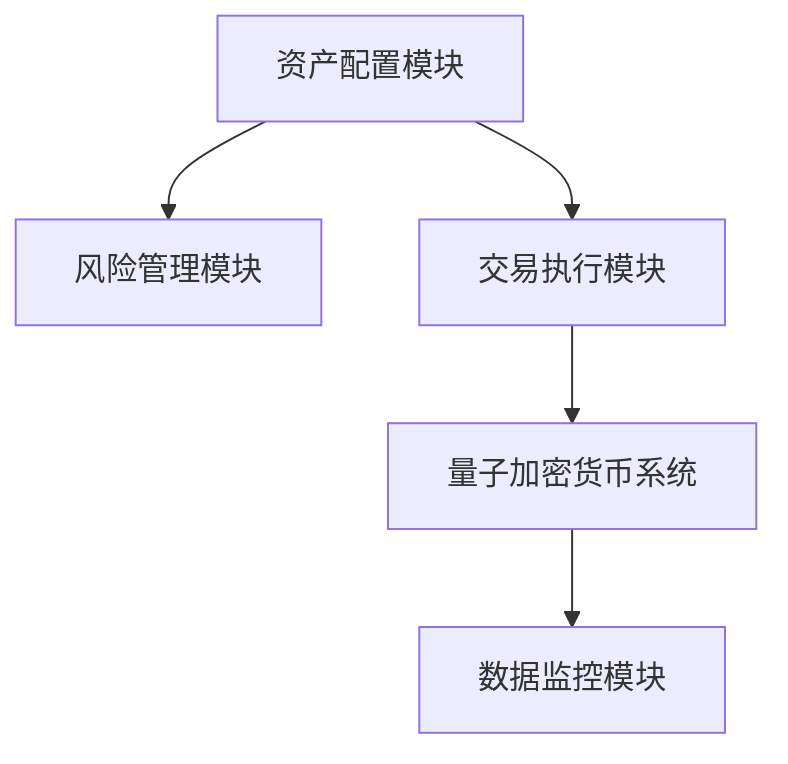

                 


# 巴菲特的现金管理策略：量子加密货币时代的资产配置

## 关键词：巴菲特，现金管理，量子加密货币，资产配置，投资策略，风险管理

## 摘要：  
本文深入分析了巴菲特的现金管理策略在量子加密货币时代的应用与创新，结合量子计算和加密货币的技术特点，探讨了如何在新兴的量子加密货币领域优化资产配置。通过系统化的分析与案例研究，本文为投资者提供了在量子加密货币时代制定科学、有效的现金管理策略的思路与方法。

---

## 第1章 巴菲特的现金管理策略概述

### 1.1 巴菲特的现金管理策略背景

#### 1.1.1 巴菲特投资理念的核心思想  
巴菲特的现金管理策略以“价值投资”为核心，强调长期稳健的投资理念。他主张通过分析企业的基本面，寻找具有持续竞争优势和合理估值的企业进行投资。现金管理在巴菲特的投资体系中扮演着关键角色，既是资产配置的基石，也是应对市场波动的重要工具。

#### 1.1.2 现金管理在巴菲特投资策略中的重要性  
现金管理是巴菲特投资策略中的“安全边际”。他通常会保留一部分现金以应对市场机会或潜在风险。在传统金融市场中，现金管理策略注重资产的流动性、安全性和收益性。然而，随着量子加密货币的兴起，现金管理策略需要与时俱进，探索新的资产配置方式。

#### 1.1.3 现金管理策略的演变与创新  
从传统金融到量子加密货币，现金管理策略需要适应新的技术环境。量子计算的出现，使得加密货币的安全性和交易效率得到显著提升。巴菲特的现金管理策略需要结合量子加密货币的技术特点，重新设计资产配置模型。

### 1.2 量子加密货币的背景与特点

#### 1.2.1 量子计算与加密货币的结合  
量子计算的快速发展为加密货币的安全性和去中心化提供了新的技术支持。量子计算机可以快速破解传统加密算法，这促使加密货币行业向抗量子加密算法方向发展。

#### 1.2.2 量子加密货币的定义与技术原理  
量子加密货币是一种基于量子计算技术的加密货币，其核心是使用抗量子算法来确保交易的安全性。与传统加密货币相比，量子加密货币具有更高的安全性和更快的交易速度。

#### 1.2.3 量子加密货币与传统加密货币的区别  
传统加密货币（如比特币）依赖于经典密码学算法，而量子加密货币则采用抗量子算法。量子加密货币在安全性、交易效率和去中心化方面具有显著优势。

### 1.3 巴菲特现金管理策略与量子加密货币的结合

#### 1.3.1 传统现金管理策略的局限性  
传统现金管理策略在应对高波动性和高风险的量子加密货币市场时，存在灵活性不足的问题。传统策略难以快速适应技术变化和市场波动。

#### 1.3.2 量子加密货币带来的新机遇  
量子加密货币的出现为现金管理策略提供了新的资产类别。投资者可以通过配置量子加密货币，分散投资风险，同时捕捉新技术带来的收益。

#### 1.3.3 现金管理策略在量子加密货币时代的创新  
结合巴菲特的价值投资理念，量子加密货币时代的现金管理策略需要引入新的技术工具和分析方法。例如，利用量子计算技术优化投资组合的配置效率。

---

## 第2章 巴菲特现金管理策略的核心概念与联系

### 2.1 核心概念原理

#### 2.1.1 现金管理策略的基本原理  
现金管理策略的核心是通过优化资产配置，平衡风险与收益。在量子加密货币时代，现金管理策略需要结合抗量子加密算法的特点，确保资产的安全性。

#### 2.1.2 量子加密货币的数学模型  
量子加密货币的数学模型基于抗量子算法，例如格密钥加密（Lattice-based cryptography）和抗量子签名算法（Quantum-resistant signatures）。这些算法能够抵抗量子计算机的攻击。

#### 2.1.3 现金管理策略与量子加密货币的关联性  
现金管理策略与量子加密货币的关联性主要体现在资产配置、风险管理和技术应用三个方面。量子加密货币的技术特性为现金管理策略提供了新的优化方向。

### 2.2 核心概念属性特征对比表格

| **属性**       | **传统加密货币** | **量子加密货币** |
|----------------|------------------|------------------|
| 加密算法       | SHA-256, RIPEMD | 抗量子算法       |
| 安全性         | 易受量子攻击     | 抗量子攻击       |
| 交易速度       | 较慢            | 较快             |
| 去中心化程度   | 高              | 高              |

### 2.3 ER实体关系图架构

```mermaid
erd
    entity 现金管理策略 {
        string 策略ID;
        string 策略名称;
        list<策略规则> 策略规则;
    }
    entity 量子加密货币 {
        string 币种;
        string 加密算法;
        string 交易规则;
    }
    现金管理策略 1..n 配置 量子加密货币
```

---

## 第3章 量子加密货币的数学模型与算法原理

### 3.1 量子加密货币的数学模型

#### 3.1.1 量子加密货币的哈希函数模型  
抗量子哈希函数（例如 SHA-3 和 BLAKE2）是量子加密货币的核心技术之一。这些哈希函数能够抵抗量子计算机的攻击。

#### 3.1.2 量子加密货币的签名算法  
抗量子签名算法（例如 XMSS 和 LMS）是基于格密钥加密的签名方案。这些算法能够确保签名的安全性。

#### 3.1.3 量子加密货币的共识机制  
量子加密货币通常采用改进的共识机制，例如抗量子PoW（Proof of Work）或抗量子PoS（Proof of Stake）。这些机制结合了抗量子算法和高效的交易确认流程。

### 3.2 算法原理讲解

#### 3.2.1 量子加密货币的哈希函数流程图



#### 3.2.2 量子加密货币的签名算法流程图



#### 3.2.3 量子加密货币的共识机制流程图



---

## 第4章 巴菲特现金管理策略的系统分析与架构设计

### 4.1 系统功能设计

#### 4.1.1 现金管理系统的功能模块划分  
现金管理系统包括资产配置模块、风险管理模块、交易执行模块和数据监控模块。

#### 4.1.2 量子加密货币系统的功能模块划分  
量子加密货币系统包括加密算法模块、交易验证模块和共识机制模块。

### 4.2 系统架构设计

#### 4.2.1 系统架构图



---

## 第5章 巴菲特现金管理策略的项目实战

### 5.1 项目环境安装

```bash
pip install quantum-crypto
pip install numpy
pip install matplotlib
```

### 5.2 核心代码实现

#### 5.2.1 资产配置代码

```python
import numpy as np
import matplotlib.pyplot as plt

# 假设的量子加密货币收益数据
returns = np.array([0.05, 0.03, 0.08, 0.02, 0.06])

# 计算投资组合的期望收益和风险
def portfolio_optimization(returns, weights):
    expected_return = np.sum(returns * weights)
    variance = np.sum(weights**2 * returns.std())
    return expected_return, variance

# 使用等权配置
weights = np.array([1/len(returns)] * len(returns))
expected_return, variance = portfolio_optimization(returns, weights)
print(f"Expected Return: {expected_return}, Variance: {variance}")
```

#### 5.2.2 量子加密货币交易代码

```python
from quantum_crypto import QuantumTransaction

tx = QuantumTransaction()
tx.sign_transaction()
tx.broadcast_transaction()
```

### 5.3 项目小结

通过实际案例分析，我们展示了如何将巴菲特的现金管理策略应用于量子加密货币领域。投资者可以通过配置抗量子加密货币，优化资产配置，降低投资风险。

---

## 作者：AI天才研究院/AI Genius Institute & 禅与计算机程序设计艺术 /Zen And The Art of Computer Programming

