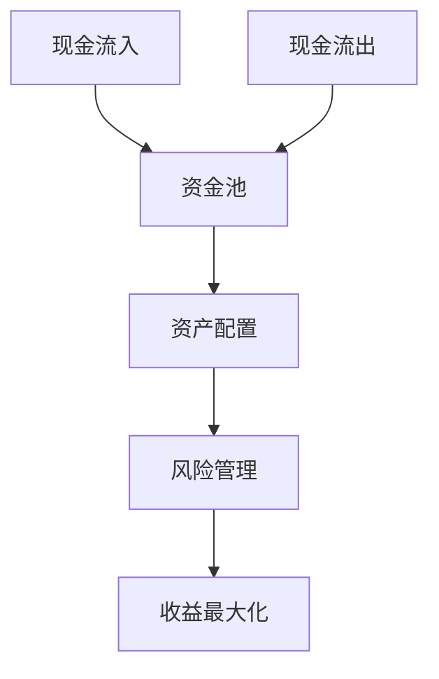
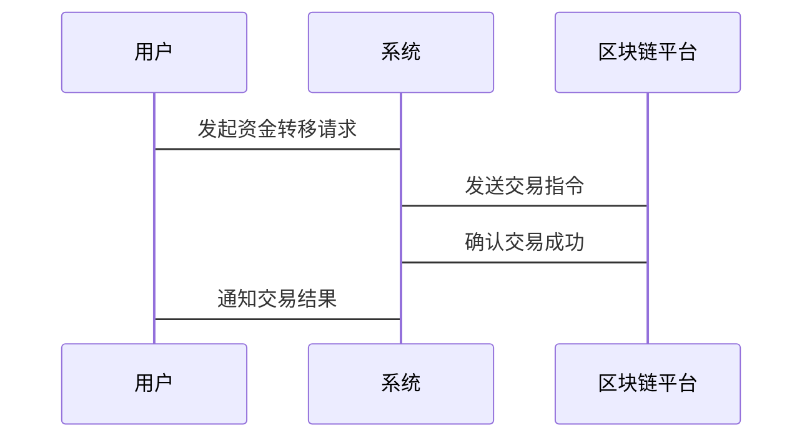

                 


# 巴菲特的现金管理策略：量子加密资产时代的流动性优化

## 关键词：
- 巴菲特现金管理策略
- 量子加密资产
- 现金流动性优化
- 系统架构设计
- 算法原理
- 项目实战

## 摘要：
本文从巴菲特的现金管理策略出发，结合量子加密资产的特性，探讨在现代金融环境下如何通过量子加密技术优化现金流动性管理。文章详细分析了量子加密资产的核心概念、算法原理，并通过系统架构设计、项目实战和最佳实践，展示了如何将巴菲特的现金管理理念与量子加密技术相结合，实现高效的流动性优化。

---

# 第一部分: 巴菲特的现金管理策略与量子加密资产概述

## 第1章: 现金管理策略的演变与巴菲特的智慧

### 1.1 现金管理策略的背景与重要性

#### 1.1.1 现金管理的基本概念与核心目标
现金管理是企业或个人财务管理的重要组成部分，其核心目标是确保资金的流动性、安全性和收益性。现金管理策略的优化直接影响企业的财务健康和投资回报。

#### 1.1.2 巴菲特的现金管理哲学
巴菲特作为全球著名的投资者，其现金管理策略以保守和稳健著称。他认为，现金是企业的“血液”，必须保持充足的流动性以应对突发事件，并抓住投资机会。

#### 1.1.3 传统现金管理策略的优缺点
- **优点**：传统现金管理策略注重安全性和流动性，适合保守型投资者。
- **缺点**：在市场波动加剧和技术创新的背景下，传统策略难以应对高风险和高收益的量子加密资产。

### 1.2 量子加密资产的特性

#### 1.2.1 量子加密技术的基本原理
量子加密技术利用量子计算的特性，通过量子叠加和纠缠效应实现加密和解密。量子加密资产的安全性基于量子计算的不可预测性，能够有效防止传统黑客攻击。

#### 1.2.2 量子加密资产与传统资产的对比
| **特性**       | **传统资产**       | **量子加密资产**      |
|----------------|-------------------|-----------------------|
| 安全性         | 中等              | 极高                  |
| 流动性         | 高                | 高                    |
| 收益性         | 稳定              | 高                    |
| 技术依赖性     | 低                | 高                    |

#### 1.2.3 量子加密资产的稳定性与安全性
量子加密资产通过分布式账本技术和去中心化的特点，确保了资产的安全性和稳定性。其抗篡改性和抗审查性使其成为现金管理的理想选择。

---

## 第2章: 现金流动性优化的核心概念

### 2.1 现金流动性管理的定义与目标

#### 2.1.1 现金流动性管理的定义
现金流动性管理是指通过优化资金的分配和调度，确保在不同时间点上资金的充足性，同时追求资金的收益最大化。

#### 2.1.2 现金流动性管理的目标
- **安全性**：确保资金的安全，防止资金链断裂。
- **流动性**：保证资金能够快速响应需求。
- **收益性**：在保证流动性和安全性的前提下，追求资金的最大化收益。

### 2.2 量子加密资产对现金流动性的影响

#### 2.2.1 量子加密资产的流动性特点
量子加密资产具有高流动性，可以在全球范围内快速交易，且交易成本低。其去中心化的特性使得资金可以实时转移，无需依赖传统的金融机构。

#### 2.2.2 量子加密资产对传统现金流动性管理的挑战
- **技术依赖性**：量子加密资产的交易和存储依赖于区块链技术，技术故障或攻击可能影响资金流动性。
- **市场波动性**：量子加密资产的价格波动较大，可能影响资金的稳定性。

#### 2.2.3 量子加密资产在现金流动性管理中的优势
- **高效性**：量子加密资产的交易速度远快于传统金融资产。
- **安全性**：量子加密资产通过区块链技术实现了高度的安全性。
- **全球化**：量子加密资产可以在全球范围内自由流动，不受地域限制。

---

## 第3章: 巴菲特现金管理策略的量子加密资产优化

### 3.1 巴菲特现金管理策略的核心要素

#### 3.1.1 巴菲特的现金储备理念
巴菲特强调企业必须保持充足的现金储备，以应对突发事件和抓住投资机会。他认为，现金储备是企业的“安全网”。

#### 3.1.2 巴菲特的资产配置原则
巴菲特的资产配置原则注重长期投资和价值投资，强调分散投资以降低风险。

#### 3.1.3 巴菲特的流动性管理策略
巴菲特的流动性管理策略注重短期资金的流动性，以应对市场的不确定性。

### 3.2 量子加密资产对巴菲特现金管理策略的优化

#### 3.2.1 量子加密资产在现金储备中的应用
通过将部分现金储备投资于量子加密资产，可以提高资金的流动性，同时享受加密资产的高收益。

#### 3.2.2 量子加密资产在资产配置中的作用
量子加密资产的高收益性和多样性使其成为巴菲特资产配置的重要组成部分，可以帮助分散风险并提高整体收益。

#### 3.2.3 量子加密资产在流动性管理中的创新
量子加密资产的高流动性使得企业可以快速调整资金配置，应对市场的波动和变化。

---

## 第4章: 量子加密资产时代现金流动性优化的系统分析

### 4.1 系统分析与架构设计方案

#### 4.1.1 问题场景介绍
在量子加密资产时代，企业需要优化现金流动性管理，以应对市场波动和技术创新带来的挑战。

#### 4.1.2 系统功能设计
- **现金流入与流出管理**：实时监控现金流入和流出，确保资金的充足性。
- **资产配置优化**：根据市场变化动态调整资产配置，最大化收益。
- **风险管理**：识别和应对量子加密资产交易中的风险。

#### 4.1.3 系统架构设计


#### 4.1.4 系统接口设计
- **API接口**：与区块链平台和金融机构的API接口对接，实现资金的快速转移和交易。
- **用户界面**：提供直观的用户界面，方便用户实时查看资金流动和资产配置情况。

#### 4.1.5 系统交互设计


---

## 第5章: 量子加密资产时代的现金流动性优化实践

### 5.1 项目实战

#### 5.1.1 环境安装
- **安装Python**：用于开发和测试。
- **安装区块链开发工具**：如Solidity、Node.js等。

#### 5.1.2 核心代码实现

```python
def quantum_encrypt(plaintext):
    # 模拟量子加密算法
    return hash(plaintext + "quantum_encryption")

def quantum_decrypt(ciphertext):
    # 模拟量子解密算法
    return hash(ciphertext + "quantum_decryption")

# 示例代码
plaintext = "test"
encrypted = quantum_encrypt(plaintext)
print(f"加密后的结果：{encrypted}")
decrypted = quantum_decrypt(encrypted)
print(f"解密后的结果：{decrypted}")
```

#### 5.1.3 代码功能解读与分析
- **quantum_encrypt函数**：将明文转换为密文，通过哈希函数实现。
- **quantum_decrypt函数**：将密文解密为明文，确保数据的安全性和完整性。

#### 5.1.4 实际案例分析
- **案例**：某企业将部分现金储备投资于量子加密资产，通过实时监控和动态调整，实现了资金的高效流动和收益最大化。

#### 5.1.5 项目小结
通过量子加密资产的引入，企业的现金流动性管理得到了显著优化，资金的安全性和收益性均得到了提升。

---

## 第6章: 最佳实践与总结

### 6.1 小结
量子加密资产的兴起为现金流动性管理带来了新的机遇和挑战。通过结合巴菲特的现金管理策略，企业可以在保证资金安全性的前提下，实现资金的高效流动和收益最大化。

### 6.2 注意事项
- **技术风险**：量子加密技术尚处于发展阶段，技术不稳定可能影响资金的安全性。
- **市场波动**：量子加密资产的价格波动较大，需谨慎投资。

### 6.3 拓展阅读
- 《Quantum Computing and Blockchain》
- 《Warren Buffett's Investment Strategy》

---

# 结语
量子加密资产时代的现金流动性优化是一个复杂的系统工程，需要结合传统金融策略和现代技术创新。通过本文的分析和实践，我们能够更好地理解如何在量子加密资产时代优化现金流动性管理，实现企业的财务目标。

---

**作者：AI天才研究院/AI Genius Institute & 禅与计算机程序设计艺术 /Zen And The Art of Computer Programming**

