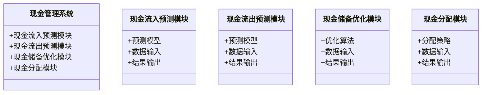
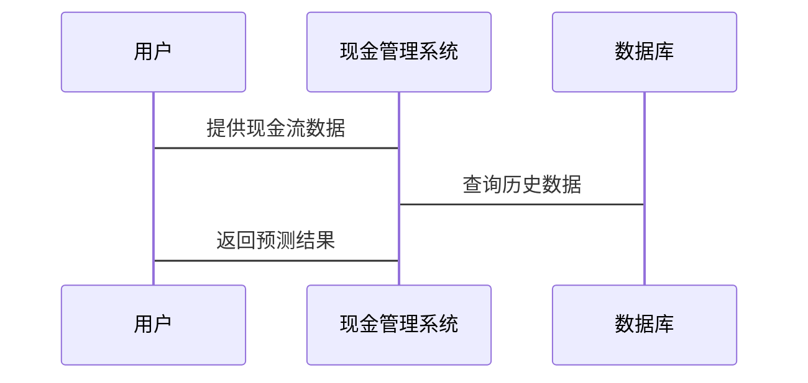

                 


# 巴菲特的现金管理：在负利率时代的新策略

## 关键词：
- 巴菲特，现金管理，负利率，投资策略，现金储备

## 摘要：
本书深入探讨了巴菲特在负利率时代的现金管理策略，分析了其投资哲学的核心理念，以及在当前经济环境下如何优化现金管理。通过详细讲解现金流预测模型、数学公式和系统架构设计，结合实际案例，为读者提供切实可行的现金管理方案。

---

## 第一部分：背景介绍

### 第1章：负利率时代的经济背景

#### 1.1 当前全球经济环境概述
- 1.1.1 经济全球化与货币体系的演变
- 1.1.2 负利率的定义与全球现状
- 1.1.3 负利率对个人和机构的影响

#### 1.2 现金管理的核心概念
- 1.2.1 现金管理的基本定义
- 1.2.2 现金管理的目标与原则
- 1.2.3 现金管理的边界与外延

### 第2章：巴菲特的现金管理理念

#### 2.1 巴菲特投资哲学概述
- 2.1.1 巴菲特的价值投资理念
- 2.1.2 巴菲特的长期投资策略
- 2.1.3 巴菲特的保守投资原则

#### 2.2 巴菲特的现金管理策略
- 2.2.1 现金储备的重要性
- 2.2.2 现金分配的合理性
- 2.2.3 现金流动的周期性

### 第3章：负利率时代现金管理的挑战与机遇

#### 3.1 负利率对传统现金管理的影响
- 3.1.1 负利率下现金贬值的风险
- 3.1.2 负利率对银行存款的影响
- 3.1.3 负利率对投资收益的影响

#### 3.2 负利率时代现金管理的新策略
- 3.2.1 现金资产的多元化配置
- 3.2.2 现金流动的全球化布局
- 3.2.3 现金收益的创新模式

---

## 第二部分：核心概念与联系

### 第4章：现金管理的核心原理

#### 4.1 现金流预测模型
- 4.1.1 现金流预测的基本原理
- 4.1.2 现金流预测的关键因素
- 4.1.3 现金流预测的数学模型

#### 4.2 现金管理的数学模型
- 4.2.1 现金流预测的公式推导
- 4.2.2 现金储备的最优解模型
- 4.2.3 现金分配的动态调整模型

---

## 第三部分：算法原理讲解

### 第5章：现金流预测模型的数学推导

#### 5.1 现金流预测的基本公式
- $$ 现金流入 = \sum_{i=1}^{n} (收入_i) $$
- $$ 现金流出 = \sum_{j=1}^{m} (支出_j) $$
- $$ 净现金流 = 现金流入 - 现金流出 $$

#### 5.2 现金流预测的动态调整
- 使用递归公式进行预测：
  ```python
  def cash_flow_prediction(history):
      # 预测公式推导
      return predicted_cash_flow
  ```

---

## 第四部分：数学模型

### 第6章：现金管理的数学模型

#### 6.1 现金储备的最优解模型
- 最优现金储备公式：
  $$ C^* = \frac{1}{2} \sqrt{\frac{2T S}{i}} $$
  其中，T为交易成本，S为安全边际，i为机会成本。

#### 6.2 现金分配的动态调整模型
- 现金分配公式：
  $$ A_t = \alpha \cdot C_t + (1-\alpha) \cdot A_{t-1} $$
  其中，$\alpha$为调整系数，$C_t$为当前现金流，$A_{t-1}$为上一期的现金分配。

---

## 第五部分：系统分析与架构设计方案

### 第7章：现金管理系统架构设计

#### 7.1 问题场景介绍
- 现金管理系统的应用场景
- 系统功能需求分析

#### 7.2 系统功能设计
- 领域模型设计（mermaid类图）



#### 7.3 系统架构设计
- 系统架构设计（mermaid架构图）


#### 7.4 系统接口设计
- 接口设计说明
- 接口交互流程（mermaid序列图）



---

## 第六部分：项目实战

### 第8章：现金流预测模型的实现

#### 8.1 环境安装
- 安装Python和相关库（如numpy、pandas、scikit-learn）

#### 8.2 核心代码实现
```python
import numpy as np
import pandas as pd
from sklearn.linear_model import LinearRegression

# 数据预处理
data = pd.read_csv('cash_flow.csv')
X = data[['time', 'income', 'expenses']]
y = data['net_cash_flow']

# 模型训练
model = LinearRegression()
model.fit(X, y)

# 预测函数
def predict_cash_flow(new_data):
    return model.predict(new_data)
```

#### 8.3 案例分析与解读
- 通过具体案例展示模型的应用和优化

---

## 第七部分：总结与展望

### 第9章：总结与展望

#### 9.1 全书总结
- 重申巴菲特的现金管理策略
- 总结书中核心观点

#### 9.2 未来展望
- 负利率时代现金管理的趋势
- 新技术对现金管理的影响

#### 9.3 最佳实践 Tips
- 现金管理的关键注意事项
- 巴菲特策略的实际应用建议

---

## 作者：
AI天才研究院/AI Genius Institute  
禅与计算机程序设计艺术/Zen And The Art of Computer Programming

