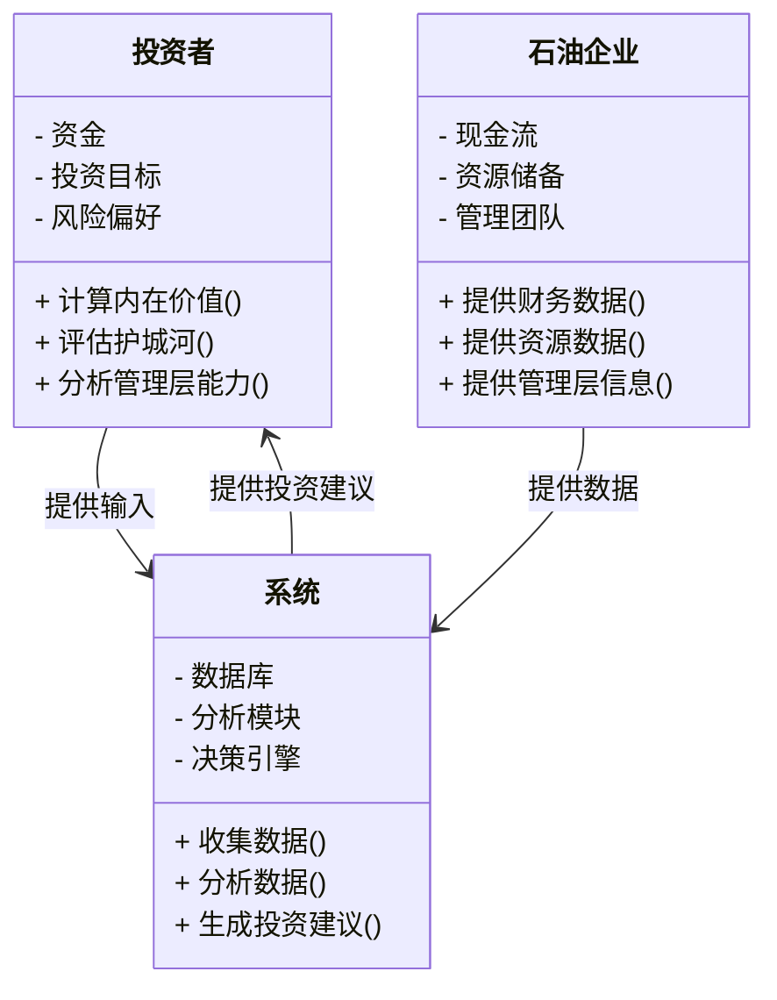

                 

# 巴菲特的石油行业投资逻辑：必需品的魅力

## 关键词：巴菲特，石油行业，价值投资，投资逻辑，必需品，长期视角，护城河

## 摘要：本文深入分析了巴菲特在石油行业的投资逻辑，探讨了石油作为必需品的战略地位，以及其长期投资视角下的护城河和管理层智慧。通过数学模型和实际案例，展示了巴菲特投资逻辑在石油行业的具体应用。

---

# 第一部分: 巴菲特的石油行业投资逻辑背景介绍

## 第1章: 巴菲特的投资理念与石油行业的关联

### 1.1 巴菲特的价值投资理念

#### 1.1.1 价值投资的核心概念
价值投资是一种以低于其内在价值的价格购买优质资产的投资策略。巴菲特认为，市场先生的情绪波动为长期投资者提供了廉价买入的机会。这种理念强调对企业的深入研究，而非市场的短期波动。

#### 1.1.2 巴菲特的投资策略与石油行业的契合点
石油作为全球经济发展的重要能源，具有刚性需求和长期稳定的市场地位。巴菲特的价值投资理念与石油行业的特性高度契合，因为石油企业的护城河（如资源储备、技术优势）使其在长期竞争中更具优势。

#### 1.1.3 石油作为必需品的战略地位
石油不仅是能源，还是化工、交通等多个行业的基础原材料。这种必需品的属性使其需求相对稳定，具备防御性投资的特点，适合长期价值投资。

---

## 第2章: 石油行业的现状与投资逻辑

### 2.1 石油行业的基本结构

#### 2.1.1 石油行业的周期性分析
石油行业受全球经济波动影响较大，但长期来看，石油作为必需品的需求稳定，行业周期性对长期投资者影响较小。

#### 2.1.2 石油行业的供需关系
全球能源转型背景下，传统石油需求增速放缓，但新兴市场国家的工业化需求仍在增长。替代能源的崛起对石油行业构成挑战，但短期内石油仍占据主导地位。

#### 2.1.3 石油行业的市场结构
石油行业集中度较高，大型企业如埃克森美孚、壳牌等拥有强大的资源和技术优势，具备较高的进入壁垒。

---

## 第3章: 巴菲特石油投资逻辑的演变

### 3.1 巴菲特早期投资石油行业的案例

#### 3.1.1 早期石油投资的背景
20世纪70年代的石油危机使得石油价格暴涨，巴菲特意识到石油行业的长期价值。他投资于具备强大财务实力和管理能力的石油公司。

#### 3.1.2 典型案例分析
以Exxon为例，巴菲特在低估值时买入该公司股票，长期持有，获得了稳定的股息收益和资本增值。

#### 3.1.3 投资逻辑的演变
随着时间推移，巴菲特更加注重企业的护城河和管理层能力，而非单纯的行业周期。

---

## 第4章: 巴菲特石油投资逻辑的核心要素

### 4.1 长期视角下的投资机会

#### 4.1.1 长期视角的定义
长期视角是指关注企业的长期盈利能力，而非短期市场波动。石油行业的稳定性和必需品属性使其成为长期投资的理想选择。

#### 4.1.2 长期视角对石油行业的意义
通过长期视角，投资者可以规避短期市场波动的影响，捕捉企业持续增长的价值。

#### 4.1.3 长期视角下的投资策略
选择具备强大护城河和管理能力的企业，长期持有，获取复利收益。

---

## 第5章: 巴菲特石油投资逻辑的数学模型与公式

### 5.1 巴菲特投资模型的数学分析

#### 5.1.1 投资模型的输入变量
- 企业未来现金流
- 折现率
- 企业的护城河强度
- 管理层能力评估
- 股票当前价格

#### 5.1.2 投资模型的处理步骤
1. 评估企业的内在价值：使用DCF模型计算企业未来现金流的现值。
2. 确定企业的护城河强度：通过行业竞争分析和市场地位评估。
3. 评估管理层能力：考察管理层的过往表现和决策能力。
4. 计算安全边际：比较当前股价与内在价值，确定投资的安全空间。

#### 5.1.3 投资模型的输出结果
- 内在价值评估结果
- 投资建议（买入、持有或卖出）
- 风险指标

---

## 第6章: 巴菲特石油投资逻辑的系统分析与架构设计

### 6.1 系统功能设计

#### 6.1.1 领域模型Mermaid类图

---

## 第7章: 巴菲特石油投资逻辑的项目实战

### 7.1 环境安装

#### 7.1.1 安装Python环境
使用Anaconda安装Python 3.8及以上版本。

#### 7.1.2 安装依赖库
安装pandas、numpy、scipy等数据分析库。

---

## 第8章: 结语

### 8.1 最佳实践

#### 8.1.1 投资要点
- 选择具备强大护城河的企业
- 评估管理层能力
- 计算安全边际

#### 8.1.2 注意事项
- 避免短期波动影响决策
- 定期复盘和调整投资组合
- 保持对行业动态的关注

#### 8.1.3 拓展阅读
推荐阅读《巴菲特传》、《价值投资实战》等书籍，深入理解价值投资的理念和方法。

---

作者：AI天才研究院 & 禅与计算机程序设计艺术

